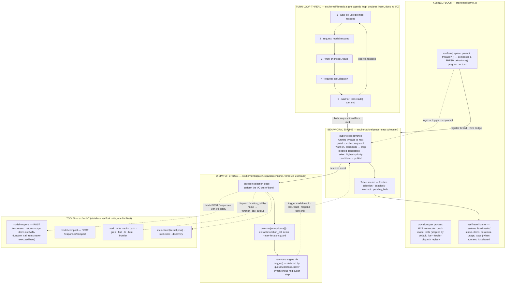

# @behavioral/sh

A behavioral agent harness — a neuro-symbolic, self-improving agent built on the
behavioral-programming runtime. The agent ships with an irreducible coordination floor
(the behavioral engine + the turn loop) and grows by composing plugins: everything above the
kernel is a plugin (`plugin.json`), and the agent improves as behaviors, tools, and skills are
added to or removed from a space. Neural generation proposes; symbolic verification disposes; the
exhaust is the teacher.

## Architecture (WIP — research phase)

The defining inversion: **the model is a tool, not the loop driver.** There is no
imperative `while` loop calling the model. `model-respond` is a stateless `useTool`
unit at the same level as `read`/`bash`/`mcp-client`; the agentic loop is a
**behavioral thread** whose `request`/`waitFor` rules the engine's super-step
scheduler interprets, and a **dispatch bridge** (wired into `useTrace`) that performs
the I/O when the engine selects a coordination event.


```mermaid
flowchart TD
  subgraph KERNEL["KERNEL FLOOR — src/kernel/kernel.ts"]
    direction TB
    K_PROV["provisions per process: MCP connection pool · model tools (scripted by default, live = fetch) · dispatch registry"]
    K_RUN["runTurn({ space, prompt, threads? }) — composes a FRESH behavioral() program per turn"]
    K_RES["useTrace listener — resolves TurnResult { status, items, iterations, usage, trace } when turn.end is selected"]
  end

  subgraph ENGINE["BEHAVIORAL ENGINE — src/behavioral (super-step scheduler)"]
    direction TB
    SS["super-step: advance running threads to next yield → collect request / waitFor / block bids → drop blocked candidates → select highest-priority candidate → publish"]
    TRACE["Trace stream — frontier · selection · deadlock · interrupt · pending_bids"]
    SS --> TRACE
  end

  subgraph THREAD["TURN-LOOP THREAD — src/kernel/threads.ts (the agentic loop: declares intent, does no I/O)"]
    direction TB
    R1["1 · waitFor: user.prompt | respond"]
    R2["2 · request: model.respond"]
    R3["3 · waitFor: model.result"]
    R4["4 · request: tool.dispatch"]
    R5["5 · waitFor: tool.result | turn.end"]
    R1 --> R2 --> R3 --> R4 --> R5
    R5 -->|"loop via respond"| R1
  end

  subgraph BRIDGE["DISPATCH BRIDGE — src/kernel/dispatch.ts (action channel, wired via useTrace)"]
    direction TB
    B_ACT["on each selection trace → perform the I/O out-of-band"]
    B_TRAJ["owns trajectory items[] · extracts function_call items · max-iteration guard"]
    B_FIRE["re-enters engine via trigger() — deferred by queueMicrotask, never synchronous mid-super-step"]
    B_ACT --> B_TRAJ --> B_FIRE
  end

  subgraph TOOLS["TOOLS — src/tools/* (stateless useTool units, one flat fleet)"]
    direction TB
    T_MODEL["model-respond — POST /responses · returns output items as DATA (function_call items never executed here)"]
    T_COMPACT["model-compact — POST /responses/compact"]
    T_CORE["read · write · edit · bash · grep · find · ls · html · frontier"]
    T_EXT["mcp-client (kernel pool) · skill-client · discovery"]
  end

  K_RUN -->|"register thread + wire bridge"| ENGINE
  K_RUN -.->|"ingress: trigger user.prompt"| SS
  THREAD -->|"bids: request / waitFor / block"| SS
  SS -->|"selected event"| B_ACT
  B_ACT -.->|"fetch POST /responses with trajectory"| T_MODEL
  B_ACT -.->|"dispatch function_call by name → function_call_output"| T_CORE
  B_ACT -.-> T_EXT
  B_FIRE -.->|"trigger model.result · tool.result · respond · turn.end"| SS
  TRACE --> K_RES
```

**Legend** — solid arrows: event/data flow selected by the engine. Dashed arrows:
out-of-band I/O and deferred re-entry via `trigger()`.

One turn: the kernel triggers `user.prompt` → the thread requests `model.respond` →
the bridge calls the `model-respond` tool (a plain `fetch` to a provisioned Open
Responses endpoint; endpoint URL + key are provisioner-injected, never model-facing)
→ output items come back as **data** (`function_call` items are never executed by the
tool) → the bridge appends them to the trajectory and fires `model.result` → the
thread requests `tool.dispatch` → the bridge runs each `function_call` against the
registry and appends spec-valid `function_call_output` items → `tool.result` →
`respond` loops the thread. No `function_call` items (or the max-iteration guard)
fires `turn.end`, which resolves the `TurnResult`.

> The turn-loop thread is scaffolding (see `src/kernel/threads.ts`) — the
> autoresearch loop (Phase 5.5) evolves candidate threads against the frontier gate
> and will replace it. This diagram reflects the current floor.

## Repository Map

- `src/kernel/` — the coordination floor: `behavioral()`, threads, dispatch bridge, OAuth
- `src/tools/` — agent tools as stateless `useTool` units (AJV `JSONSchemaType` schemas);
  `plugin-loader.ts` parses `plugin.json`
- `src/behavioral/` — the behavioral runtime (types, constants, utils)
- `src/controller/` — the browser Controller + delegated listener + swap boundary
- `src/cli/` — the `behavioral` CLI (`makeCliRouter`/`parseCli`); commands registered in `bin/behavioral.ts`
- `src/utils/` — shared pure utilities
- `tasks/` — Harbor skill-authoring task specs (challenge content; not shipped)
- `skills/` — published reference skills
- `.agents/skills/` — workspace-installed skills
- `bin/behavioral.ts` — CLI entry point

## Public API

Imported as `@behavioral/sh`:

```ts
// Tools — useTool, plugin-loader, the tool fleet
import { useTool } from '@behavioral/sh/tools'

// Controller — browser-side controller bootstrap
import { Controller } from '@behavioral/sh/controller'

// Utils — keyMirror, deepEqual, isTypeOf, trueTypeOf, ueid, case conversion, escape, wait
import { keyMirror, deepEqual } from '@behavioral/sh/utils'
```

## Plugin model

A plugin is a directory conforming to [Agent Plugins v1](https://agent-plugins.org/): a required
`plugin.json` manifest, an optional `skills/` of Agent Skills, an optional `mcp.json` declaring
MCP servers, and a reverse-domain `sh.behavioral/` extension namespace for behavioral-owned
declarations (threads, models, per-space gating). The kernel is the stable floor beneath it; the
policy layer above is minimal and improvable.

## Development

```bash
bun --bun tsc --noEmit   # typecheck
bun test                 # tests
```
