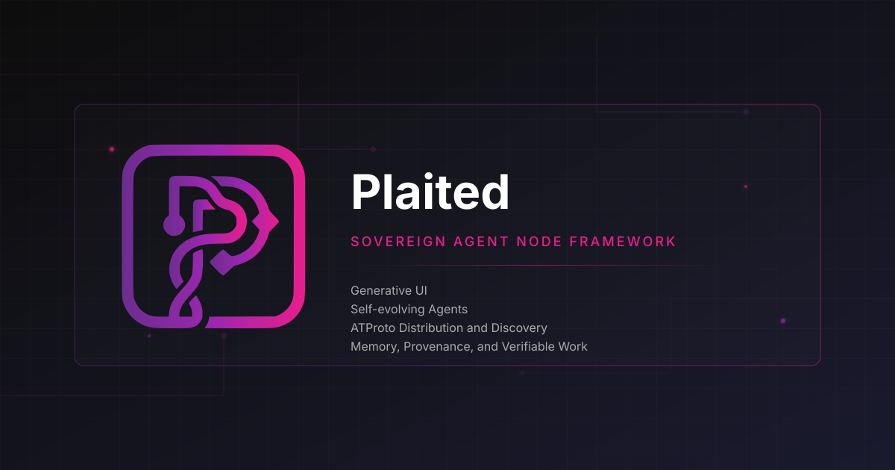

**Sovereign agent nodes first. Framework details second.**

[](https://github.com/plaited/plaited/actions/workflows/ci.yml)

---

Plaited is a framework for building local-first sovereign agents.

## Packages

This is a Bun monorepo. The framework and its pi plugins live under `packages/`:

| Package | Name | Role |
|---|---|---|
| [`packages/plaited`](./packages/plaited) | `plaited` | The published framework — behavioral runtime, Renderer/Controller, schemas, validation utils, CLI. Imported as `plaited`. |
| [`packages/pi-dev`](./packages/pi-dev) | `@plaited/pi-dev` | pi plugin for general coding-agent usage in pi; depends on `plaited`. |
| [`packages/pi-assemble`](./packages/pi-assemble) | `@plaited/pi-assemble` | pi plugin for developing MCP Apps (per [`research/mcp-apps`](./research/mcp-apps)) that leverage the framework; depends on `plaited`. |

## Repository Map

- `packages/plaited/` — the framework (runtime, schemas, Renderer/Controller, CLI)
- `packages/pi-dev/` — pi-dev plugin
- `packages/pi-assemble/` — pi-assemble plugin
- `skills/` — published reference skills (`plaited-framework`, `design`, `git-context`, `markdown`, `mcp-client`, `typescript-lsp`)
- `.agents/skills/` — workspace-installed skills
- `research/` — research briefs (`mcp-apps`, `atproto-content-sites`)
- `prompts/` — implementation prompts
- `scripts/` — repo setup and package-maintenance shell glue

## Development

Requirements:

- [Bun](https://bun.sh/) `>= v1.2.9`
- `git`

Useful commands:

```bash
# Typecheck
bun --bun tsc --noEmit

# Full test suite
bun test

# CLI schema discovery
bun run ./packages/plaited/bin/plaited.ts --schema
```

## Skills

Skills are the portable agent-facing extension surface.

- published skills live under `skills/`
- workspace-installed skills should live under `.agents/skills/`
- runtime composition still happens through modules

Repo planning is prompt-driven and maintainer-reviewed. Agent-authored work should start from
fresh `origin/dev` worktrees unless the task says otherwise.
