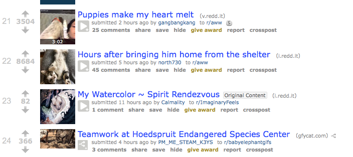
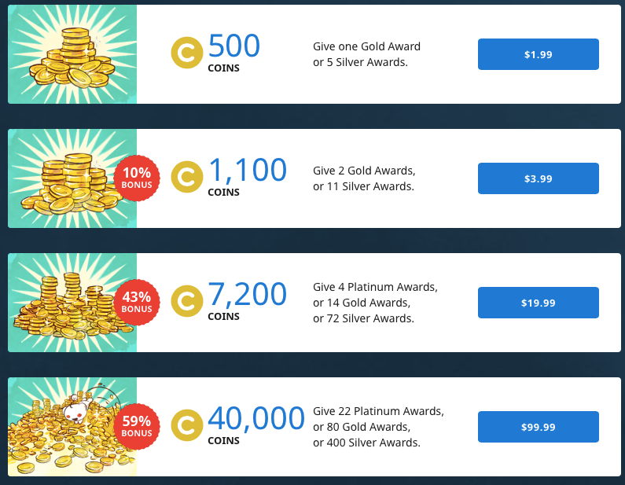
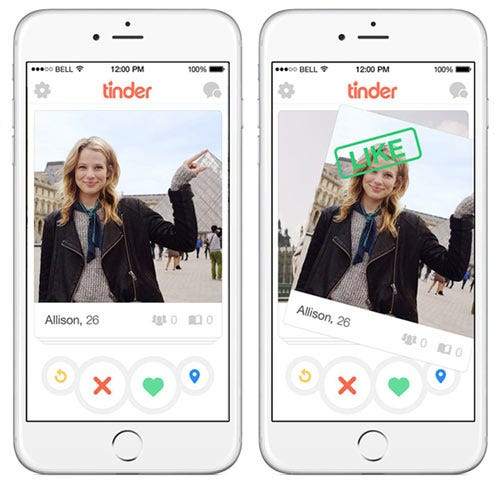
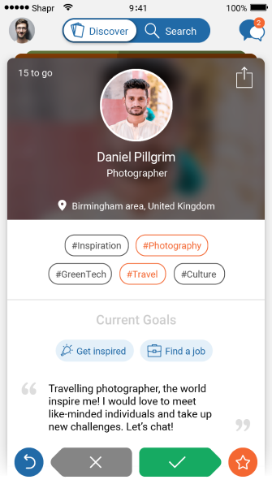
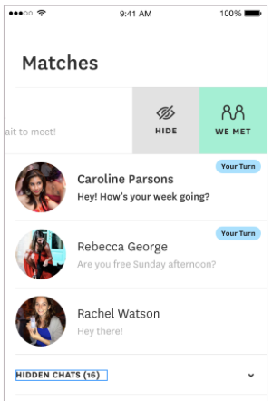

---
author:  Rachel Aliana
date: Jun 14, 2019
source: https://rachelaliana.medium.com/incentivizers-53323e344938

---

# Mechanics

Like a cupcake provides a rush of sugar, mechanics can create small rushes of dopamine.  [https://www.pexels.com/photo/cake-no-person-chocolate-sugar-112392/](https://www.pexels.com/photo/cake-no-person-chocolate-sugar-112392/)

_This post is a part of_ [_“A Unified Language for the Design of Information Systems_](a-unified-language-for-the-design-of-information-systems.md)_”._

On game shows, a player will choose a door and the host will reveal whether behind the door there was a prize. On scratch offs, the knowledge of whether there was a prize comes slowly, bit by bit. The end result is the same, but in between there are differences in how the information is revealed. These are mechanics.

**Mechanics are ways to design the presentation and interaction of information between people and a system to increase engagement**. This article covers common mechanics that designers use to increase energy input, as well as advice on when designers should use each mechanic.

## Upvote and Downvote

This interaction is commonly used to incentivize good behavior and punish bad behavior within a community. As a person who submits content gets feedback that they have submitted good content through upvotes, they are incentivized to complete more loops of engagement through the system by having more feedback from others that they produced good content.

Upvote and Downvote icon

For example, on Reddit users are incentivized to put up good content to get more upvotes, which in turn means that their content will be shown to more people. This system is tied into a larger system of karma that is partly composed of the sum of the number of upvotes and downvotes a user accumulates across all of their posts. (The full karma system is a Reddit trade secret, but you can read more about it  [here](https://www.reddit.com/r/TheoryOfReddit/comments/7qgsly/eli5how_do_they_calculate_the_karma_add_up_on/?st=jqb8te4r&sh=23bff398)).

The Reddit upvote and downvote system.  [www.reddit.com](http://www.reddit.com/)

# Gold

Gold is an award given to creators or commenters that go above and beyond in producing high quality content. With Gold, users can access secret Reddit groups and have some limited say in the direction of the company. Gold has longer lasting impacts within the individual since someone spent real money to reward them. Their ability to see a “hidden” part of Reddit ties them closer to the community.

Breakdown of how coins are bought in Reddit:  [https://www.reddit.com/coins/](https://www.reddit.com/coins/)

Outside of Reddit, the idea of Gold is powerful for other entrepreneurs as they create their communities. Gold as a mechanic allows users themselves to self-moderate what a high quality post is, and it offers an alternative funding model than ads. This is a powerful thing when many communities today are dependent on selling user data.

# Swipe

Another example is Tinder, the well-known dating app where users search through cards of other users. People can only interact with one new person at a time constraining their attention to one person on which they must make a choice before moving to the next. This heightens anxiety as they must make a decision and this decision is irreversible (unless they spend money). But this mechanic also dopamine as they can move the top card slightly to reveal some information about the next user in the deck.

Tinder at its core is a database of different profiles, but it would not be nearly as successful if people were forced to sort through an Excel spreadsheet of information. The distinct way in which Tinder designed the display of information makes the act of searching through a database, and makes people want to exert more energy in their system.

Swipe is a good mechanic to use when users need to make lots of decisions, but no one decision is pivotal.

Tinder Swipe:  [https://blog.photofeeler.com/if-you-swipe-right-on-tinder-do-they-know/](https://blog.photofeeler.com/if-you-swipe-right-on-tinder-do-they-know/)

## Scarcity

On Shapr, a networking app, users can only see 15 people at a time. This makes it so even on the internet, people are limited in their engagement with others and in turn more mindful of who they swipe left and who they swipe right. The fixed number of interactions at any one time makes each interaction feel more important.

Limited numbers of people to meet each day:  [https://www.makeuseof.com/tag/shapr-professional-networking/](https://www.makeuseof.com/tag/shapr-professional-networking/)

## Limited Loops

Limited loops means that people are constrained from continuing a conversation until the other person replies. In a world where in online dating many people simply say “hi” or send an emoji, this mechanic makes it so people focus more on each conversation they engage in since they will not be able to simply stand out by repeatedly messaging. This mechanic is good to use to create high quality messages, but might reduce messages sent because each individual message has greater importance attached to it.

On Hinge people must talk in turns:  [https://hingeapp.zendesk.com/hc/en-us/articles/360010692913-What-is-We-Met-](https://hingeapp.zendesk.com/hc/en-us/articles/360010692913-What-is-We-Met-)

