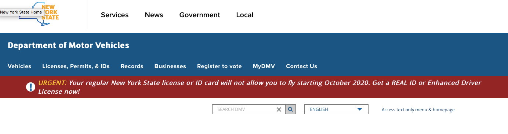
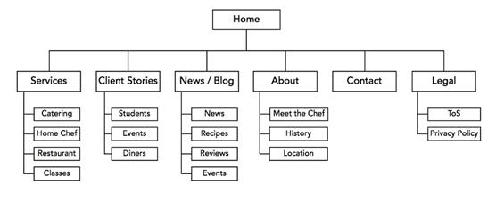
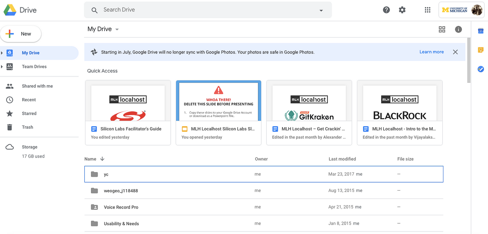
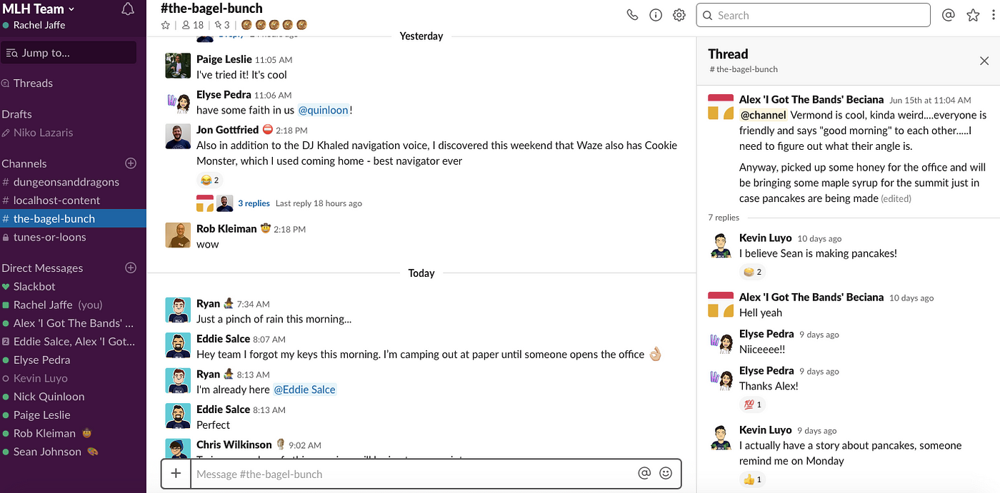
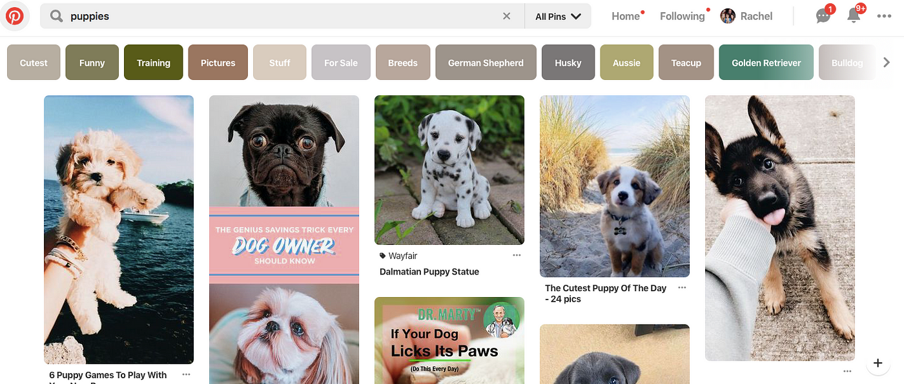
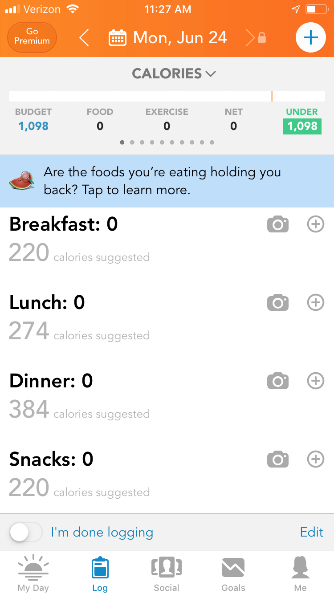
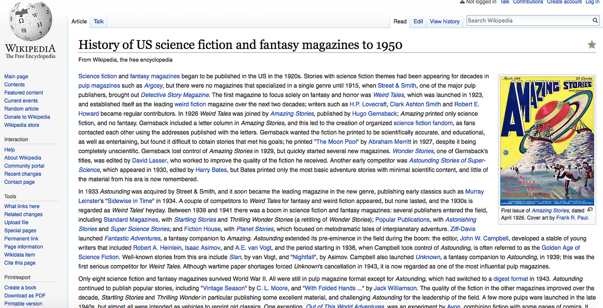

---
author: Rachel Aliana
date: Jun 21, 2019
source: https://rachelaliana.medium.com/platform-structures-a278333b4d27

---
 
# Platform Structures

_This article is a part of_ [_“A Unified Language for the Design of Information Systems_](a-unified-language-for-the-design-of-information-systems.md)_.” This article will make the most sense if you have familiarized yourself with the ideas of_ [_modules_](a-pattern-language-modules.md) _and_ [_blocks_](a-pattern-language-interaction-blocks.md)_._

A city-wanderer can feel the difference between the wide boulevards of Paris and the close turns of Boston, the human-scale boulevards of Tel Aviv and the efficient corridors of Detroit. So too can a digital wanderer feel the difference in the kinds of communities that are on Facebook, Instagram, and Reddit. This article centers on how the structure of entire websites or apps impacts the interactions that take place within them. The goal is to help designers and information architects choose structures based on the desired interactions on their platforms.

This article will cover strict hierarchies, hypertext, daisy structures, and matrices, with examples and advice on when to use each one.

# Strict Hierarchy

**Strict hierarchies**  are a platform structure where creators delineate every pathway a user can take through a system. These are often used for top-down controlled websites where there are clear tasks the user wants to accomplish and little desire to create a community. A great example is the New York’s  [DMV website](https://dmv.ny.gov/). There are paths that a user can go down — register a vehicle, obtain a license, but no option to add content to the website, connect to other users, or alter the experience another user might have.

DMV shows limited ways to interact.

The picture below shows a navigation layout of a typical company intranet, where each topic has a category, and sub-topics are accessed from them by only one pathway. The only way to get to another sub-folder is by navigating back to Home. Objects should be organized from broad to more specific as people move deeper into each sub-category.

Strict hierarchy utilized on Lynda:  [https://www.lynda.com/WordPress-tutorials/Creating-IA-WordPress-site/174240/196653-4.html](https://www.lynda.com/WordPress-tutorials/Creating-IA-WordPress-site/174240/196653-4.html)

# Nested Pools

Whereas strict hierarchies are flat web pages that are connected into structures, nested pools are collections of different objects that are structured hierarchically. Pools inside of pools create a deepening of specificity within a community with flexibility of movement within each sub-section. Google Drive’s first level is a strict hierarchy with the second and third layers user-generated nested pools. On the top layer,  **My Drive**,  **Team Drives,**  and the other folders are unable to be altered. But in the secondary and tertiary layers, users can create folders and add documents, photos, and spreadsheets to them in whatever way they like. These folders can also nest deeper layers of sub-folders.

This kind of architecture is great to use when you are designing an  **open-goal**  platform, because you are giving the user a lot of freedom both in  _what_ they put into each pool, as well as  _how_ their site is organized.

How would Google Drive be different if the company further constrained the sub-folders by having pre-set folders for work, health, school, and family? This would make the platform more of a life-organization tool than a general document-organizing platform.

How would Google Drive be different if it had the option to discover folders from other users on the platform? This would change the nature of Google Drive to be more of a specialized information search tool, rather than an information creation and collaboration tool with already other known users.

# Nested Channels

Channels are connections between objects or people. Slack is a platform composed of three different kinds of user-generated channels. There are  **Channels,**  which are usually searchable across organizations, are user generated, and usually organized around topics of conversation. Within channels, there are  **Threads,**  which are like short-term comment threads for people who want to have deeper conversations on topics that are on the main channels.  **Direct Messages**  are one-to-one channels between users that exist outside of the larger channel hierarchy.

How would Slack be different if it had objects that users within an organization kept coming back to work on? This might move the platform closer to Google Drive in the sense that it would be a place where people do work as well as converse. This shift in system structure might change the tone of the currently playful platform. On the other end of the spectrum, if messages in threads disappeared after being seen, Slack would likely become an even  _more_  casual platform. And what if instead of creating conversations in user-generated channels, conversations were instead grouped into different channels  _after_ they happen? All of these different decisions would change the kinds of conversations that occur on Slack and its role in the workplace.

Slack’s architecture features threads, channels, and direct messages: www.slack.com

# Hypertext/User-Generated Structures

Other platforms are designed with no planned structure. A user enters a key word, and the structure is generated then. This can be seen in Google where after a search term is put in, it emerges with a list of matches. The same can be seen on Pinterest, but instead of searching for websites (which in turn have their own architectures) a user searches for objects in the form of photos. This model is good for when there are a lot of items that a user can search for, but no one item that needs to repeatedly be found every time in the same exact place.

Both Google and Pinterest are good for finding new information, but are not great for people to quickly find the same information again in the same place. Adding more content to a Pinterest folder shifts around all of the items. The Google algorithm constantly changes the ranking of a specific web page. Both Google and Pinterest are good for information discovery rather than repeated information retrieval.

As seen below, on Pinterest an entry on “puppies” rapidly turns up a large number of different pathways to view puppy pictures that the user can pursue. However, since there are constantly changing algorithms and added user content, it is hard to get back to a specific puppy picture.

# Daisy Architecture

This architecture is where a user has one primary page, and then delves into sub-sections, but continually comes back to one central location. This construction is good for when people have a primary goal that they want to accomplish quickly, and then numerous secondary pathways that a user might also want.

The LoseIt app brings users first to the meal-log screen: www.loseit.com

This occurs in the LoseIt app for dieting, where a person needs to regularly log their meals and want access to this functionality quickly. Then if they have time, they might update their profile, search for healthy recipes, or log their weight.

This is also true for home security apps. When a person gets a notification from their home security app, the number one thing they want to know is whether their home is secure. Often home security apps also offer the option to turn on and off lights or monitor pets on a camera, but the security status of the home takes precedence.

# Multi-Dimensional Hierarchy

This architecture is a combination of hypertext and a hierarchy. A user can both search hierarchically from the main page through the Contents sections, but can also jump from one page to others via hyperlinks in the body of an article. A well-known example of this is Wikipedia. Users might go there for one specific reason, like to read about the history of science fiction in the United States. But once they are on the page, they can travel through links on the page to other wiki pages. This architecture is best used for when there is information that users might want to be repeatedly accessed, but also want to explore new information.

Wikipedia:  [https://en.wikipedia.org/wiki/History_of_US_science_fiction_and_fantasy_magazines_to_1950](https://en.wikipedia.org/wiki/History_of_US_science_fiction_and_fantasy_magazines_to_1950)

There are likely several hundred of variations on this structures and mash-ups of modules and blocks with these structures to create an endless array of online interactions. For each website used as an example in this article, picture how an alteration in the website’s structure would change the goals of the platform and the communities that emerge from it.
