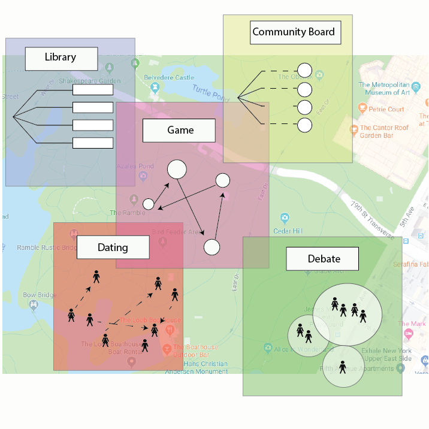
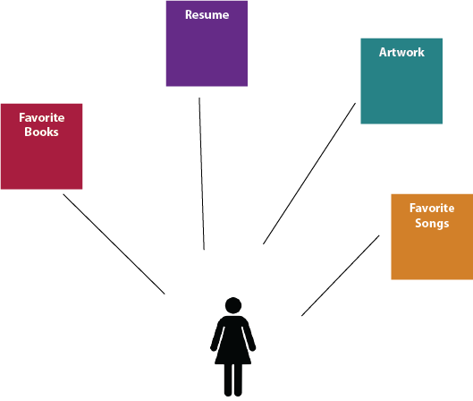
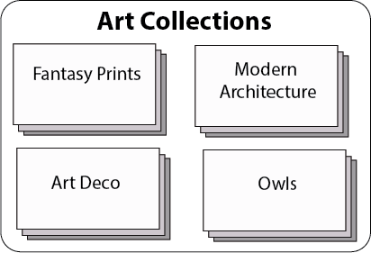
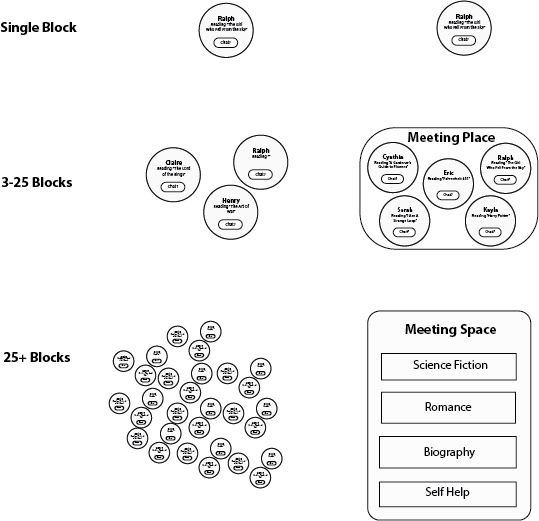

---
author: Rachel Aliana
date: Feb 3, 2020
source: https://rachelaliana.medium.com/living-digital-networks-the-new-field-of-emergent-network-design-ed7a65b31d6e

---

# The New Field of Emergent Network Design

_This article is a part of the series “_[_Past the Internet: The Emergence of the Modnet”_](past-the-internet-the-emergence-of-the-modnet.md)_._

The previous article laid out the basic concept of modular networks, or modnets, where individuals can continue to control the content they create even after they add their individual modules to a digital network. The first article outlined how people can connect their modules to pre-existing patterns. This article looks even past this new method of network creation, towards the potential for networks that have no preset patterns but are generated through the individual interactions amongst individual modules to form cohesive networks.

This form of digital network creation is called  **emergent network design.** Potential ways that the network can grow can be delineated through rules around how each module can connect to others, but the ultimate shape of the potential networks generated would be unknown even to the developers that build the pieces of the network. Emergent Modular Networks can constantly change with the ebb and flow of digital communities, creating gains in productivity since someone no longer needs to constantly redesign the software that a community uses. The very actions that people undertake creates the networks that they need.

## Autonomous Assembly

The autonomous assembly of digital networks through simple rules is highly similar to both how cells form a human body and how MIT is using the form of connectable pieces to form self-assembled furniture. Emergent Modnets simply extend this metaphor from biology and hardware to digital network design.

In physical bodies, it is a grand feat how a humble embryo becomes first two cells, then four, then six, and then become incredibly complex bodies composed of skin, and teeth, and nails, all arranged in the right places. This occurs through simple processes delineated by a section of genes called the  [homeobox](https://www.discovermagazine.com/mind/how-does-a-single-cell-become-a-whole-body)  that impacts the structure of how cells communicate with one another. The homeobox impacts some of the most basic aspects of a living thing, such as the fact that most living things have a bottom and a top, or are symmetrical on each side, or have two eyes and a nose.

Each cell contains the logic that can potentially create a complex whole. But this complex logic comes in the form of the interaction of simple rules, like cells that are  [similar group together](http://sciencenetlinks.com/student-teacher-sheets/cells-your-body/). Or the larger half of a split embryo in its first moments,  [minute differences](https://www.discovermagazine.com/mind/how-does-a-single-cell-become-a-whole-body)  impact which section becomes the top and the smaller part becomes the bottom. Cells that then are clustered towards the front of the larger half become the face of a creature. Complexity, such as the creation of insulin in a person’s pancreas in the last stages of development, becomes a cascading result of simple rules that gave rise to more and more complex interactions.

Researchers at MIT’s  [Self Assembly Lab](https://selfassemblylab.mit.edu/)  have also used the idea of autonomous assembly in the world of hardware. Sets of individual blocks each with specific notches on the end of them, when placed into moving water, over time assemble into a chair. These insights have made it so some of MIT’s researchers are looking to not simply create fixed structures, but  [robots that can self-assemble](http://news.mit.edu/2013/simple-scheme-for-self-assembling-robots-1004)  using collaborative group behavior.

In biology there is the discovery of how cells utilize simple rules to form complex life. In robotics, there is the creation of designs for how simple parts can become collaborative wholes, though we are just now embarking on the first steps of this path towards autonomously assembled robots. The modnet is inspired by the logic behind these networks to form a parallel kind of digital network.

## Living Networks

Within the digital world, it is possible to extend these metaphors to digital content. The basis of the theory of Emergent Modnets is that each person has numerous different structured content modules. These modules’ content type tells any network that they connect to how they should work with it. This is much like how cells might have several thousand strands of DNA, but their ultimate location in the body tells them which section they should trigger.

People build individual modules

Take the example of a simple List pattern.

A simple list module of favorite books

A person’s phone that contains this list pattern, in a traditional Modnet structure, a person would need to host a Collections pattern on their network and delineate what type of modules can connect to their network.

With emergent networks, any public module can automatically connect to a network even if it is not explicitly a type delineated by the network. This can allow people to create two different Collection types, and then when other collections are connected, over time no person needs to go and host another pattern. No developer needs to change the code, or the community decides they need to switch to a more complicated platform that can handle nested collections.

The front-end would sort itself out by understanding that when there is a certain number of modules, there should be a second layer added to the network that creates nested collections. The front-end emerges as a result of increased complexity on the network, instead of being delineated from the top down by a developer.

A collection of art content.

It is an odd thought that code might one day be regenerated, recursive, built by the interactions amongst people in the network. With more people, more complex networks. This complexity can emerge from simple rules, just like the human body or MIT’s notched pieces that autonomously build a chair. Below depicts a simple rule: At the scale of a single block the network only consists of the module. When 3–25 modules are connected together a front-end forms of a meeting space. If the meeting space begins to have even more participants, the front-end understands that its “cells” or modules should nest even further to form different folders out of similar content to make it easier for people to search through the content.

Simple rules can create complex interfaces.

While these rules are simple, over time a handful of simple rules: Nest complexity, create tags for diverse content, create moderation for new groups, create voting systems for short comments, create private messages for threads. Over time, people can decide which simple rules are “alive” like genes, and then the networks can auto-populate based on the specific circumstances of the people in them.

With this simple idea, it is possible for people to seamlessly connect in a world where digital infrastructure is constantly rebuilt based on their engagement. Circular code facilitates infrastructure that is constantly exactly what people want, in a way that mirrors a sort of human-generated gene pattern for digital infrastructure.

## A Collaboratively Built World

As people walk through the city, their individual modules can connect to those of others, and create spontaneous interactions. The world where the modnet is a counterpoint to the internet is a world that is more collaboratively built, as each person’s involvement in any network impacts the form and function of that network.

This world is also meant to be more egalitarian and playful. When networks are autonomously built, each person that joins has a role in deciding what are the rules that govern the network. As different levels emerge in networks, each person that is a part of the network has to agree how value is allocated at each different level.

Modnets, by reshaping the allocation of value and creating autonomous, emergent networks, enable the automatic generation of networks between people and in turn a potentially more playful digital world that in turn creates a more collaboratively built real world.
