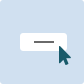

---
source: https://www.w3.org/WAI/ARIA/apg/patterns/button/

---
# Button Pattern

## About This Pattern

A  [button](https://w3c.github.io/aria/#button)  is a widget that enables users to trigger an action or event, such as submitting a form, opening a dialog, canceling an action, or performing a delete operation. A common convention for informing users that a button launches a dialog is to append "…" (ellipsis) to the button label, e.g., "Save as…".

In addition to the ordinary button widget, WAI-ARIA supports 2 other types of buttons:

-   Toggle button: A two-state button that can be either off (not pressed) or on (pressed). To tell assistive technologies that a button is a toggle button, specify a value for the attribute  [aria-pressed](https://w3c.github.io/aria/#aria-pressed). For example, a button labelled mute in an audio player could indicate that sound is muted by setting the pressed state true.  **Important:**  it is critical the label on a toggle does not change when its state changes. In this example, when the pressed state is true, the label remains "Mute" so a screen reader would say something like "Mute toggle button pressed". Alternatively, if the design were to call for the button label to change from "Mute" to "Unmute," the aria-pressed attribute would not be needed.
-   Menu button: as described in the  [menu button pattern](menu-button.md), a button is revealed to assistive technologies as a menu button if it has the property  [aria-haspopup](https://w3c.github.io/aria/#aria-haspopup)  set to either  `menu`  or  `true`.

### Note

The types of actions performed by buttons are distinctly different from the function of a link (see  [link pattern](https://www.w3.org/WAI/ARIA/apg/patterns/link/)). It is important that both the appearance and role of a widget match the function it provides. Nevertheless, elements occasionally have the visual style of a link but perform the action of a button. In such cases, giving the element role  `button`  helps assistive technology users understand the function of the element. However, a better solution is to adjust the visual design so it matches the function and ARIA role.

## Examples

-   [Button Examples](button.example.md): Examples of clickable HTML  `div`  and  `span`  elements made into accessible command and toggle buttons.
-   [Button Examples (IDL)](button_idl.example.md): Examples of clickable HTML  `div`  and  `span`  elements made into accessible command and toggle buttons. This example uses the  [IDL Interface](https://w3c.github.io/aria/#idl-interface).

## Keyboard Interaction

When the button has focus:

-   Space: Activates the button.
-   Enter: Activates the button.
-   Following button activation, focus is set depending on the type of action the button performs. For example:
    -   If activating the button opens a dialog, the focus moves inside the dialog. (see  [dialog pattern](dialog-modal.md))
    -   If activating the button closes a dialog, focus typically returns to the button that opened the dialog unless the function performed in the dialog context logically leads to a different element. For example, activating a cancel button in a dialog returns focus to the button that opened the dialog. However, if the dialog were confirming the action of deleting the page from which it was opened, the focus would logically move to a new context.
    -   If activating the button does not dismiss the current context, then focus typically remains on the button after activation, e.g., an Apply or Recalculate button.
    -   If the button action indicates a context change, such as move to next step in a wizard or add another search criteria, then it is often appropriate to move focus to the starting point for that action.
    -   If the button is activated with a shortcut key, the focus usually remains in the context from which the shortcut key was activated. For example, if  Alt + U  were assigned to an "Up" button that moves the currently focused item in a list one position higher in the list, pressing  Alt + U  when the focus is in the list would not move the focus from the list.

## WAI-ARIA Roles, States, and Properties

-   The button has role of  [button](https://w3c.github.io/aria/#button).
-   The  `button`  has an accessible label. By default, the accessible name is computed from any text content inside the button element. However, it can also be provided with  [aria-labelledby](https://w3c.github.io/aria/#aria-labelledby)  or  [aria-label](https://w3c.github.io/aria/#aria-label).
-   If a description of the button's function is present, the button element has  [aria-describedby](https://w3c.github.io/aria/#aria-describedby)  set to the ID of the element containing the description.
-   When the action associated with a button is unavailable, the button has  [aria-disabled](https://w3c.github.io/aria/#aria-disabled)  set to  `true`.
-   If the button is a toggle button, it has an  [aria-pressed](https://w3c.github.io/aria/#aria-pressed)  state. When the button is toggled on, the value of this state is  `true`, and when toggled off, the state is  `false`.

