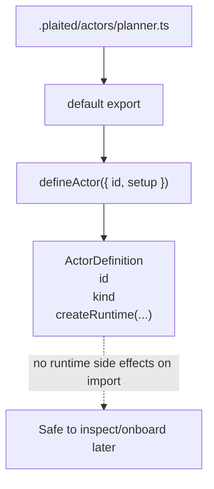
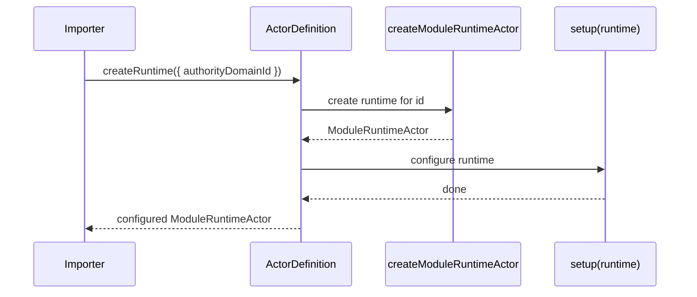
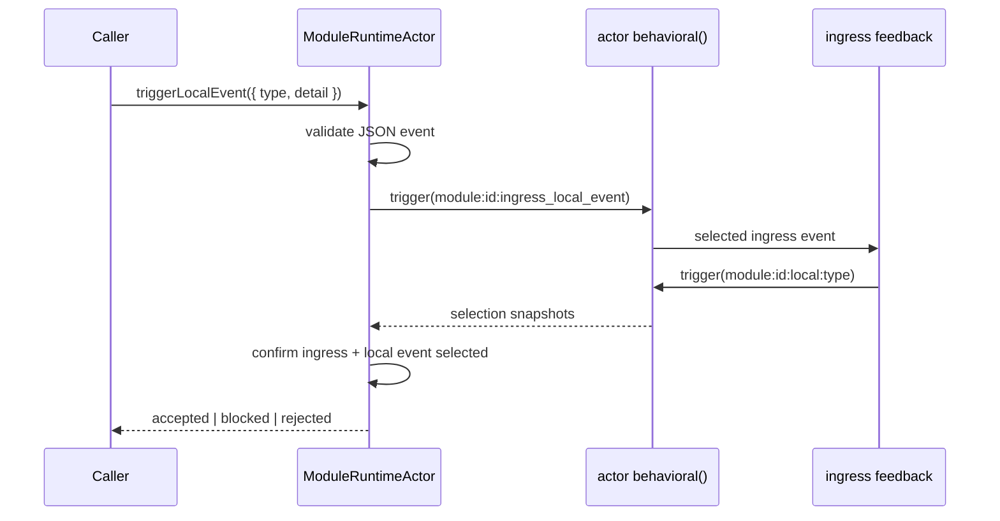
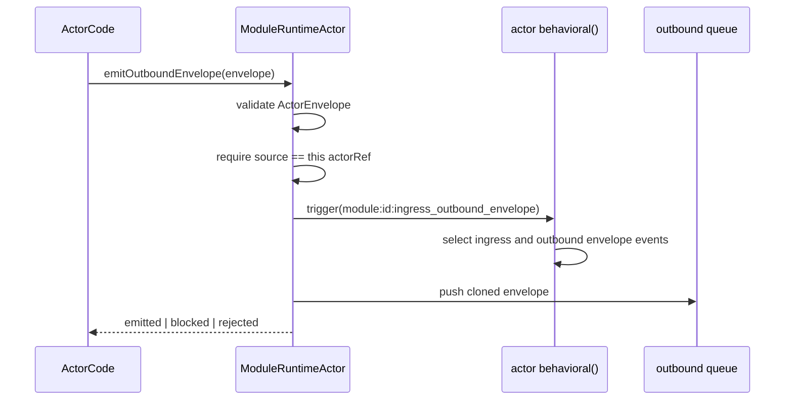
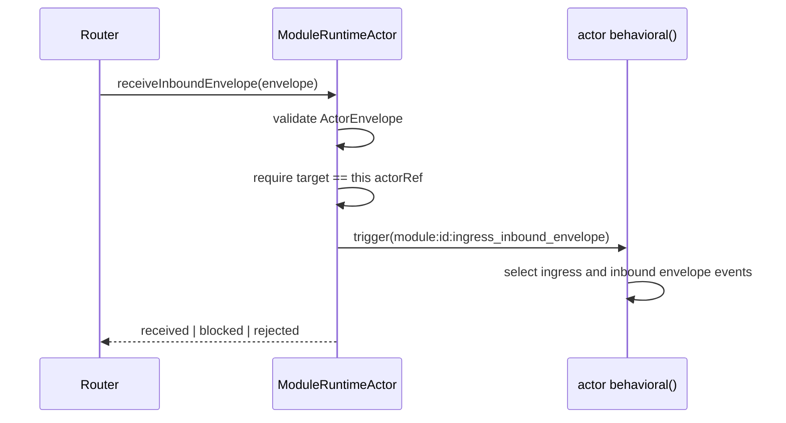
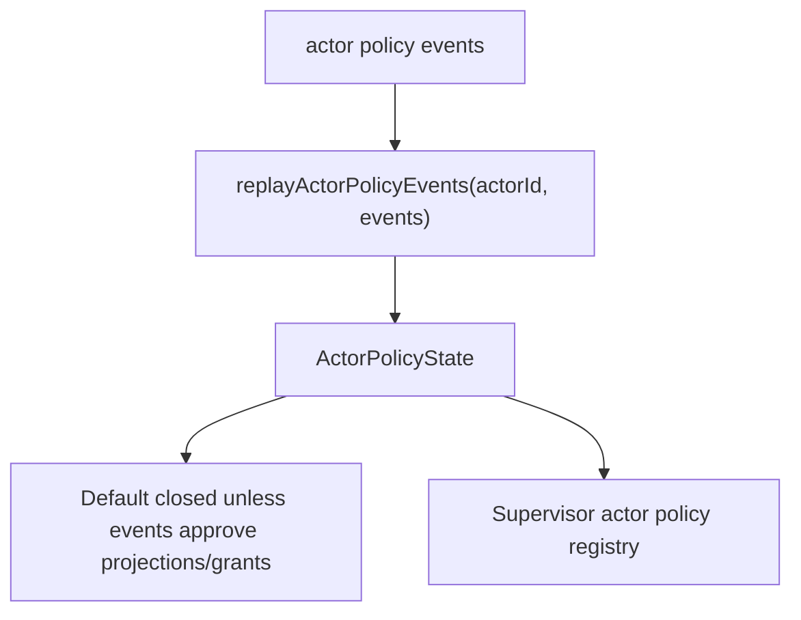
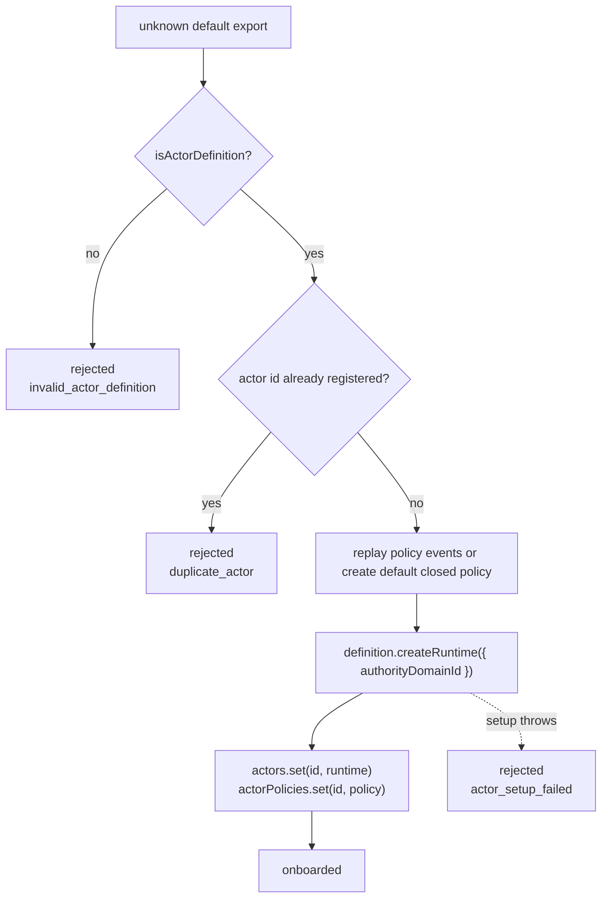
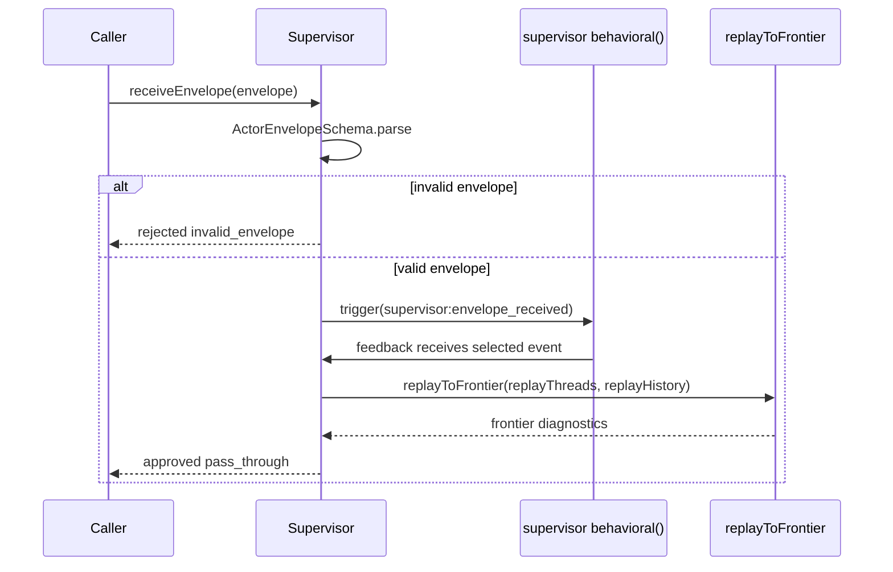
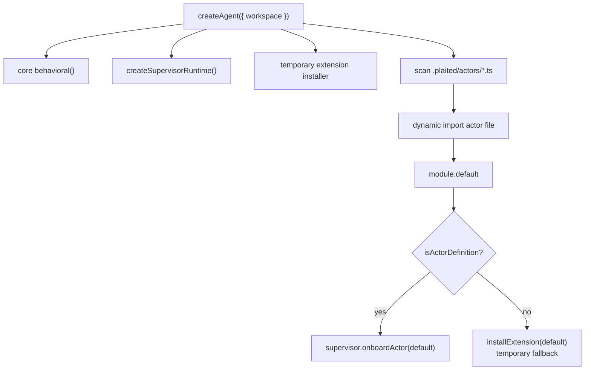
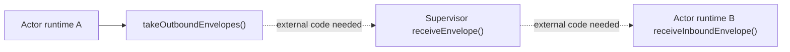

# Actor Runtime

> Status: active implementation notes for the current `defineActor`,
> module runtime actor, supervisor runtime, and `createAgent()` scan flow.

This document explains how the current actor runtime pieces fit together.
It is intentionally source-grounded so future edits can be made against the
actual code path instead of the older extension/install model.

## Files

| File | Role |
|---|---|
| `src/behavioral/create-module-runtime-actor.ts` | Defines `defineActor(...)`, creates live module actor runtimes, validates module-local events and envelopes, and records actor-local history/diagnostics. |
| `src/behavioral/create-supervisor-runtime.ts` | Owns supervisor identity, onboards actor definitions into a registry, validates received envelopes, and records supervisor replay/frontier diagnostics. |
| `src/behavioral/actor-policy-ledger.ts` | Defines append-only actor policy event schemas and replays them into default-closed actor policy state. |
| `src/agent/create-agent.ts` | Composition root. Creates the core behavioral engine, creates the supervisor runtime, scans actor files, and onboards `defineActor(...)` defaults. |

`useExtension` and `useInstaller` still exist for temporary compatibility in
`createAgent()`, but they are not the target actor model.

## Authoring Model

Actor files should default-export `defineActor(...)`.

```ts
import { defineActor } from 'plaited/behavioral'

export default defineActor({
  id: 'planner',
  setup(runtime) {
    runtime.addBThread(...)
    runtime.useFeedback(...)
  },
})
```

`defineActor(...)` is intentionally inert. Importing the file creates a branded
definition object, not a running actor. The supervisor decides when the
definition becomes a live runtime.



## `defineActor(...)`

`defineActor(...)` lives in `create-module-runtime-actor.ts`.

It:

- validates `id` as a non-empty module id
- returns a branded `ActorDefinition`
- exposes `createRuntime({ authorityDomainId })`
- calls `createModuleRuntimeActor({ moduleId: id, authorityDomainId })`
- runs optional `setup(runtime)` after runtime creation



## Module Runtime Actor

`createModuleRuntimeActor(...)` creates one isolated behavioral runtime for one
module id.

It returns a frozen runtime object with:

- `authorityDomainId`
- `moduleId`
- `actorRef`
- `addBThread(...)`
- `addBThreads(...)`
- `useFeedback(...)`
- `useSnapshot(...)`
- `triggerLocalEvent(...)`
- `emitOutboundEnvelope(...)`
- `receiveInboundEnvelope(...)`
- `takeOutboundEnvelopes()`
- history and diagnostic getters

Each module runtime owns its own internal `behavioral()` instance. Blocking,
feedback, snapshots, and histories are isolated per actor runtime.

### Internal Event Names

For module id `planner`, the runtime uses names like:

| Purpose | Event Type |
|---|---|
| Local ingress | `module:planner:ingress_local_event` |
| Outbound ingress | `module:planner:ingress_outbound_envelope` |
| Inbound ingress | `module:planner:ingress_inbound_envelope` |
| Local actor event | `module:planner:local:<event>` |
| Outbound envelope event | `module:planner:outbound_envelope` |
| Inbound envelope event | `module:planner:inbound_envelope` |

### Local Event Flow

`triggerLocalEvent(...)` is the actor-local event ingress.



Rejected local events produce validation diagnostics. Blocked local events mean
a bThread in that actor runtime prevented selection.

### Outbound Envelope Flow

`emitOutboundEnvelope(...)` is how an actor proposes communication outside
itself.



The runtime does not deliver the envelope. It queues approved outbound
envelopes. An outside orchestrator or supervisor-facing loop must call
`takeOutboundEnvelopes()`.

### Inbound Envelope Flow

`receiveInboundEnvelope(...)` is how an approved envelope enters a target actor.



## Supervisor Runtime

`createSupervisorRuntime(...)` owns the node-local supervision layer.

It returns:

- `authorityDomainId`
- `onboardActor(...)`
- `receiveEnvelope(...)`
- `useSnapshot(...)`
- `getActor(...)`
- `getActorIds()`
- replay, envelope, diagnostic, decision, and snapshot getters

The supervisor has its own internal `behavioral()` instance. Today it validates
and records envelope intake. It does not yet route approved envelopes to target
actors.

## Actor Policy Ledger

Actor access starts closed. Policy is represented as append-only ledger events
that the supervisor replays into actor policy state during onboarding.

Default policy has:

- no projections
- no grants
- no public memory
- no known MSS tags

Supported policy event families currently include:

- `actor.created`
- `code.promoted`
- `mss.observed`
- `projection.proposed`
- `projection.approved`
- `grant.approved`



Example JSONL shape:

```jsonl
{"type":"actor.created","actorId":"farm-stand","codeHash":"hash-a"}
{"type":"mss.observed","actorId":"farm-stand","tags":{"content":["produce-catalog"],"structure":["projection-ledger"],"mechanics":["inventory-update"],"boundary":["supplier-boundary"],"scale":["market-day"]}}
{"type":"projection.approved","actorId":"farm-stand","projectionId":"supplier-stock","approvedBy":"human","audience":{"kind":"supplier"}}
{"type":"grant.approved","actorId":"farm-stand","projectionId":"supplier-stock","approvedBy":"human","audience":{"kind":"supplier","id":"supplier-1"}}
{"type":"code.promoted","actorId":"farm-stand","codeHash":"hash-b","approvedBy":"human"}
```

### Actor Onboarding

`onboardActor(...)` accepts unknown input and requires a `defineActor(...)`
definition.



Onboarding currently records rejected onboarding as supervisor validation
diagnostics and rejected decisions. Successful onboarding registers the runtime
but does not emit a supervisor event yet.

### Envelope Receive Flow

`receiveEnvelope(...)` validates an `ActorEnvelope`, triggers supervisor ingress,
records replay/frontier diagnostics, and returns an approval result.



The current supervisor policy is pass-through for valid envelopes. The replay
diagnostics prove what the supervisor runtime selected, but no grant,
projection, memory, or target-routing policy is enforced yet.

## `createAgent()` Composition

`createAgent()` is the current composition root.

It:

- creates the core `behavioral()` engine
- creates `createSupervisorRuntime()`
- creates the temporary extension installer for legacy/default modules
- installs the core extension and existing `src/modules` extension actors
- scans `.plaited/actors/*.ts`
- imports each actor file default export
- onboards `defineActor(...)` defaults into the supervisor
- temporarily falls back to extension installation for old scanned fixtures
- returns the host `trigger`



The important direction is that scanned actor files should become
`defineActor(...)` definitions. The extension fallback is transitional.

## Current End-To-End Gap

The actor runtime and supervisor runtime are now connected for onboarding, but
not for message routing.

Today:



Still missing:

- supervisor-owned routing from outbound queues to `receiveEnvelope(...)`
- delivery of approved envelopes to target actors
- projection/grant policy decisions using replayed actor policy state
- actor descriptor metadata on `defineActor(...)`
- validation that actor files have only one default export and no named exports
- removal of the temporary extension fallback in actor scanning

## Practical Editing Guide

When editing actor authoring semantics, start in
`create-module-runtime-actor.ts`:

- `defineActor(...)` controls the default-export contract
- `ActorDefinition` controls what imported actor files produce
- `createModuleRuntimeActor(...)` controls live actor behavior

When editing onboarding and registry behavior, start in
`create-supervisor-runtime.ts`:

- `onboardActor(...)` validates actor definitions and creates runtimes
- `actors` is the supervisor registry
- diagnostics and decisions are recorded there

When editing workspace scanning, start in `create-agent.ts`:

- `scanActorDirectory(...)` finds files
- `installActorFileDefaultExport(...)` imports defaults
- `isActorDefinition(...)` decides whether to onboard or use the temporary
  extension fallback

When adding cross-actor communication, avoid putting routing in actor files.
The likely home is supervisor runtime or a small agent-owned orchestration loop
that drains outbound queues, asks the supervisor for decisions, and delivers
approved envelopes.
