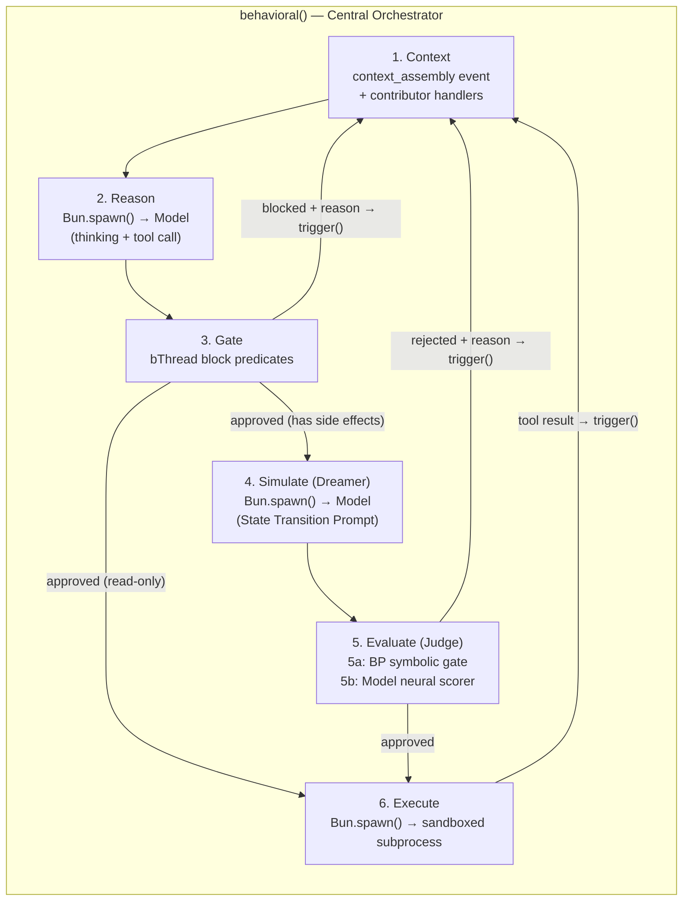
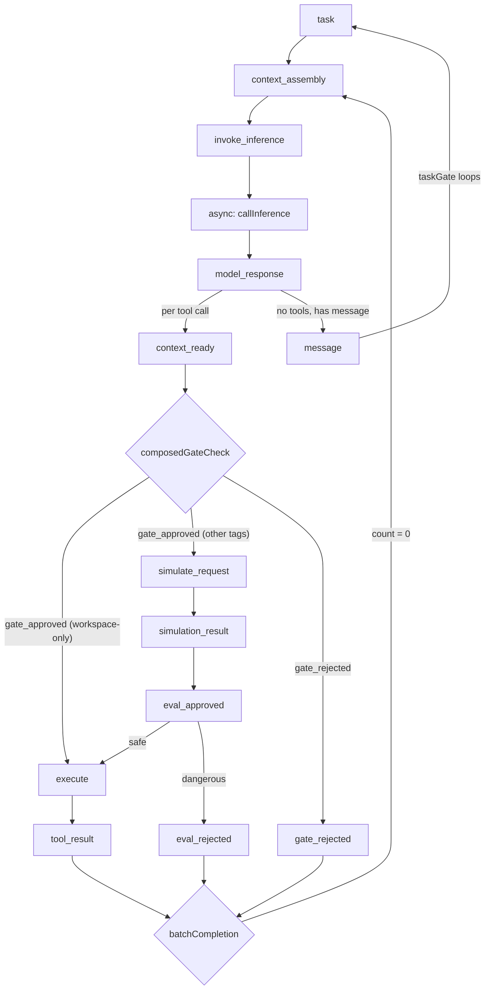
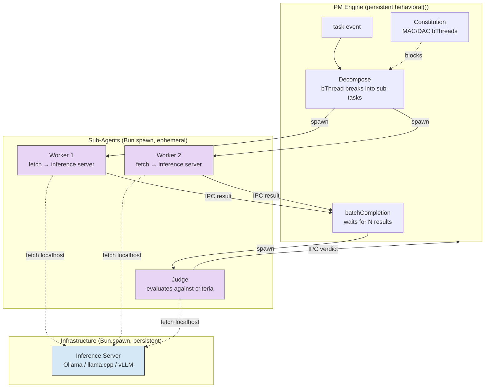
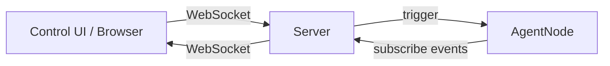

# The Agent Loop

> **Status: ACTIVE** — Extracted from SYSTEM-DESIGN-V3.md. Replaces the `agent-build` skill as the authoritative loop reference. Cross-references: `SAFETY.md` (defense layers), `HYPERGRAPH-MEMORY.md` (context assembly, plans as bThreads), `CONSTITUTION.md` (governance enforcement).

## The 6-Step Loop

The PM's `behavioral()` engine is the central coordinator. Sub-agents run as `Bun.spawn()` processes for crash isolation, each with their own inference context. The PM's bThreads handle all structural coordination — task lifecycle, batch completion, constitution enforcement, simulation guards. Sub-agents have minimal bThreads scoped to their role (or none — simple inference runners).

See `ARCHITECTURE.md` § Runtime Hierarchy for the full `Bun.spawn → behavioral → bThread → bSync` isolation model.

### Step Details

1. **Context** — BP assembles the model's prompt via the `context_assembly` event (see `HYPERGRAPH-MEMORY.md`). Contributor handlers provide: plan state, active constraints, conversation history, relevant tool descriptions, prior gate rejections, constitution knowledge.

2. **Reason** — The model produces two outputs separated by the inference server: `<think>` blocks containing reasoning, and a structured tool call. On the first cycle, the tool call may be `save_plan`. On subsequent cycles, the model adjusts based on tool results.

3. **Gate** — BP evaluates the tool call via `block` predicates. Deterministic: if any bThread blocks, the action is denied. The rejection reason feeds back to step 1 as context. For read-only actions, approved calls skip to step 6 — no simulation needed.

4. **Simulate (Dreamer)** — For side-effect actions, the model is called again with a **State Transition Prompt** (adapted from [WebDreamer](https://arxiv.org/abs/2411.06559)). The prompt instructs the model to predict only state changes — predicted stdout, error messages, or file diffs.

5. **Evaluate (Judge)** — Two layers assess the simulated output:
   - **5a — Symbolic Gate (fast, deterministic):** BP `block` predicates evaluate the Dreamer's text output via regex/keyword matching.
   - **5b — Neural Scorer (slow, optional):** Only for high-ambiguity actions. The model scores the simulated state on progress toward the goal.

6. **Execute** — Only if Gate (3), symbolic gate (5a), and neural scorer (5b, if active) all approve. The tool call runs in a sandboxed subprocess. Output returns via `trigger()` as new context.

### Selective Simulation

BP classifies actions at the Gate and routes accordingly:

| Risk Class | Actions | Path |
|---|---|---|
| **Read-only** | File read, search, LSP query, plan navigation | Gate → Execute (skip simulation) |
| **Side effects** | File write, bash command, file creation/deletion | Gate → Simulate → 5a symbolic gate → Execute |
| **High ambiguity** | Network calls, payment, system config, destructive ops | Gate → Simulate → 5a + 5b neural scorer → Execute |

### `<think>` as Lightweight Simulation

The model's `<think>` block is itself a first layer of prediction. If the thinking already predicts a violation, the Gate blocks without invoking the Dreamer. The Dreamer handles cases where `<think>` didn't surface the risk.

## Event Flow

**Narrow World View:** Each tool call is an independent scenario. `model_response` triggers one `context_ready` event per tool call, each flowing through its own pipeline. `batchCompletion` waits for all N to resolve, then triggers `context_assembly` for the next inference call.

**Pipeline pass-through:** Events always flow through the full simulate → evaluate → execute pipeline. When a seam is absent, the handler passes through via optional chaining — no conditional routing.

## Sub-Agent Coordination (4-Step Harness)

The PM decomposes complex tasks into sub-tasks, each handled by a `Bun.spawn()` sub-agent. The harness maps to BP:

1. **Decompose** — PM reads task context, breaks into sub-tasks via bThread coordination
2. **Parallelize** — Spawn sub-agent processes (each calls local inference server via `fetch`)
3. **Verify** — Judge sub-agent evaluates results against acceptance criteria
4. **Iterate** — On failure, spawn FRESH sub-agent with error context (new process, clean context window)

Sub-agents communicate with the PM via the `SubAgentHandle` interface (see `ARCHITECTURE.md` § Runtime Hierarchy). IPC uses `serialization: "advanced"` (JSC structured clone). The inference server is a persistent process on the same box — sub-agents call it via `fetch("http://localhost:PORT")`, making inference async I/O from the sub-agent's perspective.

## ACP Interface (Agent Communication Protocol)

The agent exposes an `AgentNode` — `{ trigger, subscribe, snapshot, destroy }` — as its external API. External clients (control UIs, trial adapters, orchestrators) communicate through this interface.

### Control UI via ACP

The control UI is a **generative UI** rendered via the controller protocol (see `UI.md`). It communicates with the agent over WebSocket, which bridges to `AgentNode.trigger()` and `AgentNode.subscribe()`.

The UI is not a TUI — it's server-driven HTML generated by the agent. The agent decides what to render based on the task context. The controller protocol (render/attrs/update_behavioral) handles bidirectional updates.

### Programmatic Access via ACP

For programmatic access (trial runner, CI, orchestrator), the agent supports operation via stdin/stdout or subprocess IPC:

| Mode | Transport | Use Case |
|---|---|---|
| **WebSocket** | Browser ↔ Server | Control UI (generative UI) |
| **IPC** | `Bun.spawn({ ipc: true })` | Orchestrator ↔ Project subprocess |
| **stdin/stdout** | JSONL stream | Trial runner, CI pipelines |

All modes use the same `AgentNode` API — the transport adapter translates between the protocol and `trigger()`/`subscribe()`.

### SSH Access

System engineers can access the node directly via SSH for:
- Constitution modification (adding/removing MAC factories outside normal agent process)
- Debugging (inspecting JSON-LD decision files, git history)
- Recovery (replaying from hypergraph memory)

SSH access bypasses the agent process entirely — it's OS-level access to the node's filesystem.

## Why Distillation, Not a Pre-trained Tool-Calling Model

Pre-trained tool-calling models (GPT-4, Claude) are trained on generic tool schemas. Our model needs:

1. **Specific tool schemas** — our tools have specific argument shapes and output formats
2. **BP-aware reasoning** — the model needs to understand that blocked actions should be re-planned, not retried
3. **Dreamer capability** — predicting state transitions requires training on `(Context + Tool Call) → (Real Output)` pairs from our specific tools
4. **Constitution awareness** — the model learns governance constraints through context assembly + experience, not generic instruction-following

Distillation from frontier agents (Claude Code, Gemini CLI) via the trial runner provides the reasoning patterns. Fine-tuning on our specific tools and BP feedback loop produces a model that's both capable and constraint-aware. See `TRAINING.md`.

## Default Tools

The framework ships with built-in tools for file system and shell access:

| Tool | Category | Description |
|---|---|---|
| `read_file` | Read-only | Read file contents |
| `write_file` | Side effects | Write/create files |
| `edit_file` | Side effects | Targeted string replacement in files |
| `bash` | Side effects / High ambiguity | Execute shell commands |
| `list_directory` | Read-only | List directory contents |
| `save_plan` | Internal | Save plan (flows through normal pipeline) |

Additional tools come from skills (see `GENOME.md` for the seeds/tools/eval taxonomy) and MCP servers (see `PROJECT-ISOLATION.md` for tool layers).

**Open question: what additional tools should ship as defaults?** This needs evaluation against pi-mono's tool set and our specific needs (hypergraph queries, constitution management, model lifecycle).
