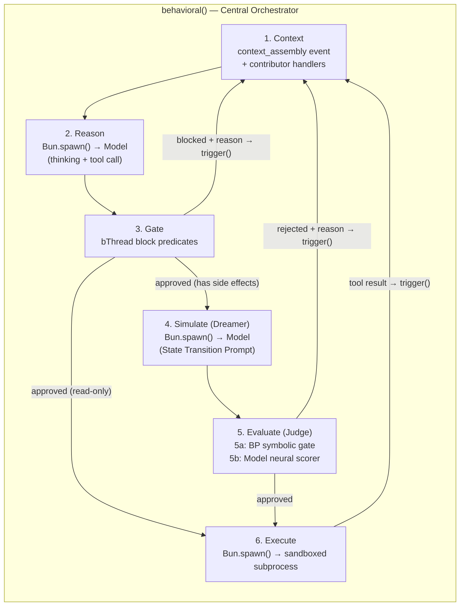
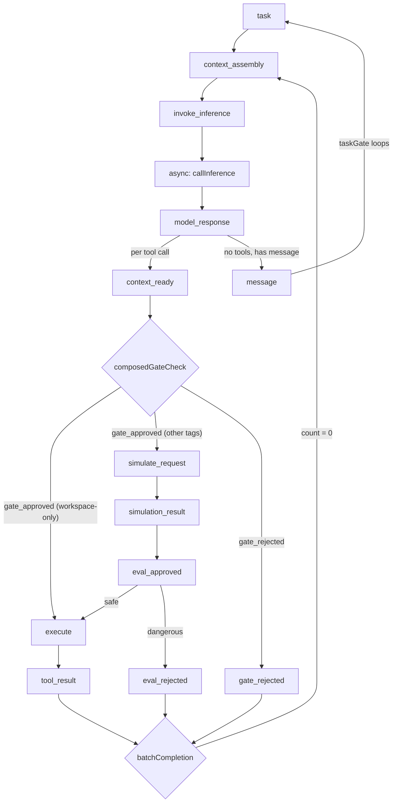
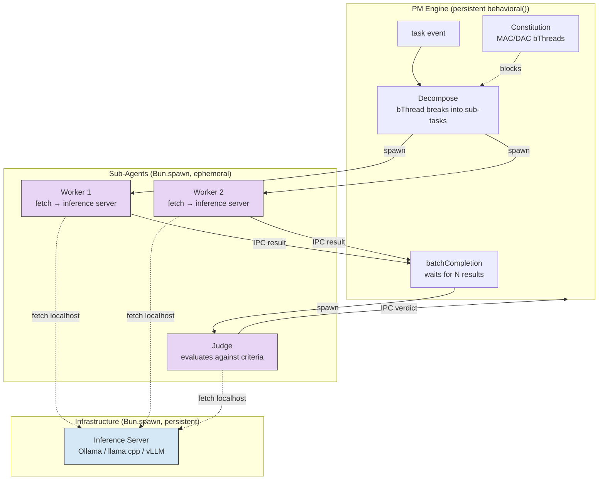
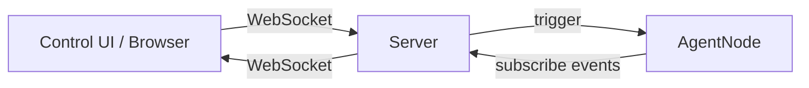
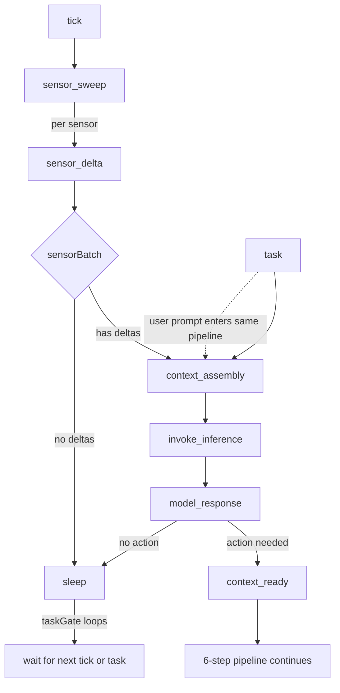

# The Agent Loop

> **Status: ACTIVE** — Extracted from SYSTEM-DESIGN-V3.md. Replaces the `agent-build` skill as the authoritative loop reference. Cross-references: `SAFETY.md` (defense layers), `HYPERGRAPH-MEMORY.md` (context assembly, plans as bThreads), `CONSTITUTION.md` (governance enforcement).

## The 6-Step Loop

The PM's `behavioral()` engine is the central coordinator. Sub-agents run as `Bun.spawn()` processes for crash isolation, each with their own inference context. The PM's bThreads handle all structural coordination — task lifecycle, batch completion, constitution enforcement, simulation guards. Sub-agents have minimal bThreads scoped to their role (or none — simple inference runners).

See `ARCHITECTURE.md` § Runtime Hierarchy for the full `Bun.spawn → behavioral → bThread → bSync` isolation model.



### Step Details

1. **Context** — BP assembles the model's prompt via the `context_assembly` event (see `HYPERGRAPH-MEMORY.md`). Contributor handlers provide: plan state, active constraints, conversation history, relevant tool descriptions, prior gate rejections, constitution knowledge.

2. **Reason** — The model produces two outputs separated by the inference server: `<think>` blocks containing reasoning, and a structured tool call. On the first cycle, the tool call may be `save_plan`. On subsequent cycles, the model adjusts based on tool results.

3. **Gate** — BP evaluates the tool call via `block` predicates. Deterministic: if any bThread blocks, the action is denied. The rejection reason feeds back to step 1 as context. For read-only actions, approved calls skip to step 6 — no simulation needed.

4. **Simulate (Dreamer)** — For side-effect actions, the model is called again with a **State Transition Prompt** (adapted from [WebDreamer](https://arxiv.org/abs/2411.06559)). The prompt instructs the model to predict only state changes — predicted stdout, error messages, or file diffs.

5. **Evaluate (Judge)** — Two layers assess the simulated output:
   - **5a — Symbolic Gate (fast, deterministic):** BP `block` predicates evaluate the Dreamer's text output via regex/keyword matching.
   - **5b — Neural Scorer (slow, optional):** Only for high-ambiguity actions. The model scores the simulated state on progress toward the goal.

6. **Execute** — Only if Gate (3), symbolic gate (5a), and neural scorer (5b, if active) all approve. The tool call runs in a sandboxed subprocess. Output returns via `trigger()` as new context.

### Selective Simulation

BP classifies actions at the Gate and routes accordingly:

| Risk Class | Actions | Path |
|---|---|---|
| **Read-only** | File read, search, LSP query, plan navigation | Gate → Execute (skip simulation) |
| **Side effects** | File write, bash command, file creation/deletion | Gate → Simulate → 5a symbolic gate → Execute |
| **High ambiguity** | Network calls, payment, system config, destructive ops | Gate → Simulate → 5a + 5b neural scorer → Execute |

### `<think>` as Lightweight Simulation

The model's `<think>` block is itself a first layer of prediction. If the thinking already predicts a violation, the Gate blocks without invoking the Dreamer. The Dreamer handles cases where `<think>` didn't surface the risk.

## Event Flow



**Narrow World View:** Each tool call is an independent scenario. `model_response` triggers one `context_ready` event per tool call, each flowing through its own pipeline. `batchCompletion` waits for all N to resolve, then triggers `context_assembly` for the next inference call.

**Pipeline pass-through:** Events always flow through the full simulate → evaluate → execute pipeline. When a seam is absent, the handler passes through via optional chaining — no conditional routing.

## Sub-Agent Coordination (4-Step Harness)

The PM decomposes complex tasks into sub-tasks, each handled by a `Bun.spawn()` sub-agent. The harness maps to BP:

1. **Decompose** — PM reads task context, breaks into sub-tasks via bThread coordination
2. **Parallelize** — Spawn sub-agent processes (each calls local inference server via `fetch`)
3. **Verify** — Judge sub-agent evaluates results against acceptance criteria
4. **Iterate** — On failure, spawn FRESH sub-agent with error context (new process, clean context window)



Sub-agents communicate with the PM via the `SubAgentHandle` interface (see `ARCHITECTURE.md` § Runtime Hierarchy). IPC uses `serialization: "advanced"` (JSC structured clone). The inference server is a persistent process on the same box — sub-agents call it via `fetch("http://localhost:PORT")`, making inference async I/O from the sub-agent's perspective.

## ACP Interface (Agent Communication Protocol)

The agent exposes an `AgentNode` — `{ trigger, subscribe, snapshot, destroy }` — as its external API. External clients (control UIs, trial adapters, orchestrators) communicate through this interface.

### Control UI via ACP

The control UI is a **generative UI** rendered via the controller protocol (see `UI.md`). It communicates with the agent over WebSocket, which bridges to `AgentNode.trigger()` and `AgentNode.subscribe()`.



The UI is not a TUI — it's server-driven HTML generated by the agent. The agent decides what to render based on the task context. The controller protocol (render/attrs/update_behavioral) handles bidirectional updates.

### Programmatic Access via ACP

For programmatic access (trial runner, CI, orchestrator), the agent supports operation via stdin/stdout or subprocess IPC:

| Mode | Transport | Use Case |
|---|---|---|
| **WebSocket** | Browser ↔ Server | Control UI (generative UI) |
| **IPC** | `Bun.spawn({ ipc: true })` | Orchestrator ↔ Project subprocess |
| **stdin/stdout** | JSONL stream | Trial runner, CI pipelines |

All modes use the same `AgentNode` API — the transport adapter translates between the protocol and `trigger()`/`subscribe()`.

### SSH Access

System engineers can access the node directly via SSH for:
- Constitution modification (adding/removing MAC factories outside normal agent process)
- Debugging (inspecting JSON-LD decision files, git history)
- Recovery (replaying from hypergraph memory)

SSH access bypasses the agent process entirely — it's OS-level access to the node's filesystem.

## Proactive Mode (Heartbeat)

> **Status: DESIGN** — Not yet implemented. Depends on `createAgentLoop()`.

The 6-step loop is reactive by default — it waits for a `task` event from the user. Proactive mode adds a second entry point: a **heartbeat tick** that triggers the same pipeline on a timer, enabling the agent to act without user prompting.

### Why Push-Based

The UI rendering pipeline (`src/ui/`) was redesigned to be server-driven (commit `6b53f70`) specifically to support this: the agent pushes `render`, `attrs`, and `update_behavioral` messages to the client over WebSocket. A proactive agent needs a proactive UI — the server initiates contact, not the user.

### Architecture: Tick as BP Event

The heartbeat is not a scheduler — it's a timer that fires `trigger({ type: 'tick' })` into the existing BP engine. BP event selection handles all coordination:

```typescript
// Timer source — outside BP, replaceable
let timerId: Timer

const setHeartbeat = (intervalMs: number) => {
  clearInterval(timerId)
  if (intervalMs > 0) {
    timerId = setInterval(() => trigger({ type: 'tick' }), intervalMs)
  }
}

// Default: every 15 minutes
setHeartbeat(15 * 60 * 1000)
```

The `taskGate` bThread extends to accept both `task` and `tick`:

```typescript
bThreads.set({
  taskGate: bThread([
    bSync({
      waitFor: (e) => e.type === AGENT_EVENTS.task || e.type === 'tick',
      block: (e) => PIPELINE_EVENTS.has(e.type),
    }),
    bSync({ waitFor: AGENT_EVENTS.message }),
  ], true),
})
```

### Event Flow (Proactive)



### Sensor Sweep

Each sensor is a `useFeedback` handler on `tick`. Sensors run in parallel, produce `sensor_delta` events. A `sensorBatch` bThread (same pattern as `batchCompletion`) waits for all sensors to resolve, then either triggers `context_assembly` (deltas found) or `sleep` (no changes):

```typescript
useFeedback({
  async tick() {
    // Discover registered sensors
    const sensors = getSensors()

    // Run all sensors in parallel
    const results = await Promise.all(
      sensors.map(async (sensor) => {
        const current = await sensor.read()
        const previous = await sensor.lastSnapshot()
        const delta = sensor.diff(current, previous)
        if (delta) {
          trigger({ type: 'sensor_delta', detail: { sensor: sensor.name, delta } })
        }
        await sensor.saveSnapshot(current)
        return delta
      }),
    )

    // sensorBatch bThread handles the rest
    const sensorCount = results.filter(Boolean).length
    bThreads.set({
      sensorBatch: bThread([
        ...Array.from({ length: sensorCount }, () =>
          bSync({ waitFor: 'sensor_delta', interrupt: [AGENT_EVENTS.task] }),
        ),
        bSync({
          request: { type: AGENT_EVENTS.context_assembly },
          interrupt: [AGENT_EVENTS.task],
        }),
      ]),
    })

    if (sensorCount === 0) {
      trigger({ type: 'sleep' })
    }
  },
})
```

### Inference Prompt (Proactive)

When a `tick` triggers inference (via `context_assembly`), the system prompt includes a proactive framing:

```
Here are your active goals.
Here is what you did during the last heartbeat.
Here is new data from your sensors.

Based strictly on this context, is any action required?
If no action is needed, respond with a text message "SLEEP".
If action is required, produce the appropriate tool calls.
```

If the model responds with text only (no tool calls), the `message` event fires, `taskGate` loops back to waiting, and the agent sleeps until the next tick.

### User-Configurable Heartbeat

The heartbeat interval is a tool call, not a config file. The user says "check less often" and the model calls `set_heartbeat`:

```typescript
const setHeartbeatTool = {
  name: 'set_heartbeat',
  description: 'Change the proactive heartbeat interval. 0 = pause.',
  parameters: {
    interval_seconds: { type: 'number', minimum: 0 },
  },
}
```

This means:
- Natural language control: "pause heartbeat", "check every 2 hours", "wake me if anything changes"
- No settings UI required — the cost knob is accessible through conversation
- Persisted in session state so the interval survives reconnection

### Priority: User Always Wins

A `tickYield` bThread ensures user prompts interrupt in-progress proactive cycles:

```typescript
bThreads.set({
  tickYield: bThread([
    bSync({ waitFor: 'tick' }),
    bSync({
      waitFor: AGENT_EVENTS.message,
      interrupt: [AGENT_EVENTS.task],
    }),
  ], true),
})
```

| Scenario | Behavior |
|----------|----------|
| User sends prompt while idle | `task` selected, normal reactive flow |
| Tick fires while idle | `tick` selected, sensor sweep runs |
| Tick fires during active user task | `taskGate` blocks `tick` — silently dropped |
| User sends prompt during tick processing | `tickYield` interrupts proactive cycle, user task runs |
| User says "pause heartbeat" | Model calls `set_heartbeat(0)`, timer cleared |

### Concurrency

BP's single-threaded super-step model provides mutual exclusion for free. A `tick` during an active task is not selected (blocked by `taskGate`). No locks, no race conditions, no concurrent inference calls.

### Push Notifications

When the agent acts proactively, it pushes results to the user via the existing WebSocket channel. If the client is disconnected, the `sessionGate` bThread blocks pipeline events — proactive actions queue until reconnection or route to an external notification channel.

```typescript
useFeedback({
  [AGENT_EVENTS.message]({ content, source }: MessageDetail) {
    if (source === 'proactive') {
      // WebSocket connected → push via render
      server.publish(sessionId, {
        type: 'render',
        detail: { target: 'notifications', template: formatNotification(content) },
      })
      // TODO: external push (Telegram, Discord, SMS) when disconnected
    }
  },
})
```

### Cost Implications

On local hardware (Mac Mini, Mac Studio, DGX Spark), the GPU is a sunk cost — proactive ticks have **zero marginal cost** and improve hardware utilization. On cloud GPU, cost scales linearly with tick frequency:

| Interval | Ticks/day | Est. cloud cost/mo |
|----------|----------|-------------------|
| 5 min | 288 | ~$25 |
| 15 min (default) | 96 | ~$8 |
| 1 hour | 24 | ~$2 |
| 2 hours | 12 | ~$1 |
| Paused | 0 | $0 |

User-configurable intervals let cloud deployments control costs via natural language.

### Goals as bThreads

Long-term directives ("watch for emails from Alice", "alert if server goes down") are persistent `repeat: true` bThreads that `waitFor` specific `sensor_delta` events. Multiple goals coexist — BP event selection evaluates all threads simultaneously on every super-step.

Goals are generated as **TypeScript factory files** with companion tests, stored in `.memory/goals/`. On agent spawn, the loader reads all goal factories, validates them (tsc + test), and creates bThreads. See `CONSTITUTION.md` § Generated bThreads for the full generation architecture, verification pipeline, and file structure.

**Goal lifecycle via natural language:**

| User says | Agent action |
|-----------|-------------|
| "Watch for emails from Alice" | Generates `watch-alice.ts` + `watch-alice.spec.ts`, runs verification, loads bThread |
| "Stop watching Alice" | Removes goal factory file, bThread is interrupted |
| "Pause all monitoring" | Calls `set_heartbeat(0)` — goals stay registered but dormant (no ticks) |
| "Also watch for Bob" | Generates new goal factory — composes additively with existing goals |
| "Watch Alice but only weekdays" | Generates goal with `repeat: () => isWeekday()` — self-terminates on weekends |

**Multiple goals firing on same tick:** If Alice emails AND the server goes down in the same tick, both goal bThreads advance. The `batchCompletion` pattern handles N concurrent goal-triggered actions.

### Event Vocabulary (Proactive Extensions)

| Event | Produced by | Consumed by |
|-------|-------------|-------------|
| `tick` | `setInterval` timer (external) | tick handler (sensor sweep) |
| `sensor_sweep` | tick handler | sensor handlers |
| `sensor_delta` | individual sensor handlers | goal bThreads, sensorBatch bThread |
| `sleep` | tick handler (no deltas) or model (no action) | taskGate (loops back) |
| `set_heartbeat` | model tool call | execute handler (reconfigures timer) |

## Why Distillation, Not a Pre-trained Tool-Calling Model

Pre-trained tool-calling models (GPT-4, Claude) are trained on generic tool schemas. Our model needs:

1. **Specific tool schemas** — our tools have specific argument shapes and output formats
2. **BP-aware reasoning** — the model needs to understand that blocked actions should be re-planned, not retried
3. **Dreamer capability** — predicting state transitions requires training on `(Context + Tool Call) → (Real Output)` pairs from our specific tools
4. **Constitution awareness** — the model learns governance constraints through context assembly + experience, not generic instruction-following

Distillation from frontier agents (Claude Code, Gemini CLI) via the trial runner provides the reasoning patterns. Fine-tuning on our specific tools and BP feedback loop produces a model that's both capable and constraint-aware. See `TRAINING.md`.

## Default Tools

The framework ships with built-in tools for file system and shell access:

| Tool | Category | Description |
|---|---|---|
| `read_file` | Read-only | Read file contents |
| `write_file` | Side effects | Write/create files |
| `edit_file` | Side effects | Targeted string replacement in files |
| `bash` | Side effects / High ambiguity | Execute shell commands |
| `list_directory` | Read-only | List directory contents |
| `save_plan` | Internal | Save plan (flows through normal pipeline) |

Additional tools come from skills (see `GENOME.md` for the seeds/tools/eval taxonomy) and MCP servers (see `PROJECT-ISOLATION.md` for tool layers).

**Open question: what additional tools should ship as defaults?** This needs evaluation against pi-mono's tool set and our specific needs (hypergraph queries, constitution management, model lifecycle).
