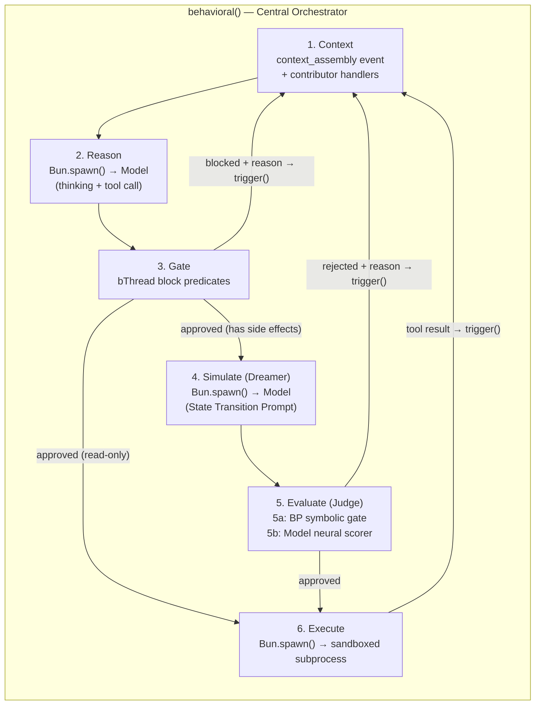

# The Agent Loop

> **Status: ACTIVE** — High-level overview. Implementation patterns, event
> vocabulary, and BP coordination details are in `skills/agent-loop/`.
> Cross-references: `SAFETY.md` (defense layers),
> `dev-research/memory-factories/program.md` (context assembly and memory
> layering), `CONSTITUTION.md` (governance enforcement).

## Overview

The agent loop is a 6-step pipeline orchestrated by a `behavioral()` engine.
Its bThreads handle all structural coordination — task lifecycle, batch
completion, constitution enforcement, and simulation guards.

## Steps

1. **Context** — BP assembles the model's prompt via the `context_assembly` event. Contributors provide: plan state, active constraints, conversation history, tool descriptions, prior gate rejections, constitution knowledge.

2. **Reason** — The model produces `<think>` reasoning blocks and a structured tool call. On the first cycle, the tool call may be `save_plan`.

3. **Gate** — BP evaluates the tool call via `block` predicates. Deterministic: if any bThread blocks, the action is denied and the rejection feeds back to step 1.

4. **Simulate (Dreamer)** — For side-effect actions, the model predicts state changes via a State Transition Prompt (adapted from [WebDreamer](https://arxiv.org/abs/2411.06559)).

5. **Evaluate (Judge)** — Two layers: 5a symbolic gate (regex/keyword, fast) and 5b neural scorer (model-based, optional for high-ambiguity actions).

6. **Execute** — Only after all gates approve. The tool call runs in a sandboxed subprocess. Output returns via `trigger()` as new context.

## Default Tools

| Tool | Category | Description |
|---|---|---|
| `read_file` | Read-only | Read file contents |
| `write_file` | Side effects | Write/create files |
| `edit_file` | Side effects | Targeted string replacement |
| `bash` | Side effects / High ambiguity | Execute shell commands |
| `list_directory` | Read-only | List directory contents |
| `save_plan` | Internal | Save plan (flows through normal pipeline) |

Additional tools come from skills (see `GENOME.md`) and MCP servers (see `PROJECT-ISOLATION.md`).

## Implementation Details

For event flow diagrams, BP coordination patterns, selective simulation routing,
proactive heartbeat, and ACP interface, see `skills/agent-loop/`.
