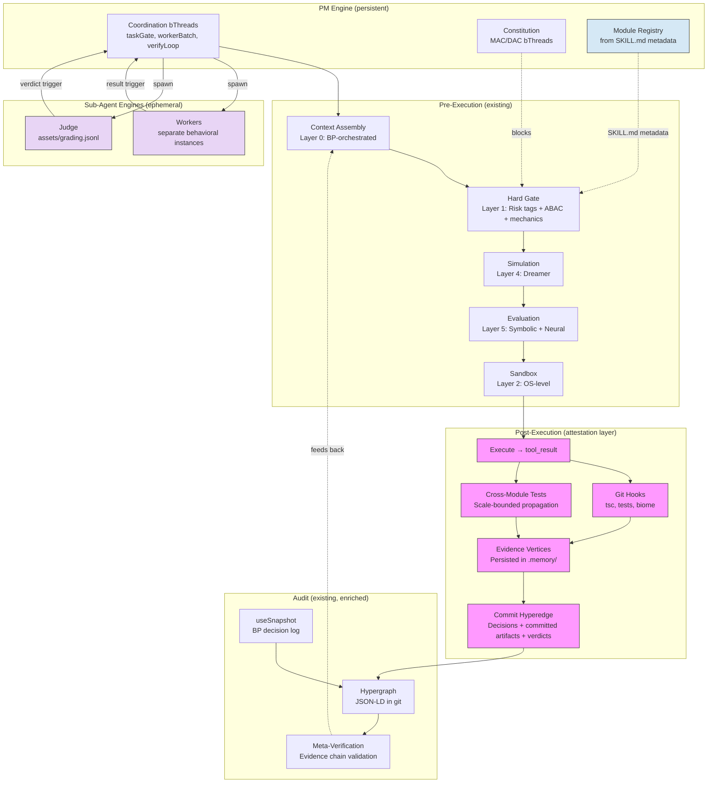

# Response: System-State Steering in a Modnet Architecture

> **Status: ACTIVE** — Response to [external critique](https://gist.github.com/yshaaban/51f31203be945887df69892e850d5bd7) of [`correct-behavior-analysis.md`](https://gist.github.com/yshaaban/5b90cc2dcd505babcfe3505f1b5fbb74). Resolves all 7 gaps through existing design, modnet alignment, and targeted extensions. Module architecture evolution (C+D combined, AgentSkills alignment, mechanics-driven dynamics) further strengthens resolutions.
>
> *Documents referenced below (e.g., `SAFETY.md`, `CONSTITUTION.md`, `MODNET-IMPLEMENTATION.md`) are internal architecture specifications within the project repository.*

## Summary

The critique argues that steering enterprise agents is a **control-plane problem over system state**, not just trajectory evaluation. It identifies seven gaps in the original analysis. This response resolves all seven — three through existing design that was insufficiently surfaced, three through new features that compose with existing primitives, and one through extending an existing capability to cover additional deployment contexts.

| Gap | Resolution | Category |
|---|---|---|
| 1: Post-execution verification | **New feature**: attestation layer + commit-as-hyperedge + git hooks | Extension |
| 2: System state model | **Existing**: modnet module graph + bridge-code + hypergraph | Reframe |
| 3: Evidence-backed meta-verification | **New feature**: evidence vertices with `attestsTo` + `artifacts` | Extension |
| 4: Resource-action-condition authority | **Existing**: ABAC already designed, scope extension needed | Reframe |
| 5: Data governance | **Existing**: MSS bridge-code IS data governance | Reframe |
| 6: Composite process signal | **New feature**: evidence vertices as additional signal sources | Extension |
| 7: Control-plane integration | **Existing + extension**: distributed control plane via BP + A2A + hosted infrastructure | Reframe |

## What the Critique Validates

Two areas where the architecture directly addresses the critique's concerns — and the critique confirms this:

**Hard constraints outside reward.** The critique says: "hard constraints belong outside the reward function. If an action violates policy or exceeds delegated authority, the system should reject it outright rather than merely assigning it a lower score." This is exactly what BP block predicates do. The neuro-symbolic split in `CONSTITUTION.md` — structural rules reject outright via bThread blocks, reward shapes behavior among allowed actions via training — matches this prescription precisely.

**Deterministic process ground truth.** The critique says BP snapshots are "real ground truth" and "valuable." It positions them as "one verifier among several" — which is fair and addressed below (Gap 6). But the core value of deterministic process signals from the BP engine is validated.

## What the Critique Assumes

The critique operates from a centralized enterprise context: a platform with CI/CD pipelines, deployment approval workflows, shared infrastructure, and a unified control plane. This is a valid deployment scenario — and one the architecture supports — but it's not the only one, and it's not the architecture's starting point.

The architecture is built on **modnet** principles — a module network design where:

- **1 node : 1 user** — each agent is a sovereign node, controlling its own modules and data
- **Modules are internal** — code and data live inside the node; only outputs cross A2A (Agent-to-Agent) boundaries
- **Bridge-code (MSS)** — every module carries contentType, structure, mechanics, boundary, scale tags
- **Coordination via protocol** — agents coordinate through A2A, not through a shared platform service
- **BP is the single policy engine** — the same block predicates govern local execution and inter-agent sharing

This doesn't preclude centralized hosting. Like websites, modules need to live somewhere with internet access — a cloud server, a company's infrastructure, or a home device. Sovereignty means the user (or organization) controls the node and its policies, not that everything runs on local hardware. A business can deploy modnet nodes for each worker, creating an internal emergent network of personal agents operating within organizational policy — the architecture scales from individual to enterprise.

Several of the critique's gaps dissolve when viewed through modnet's sovereignty model rather than shared-platform assumptions. Others require targeted extensions that compose naturally with existing primitives.

---

## Gap 1: Post-Execution Verification

**Critique:** After execution — did the system evolve correctly? Did the service behave in staging? Did the canary show regressions?

**Resolution: Attestation layer + commit-as-hyperedge + git hooks**

This is a genuine gap. The existing defense-in-depth (6 layers in `SAFETY.md`) is entirely pre-execution. A third layer of hypergraph vertices — **attestation vertices** — closes it.

### Three Layers of Hypergraph Vertices

The hypergraph currently has two layers. The attestation layer adds a third:

| Layer | Vertex Types | Produced By | Purpose |
|---|---|---|---|
| **Design-time** | Skill, Thread, Event, Tool, Rule, GovernanceRule | `collect_metadata` + source scan | What the agent *can* do |
| **Runtime** | Session, SelectionDecision, Bid | `useSnapshot` | What the agent *decided* |
| **Attestation** | GateDecision, ExecutionRecord, VerificationResult, UserApproval + skill-extended types | `useFeedback` handlers | What the *system state* actually is |

### Core Evidence Types

Every attestation vertex shares a base shape — an `@type`, a `verdict`, a link to the decision it verifies (`attestsTo`), and references to concrete artifacts with content hashes:

```jsonc
{
  "@id": "evidence://sess_abc/verify_tc-3",
  "@type": "VerificationResult",
  "attestsTo": "bp:decision/D-42",
  "producedBy": "tools:bash",
  "verdict": "pass",
  "artifacts": [
    { "path": "test-output.log", "hash": "sha256:abc..." }
  ],
  "summary": "12 tests passed, 0 failed",
  "boundary": "ask",
  "scope": "modules/farm-stand",
  "timestamp": "2026-03-11T14:30:00Z"
}
```

Six core types map to pipeline stages:

| `@type` | Pipeline Step | What It Attests |
|---|---|---|
| `GateDecision` | Gate (3) | Risk tags evaluated, preconditions checked |
| `SimulationPrediction` | Simulate (4) | Predicted state changes |
| `EvaluationJudgment` | Evaluate (5) | Symbolic + neural assessment |
| `ExecutionRecord` | Execute (6) | Raw tool output, exit code |
| `VerificationResult` | Verify (new) | Post-execution state check |
| `UserApproval` | Human-in-loop | Explicit owner confirmation |

The first four already have BP events (`gate_approved`, `simulation_result`, `eval_approved`, `tool_result`). They fire, handlers act on them, but the attestation is ephemeral. Persisting them as JSON-LD evidence vertices in `.memory/` makes them queryable for meta-verification and training.

Extended types (`TestResult`, `TypeCheckResult`, `DeploymentRecord`, `HealthCheck`, etc.) are contributed by skills that merge their own `@context` vocabulary — the same mechanism that already powers skill subgraphs.

### Git Hooks as Structural Verification

For local module state, git hooks are the natural post-execution verification mechanism. The agent executes `git commit` via the `bash` tool. The pre-commit hook runs inside `Bun.$`. The `tool_result` carries stdout, stderr, and exit code — the handler parses these into evidence vertices.

Current hooks enforce formatting (biome) and commit message format (commitlint). The Code Quality Gate in `AGENTS.md` mandates type checking (`tsc --noEmit`) and testing (`bun test src/`), but these are instructional — not structurally enforced by hooks. Moving them into the pre-commit hook is the neuro-symbolic migration the architecture describes: a pattern the model was told to follow becomes a constraint it cannot bypass.

```sh
# .hooks/pre-commit (upgraded)
#!/bin/sh
npx lint-staged                    # formatting: biome
bun --bun tsc --noEmit            # type correctness
bun test src/                      # test passing
```

Hook failures produce evidence with `verdict: 'fail'`, feed back to the model via `tool_result`, and the model re-plans. Hook successes produce evidence with `verdict: 'pass'` — proof that the commit passed structural verification at commit time.

### The Commit as Evidence Hyperedge

Per-side-effect commits (from `HYPERGRAPH-MEMORY.md`) already bundle code artifacts alongside decision JSON-LD files. Making the commit a first-class hypergraph vertex connects three things that are currently unlinked:

```jsonc
{
  "@id": "git:a1b2c3d",
  "@type": "Commit",
  "attestsTo": ["bp:decision/D-42", "bp:decision/D-43"],
  "artifacts": [
    { "path": "src/agent/agent.types.ts", "action": "modified" },
    { "path": ".memory/sessions/sess_abc/D-42.jsonld", "action": "added" }
  ],
  "hookResults": [
    { "@type": "FormatResult", "verdict": "pass", "producedBy": "pre-commit:biome" },
    { "@type": "TypeCheckResult", "verdict": "pass", "producedBy": "pre-commit:tsc" },
    { "@type": "TestResult", "verdict": "pass", "producedBy": "pre-commit:test" }
  ],
  "message": "feat: add evidence vertex taxonomy",
  "session": "session/sess_abc"
}
```

The commit hash is immutable. The decision chain is linked via `attestsTo`. The verification results are embedded. Meta-verification can walk this structure to check that evidence exists and coheres.

### Cross-Module Consistency

The workspace is a monorepo (node root with `modules/` as Bun workspaces). When the agent commits a change to a module, the `tool_result` handler discovers which modules depend on the changed module (scanning `package.json` for `workspace:*` references), triggers test runs for each dependent, and persists the results as `CrossModuleTestResult` evidence vertices.

This uses the batchCompletion pattern — each dependent's test run is a parallel operation, coordinated by a bThread that waits for all to complete before triggering a verification summary. Failed dependents feed back to context for the model to fix.

The verification depth is configurable via DAC governance factories: direct dependents only (default), full transitive graph, or skip for routine changes. The MAC layer enforces the minimum — the changed module's own tests must pass.

---

## Gap 2: No System State Model

**Critique:** The environment is overlapping graphs — goal, artifact, resource, authority, operational — and the agent's job is to move them forward without breaking invariants.

**Resolution: Already exists — modnet module graph + bridge-code + hypergraph**

The critique describes five graphs. All five already have modnet equivalents:

| Critique Graph | Modnet Equivalent | Where Documented |
|---|---|---|
| Goal graph | Plan bThreads — step dependencies are `waitFor`/`block` in the BP engine | `HYPERGRAPH-MEMORY.md` |
| Artifact graph | Modules with MSS contentType tags (`test-result`, `build-output`, etc.) | `MODNET-IMPLEMENTATION.md` |
| Resource graph | Peer agents (Agent Cards) + module dependencies (`workspace:*`) | `MODNET-IMPLEMENTATION.md` |
| Authority graph | ABAC predicates + known-peers table + boundary tags | `MODNET-IMPLEMENTATION.md` § Access Control |
| Operational graph | Modules with operational contentType tags — skill-contributed | Extension via `@context` |

In modnet, everything the agent works with is a **module** with bridge-code tags. Test results, security scans, deployment records — they're all modules or attestation vertices with contentType, structure, boundary, and scale. The hypergraph vertex taxonomy extends to cover them via JSON-LD `@context` vocabulary contributed by skills. No new architecture needed — the existing module model and `@context` extension mechanism handle it.

What was missing was acknowledging this in `correct-behavior-analysis.md` and surfacing the connection between evidence artifacts and the existing module/vertex model. The attestation layer (Gap 1) provides the concrete implementation.

---

## Gap 3: Evidence-Backed Meta-Verification

**Critique:** Instead of asking "how confident are we in this score," ask "does the evidence behind this decision actually exist and is it coherent?"

**Resolution: Evidence vertices with `attestsTo` + `artifacts` enable graph-based verification**

The current `withMetaVerification` wrapper produces `{ confidence, reasoning? }` — a grader-confidence score. This is necessary but insufficient. With attestation vertices persisted in the hypergraph, meta-verification extends to evidence-chain validation:

1. **Existence check**: Do all referenced evidence vertices resolve? A `GraderResult` that claims tests passed should link to `TestResult` vertices via `@id`.
2. **Artifact integrity**: Do content hashes in `artifacts` arrays match actual files? If a `TestResult` references `test-output.log` with hash `sha256:abc`, does the file exist and match?
3. **Verdict coherence**: Are verdicts internally consistent? If evidence includes a `TestResult` with `verdict: 'fail'`, but the grader's outcome score is 0.9, the meta-verifier flags the inconsistency.

This shifts meta-verification from "how confident is the grader?" to "does the evidence chain hold?" — exactly what the critique asks for. The existing `confidence` score remains useful as one signal, but it's grounded in verifiable evidence rather than self-assessment.

---

## Gap 4: Resource-Action-Condition Authority

**Critique:** Autonomy is a function of delegated authority. Permissions are contextual and scoped — deploy to staging if checks pass, but production needs additional approval.

**Resolution: ABAC already designed — extend scope from A2A to local execution**

The critique describes Attribute-Based Access Control. The architecture already has ABAC — it's documented in `MODNET-IMPLEMENTATION.md` § Access Control and implemented as BP block predicates evaluating requester attributes + module attributes + context. The three-layer model (DAC + MAC + ABAC) is designed and the code pattern is specified.

| Critique Term | Existing Modnet Primitive |
|---|---|
| Resource | Module (with contentType, structure, boundary tags) |
| Action | Event type (`share_module`, `execute`, etc.) |
| Condition | Context attributes evaluated by BP predicates |

The gap is **scope**: ABAC is currently applied only to inter-agent `share_module` events. Extending it to local `execute` events means gate bThread predicates evaluate not just the tool call and its risk tags, but also the resource being targeted and whether preconditions are met.

With the attestation layer, preconditions become evidence queries: "block deployment to production unless a `TestResult` with `verdict: 'pass'` exists for this session." This is a bThread block predicate that inspects the hypergraph for evidence state:

```typescript
bThreads.set({
  requireTestsBeforeDeploy: bThread([
    bSync({
      block: (e) => {
        if (e.type !== AGENT_EVENTS.execute) return false
        if (!isDeploy(e.detail?.toolCall)) return false
        return !hasEvidence({ type: 'TestResult', verdict: 'pass', session: currentSession })
      },
    }),
  ], true),
})
```

No new authority model needed. ABAC block predicates + evidence vertices + existing risk tags compose to provide resource-action-condition authority. The authority isn't "can you use bash?" — it's "can you deploy to production given the current evidence state?"

---

## Gap 5: Data Governance

**Critique:** Data should carry labels — classification, residency, retention — and the system should know whether the agent is permitted to interact with that class of data.

**Resolution: MSS bridge-code IS data governance**

Every modnet module carries five MSS tags. Three of them directly address data governance:

| Critique Concept | MSS Tag | How It Works |
|---|---|---|
| Data classification | `contentType` | Identifies the data domain — `"credentials"`, `"health-data"`, `"financial"`. MAC bThreads block access to classified types. |
| Data residency | Node sovereignty | Data lives on the user's node, nowhere else. The node IS residency. Data doesn't leave unless the boundary tag permits it. |
| Sharing policy | `boundary` | `all` / `none` / `ask` / `paid`. Controls what crosses A2A boundaries. MAC overrides — credentials are blocked regardless of boundary setting. |
| Code/data separation | MSS architecture | Code never crosses A2A boundaries. Only `data/` contents are eligible for sharing. |
| Access control | DAC + MAC + ABAC | Three-layer evaluation for every sharing request. |

What the architecture doesn't have is **retention policy** — when to archive or delete data. This is partially addressed by hypergraph rotation (`skills/training-pipeline/SKILL.md` § Log Retention): time-based or size-based rotation moves old decision files into compressed archives. Extending retention to module data would add a `retention` property to MSS bridge-code — but this is a minor addition to an existing model, not a new architecture.

The critique's concern about data governance assumes a platform context where user data is centralized and needs classification to prevent misuse. In modnet, data is sovereign by default — it starts private on the user's node and only crosses boundaries through explicit, BP-gated sharing. The governance model is inverted: not "classify to protect" but "everything is protected; classify to share."

---

## Gap 6: Composite Process Signal

**Critique:** BP snapshots are "one verifier among several" — they capture local coordination decisions, not broader system impact.

**Resolution: Attestation vertices extend the process signal without diminishing BP snapshots**

The critique is correct that BP snapshots alone don't capture broader system impact. But it underestimates what they capture. BP's event selection algorithm (`e ∈ ⋃ R_i(q_i) − ⋃ B_i(q_i)`) provides a formal composition guarantee — thread position IS state, blocking takes absolute precedence via set subtraction, and additive composition is a mathematical property, not a runtime hope. Within the agent's coordination boundary, BP snapshots are not just "one signal" — they are deterministic proof of every decision.

That said, the process dimension in `GradingDimensions` should be a composite signal. The attestation layer provides additional signal sources:

| Signal Source | What It Captures | Type | Weight |
|---|---|---|---|
| BP snapshots | Coordination decisions (blocked, interrupted, selected) | Deterministic | Foundation |
| Git hook results | Type correctness, test passing, formatting | Deterministic | High |
| Cross-module test results | Dependent module integrity | Deterministic | Medium |
| Evidence chain integrity | Artifact hashes valid, verdicts coherent | Deterministic | High |
| User approval/rejection | Semantic correctness | Human judgment | Highest |

The training weight formula remains `outcome × process`, but `process` is now a weighted composite of BP snapshots + evidence verdicts. BP snapshots provide the foundation (free, deterministic, always available). Evidence vertices extend coverage to module state. User feedback provides irreducible semantic signal.

This composite doesn't require a learned PRM — all signal sources except user feedback are deterministic. The composite just broadens the surface area of what "process quality" measures.

---

## Gap 7: Control-Plane Integration

**Critique:** Steering enterprise agents is a control-plane problem. Guardrails need to be visible in logs, enforceable by policy, and explainable during an audit.

**Resolution: BP enforcement + A2A coordination compose into a distributed control plane**

The critique envisions a centralized control plane — a platform service coordinating CI/CD, deployment approvals, monitoring, and cost budgets. The modnet architecture approaches this differently: each node governs itself through BP, and nodes coordinate through A2A protocol. But the operational concerns the critique raises are real and don't disappear.

**CI/CD doesn't go away.** Modules need testing, building, and deploying regardless of where they're hosted. In modnet, CI/CD can be:

- A peer agent (a build-and-test node that receives module code via A2A and returns evidence)
- Infrastructure local to the node's host (git hooks, pre-commit checks, local test runners)
- A managed service the node connects to (GitHub Actions, cloud CI — the node controls the pipeline config)

The key difference: the CI/CD pipeline serves the node, not the other way around. Results flow back as evidence vertices, consumed by BP block predicates.

**Modules need hosting.** Modnet has always been agnostic about where a node physically lives. Like a personal website, a node runs on infrastructure the user controls — cloud servers, company infrastructure, edge devices, or home hardware. "Sovereign" means the user controls the node's policies and data, not that everything runs offline. A hosting provider can pull down your node just as a hosting provider can pull down your website — but while it runs, you control it. This is fundamentally different from a platform where the operator controls the policies.

**Businesses deploy modnet internally.** A company can provision modnet nodes for each worker, creating an internal emergent network of personal agents. Each worker's PM manages their modules, coordinates with peer PMs via A2A, and operates within organizational policy enforced through MAC bThreads pushed to all nodes. This is modnet at organizational scale — the architecture applies equally to sovereign individuals and to managed fleets within an enterprise.

| Centralized Concept | Modnet Equivalent |
|---|---|
| CI/CD pipeline | Build agent (peer node), local git hooks, or managed CI service — results as evidence |
| Deployment approval | A2A request to deploy agent — blocked by bThread until approval event |
| Monitoring dashboard | Monitoring agent or hosted service — exposes metrics consumed by BP predicates |
| Cost budget | Budget bThread — blocks `execute` when cost exceeds threshold |
| Audit log | Hypergraph memory — append-only, git-versioned, per-node |
| Organizational policy | MAC bThreads distributed to fleet nodes — immutable, centrally authored |

The ACP interface (`AgentNode.trigger()` / `AgentNode.subscribe()`) supports external event sources. A peer agent's A2A message, a CI webhook, or a monitoring alert all arrive as `trigger()` calls. BP gates coordinate locally based on evidence from any source.

Three properties the critique requires — visible in logs, enforceable by policy, explainable during audit — are provided:

1. **Visible in logs**: `useSnapshot` captures every BP decision as JSON-LD. Attestation vertices capture every verification result. Both are git-versioned.
2. **Enforceable by policy**: BP block predicates enforce policy deterministically. MAC bThreads cannot be overridden. ABAC evaluates context.
3. **Explainable during audit**: Each `SelectionBid` records which thread blocked which event and why. Each attestation vertex links to the decision it verifies and the artifacts that prove it. The full evidence chain is traversable.

The control plane isn't absent — it's distributed. Each node governs itself; nodes coordinate through protocol. An organization can layer centralized policy (MAC bThreads) on top of this distributed substrate without contradicting the architecture.

---

## Module Architecture Evolution

Subsequent exploration addressed the critique's remaining concerns through a fundamental rethinking of what a module IS. The result: modules as generative seeds with living interfaces, following the AgentSkills specification.

### Modules Are AgentSkills (C+D Combined)

The simple initial design (module = npm package = code) evolved into a combined architecture:

- **Seed** (SKILL.md body) — the PM's internal knowledge: desired outcome, key decisions, constraints, eval criteria
- **Interface** (references/interface.jsonld) — the module's external face: I/O contracts, relationships, mechanics
- **Committed artifacts** (scripts/) — generated code, incrementally updated against a stable base

The seed PRODUCES the interface. The PM GENERATES code from both. Artifacts are committed (not ephemeral) because AI generation is non-deterministic — committed code freezes the best generation and enables incremental diffs rather than blank-slate rebuilds.

```
modules/
  farm-stand/
    package.json                  ← name, MSS tags in "modnet" field
    skills/
      farm-stand/                 ← seed skill (named after module)
        SKILL.md                  ← seed body + CONTRACT in metadata
        scripts/                  ← committed generated code
        references/               ← interface.jsonld, decisions.md
        assets/                   ← grading.jsonl (eval criteria)
      price-lookup/               ← additional capability skill
        SKILL.md
        scripts/
    data/
    .memory/
```

MSS bridge-code tags and CONTRACT fields live in the AgentSkills `metadata` field (arbitrary string key-value pairs, spec-compliant). This means modules validate with `bunx @plaited/development-skills validate-skill`, use the same progressive disclosure as framework skills, and feed the same distillation pipeline.

### Sub-Agent Architecture (4-Step Harness)

Sub-agents are separate `behavioral()` instances — not bThreads in the orchestrator's engine. Each has its own bThreads, context window, and inference. The PM (personal agent) coordinates them:

1. **Decompose**: PM reads seed → breaks into sub-tasks
2. **Parallelize**: Spawn sub-agent engines (Schema Designer, Implementer, UI Generator)
3. **Verify**: Judge sub-agent evaluates against `assets/grading.jsonl`
4. **Iterate**: On failure, spawn FRESH sub-agent with error context (new context window)

The template is the existing UI↔Agent pattern — separate BP engines communicating via event bridges. `useRestrictedTrigger` creates bounded APIs between engines.

### Mechanics-Driven Base Dynamics

Rachel's structural IA defined person-object and person-person as base dynamics. In the personal agent model, ALL UI is generated by the user's PM — there is no shared interface. Person-person is subsumed by person-object as a content type handled by mechanics:

| Dynamic | Scope |
|---|---|
| **Person-object** | ALL human-facing interaction. PM generates UI. Mechanics drive affordances. |
| **Object-object** | Module ↔ module coordination. BP events / A2A data sync. No UI. |

The mechanics taxonomy replaces source classification:

| Category | Mechanics | Triggers |
|---|---|---|
| **Data** | sort, filter, aggregate, export | Module data display |
| **Social** | reply, react, forward, mention, thread | Inter-personal content via A2A |
| **Governance** | accept, reject, approve, escalate | Authority decisions |
| **Temporal** | notify, remind, expire, schedule | Time-sensitive content |

When inter-personal content arrives via A2A, it carries social mechanics. The PM reads mechanics and generates appropriate affordances. A comment gets `[reply, react]`; inventory data gets `[sort, filter]`. Same rendering pipeline, different mechanics applied.

### Scale as Transitive Dependency Circuit Breaker

Rachel's S1–S8 scale hierarchy bounds dependency propagation:

- **Same scale** (S3 → S3): regenerate consuming module's artifacts
- **Adjacent scale** (S3 → S4 group): only if group-level CONTRACT affected
- **Beyond**: no propagation — scale IS the circuit breaker

CONTRACT `produces`/`consumes` in SKILL.md metadata makes the dependency DAG explicit. The PM queries metadata to determine impact scope.

### Eliminated: `.meta.db` Sidecar

The per-module SQLite sidecar was designed for discovering branded objects in human-written code. In the C+D model, the PM generated the code from a specification it already has — discovery is unnecessary. The PM reads SKILL.md `metadata` fields for module registry, cross-module queries, and dependency resolution. `.workspace.db` is likewise eliminated.

### How This Strengthens Gap Resolutions

| Gap | Original Resolution | Strengthened By |
|---|---|---|
| 1: Post-execution | Attestation layer + git hooks | Committed artifacts → stable hashes for evidence vertices |
| 2: System state | Module graph + hypergraph | SKILL.md metadata IS the module registry (no sidecar indirection) |
| 3: Meta-verification | Evidence chains | `assets/grading.jsonl` provides structured acceptance criteria |
| 4: Authority | ABAC + evidence-gated | Mechanics taxonomy classifies available interactions per content type |
| 5: Data governance | MSS bridge-code | Mechanics-driven dynamics extend governance to social/temporal interactions |
| 6: Process signal | Evidence as additional signals | 4-step harness with judge sub-agents provides structured verification |
| 7: Control plane | A2A coordination | PM + sub-agent architecture — PMs negotiate, sub-agents execute |

### Emergent Networks

**Intra-node**: PM detects compatible modules (same `contentType`, compatible `scale` in SKILL.md metadata) → spawns Aggregate Generator sub-agent → generates emergent S6+ structure with its own seed + interface.

**Inter-node**: PMs exchange interface specs via A2A → each PM independently generates its user's view. No shared interface. The "farmer's market" isn't a place — it's a protocol where interface specs flow between PMs, each rendering sovereign views for their user.

---

## Remaining Open Area

After resolving all seven gaps and the module architecture evolution, one area remains:

### Retention Policy

MSS bridge-code doesn't include a retention property. Hypergraph rotation (`skills/training-pipeline/SKILL.md` § Log Retention) handles decision file lifecycle, but module-level data retention (when to archive, when to delete, regulatory compliance) would need an additional MSS tag or a governance factory pattern. This is a minor extension for enterprise deployments, not an architectural gap.

---

## Revised Architecture Summary

The architecture addresses the critique's central argument — steering as a control-plane problem over system state — through the composition of existing primitives, the attestation layer, and the module architecture evolution:



Pink nodes: attestation layer (new). Purple nodes: sub-agent architecture (new). Blue node: module registry from SKILL.md metadata (replaces sidecar). Everything else is existing architecture, now connected through evidence vertices and the PM coordination engine.

The attestation layer extends verification from "did we prevent bad actions?" to "did the system evolve correctly?" The sub-agent architecture extends execution from "one engine does everything" to "PM coordinates specialist engines." The module registry extends discovery from "scan source files" to "read SKILL.md frontmatter."
