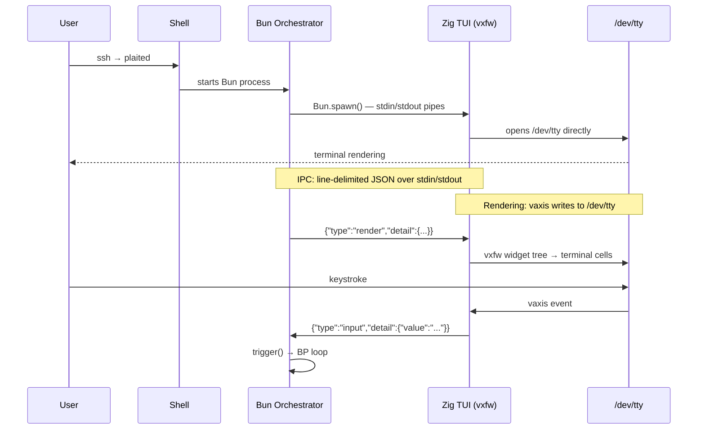
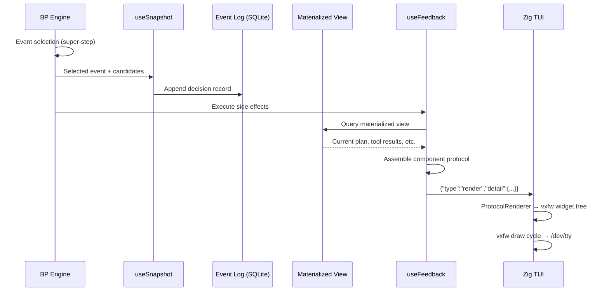
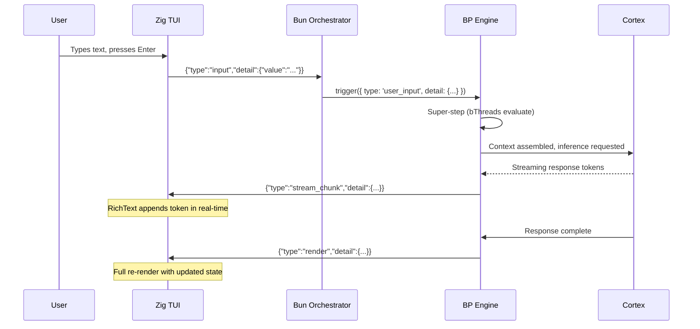
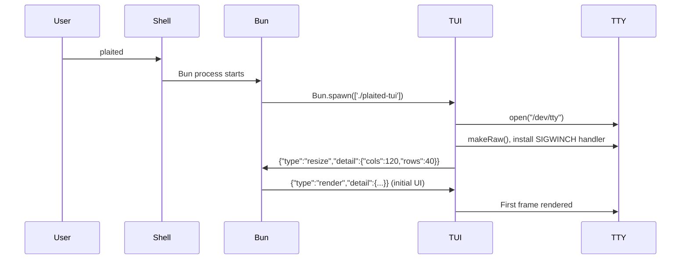

# Generative TUI — Design Document

A Zig-based terminal adapter that projects the agent's event log state as a dynamically constructed interface and captures user input as BP events.

## Overview

The generative TUI is a **channel adapter** in the V3 Reflex Architecture. It sits between the human operator and the Bun-hosted BP engine, translating the agent's internal state into visual terminal output and user interactions into typed BP events.

The interface is "generative" — the Cortex and BP system decide what to render based on context (current plan step, tool results, gate rejections, pending confirmations), not the developer. The component protocol serves the same role as HTML on the web: a declarative description of UI that the rendering engine (vxfw) interprets into visual output.

```mermaid
flowchart LR
    User -->|keyboard/mouse| TTY[/dev/tty]
    TTY --> Vaxis[Zig TUI<br/>vxfw widgets]
    Vaxis -->|input events<br/>line-delimited JSON| stdout
    stdin -->|render commands<br/>line-delimited JSON| Vaxis
    stdout --> Bun[Bun Orchestrator<br/>BP Engine]
    Bun --> stdin

    style TTY fill:#2d2d2d,stroke:#888,color:#fff
    style Vaxis fill:#f7a41d,stroke:#c47b00,color:#000
    style Bun fill:#fbf0df,stroke:#c47b00,color:#000
```

**Key separation**: vaxis renders to `/dev/tty` directly. stdin/stdout are free for IPC with the Bun parent process. These two channels never conflict.

### Relationship to V3

The V3 system design defines channel adapters as the mechanism for human-in-the-loop control:

> "High-stakes actions [...]: Always require owner confirmation via channel adapter. BP bThreads enforce this — the action is blocked until a `confirm` event arrives from the channel."

The TUI is one such adapter. A web UI adapter could coexist — both consume the same event log and emit the same BP event types. The component protocol is adapter-agnostic; only the rendering engine differs.

## Why Zig + libvaxis

| Concern | Decision |
|---------|----------|
| **Widget framework** | vxfw provides a Flutter-like retained widget tree with constraints-based layout, three-phase event propagation (capture → at-target → bubble), and focus management |
| **TTY isolation** | vaxis opens `/dev/tty` directly (`posix.open("/dev/tty", .{ .ACCMODE = .RDWR }, 0)` in `src/tty.zig`), leaving stdin/stdout available for IPC |
| **Binary size** | Single static binary, no runtime dependencies — ideal for SSH deployment |
| **Capability detection** | vaxis queries the terminal at runtime for capabilities (RGB, Kitty keyboard, synchronized output) rather than relying on terminfo databases |
| **Bun affinity** | Bun's internals use Zig's allocator and runtime concepts — shared mental model for the developer |
| **Learning** | Zig is a learning goal for the project |

### vxfw Widget Inventory

vxfw ships 15 visual widgets plus the `App` runtime. All widgets implement a common interface via type-erased function pointers (`*anyopaque` userdata + `draw`/`eventHandler`/`captureHandler` functions).

| Widget | Purpose |
|--------|---------|
| `Text` | Single-style text with alignment, soft-wrap, overflow (ellipsis/clip) |
| `RichText` | Multi-span styled text (`TextSpan[]`), word-based wrapping |
| `TextField` | Editable input with gap buffer, cursor navigation, `onSubmit` callback |
| `Button` | Clickable with four visual states (default, hover, pressed, focused) |
| `ListView` | Virtualized scrollable list with optional cursor indicator, static or dynamic data source |
| `ScrollView` | General-purpose scrollable container with keyboard + mouse support |
| `ScrollBars` | Wrapper around ScrollView adding visual scrollbar indicators |
| `FlexColumn` | Vertical flex layout — two-pass: measure intrinsic, then distribute remaining space |
| `FlexRow` | Horizontal flex layout — same algorithm as FlexColumn |
| `SplitView` | Two-pane split with interactive mouse-drag resize, vertical separator |
| `Border` | Box-drawing border with up to 6 label positions |
| `Center` | Centers child within available space |
| `Padding` | Spacing wrapper (left/right/top/bottom) |
| `SizedBox` | Fixed-size container that respects constraint hierarchy |
| `Spinner` | Braille animation at 12 FPS with thread-safe start/stop |

Notable absence: **no `Table` widget in vxfw**. The low-level API (`src/widgets/Table.zig`) has one, but vxfw tables must be composed from `FlexRow` + `FlexColumn` + `Text`.

## Architecture

### Process Model



The Bun orchestrator spawns the Zig TUI binary as a child process via `Bun.spawn()`. This mirrors the existing pattern proven in `src/workshop/get-server.ts`, which uses `Bun.spawn()` + IPC + `BPEventSchema.safeParse()` for bidirectional BP events between parent and child processes.

### Communication Channels

Two independent channels operate simultaneously without interference:

1. **IPC channel** (stdin/stdout pipes) — structured JSON messages between Bun and the TUI process
2. **Rendering channel** (`/dev/tty` file descriptor) — vaxis reads keyboard/mouse input and writes terminal escape sequences directly to the controlling terminal

This works because Unix `/dev/tty` always refers to the controlling terminal of the process, regardless of stdin/stdout redirection.

## Component Protocol

The component protocol is the shared contract between the Bun agent and the Zig TUI. It defines a vocabulary of **component kinds** that the agent assembles into a declarative UI description. The TUI interprets this description and instantiates the corresponding vxfw widgets.

Formal JSON schemas are deferred to implementation. This section defines the conceptual vocabulary and categories.

### Component Categories

**Content** — display information to the user:

| Kind | Description | Attributes |
|------|-------------|------------|
| `heading` | Section title | `text`, `level` (1–3) |
| `text` | Static paragraph | `content`, `style` (normal, dim, bold) |
| `stream` | Streaming text (Cortex output) | `id` (for incremental append) |
| `code_block` | Source code with syntax context | `content`, `language` |

**Interaction** — capture user input:

| Kind | Description | Attributes |
|------|-------------|------------|
| `input` | Free-text entry | `placeholder`, `label` |
| `confirm` | Yes/no decision | `prompt`, `labels` (confirm/deny text) |
| `select` | Choose from options | `items[]`, `label` |

**Structure** — organize and group content:

| Kind | Description | Attributes |
|------|-------------|------------|
| `task_list` | Plan steps with status indicators | `tasks[]` (each with `label`, `status`) |
| `table` | Tabular data | `headers[]`, `rows[][]` |
| `divider` | Visual separator | `style` (line, space, heavy) |

**Layout** — spatial arrangement:

| Kind | Description | Attributes |
|------|-------------|------------|
| `vertical` | Stack children vertically | `children[]`, `gap` |
| `horizontal` | Arrange children horizontally | `children[]`, `gap` |
| `split` | Two-pane layout | `left`, `right`, `ratio` |
| `padded` | Add spacing around child | `child`, `padding` |
| `bordered` | Add border around child | `child`, `label` |
| `centered` | Center child in available space | `child` |

### BP Event Shape

Render commands flow as BP events. The Bun orchestrator sends:

```typescript
{
  type: 'render',
  detail: {
    components: [
      { kind: 'heading', text: 'Current Task', level: 1 },
      { kind: 'task_list', tasks: [
        { label: 'Parse input schema', status: 'complete' },
        { label: 'Generate validators', status: 'active' },
        { label: 'Write tests', status: 'pending' }
      ]},
      { kind: 'stream', id: 'cortex-output' },
      { kind: 'divider', style: 'line' },
      { kind: 'input', placeholder: 'Message the agent...', label: 'prompt' }
    ]
  }
}
```

This maps directly to how V3 structures events: `{ type, detail }` flowing through `trigger()` → super-step → `useFeedback` handlers.

## Widget Mapping

The TUI's **ProtocolRenderer** is a custom top-level vxfw widget that interprets component protocol JSON and instantiates the corresponding vxfw widget tree.

| Component Kind | vxfw Widget | Notes |
|----------------|-------------|-------|
| `heading` | `Text` | Bold style, large text |
| `text` | `Text` | Standard style with `softwrap: true` |
| `stream` | `RichText` | Append-only via `stream_chunk` messages; multi-span for styling |
| `code_block` | `Text` | Monospace style; ANSI escape sequences for syntax color |
| `input` | `TextField` | `onSubmit` emits `input` event over IPC |
| `confirm` | `Button` × 2 in `FlexRow` | Two buttons (confirm/deny); `onClick` emits `confirmed` event |
| `select` | `ListView` | Cursor-enabled; selection emits `selected` event |
| `task_list` | `ListView` | Status prefix per item (e.g. `✓`, `▸`, `○`); no cursor needed |
| `table` | `FlexColumn` of `FlexRow`s of `Text` | Composed — no native vxfw Table widget |
| `divider` | `Text` | Single line of `─` characters |
| `vertical` | `FlexColumn` | Children as flex items |
| `horizontal` | `FlexRow` | Children as flex items |
| `split` | `SplitView` | `lhs`/`rhs` with ratio mapped to width constraint |
| `padded` | `Padding` | Maps padding values directly |
| `bordered` | `Border` | Rounded corners; label at `top-left` position |
| `centered` | `Center` | Requires bounded constraints from parent |

Additional vxfw widgets used internally:

- `Spinner` — shown during Cortex inference (before stream begins)
- `ScrollView` / `ScrollBars` — wraps the main content area for overflow
- `SizedBox` — constrains widget dimensions when the protocol specifies explicit sizes

## IPC Protocol

Two IPC approaches are documented for implementers to evaluate. Both use the same message types.

### Option A: stdin/stdout Pipes

Bun spawns the Zig binary and communicates via pipes. Line-delimited JSON (`\n`-terminated).

```typescript
const tui = Bun.spawn(['./plaited-tui'], {
  stdin: 'pipe',
  stdout: 'pipe',
  stderr: 'inherit',
})

// Send render command
tui.stdin.write(JSON.stringify(renderCommand) + '\n')

// Read TUI events
for await (const line of tui.stdout) {
  const event = BPEventSchema.safeParse(JSON.parse(line))
  if (event.success) trigger(event.data)
}
```

**Advantages**: simplest setup, automatic lifecycle (TUI dies when parent dies), proven pattern in the codebase.

**Tradeoff**: TUI lifecycle is coupled to the Bun process.

### Option B: Unix Domain Socket

The Zig TUI creates a socket at a known path (e.g. `$XDG_RUNTIME_DIR/plaited.sock`). Bun connects as a client.

**Advantages**: decoupled lifecycle (TUI can outlive Bun restarts), true bidirectional without interleaving concerns, multiple Bun processes could connect.

**Tradeoff**: more setup, socket cleanup on crash, discovery mechanism needed.

**Recommendation**: Start with Option A. The V3 architecture already uses `Bun.spawn()` + IPC for subprocess coordination. Option B can be adopted later if lifecycle decoupling becomes necessary.

### Message Types

**Agent → TUI**:

| Type | Purpose | Key Fields |
|------|---------|------------|
| `render` | Full UI description | `components[]` — complete widget tree |
| `patch` | Incremental update | `target` (component id), `operation` (replace, append, remove), `value` |
| `stream_chunk` | Cortex output token | `target` (stream id), `content` (text fragment) |
| `notify` | Toast/alert message | `message`, `level` (info, warn, error) |

**TUI → Agent**:

| Type | Purpose | Key Fields |
|------|---------|------------|
| `input` | Text submitted | `value`, `source` (component label) |
| `selected` | List item chosen | `index`, `value`, `source` |
| `confirmed` | Yes/no response | `value` (boolean), `source` |
| `key` | Special keypress | `key` (e.g. `ctrl+c`, `esc`) |
| `resize` | Terminal dimensions changed | `cols`, `rows` |

All messages map to BP events. TUI → Agent messages become `trigger()` calls into the BP engine. Agent → TUI messages originate from `useFeedback` handlers responding to state changes.

## Event Flow

### Render Cycle



The render cycle follows V3's established pattern: `useSnapshot` captures the decision to the event log *before* `useFeedback` executes side effects. The channel adapter render is a side effect — it projects the current materialized view state into a component protocol message.

### Input Cycle



### Streaming

Cortex output streams token-by-token. The flow:

1. BP requests Cortex inference → `Bun.spawn()` starts the inference subprocess
2. Each token arrives via subprocess stdout → BP emits `stream_chunk` to TUI
3. TUI's `ProtocolRenderer` finds the `stream` widget by `id` and appends the token to its `RichText` spans
4. vxfw redraws only the changed cells (double-buffered rendering)
5. On completion, a full `render` message replaces the stream with finalized content

## Generative UI Patterns

The Cortex does not render a fixed screen. It assembles component protocol messages based on the current agent state. The BP system's `useFeedback` handlers select the appropriate pattern:

### Plan View

When a plan exists in the materialized view, the agent renders the task list with step status. Active steps show a spinner; completed steps show results inline.

```
┌─ Current Plan ──────────────────────────────┐
│  ✓ Parse input schema                       │
│  ▸ Generate validators          ⠋           │
│  ○ Write tests                              │
│  ○ Run test suite                           │
├─────────────────────────────────────────────┤
│  Generating zod validators for UserConfig   │
│  schema. Found 3 required fields and 2      │
│  optional fields with defaults...           │
└─────────────────────────────────────────────┘
```

### Tool Execution View

During tool execution, the agent shows the tool call and streams the result. Gate rejections display the blocking bThread and reason.

```
  ⠋ Running: write_file
  Path: src/validators/user-config.ts
  ──────────────────────────────────
  export const UserConfigSchema = z.object({
    name: z.string(),
    email: z.string().email(),
    ...
```

### Confirmation View

When a bThread blocks an action pending human confirmation (the V3 human-in-the-loop gate), the TUI renders a confirm component:

```
  ⚠ Confirmation Required
  ──────────────────────────────────
  The agent wants to execute:
    delete_file("src/old-module.ts")

  This action is destructive and cannot
  be undone.

  [ Approve ]    [ Deny ]
```

The `confirm` event from the TUI becomes a `trigger({ type: 'confirm', detail: { value: true } })` that unblocks the waiting bThread.

### Chat View

Conversational interaction — the default when no plan is active:

```
  Agent
  ──────────────────────────────────
  I analyzed the error in checkout.ts.
  The issue is a race condition between
  the payment validation and inventory
  check. Here's what I recommend...

  ──────────────────────────────────
  > Message the agent...
```

### Discovery View

Search results from FTS5, DAG traversal, or semantic search rendered as a selectable list:

```
  Search: "authentication middleware"
  ──────────────────────────────────
  ▸ src/auth/middleware.ts (0.94)
    JWT validation and session management

    src/auth/oauth.ts (0.87)
    OAuth2 provider integration

    src/auth/types.ts (0.82)
    Auth type definitions
  ──────────────────────────────────
  ↑↓ Navigate  Enter Select  Esc Back
```

## Lifecycle

### Startup



1. User runs `plaited` in their SSH session
2. Bun orchestrator starts, initializes BP engine, loads event log
3. Bun spawns the Zig TUI binary with stdin/stdout pipes
4. TUI opens `/dev/tty`, enters raw mode, detects terminal capabilities
5. TUI sends initial `resize` event with terminal dimensions
6. Bun queries the materialized view for current state and sends the initial `render` command
7. TUI renders the first frame

### Shutdown

Two paths:

**Clean shutdown**: User presses `ctrl+c` or issues a quit command → TUI sends `{ type: 'key', detail: { key: 'ctrl+c' } }` → Bun receives it → BP engine runs shutdown bThreads → Bun sends final render (goodbye screen) → Bun closes stdin pipe → TUI detects EOF → TUI restores terminal state (`cookRaw()`) → TUI exits → Bun process exits.

**Pipe break**: If Bun crashes, TUI detects broken pipe on stdin read → TUI restores terminal state → TUI exits with error message to `/dev/tty`. If TUI crashes, Bun detects child process exit → Bun can respawn the TUI binary → new TUI receives a fresh `render` with current state (the event log survives — state is never lost).

### Crash Recovery

The V3 architecture's event log makes crash recovery straightforward:

- **TUI crash**: Bun respawns the binary. The event log is intact. Materialized views rebuild the current state. A fresh `render` command restores the UI to exactly where it was.
- **Bun crash**: The event log persists in SQLite. On restart, Bun rebuilds materialized views from the log, spawns a new TUI, and resumes. No state is lost — the log is the source of truth.
- **Both crash**: On next `plaited` invocation, the event log is replayed. The agent resumes from its last recorded decision.

This is a direct benefit of the V3 principle: *"Recovery: Replay the log to rebuild any materialized view."*
