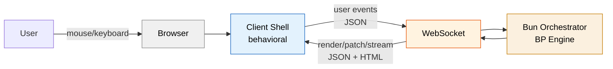
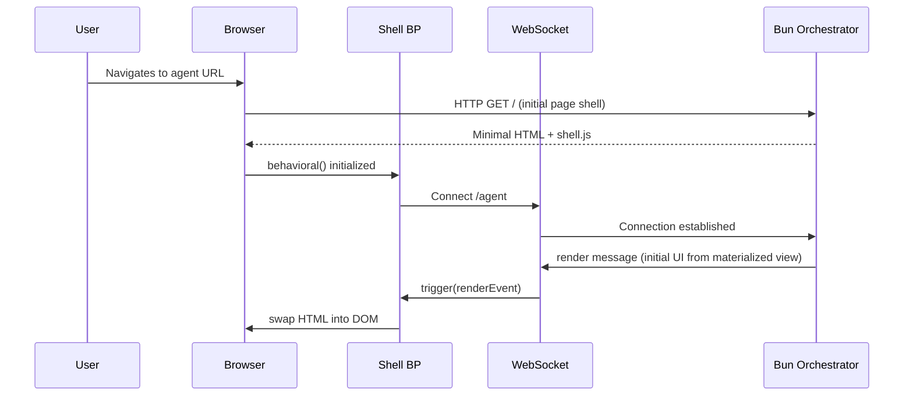
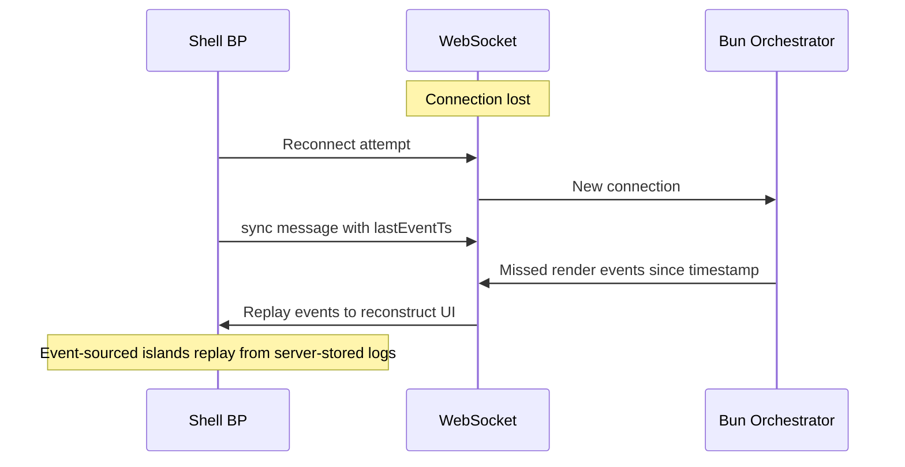

# Generative Web UI — Design Specification

A WebSocket-based web adapter that projects the agent's state as dynamically generated HTML and coordinates user interaction through a client-side behavioral program.

## Overview

The generative web UI is a **channel adapter** in the V3 Reflex Architecture. It sits between the human operator and the Bun-hosted BP engine, translating the agent's internal state into browser-rendered HTML and user interactions into typed BP events.

The interface is "generative" — the Cortex and BP system decide what to render based on context (current plan step, tool results, gate rejections, pending confirmations). The agent generates type-safe JSX, CSS, and when needed, typed behavioral thread modules — not from a fixed component library, but from learned patterns adapted to the user's preferences.



### Relationship to V3

The V3 system design defines channel adapters as the mechanism for human-in-the-loop control:

> "High-stakes actions [...]: Always require owner confirmation via channel adapter. BP bThreads enforce this — the action is blocked until a `confirm` event arrives from the channel."

The web UI is one such adapter. The TUI adapter (Zig + vxfw) coexists — both consume the same agent state and emit the same BP event types. The web adapter uses JSX → `ssr()` → HTML as its rendering pipeline; the TUI uses a component protocol interpreted by vxfw. Each adapter plays to its platform's strengths.

### Relationship to Existing UI Layer

The web adapter leverages Plaited's existing UI primitives:

| Primitive | Role in Generative Web UI |
|-----------|--------------------------|
| `ssr()` | Server-side HTML generation from `TemplateObject` |
| `h()` / JSX factory | Type-safe template creation with `FT<Props>` generics |
| `createStyles` / `createTokens` | Atomic CSS — hash-based class names prevent collision |
| `bElement` | Used only when form association or true DOM encapsulation is required |
| `behavioral()` | Client-side shell coordinator + interactive element coordination |
| `useSnapshot()` | Event logging on both server and client |

**Not used in the primary rendering path:**

| Primitive | Reason |
|-----------|--------|
| `useSignal` | Server is source of truth. `behavioral()` handles all coordination |
| Fetch-swap runtime | Server pushes — client doesn't pull |
| `MutationObserver` | Server controls all DOM mutations via the shell BP |
| Shadow DOM (default) | Atomic CSS prevents style collision. Used only when platform requires it |

## Architecture

### Transport: WebSocket

The channel between server and client is a persistent WebSocket connection. Bun's native WebSocket support (`Bun.serve({ websocket: { ... } })`) handles the server side. This pattern is proven in `src/workshop/get-server.ts`, which uses WebSocket pub/sub for live reload and test runner communication.

**Why WebSocket over SSE:**
- Bidirectional — agent pushes renders, user pushes events, no separate POST channel
- Persistent — connection survives across many render/interact cycles
- Streaming — token-by-token Cortex output flows naturally
- Bun-native — first-class support with pub/sub topics

### Server: Generation Pipeline

The agent generates UI through a tool-call pipeline:

```
Cortex reasons → Actuator emits render tool call → useFeedback handler → JSX → ssr() → WebSocket
```

The server-side rendering uses Plaited's type-safe JSX throughout. Templates are `FT<Props>` functions that produce `TemplateObject`s — never raw HTML strings:

```typescript
import type { FT } from 'plaited/ui'
import { ssr } from 'plaited/ui'

type PlanStep = {
  id: string
  label: string
  status: 'pending' | 'active' | 'complete'
}

const statusIcon = (status: PlanStep['status']) => {
  const icons = { pending: '\u25CB', active: '\u25B8', complete: '\u2713' } as const
  return icons[status]
}

const PlanView: FT<{ steps: PlanStep[] }> = ({ steps }) => (
  <section p-target="plan">
    <h2 {...styles.heading}>Current Plan</h2>
    <ul {...styles.stepList}>
      {steps.map(s => (
        <li data-status={s.status} {...styles.step}>
          <span {...styles.icon}>{statusIcon(s.status)}</span>
          {s.label}
        </li>
      ))}
    </ul>
  </section>
)
```

Type safety flows end-to-end: `FT<Props>` validates prop types at compile time, `h()` produces typed `TemplateObject`s, `ssr()` converts to HTML strings. Invalid attributes, wrong prop types, and bad nesting are caught by the TypeScript compiler — feeding back into the agent loop as gate rejections.

### Style Deduplication

The server tracks which stylesheets have been sent to each WebSocket connection:

```typescript
import type { TemplateObject } from 'plaited/ui'

const createStyleTracker = () => {
  const sent = new Set<string>()

  return {
    dedup: (stylesheets: string[]): string => {
      const fresh = stylesheets.filter(s => !sent.has(s))
      for (const s of fresh) sent.add(s)
      return fresh.length ? `<style>${fresh.join('')}</style>` : ''
    },
    reset: () => sent.clear(),
  }
}
```

**First render:** All styles sent. **Subsequent renders:** Only new styles. Over a long session, the client accumulates a complete stylesheet and renders become pure HTML — smaller payloads, faster swaps.

### Client: Behavioral Shell

The client runs a single `behavioral()` instance — the **shell** — that coordinates all rendering, user input, and interactive element lifecycle.

The shell's responsibilities:

1. **Render coordination** — swap/patch/stream HTML from server into DOM
2. **Input protection** — block renders that would destroy active user input
3. **User event forwarding** — delegate `p-trigger` events to server
4. **Render acknowledgment** — confirm renders were applied (server can `waitFor`)
5. **Stream batching** — accumulate rapid stream chunks, flush on animation frames
6. **Thread lifecycle** — load/unload agent-generated behavioral threads per region

## Message Protocol

Three message types flow from server to client. User events flow from client to server.

### Server → Client

| Type | Purpose | Key Fields |
|------|---------|------------|
| `render` | Full region replacement | `target` (p-target value), `html`, `swap` (innerHTML, outerHTML, beforeend, etc.) |
| `patch` | Targeted attribute/content update | `target`, `attr?` (attribute changes), `html?` (content replacement) |
| `stream` | Append streaming content (Cortex output) | `target` (stream region id), `content` (text fragment) |

### Client → Server

| Type | Purpose | Key Fields |
|------|---------|------------|
| `userAction` | User interaction | `action` (from p-trigger), `detail` (event data, form data, etc.) |
| `rendered` | Render acknowledgment | `target` (what was rendered) |
| `input` | Text submission | `value`, `source` (element p-target) |
| `confirmed` | Yes/no response | `value` (boolean), `source` |

All messages are `{ type, detail }` — the same BP event shape used throughout V3.

### Streaming

Cortex output streams token-by-token:

1. Server starts inference → sends `render` with a stream target region
2. Each token → sends `stream` message with content fragment
3. Shell BP accumulates chunks, flushes on `requestAnimationFrame`
4. Inference complete → sends `render` replacing the stream region with final content

## Generation Spectrum

The agent generates UI at any point on this spectrum. The system supports all levels without requiring all levels.

```
Level 0  JSX → HTML + CSS                     Zero client JS. Native elements only.
Level 1  JSX → HTML + CSS + native behavior    <details>, <dialog>, :checked, CSS states
Level 2  JSX → HTML + CSS + behavioral threads Agent generates typed thread modules
Level 3  JSX → HTML + CSS + Custom Element     Form association, true encapsulation
Level 4  JSX → HTML + CSS + bElement + BP      Full behavioral coordination
```

### Level 0–1: Server-Rendered JSX

The agent generates `FT` templates, the server calls `ssr()`, the client swaps HTML. No client-side JS beyond the shell.

```typescript
import type { FT } from 'plaited/ui'
import { createStyles } from 'plaited/ui'

const styles = createStyles({
  toolOutput: { fontFamily: 'monospace', fontSize: '0.875rem' },
  confirmDialog: { padding: '1.5rem', maxWidth: '24rem' },
  actions: { display: 'flex', gap: '0.5rem', justifyContent: 'flex-end' },
})

// Expandable tool output — Level 1, no JS, no round-trip
const ToolOutput: FT<{ command: string; output: string }> = ({ command, output }) => (
  <details>
    <summary {...styles.toolOutput}>{command}</summary>
    <pre><code>{output}</code></pre>
  </details>
)

// Confirmation dialog — Level 1, native <dialog>, accessible
const ConfirmDialog: FT<{ prompt: string; action: string }> = ({ prompt, action }) => (
  <dialog p-target="confirm-dialog" open {...styles.confirmDialog}>
    <p>{prompt}</p>
    <div {...styles.actions}>
      <button p-trigger={{ click: `${action}:approve` }}>Approve</button>
      <button p-trigger={{ click: `${action}:deny` }}>Deny</button>
    </div>
  </dialog>
)
```

Native HTML interactivity provides instant feedback: `<details>` expands/collapses, `<dialog>` manages focus trapping, CSS `:checked` + sibling selectors toggle visual state — all without JS or server round-trips.

### Level 2: JSX + Behavioral Threads

When the agent needs client-side coordination that native HTML can't provide, it generates typed behavioral thread modules alongside the JSX. The server bundles these via `Bun.build()` and includes a `<script>` tag in the rendered HTML.

The thread module is a proper TypeScript file with typed imports:

```typescript
// Generated by the agent: wizard-threads.ts
import { bThread, bSync } from 'plaited'
import type { BThreads, Trigger } from 'plaited'

type WizardDetail = {
  stepIndex: number
  valid: boolean
}

export const registerWizardThreads = (
  bThreads: BThreads,
  trigger: Trigger,
) => {
  let currentStep = 0

  bThreads.set({
    'wizard:validation': bThread([
      bSync({
        waitFor: ({ type }) => type === 'wizard:next',
        block: ({ type, detail }) =>
          type === 'wizard:advance' && !(detail as WizardDetail).valid,
      }),
      bSync({ request: { type: 'wizard:showErrors' } }),
    ], true),

    'wizard:progress': bThread([
      bSync({ waitFor: 'wizard:advance' }),
      bSync({
        request: () => {
          currentStep++
          return { type: 'wizard:renderStep', detail: { stepIndex: currentStep } }
        },
      }),
    ], true),

    'wizard:syncToServer': bThread([
      bSync({ waitFor: 'wizard:advance' }),
      bSync({ request: { type: 'sendToServer' } }),
    ], true),
  })
}
```

The corresponding JSX template:

```typescript
import type { FT } from 'plaited/ui'
import { createStyles } from 'plaited/ui'

type WizardStep = { label: string; fields: FT[] }

const styles = createStyles({
  wizard: { display: 'flex', flexDirection: 'column', gap: '1rem' },
  stepIndicator: { display: 'flex', gap: '0.5rem' },
  activeStep: { fontWeight: '700', color: 'var(--text-1)' },
})

const FormWizard: FT<{ steps: WizardStep[] }> = ({ steps }) => (
  <div p-target="wizard" {...styles.wizard}>
    <nav {...styles.stepIndicator}>
      {steps.map((s, i) => (
        <span data-step={i} {...(i === 0 ? styles.activeStep : {})}>
          {s.label}
        </span>
      ))}
    </nav>
    <div p-target="wizard-content">
      {steps[0]?.fields}
    </div>
    <button p-trigger={{ click: 'wizard:next' }}>Next</button>
  </div>
)
```

The server bundles and serves the thread module:

```typescript
import { ssr } from 'plaited/ui'

// In the render tool call handler
const template = FormWizard({ steps })
const html = ssr(template)
const styleTag = styleTracker.dedup(template.stylesheets)

// Bundle the typed thread module
const bundle = await Bun.build({
  entrypoints: [generatedThreadModulePath],
  external: ['plaited'],
  minify: true,
})
const bundleHash = Bun.hash(await bundle.outputs[0]!.text())
serveBundleAtPath(`/gen/${bundleHash}.js`, bundle.outputs[0]!)

// Send HTML + script tag
ws.send(JSON.stringify({
  type: 'render',
  detail: {
    target: 'main',
    html: `${styleTag}${html}<script type="module" src="/gen/${bundleHash}.js"></script>`,
    swap: 'innerHTML',
  },
}))
```

Because the thread module is TypeScript with typed imports, the compiler catches errors before the agent's code reaches the client. Invalid `bSync` arguments, wrong event types, missing imports — all caught at build time and fed back to the Cortex as gate rejections.

### Level 3–4: Custom Elements (When Required)

Custom elements are used when the platform demands them:

- **Form association** — `ElementInternals` requires a custom element with `static formAssociated = true`
- **True DOM encapsulation** — when third-party or user-generated content must be isolated
- **Slot-based composition** — when declarative slot projection is the right pattern

For form association, the agent generates a typed custom element. The behavioral programming may or may not be necessary depending on coordination needs:

```typescript
// Level 3 — custom element for form association, no behavioral needed
// Agent generates this when a custom form control is needed

import { createStyles } from 'plaited/ui'

const styles = createStyles({
  track: {
    width: '2.5rem',
    height: '1.25rem',
    borderRadius: '0.625rem',
    backgroundColor: 'var(--surface-2)',
    transition: 'background-color 150ms',
    cursor: 'pointer',
  },
  thumb: {
    width: '1rem',
    height: '1rem',
    borderRadius: '50%',
    backgroundColor: 'var(--surface-1)',
    transition: 'transform 150ms',
  },
})

class CustomToggle extends HTMLElement {
  static formAssociated = true
  #internals: ElementInternals

  constructor() {
    super()
    this.#internals = this.attachInternals()
  }

  connectedCallback() {
    if (this.hasAttribute('checked')) {
      this.#internals.states.add('checked')
      this.#internals.setFormValue('on', this.getAttribute('value') ?? 'checked')
    }
    this.addEventListener('click', this.#handleClick)
  }

  disconnectedCallback() {
    this.removeEventListener('click', this.#handleClick)
  }

  #handleClick = () => {
    if (this.#internals.states.has('disabled')) return
    const checked = !this.#internals.states.has('checked')
    this.#internals.states.toggle('checked')
    this.#internals.setFormValue(checked ? 'on' : 'off')
    this.dispatchEvent(new Event('change', { bubbles: true }))
  }
}
```

For Level 4 (custom element + behavioral coordination), the element uses `bElement` from `plaited/ui` when it needs the full BP toolkit — blocking, thread composition, `useSnapshot` observability.

## Style System

### Atomic CSS — No Shadow DOM Required

Plaited's `createStyles` generates hash-based atomic class names:

```typescript
import { createStyles } from 'plaited/ui'

const styles = createStyles({
  card: {
    display: 'flex',
    flexDirection: 'column',
    gap: '1rem',
    padding: '1.5rem',
    borderRadius: '0.5rem',
    backgroundColor: 'var(--surface-1)',
  },
  title: {
    fontSize: '1.125rem',
    fontWeight: '600',
    color: 'var(--text-1)',
  },
})
// Produces: { card: 'cls_a3f2d1', title: 'cls_b7e9c4' }
```

Class names are deterministic hashes of the style rules. Collision is not possible. This eliminates Shadow DOM's primary value proposition for style isolation.

### Design Tokens

`createTokens` generates CSS custom properties that flow through the standard cascade:

```typescript
import { createTokens } from 'plaited/ui'

const tokens = createTokens({
  surface: { 1: '#ffffff', 2: '#f5f5f5', 3: '#e5e5e5' },
  text: { 1: '#111111', 2: '#666666' },
  accent: { 1: '#2563eb' },
})
```

The server pushes theme-specific token sets as a `patch` to the document's style region:

```typescript
// Agent switches to dark theme based on user preference
ws.send(JSON.stringify({
  type: 'patch',
  detail: {
    target: 'root-styles',
    html: `<style>${darkTokens}</style>`,
  },
}))
```

No runtime theming API needed. The server knows user preferences and pushes the right tokens.

## Shell BP — Coordination Threads

The client shell is a `behavioral()` instance with a fixed set of coordination threads and `useFeedback` handlers for side effects.

### Core Threads

```typescript
import { behavioral, bThread, bSync } from 'plaited'
import type { BPEvent } from 'plaited'

const { trigger, bThreads, useFeedback, useSnapshot } = behavioral()

bThreads.set({
  // Block renders that would destroy active user input
  protectActiveInput: bThread([
    bSync({
      block: ({ type, detail }: BPEvent) => {
        if (type !== 'render' && type !== 'patch') return false
        const target = document.querySelector(
          `[p-target="${(detail as { target: string }).target}"]`,
        )
        return target?.contains(document.activeElement) ?? false
      },
    }),
  ], true),

  // Batch rapid stream chunks into animation frames
  streamBatcher: bThread([
    bSync({ waitFor: 'stream' }),
    bSync({ request: { type: 'flushStream' } }),
  ], true),

  // Forward user actions to server
  userToServer: bThread([
    bSync({ waitFor: 'userAction' }),
    bSync({ request: { type: 'sendToServer' } }),
  ], true),

  // Acknowledge renders — server can waitFor this
  renderAck: bThread([
    bSync({ waitFor: 'render' }),
    bSync({ request: { type: 'rendered' } }),
  ], true),
})
```

### Side Effects

```typescript
type RenderDetail = { target: string; html: string; swap?: string }
type PatchDetail = { target: string; attr?: Record<string, string | null>; html?: string }
type StreamDetail = { target: string; content: string }

const pendingChunks: StreamDetail[] = []

const performSwap = (el: Element, html: string, swap: string) => {
  switch (swap) {
    case 'innerHTML': el.innerHTML = html; break
    case 'outerHTML': el.outerHTML = html; break
    case 'beforebegin': el.insertAdjacentHTML('beforebegin', html); break
    case 'afterbegin': el.insertAdjacentHTML('afterbegin', html); break
    case 'beforeend': el.insertAdjacentHTML('beforeend', html); break
    case 'afterend': el.insertAdjacentHTML('afterend', html); break
  }
}

useFeedback({
  render({ detail }: { detail: RenderDetail }) {
    const el = document.querySelector(`[p-target="${detail.target}"]`)
    if (!el) return
    cleanupRegionThreads(detail.target)
    performSwap(el, detail.html, detail.swap ?? 'innerHTML')
  },

  patch({ detail }: { detail: PatchDetail }) {
    const el = document.querySelector(`[p-target="${detail.target}"]`)
    if (!el) return
    if (detail.attr) {
      for (const [key, val] of Object.entries(detail.attr)) {
        val === null ? el.removeAttribute(key) : el.setAttribute(key, val)
      }
    }
    if (detail.html) el.innerHTML = detail.html
  },

  stream({ detail }: { detail: StreamDetail }) {
    pendingChunks.push(detail)
  },

  flushStream() {
    requestAnimationFrame(() => {
      for (const chunk of pendingChunks) {
        const el = document.querySelector(`[p-target="${chunk.target}"]`)
        if (el) el.insertAdjacentText('beforeend', chunk.content)
      }
      pendingChunks.length = 0
    })
  },

  sendToServer({ detail }: { detail: unknown }) {
    ws.send(JSON.stringify({ type: 'userAction', detail }))
  },

  rendered({ detail }: { detail: { target: string } }) {
    ws.send(JSON.stringify({ type: 'rendered', detail: { target: detail.target } }))
  },
})
```

### Agent-Generated Thread Lifecycle

When the agent generates interactive HTML (Level 2+), the accompanying typed thread module registers with the shell BP via `bThreads.set()`. These threads:

- Share the shell's event space — they can `waitFor` shell events and the shell can `waitFor` theirs
- Are namespaced by convention — `'wizard:validation'`, `'editor:autosave'` — to avoid collisions
- Are removed when their associated HTML region is re-rendered

```typescript
// Shell tracks thread ownership per region
const threadsByRegion = new Map<string, string[]>()

const registerRegionThreads = (target: string, threadIds: string[]) => {
  threadsByRegion.set(target, threadIds)
}

const cleanupRegionThreads = (target: string) => {
  const ids = threadsByRegion.get(target)
  if (ids) {
    for (const id of ids) bThreads.delete(id)
    threadsByRegion.delete(target)
  }
}
```

## Event-Sourced State (Complex Elements)

For elements with state worth preserving — code editors, multi-step workflows, drag-and-drop builders — the agent generates event-sourced behavioral programs.

### Pattern

State is derived from an event log, never directly mutated. `useSnapshot()` captures every BP decision. Undo is log replay.

```typescript
import { behavioral, bThread, bSync } from 'plaited'
import type { BPEvent, Trigger } from 'plaited'

type EditorState = {
  content: string
  cursor: number
  selections: Array<{ start: number; end: number }>
}

const createEditor = (el: HTMLElement, shellTrigger: Trigger) => {
  const { trigger, bThreads, useFeedback, useSnapshot } = behavioral()

  const eventLog: BPEvent[] = []
  let state: EditorState = { content: '', cursor: 0, selections: [] }

  // Every BP decision is logged — state is derived, not mutated
  useSnapshot((candidates) => {
    const selected = candidates.find(c => c.selected)
    if (selected) {
      eventLog.push(selected)
      state = reduceEditorState(state, selected)
    }
  })

  bThreads.set({
    edit: bThread([
      bSync({ waitFor: 'keystroke' }),
      bSync({
        request: ({ detail }) => ({
          type: 'applyEdit',
          detail: computeEdit(state, detail as KeyboardEvent),
        }),
      }),
    ], true),

    undoRedo: bThread([
      bSync({ waitFor: ({ type }: BPEvent) => type === 'undo' || type === 'redo' }),
      bSync({
        request: ({ type }: BPEvent) => {
          if (type === 'undo') {
            const withoutLast = eventLog.filter(e => e.type === 'applyEdit').slice(0, -1)
            return { type: 'restoreState', detail: replayLog(withoutLast) }
          }
          return { type: 'noop' }
        },
      }),
    ], true),

    periodicSync: bThread([
      bSync({ waitFor: 'applyEdit' }),
      bSync({ request: { type: 'syncToServer' } }),
    ], true),
  })

  useFeedback({
    applyEdit() { renderEditor(el, state) },
    restoreState({ detail }: { detail: EditorState }) {
      state = detail
      renderEditor(el, state)
    },
    syncToServer() {
      shellTrigger({
        type: 'islandEvent',
        detail: { islandId: el.id, event: { type: 'editorSync', detail: state } },
      })
    },
  })

  return {
    trigger,
    // Restore from server-provided event log — crash recovery
    restore(events: BPEvent[]) {
      for (const e of events) {
        eventLog.push(e)
        state = reduceEditorState(state, e)
      }
      renderEditor(el, state)
    },
  }
}
```

### Crash Recovery

The server stores island event logs (forwarded via sync events). On WebSocket reconnect:

1. Server sends the event log slice for each active island
2. Client replays events to reconstruct state
3. Island renders from reconstructed state — exact restoration

### When to Use

| Use Case | Event-Sourced? | Reason |
|----------|---------------|--------|
| Code editor | Yes | Undo/redo, crash recovery, collaborative potential |
| Multi-step form wizard | Maybe | Undo is valuable; crash recovery depends on session length |
| Drag-and-drop reorder | Yes | Undoable, state is complex |
| Toggle / checkbox | No | Trivial state, no undo needed |
| Confirmation dialog | No | Stateless — appears, user responds, gone |
| Streaming text | No | Ephemeral — replaced by final render |

## Lifecycle

### Connection



### Reconnection



### Crash Recovery

- **Browser refresh:** Shell reconnects. Server re-renders current state from materialized views. Event-sourced islands restore from server-stored event logs.
- **Server restart:** Event log persists in SQLite. Materialized views rebuild. WebSocket reconnects. Fresh render sent.
- **Both crash:** On next connection, event log replays. Agent resumes from last recorded decision.

## What the Agent Generates

The agent's Actuator makes tool calls. UI generation is a tool call like any other, processed through the same Actuator → Gate → Execute pipeline:

```typescript
// Level 0 — static plan view
{ tool: 'render_ui', args: { view: 'plan', data: { steps: [...] } } }

// Level 2 — interactive form wizard with behavioral threads
{ tool: 'render_ui', args: { view: 'form_wizard', data: { steps: [...] }, interactive: true } }

// Level 3 — custom element with form association
{ tool: 'render_ui', args: { view: 'custom_toggle', data: { ... }, formAssociated: true } }
```

The server-side `useFeedback` handler interprets these:

1. Generates or selects JSX (`FT` templates) for the requested view
2. If `interactive`, generates a typed behavioral thread module
3. If `formAssociated`, generates a typed custom element class
4. Type-checks and bundles any client JS via `Bun.build()`
5. Calls `ssr()` to produce HTML from `TemplateObject`
6. Deduplicates styles against the connection's sent set
7. Pushes over WebSocket

### Type Safety in the Agent Loop

JSX is TypeScript. Generated code goes through the compiler. This is a core part of the agent's feedback loop:

```
Agent generates JSX → TypeScript compiler → errors? → feed back to Cortex → re-plan
Agent generates thread module → TypeScript compiler → type errors? → feed back to Cortex → re-plan
Agent generates custom element → TypeScript compiler → invalid API usage? → feed back to Cortex → re-plan
```

The type checker is Layer 0 prevention. `FT<Props>` catches invalid props, `PlaitedAttributes` catches invalid `p-trigger`/`p-target` usage, `bSync`/`bThread` types catch invalid thread composition — all at compile time, before anything reaches the client.

### Pattern Learning

The agent is not bound by a component library. It generates novel UI from learned patterns:

- **Implicit learning:** The agent observes user preferences over time — layout choices, interaction patterns, styling preferences — and adapts its generation.
- **Explicit saving:** The user can tell the agent "I like this layout" and the pattern is saved for reuse.
- **Adaptation:** Saved patterns are starting points, not constraints. The agent adapts them to new contexts.

The training flywheel from V3 applies: successful UI generations become SFT data, user-rejected ones become GRPO preference pairs. The agent gets better at generating UI the user wants.

## Key Design Decisions

### Why No useSignal

`useSignal` is a client-side pub/sub reactive primitive. In a server-first generative model:

- **Server is source of truth.** Cross-element state updates are just multiple `render`/`patch` messages in one WebSocket frame.
- **`behavioral()` handles coordination.** The shell BP's event-driven model subsumes `useSignal`'s functionality with added observability and blocking semantics.
- **One primitive, not two.** `behavioral()` is used for the agent loop, the test runner, the TUI adapter, and the web shell. Adding `useSignal` introduces a second coordination primitive with different semantics.

### Why No Fetch-Swap

The fetch-swap runtime (RFC #224) is a pull model: client fetches fragments from server routes. Generative UI is a push model: the agent decides what to render and pushes it. The WebSocket transport handles both directions natively.

### Why No MutationObserver

`MutationObserver` is needed when external code modifies the DOM and the framework needs to react. In this architecture, all DOM modifications flow through the shell BP's `useFeedback` handlers. The shell knows exactly when and where DOM changes happen — it's making them.

### Why No Shadow DOM (By Default)

Shadow DOM provides style encapsulation and DOM encapsulation. Plaited's atomic CSS (`createStyles`) prevents style collision via deterministic hash-based class names. DOM encapsulation is unnecessary when the agent controls all DOM mutations. Shadow DOM is reserved for:

- **Form association** via `ElementInternals` (requires custom element with `static formAssociated = true`)
- **Third-party content isolation** (untrusted content must be sandboxed)
- **Slot-based composition** (when declarative slot projection is the right pattern)

### Why JSX, Not Raw HTML

JSX is TypeScript. It participates in the compiler's type-checking pipeline. The agent's architecture relies on tests and linters providing feedback in the agent loop — removing JSX removes compile-time safety. Invalid attributes, wrong prop types, bad nesting, and incorrect `p-trigger` configurations are caught before code reaches the client.

### Why WebSocket Over SSE

SSE is unidirectional (server → client). The web adapter needs bidirectional communication: server pushes renders, client pushes user events. SSE would require a separate POST channel for user input — two connections instead of one. WebSocket handles both directions on a single persistent connection.

## Relationship to TUI Adapter

Both adapters serve the same agent. Both consume the same BP events. They diverge at the rendering layer:

| Concern | TUI Adapter | Web Adapter |
|---------|------------|-------------|
| **Transport** | stdin/stdout pipes (`Bun.spawn`) | WebSocket (`Bun.serve`) |
| **Rendering format** | Component protocol JSON → vxfw widgets | JSX → `ssr()` → HTML → DOM |
| **Styling** | ANSI escape sequences | Atomic CSS (`createStyles`/`createTokens`) |
| **Interactivity** | vxfw event propagation | Shell BP + `p-trigger` delegation |
| **Streaming** | `stream_chunk` → `RichText` append | `stream` → `insertAdjacentText` |
| **Type safety** | JSON schema validation | TypeScript compiler + JSX types |

The adapter-agnostic layer is the **tool call**. The Actuator emits `render_ui({ view, data })`. Each adapter's `useFeedback` handler translates that into its native format. The agent never knows which adapter is connected.

## Summary

1. **Server generates everything** — JSX via `FT<Props>` templates, CSS via `createStyles`, JS via typed modules + `Bun.build()`
2. **Type safety throughout** — JSX is TypeScript. Generated thread modules are TypeScript. The compiler catches errors before they reach the client, feeding back into the agent loop.
3. **WebSocket pushes** — `render`/`patch`/`stream` messages, bidirectional
4. **Client shell is a `behavioral()` program** — coordinates rendering, protects input, forwards events, batches streams
5. **Agent generates at any level** — from pure JSX/HTML to custom elements with behavioral coordination
6. **Atomic CSS prevents style collision** — no Shadow DOM needed for encapsulation
7. **Style deduplication per connection** — server tracks sent styles, only ships deltas
8. **Event-sourced state for complex elements** — undo, crash recovery, full observability via `useSnapshot`
9. **No `useSignal`, no fetch-swap, no `MutationObserver`** — `behavioral()` is the single coordination primitive
10. **Patterns are learned, not library-bound** — agent adapts to user preferences over time
