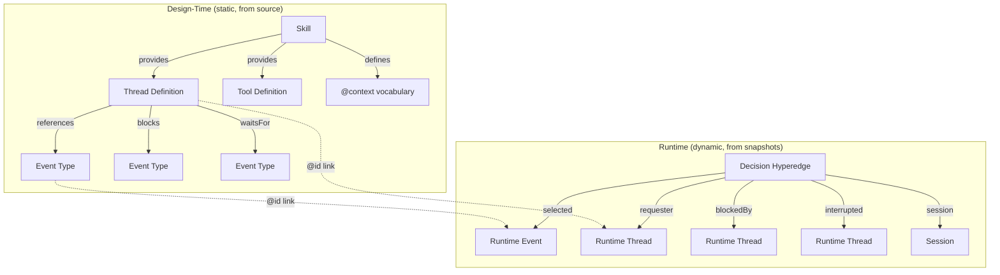
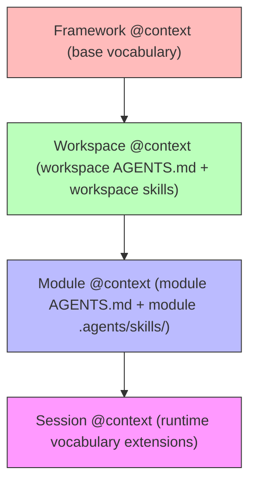
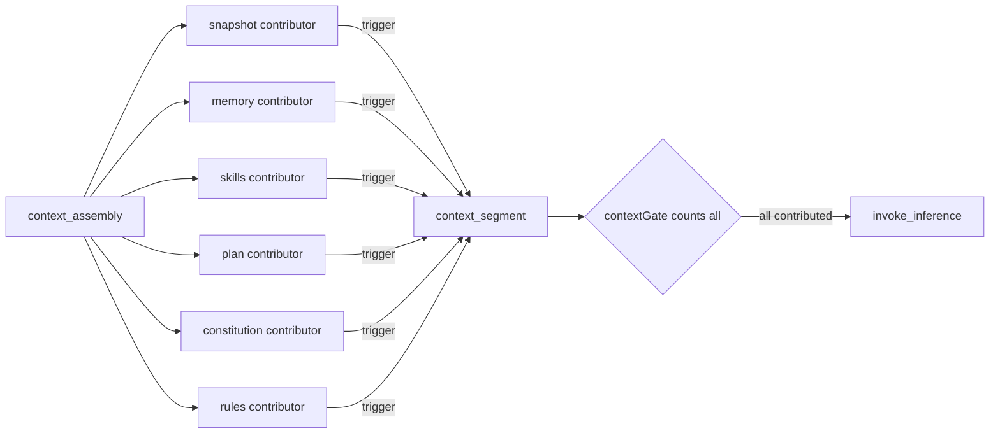
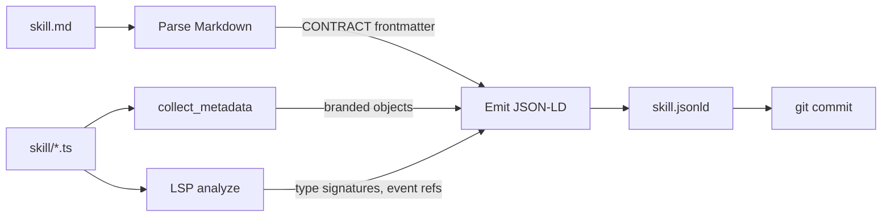
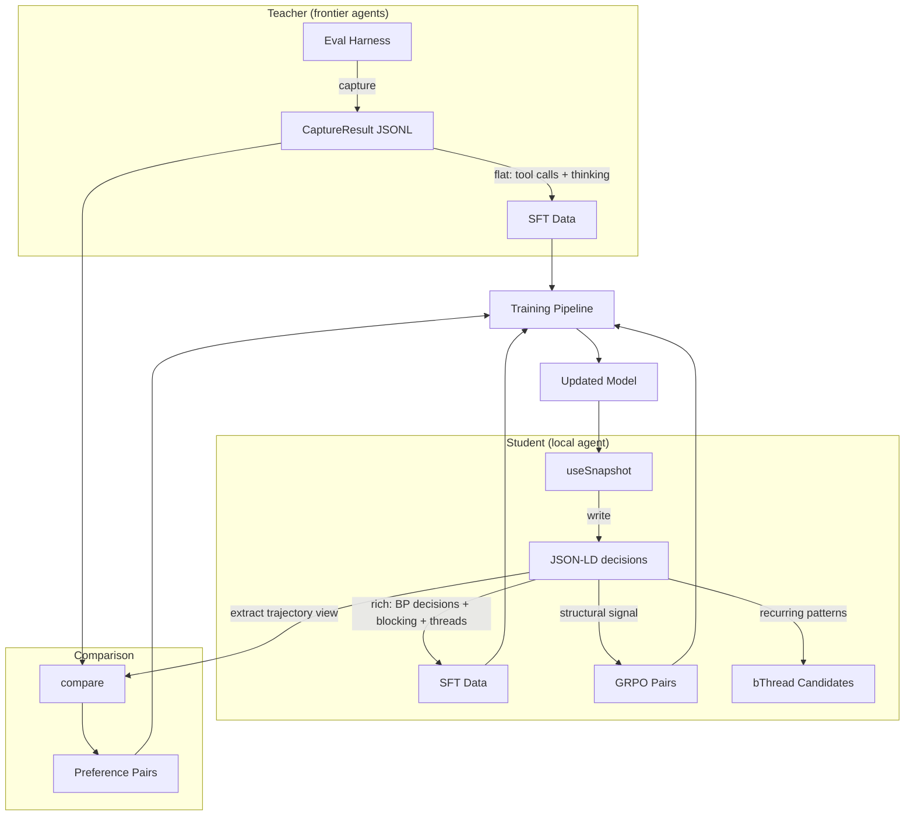

# Hypergraph Memory Architecture

> **Status: ACTIVE** — Authoritative memory architecture. Retains the sidecar (see `MODNET-IMPLEMENTATION.md` § Package Sidecar) and module architecture unchanged. Aligns with `GENOME.md` (CONTRACT frontmatter → JSON-LD `@context`). Cross-references: `AGENT-LOOP.md` (context assembly), `CONSTITUTION.md` (dual representation), `TRAINING.md` (training data source).

## Summary

Replace the SQLite event log + FTS5 index with a **git-versioned hypergraph** persisted as JSON-LD files. The agent's memory becomes files in a git repository — queryable via bash/grep (text), an in-memory TS runtime (structural), and optionally Bun FFI to native code (expensive algorithms). Embeddings are stored inline as properties on JSON-LD documents, not in a separate vector store.

The core insight: BP snapshots are already a hypergraph — each `SelectionBid[]` is a hyperedge connecting multiple threads, events, and decisions. JSON-LD preserves this structure on disk. Git provides versioning, branching (concurrent agents), and archival.

## What Changes

| Previous Decision | New Approach | Why |
|-----|-----|-----|
| SQLite append-only event log | JSON-LD files in git | Preserves multi-party decision structure; git-diffable; grep-friendly |
| `plan_steps` materialized view | Eliminated — plans are bThreads | Step dependencies are `waitFor`/`block` in the BP engine, not database rows |
| FTS5 over event log | `grep -rl` over JSON-LD files | Same capability, no separate index |
| FTS5 over skill frontmatter | `.meta.db` sidecar (unchanged) | Design-time vertex index stays SQLite |
| Log retention: hot SQLite → `.jsonl.gz` | Hot JSON-LD → `git archive` | Git's object packing handles compression |
| LSP code graph (deferred) | `🪢` brand + LSP tools (targeted) | Design-time vertex discovery, not full code graph |
| Semantic search (deferred) | Inline embeddings + cosine similarity | No vector DB; brute-force over `meta.jsonld` files |
| `buildContextMessages()` function | `context_assembly` BP event + contributor handlers | Context assembly becomes observable, trainable, composable |
| Constitution rules as opaque bThreads only | Constitution knowledge as skills + enforcement as bThreads | Dual representation: model understands rules (context), engine enforces them (blocks) |

## What Does NOT Change

- **`.meta.db` sidecar** — per-module SQLite, committed to git, populated by `collect_metadata`. Remains the design-time branded-object index.
- **`.workspace.db`** — ephemeral cross-module view via ATTACH. Rebuilt from sidecars.
- **`collect_metadata` tool** — scans `$` brand identifiers, upserts sidecar.
- **Module architecture** — module-per-repo, Bun workspace, MSS tags.
- **Constitution** — governance factories, MAC/DAC, `protectGovernance` bThread.
- **Cross-project isolation** — hard process boundaries. Knowledge transfer through model weights.
- **Training flywheel** — JSON-LD files replace SQLite as the source for trajectory extraction.

## Concepts

### The Hypergraph

A hypergraph generalizes a graph: a **hyperedge** connects any number of vertices, not just two. BP's `SelectionBid[]` is naturally a hyperedge — it connects threads, events, and decisions in a single atomic record. A regular graph would lose this multi-party structure.

The agent's hypergraph has two layers:



**Design-time vertices** come from source code: branded objects (`🪢`, `🏛️`, `🎛️`, `🎨`) discovered by `collect_metadata` and enriched by LSP type analysis. They represent what the agent *can* do.

**Runtime hyperedges** come from `useSnapshot`: each BP decision connects the participating threads, the candidate events, the blocking relationships, and the session context. They represent what the agent *has done*.

The `@id` URIs link the two layers — a runtime thread `bp:thread/taskGate` references the same identity as the design-time definition.

### JSON-LD as Persistence Format

JSON-LD is JSON with linked-data semantics. Three properties make it suitable:

- **`@id`** — every entity has a URI. Thread `bp:thread/sim_guard_tc-1` in decision 7 and the same `@id` in decision 12 are the same vertex. No foreign keys, no JOINs.
- **`@type`** — typed entities. The processor knows a `bp:SelectionDecision` has `bids`, a `bp:Skill` has `provides`.
- **`@context`** — defines the vocabulary. Skills contribute context; loading a skill extends what types the hypergraph can express.

JSON-LD files are plain JSON — readable by any tool, parseable by `JSON.parse()`, greppable, diffable, committable to git.

### Skills as Hypergraph Subgraphs

A skill is both executable code (`.ts` files) and metadata (frontmatter/CONTRACT in `.md` files). The code stays in the filesystem. The metadata becomes a JSON-LD subgraph — but the JSON-LD **points to** the markdown source rather than duplicating its content.

```jsonc
// The JSON-LD references the markdown — single source of truth
{
  "@id": "skill://behavioral-core",
  "@type": "Skill",
  "source": "skills/seeds/behavioral-core/behavioral-core.md",
  "contract": "skills/seeds/behavioral-core/behavioral-core.md#contract",
  // ... vertices, edges derived from source scan
}
```

The markdown file remains the human-authored source of truth. The JSON-LD is a **derived structural projection** — regenerated by `ingest_skill` when the markdown or TypeScript changes. Git tracks both, so `git diff` on the skill source triggers re-ingestion.

Loading a skill **merges its subgraph** into the agent's active hypergraph. Its branded objects become vertices. Its relationships (thread → event references) become edges. Its CONTRACT fields map to JSON-LD properties:

| CONTRACT field | JSON-LD equivalent |
|---|---|
| `produces` | Vertex definitions with `@type` and `@id` |
| `consumes` | `@id` references to vertices from other skills |
| `depends-on` | `requires` edges between skill vertices |
| `layer` / `wave` | Properties on the skill vertex |

### AGENTS.md as Hypergraph Subgraphs

`AGENTS.md` files capture rules — coding conventions, workflow requirements, testing policies, governance constraints. They exist at multiple levels of the workspace hierarchy and follow the same pattern as skills: the markdown is the source of truth, the JSON-LD is the derived structural projection.

```
workspace/
├── AGENTS.md                        # workspace-level rules
├── modules/
│   ├── apple-block/
│   │   ├── AGENTS.md                # module-level rules (overrides workspace)
│   │   └── .agents/skills/          # module-level skills
│   └── farm-stand/
│       ├── AGENTS.md                # different module, different overrides
│       └── .agents/skills/
└── .agents/skills/                  # workspace-level skills
```

Each `AGENTS.md` is ingested as a JSON-LD subgraph with a `scope` property:

```jsonc
{
  "@id": "rules://workspace",
  "@type": "RuleSet",
  "source": "AGENTS.md",
  "scope": "workspace",
  "rules": [
    { "@id": "rule://no-index-files", "@type": "Rule", "category": "module-organization" },
    { "@id": "rule://explicit-ts-extensions", "@type": "Rule", "category": "module-organization" }
  ]
}

{
  "@id": "rules://modules/apple-block",
  "@type": "RuleSet",
  "source": "modules/apple-block/AGENTS.md",
  "scope": "modules/apple-block",
  "rules": [
    // May override or extend workspace rules for this module
  ]
}
```

### `@context` Vocabulary Resolution: Area of Effect

When multiple sources (skills, AGENTS.md files) define overlapping vocabulary, conflicts are resolved by **proximity to the area of effect** — the closest definition wins. This follows the same scoping model as CSS specificity, git config, and the tool layers table in `PROJECT-ISOLATION.md`:



| Scope | Source | Priority | Example |
|---|---|---|---|
| Framework | Base `@context.jsonld` | Lowest | `bp:Thread`, `bp:SelectionDecision` |
| Workspace | Workspace `AGENTS.md`, workspace skills | ↑ | Testing conventions, git workflow rules |
| Module | Module `AGENTS.md`, module `.agents/skills/` | ↑ | Module-specific type definitions, local conventions |
| Session | Runtime decisions, per-session extensions | Highest | Dynamic thread types, per-task vocabulary |

**Resolution rule**: When the same `@id` or `@type` appears at multiple scopes, the narrowest scope takes precedence. The agent resolves context by walking from session → module → workspace → framework, taking the first match. This is a merge, not a replacement — broader scopes provide defaults, narrower scopes override specific entries.

This applies identically to skills and AGENTS.md rules — both are subgraphs with a `scope` property, both follow the same proximity-based resolution.

### Git as Coordination and Versioning Layer

Each session boundary produces a git commit. Decision files are written to disk continuously during the session (data is durable before commit). At session end, decision files are consolidated into a single JSONL archive, and the session is committed. The agent has `git log` for temporal queries, `git diff` for change detection, `git worktree` for concurrent access.

**Concurrent agents:** The orchestrator creates git worktrees for sub-agents. Each writes to an isolated branch. Results merge back through standard git operations.

**Archival:** At session end or module disconnect, individual decision files are consolidated into `decisions.jsonl`. Archived sessions contain only `meta.jsonld` + `trajectory.jsonld` + `decisions.jsonl` — compact but lossless. Old archives can be moved out of the working tree via `git archive`. Full history preserved in git's object store.

**Rebuild guarantee:** The JSON-LD files ARE the source of truth. If the in-memory index is lost, reload from files. If files are corrupted, recover from git history.

### Context Assembly as BP Event

Before each inference call, the agent assembles context through a BP-coordinated process. A `context_assembly` event fires, and contributor handlers each query the hypergraph for relevant context segments. A `contextGate` bThread blocks `invoke_inference` until all contributors have responded.



Each contributor queries a different part of the hypergraph:

| Contributor | Hypergraph Query | What It Provides |
|---|---|---|
| Snapshot | Recent decision hyperedges | "Thread sim_guard_tc-1 blocked execute" — BP decision history |
| Memory | `meta.jsonld` embeddings + structural similarity | "Session sess_abc solved a similar file watcher task" |
| Skills | Area-of-effect scoped skill subgraphs | Schema knowledge for the current task scope |
| Plan | Active plan step bThreads' positions | "Step 3 is blocked, waiting for step 2 completion" |
| Constitution | Governance rule subgraphs in scope | "noRmRf blocks destructive shell commands" — rule explanations |
| Rules | AGENTS.md subgraphs by proximity | Module-level coding conventions, workflow rules |

Context assembly is itself observable and trainable:

- **Observable** — `useSnapshot` captures which contributors provided context and what was included. The model sees its own context assembly process in subsequent snapshots.
- **Trainable** — Context assembly decisions become training signal. The model learns which context segments led to successful sessions vs failures.
- **Composable** — New contributors are additive. Adding a memory source doesn't modify existing contributors — it's another handler that responds to `context_assembly`.

This replaces the reference implementation's `buildContextMessages()` function, which assembled context imperatively in a single function. The BP event approach makes context assembly a first-class coordination concern with the same observability guarantees as tool execution and gate checking.

### Constitution Knowledge in Skills

Skills have two poles — they sit on a spectrum, not in discrete categories:

| Pole | Purpose | Example |
|---|---|---|
| **Schema** | Pattern knowledge — what things are, how they work | "behavioral-core teaches bThread coordination patterns" |
| **Operator** | Tool invocations — how to carry out instructions | "typescript-lsp provides lsp-find, lsp-hover commands" |

Most skills blend both poles. A skill like `agent-build` is mostly schema (architecture knowledge) but includes operator guidance (testing patterns, event flow). A skill like `typescript-lsp` is mostly operator (LSP commands) but includes schema (when to use LSP vs grep).

Constitution knowledge lives naturally in skills as schema content. A governance skill teaches the model **what** the constitution means and **why** — what the `noRmRf` rule protects against, what the `protectGovernance` thread blocks, what the MAC/DAC distinction enforces. The skill is picked up by area-of-effect scoped context assembly and injected into the model's context.

The dual representation reinforces the neuro-symbolic advantage:

| Layer | Mechanism | What It Does |
|---|---|---|
| **bThread** (symbolic) | Block predicates | Prevents dangerous events structurally — the engine won't select them |
| **Skill** (neural) | Context assembly | Teaches the model the rules so it doesn't propose blocked actions |

The bThread catches anything the model gets wrong. The skill reduces how often the model gets it wrong. Both are needed — the bThread alone means the model keeps proposing blocked actions (wasting inference). The skill alone means the model might find creative ways around the rules. Together: the model understands the rules and the engine enforces them.

## File Structure

```
data/memory/
├── @context.jsonld              # framework-level vocabulary (BP types, tool types)
├── sessions/
│   ├── {session_id}/
│   │   ├── @context.jsonld      # session-specific vocabulary extensions
│   │   ├── meta.jsonld          # summary, outcome, embedding, tools used
│   │   ├── decisions/
│   │   │   ├── {superstep}.jsonld   # one file per BP decision (hyperedge)
│   │   │   └── ...
│   │   └── trajectory.jsonld    # tool calls + outputs (adapter concern)
│   └── ...
├── skills/
│   ├── {skill_name}.jsonld      # ingested skill subgraph (source pointer to .md)
│   └── ...
├── rules/
│   ├── workspace.jsonld         # ingested workspace AGENTS.md (source pointer)
│   ├── {module_name}.jsonld     # ingested module AGENTS.md (source pointer)
│   └── ...
├── threads/
│   ├── {thread_name}.jsonld     # design-time thread vertex (from LSP + brand scan)
│   └── ...
└── constitution/
    ├── mac/                     # mandatory governance subgraphs
    └── dac/                     # discretionary governance subgraphs
```

### Progressive Disclosure

The file hierarchy appears in the system prompt as a summarized tree. Each `meta.jsonld` provides enough context for the agent to decide what to load without loading it:

```jsonc
// data/memory/sessions/sess_abc/meta.jsonld
{
  "@id": "session/sess_abc",
  "@type": "bp:Session",
  "summary": "Implemented file watcher with debounce. Gate rejected rm -rf attempt.",
  "embedding": [0.023, -0.118, 0.445, "..."],
  "threadTypes": ["taskGate", "maxIterations", "noRmRf"],
  "outcomeEvents": ["gate_rejected", "message"],
  "toolsUsed": ["read", "write", "bash"],
  "decisionCount": 12,
  "timestamp": "2026-03-03T10:00:00Z"
}
```

The agent reads the tree, decides relevance, loads specific files. Grep for quick lookups. Hypergraph CLI for structural queries.

## JSON-LD Schema

### Base Context (`@context.jsonld`)

```jsonc
{
  "@context": {
    "@base": "node://agent/",
    "bp": "node://agent/behavioral#",
    "tools": "node://agent/tools#",
    "xsd": "http://www.w3.org/2001/XMLSchema#",

    "Session": "bp:Session",
    "SelectionDecision": "bp:SelectionDecision",
    "Bid": "bp:Bid",
    "Thread": "bp:Thread",
    "Event": "bp:Event",
    "Skill": "bp:Skill",
    "GovernanceRule": "bp:GovernanceRule",

    "thread": { "@type": "@id" },
    "event": { "@type": "@id" },
    "blockedBy": { "@type": "@id" },
    "interrupts": { "@type": "@id" },
    "requester": { "@type": "@id" },
    "provides": { "@type": "@id", "@container": "@set" },
    "requires": { "@type": "@id", "@container": "@set" },

    "selected": "xsd:boolean",
    "superstep": "xsd:integer",
    "timestamp": "xsd:dateTime",
    "priority": "xsd:integer",
    "embedding": { "@container": "@list" }
  }
}
```

### Decision Document (Runtime Hyperedge)

```jsonc
// data/memory/sessions/sess_abc/decisions/007.jsonld
{
  "@context": "../../../@context.jsonld",
  "@id": "session/sess_abc/decision/7",
  "@type": "SelectionDecision",
  "superstep": 7,
  "timestamp": "2026-03-03T10:00:00.123Z",
  "bids": [
    {
      "@type": "Bid",
      "event": "bp:event/execute",
      "thread": "bp:thread/sim_guard_tc-1",
      "selected": false,
      "blockedBy": "bp:thread/sim_guard_tc-1",
      "priority": 0
    },
    {
      "@type": "Bid",
      "event": "bp:event/tool_result",
      "thread": "bp:thread/batchCompletion",
      "selected": true,
      "priority": 0
    }
  ]
}
```

### Skill Subgraph (Design-Time Vertices)

The JSON-LD points to the markdown source — it does not duplicate CONTRACT frontmatter:

```jsonc
// data/memory/skills/behavioral-core.jsonld
{
  "@context": "../@context.jsonld",
  "@id": "skill://behavioral-core",
  "@type": "Skill",
  "source": "skills/seeds/behavioral-core/behavioral-core.md",
  "contract": "skills/seeds/behavioral-core/behavioral-core.md#contract",
  "layer": "foundation",
  "wave": 0,
  "provides": [
    {
      "@id": "bp:thread/taskGate",
      "@type": "Thread",
      "source": "src/agent/agent.ts",
      "references": ["bp:event/task", "bp:event/message"],
      "blocks": ["bp:event/execute", "bp:event/invoke_inference"]
    },
    {
      "@id": "bp:tool/behavioral",
      "@type": "tools:ToolDefinition",
      "source": "src/behavioral/behavioral.ts"
    }
  ],
  "requires": []
}
```

Note: `layer` and `wave` are extracted from the CONTRACT frontmatter during ingestion — they're properties on the vertex, not duplicated content. The `contract` field is a pointer back to the authoritative source. If the markdown changes, `git diff` on the source triggers re-ingestion.

### AGENTS.md Subgraph (Rule Vertices)

```jsonc
// data/memory/rules/workspace.jsonld
{
  "@context": "../@context.jsonld",
  "@id": "rules://workspace",
  "@type": "RuleSet",
  "source": "AGENTS.md",
  "scope": "workspace",
  "rules": [
    {
      "@id": "rule://no-index-files",
      "@type": "Rule",
      "category": "module-organization",
      "source": "AGENTS.md#module-organization"
    },
    {
      "@id": "rule://use-test-not-it",
      "@type": "Rule",
      "category": "testing",
      "source": "AGENTS.md#testing"
    }
  ]
}
```

### Thread Vertex (Design-Time, from LSP + Brand Scan)

```jsonc
// data/memory/threads/taskGate.jsonld
{
  "@context": "../@context.jsonld",
  "@id": "bp:thread/taskGate",
  "@type": "Thread",
  "brand": "🪢",
  "source": "src/agent/agent.ts",
  "line": 42,
  "repeat": true,
  "phases": [
    {
      "waitFor": "bp:event/task",
      "blocks": ["bp:event/execute", "bp:event/invoke_inference"],
      "interrupt": ["bp:event/disconnected"]
    },
    {
      "waitFor": "bp:event/message",
      "interrupt": ["bp:event/disconnected"]
    }
  ]
}
```

## Query Stack

Three layers over the same JSON-LD files, escalating in capability:

### Layer 1: Bash / Grep / Git (Text — 80% Case)

```bash
# What happened in this session?
cat data/memory/sessions/sess_abc/meta.jsonld

# Find all gate rejections across sessions
grep -rl '"gate_rejected"' data/memory/sessions/

# What blocked execute in session abc?
grep -l '"blockedBy"' data/memory/sessions/sess_abc/decisions/ | \
  xargs grep '"execute"'

# Git history of memory changes
git log --oneline data/memory/sessions/

# Diff between sessions
git diff HEAD~5 -- data/memory/sessions/sess_abc/meta.jsonld
```

No index. No database. Standard unix tools.

### Layer 2: Hypergraph CLI (Structural — TS Runtime)

A compiled Bun executable that loads JSON-LD files into an in-memory incidence structure (`Map<VertexId, Set<HyperedgeId>>`) and performs graph queries.

```bash
# Causal chain from task to message
./tools/hypergraph causal-chain \
  --session data/memory/sessions/sess_abc \
  --from "bp:event/task" --to "bp:event/message"

# Thread co-participation across sessions
./tools/hypergraph co-occurrence \
  --vertex "bp:thread/sim_guard" \
  --sessions data/memory/sessions/

# Check constitution rules for deadlocks
./tools/hypergraph check-cycles \
  --threads data/memory/threads/

# Find structurally similar sessions
./tools/hypergraph match \
  --pattern '{"sequence": ["gate_rejected", "simulate_request"]}' \
  --sessions data/memory/sessions/

# Semantic similarity (embedding search)
./tools/hypergraph similar \
  --query "implement file watcher with debounce" \
  --sessions data/memory/sessions/ \
  --top-k 3
```

Built with Bun bytecode compilation for fast startup:

```bash
bun build --compile --bytecode --minify \
  ./src/tools/hypergraph.ts --outfile ./tools/hypergraph
```

**Internal data structure:**

```typescript
// Incidence representation — vertices share identity across hyperedges
type VertexId = string          // JSON-LD @id URI
type HyperedgeId = string       // JSON-LD @id URI

type HypergraphIndex = {
  vertices: Map<VertexId, Set<HyperedgeId>>     // vertex → hyperedges containing it
  hyperedges: Map<HyperedgeId, HyperedgeData>   // hyperedge → full data
  typeIndex: Map<string, Set<VertexId>>          // @type → vertices of that type
}
```

### Layer 3: FFI to Native Code (Expensive Algorithms)

When TS `Map`/`Set` operations are insufficient — subgraph isomorphism, cycle detection in large constraint graphs, hypertree decomposition:

```typescript
import { dlopen, FFIType, suffix } from 'bun:ffi'

const lib = dlopen(`libhypergraph.${suffix}`, {
  find_cycles: {
    args: [FFIType.ptr, FFIType.u32, FFIType.ptr, FFIType.u32],
    returns: FFIType.ptr,
  },
  subgraph_match: {
    args: [FFIType.ptr, FFIType.u32, FFIType.ptr, FFIType.u32],
    returns: FFIType.ptr,
  },
})
```

The incidence structure serializes to `Uint32Array` (CSR format) for zero-copy FFI. Native library written in Rust or Zig, compiled to a shared library per platform.

**Deferred** — build when TS runtime proves insufficient for real workloads. Start with TS only.

## Embeddings

Embeddings are stored inline as properties on `meta.jsonld` documents. No separate vector store.

### When to Compute

| Trigger | What Gets Embedded | Storage |
|---|---|---|
| Session completion | Session summary text | `sessions/{id}/meta.jsonld` → `embedding` |
| Skill ingestion | Skill description text | `skills/{name}.jsonld` → `embedding` |
| Constitution change | Rule description text | `constitution/{rule}.jsonld` → `embedding` |

### How to Query

Brute-force cosine similarity over `Float32Array`. At the scale of a single agent's memory (hundreds to low thousands of sessions), this takes <1ms in TS. ANN algorithms are unnecessary below ~100k vectors.

The `hypergraph similar` command loads `meta.jsonld` files, extracts `embedding` fields, computes dot products, returns top-k matches.

### Embedding Model

EmbeddingGemma (Gemma 3 300M base) runs locally via the `Indexer` interface (see `ARCHITECTURE.md` § Pluggable Models). 768-dim embeddings with Matryoshka truncation to 512/256/128 as scale demands. 2K token context. Not part of the agent loop — a separate, cheap model dedicated to turning text into vectors. The `Indexer.embed(text): Promise<Float32Array>` interface is unchanged from the original design.

## Tools

### Write Tools

| Tool | Input | Output | Trigger |
|---|---|---|---|
| `useSnapshot` callback | `SelectionBid[]` | `decisions/{superstep}.jsonld` | Every BP decision (automatic) |
| `ingest_skill` | Skill markdown + TS files | `skills/{name}.jsonld` | Skill install, update, or `git diff` on source |
| `ingest_rules` | `AGENTS.md` file | `rules/{scope}.jsonld` | AGENTS.md change or `git diff` on source |
| `collect_metadata` | Module source files | `.meta.db` sidecar (unchanged) | Module creation, governance change, on demand |

### Query Tools

| Tool | Query Type | Interface |
|---|---|---|
| `bash` (grep/git) | Text search, version history | Standard unix CLI |
| `hypergraph` CLI | Structural traversal, co-occurrence, cycles, similarity | Compiled Bun executable |
| LSP tools | Design-time type analysis, symbol discovery | `lsp-find`, `lsp-hover`, `lsp-refs`, `lsp-analyze` |

### Maintenance Tools

| Tool | Purpose | Trigger |
|---|---|---|
| `consolidate` | Concatenate decision files into `decisions.jsonl`, clean up individual files | Session end or module disconnect |
| `defrag` | Reorganize files, archive old sessions out of working tree | On demand or bThread after N sessions |

**No `reflect` tool.** The `decisions.jsonl` archive is lossless — pattern detection and anomaly analysis are batch queries via the `hypergraph` CLI (`recurring-patterns`, `co-occurrence`), not eager writes. The `meta.jsonld` summary and embedding are written by the session-closing handler, not a separate reflection step.

## bThread Coordination

Memory operations are coordinated by bThreads, not ad-hoc scheduling:

```
sessionClose: bThread([
  bSync({ waitFor: 'message' }),                    // session completed
  bSync({ request: { type: 'consolidate' } }),      // archive decisions → JSONL
], true)                                             // repeats after every session

defragSchedule: bThread([
  // Wait for N session completions
  ...Array.from({ length: N }, () =>
    bSync({ waitFor: 'message' })
  ),
  bSync({ request: { type: 'defrag' } }),           // trigger defragmentation
], true)

contextGate: bThread([
  // Block invoke_inference until all context contributors have reported
  bSync({
    waitFor: 'context_assembly',
    block: 'invoke_inference',
    interrupt: ['message'],
  }),
  // Wait for all contributor segments (count set dynamically)
  // ... N bSync({ waitFor: isContextSegment }) ...
  bSync({ request: { type: 'invoke_inference' }, interrupt: ['message'] }),
], true)

memoryIntegrity: bThread([
  // Constitution rule: block writes to protected memory paths
  bSync({
    block: (e) => e.type === 'execute' &&
      e.detail?.command?.includes('data/memory/@context.jsonld'),
  }),
], true)
```

The `consolidate` and `defrag` handlers are async (they do I/O). They call `trigger()` with results when done, starting new super-steps. The bThreads coordinate *when* these operations happen. The tools do the actual work.

## Ingestion Pipeline

Skills and AGENTS.md files share the same pipeline — both are markdown sources that produce JSON-LD subgraphs with `source` pointers back to the authoritative files.

### Skill Ingestion



Steps:
1. **Parse markdown** — extract CONTRACT frontmatter (name, layer, wave, produces, consumes, depends-on)
2. **Scan brands** — `collect_metadata` finds `🪢`, `🏛️`, `🎛️`, `🎨` in `.ts` files
3. **Resolve types** — LSP tools get type signatures, event references from bThread definitions
4. **Emit JSON-LD** — produce subgraph with `source` pointers to markdown, vertex definitions from brand scan + LSP
5. **Commit** — git commit the `.jsonld` alongside skill source

### AGENTS.md Ingestion


Steps:
1. **Parse sections** — extract rule categories (testing, module organization, workflow, etc.)
2. **Derive scope** — file path determines area of effect (`AGENTS.md` → workspace, `modules/x/AGENTS.md` → module x)
3. **Emit JSON-LD** — produce `RuleSet` subgraph with `source` pointers to markdown sections, `scope` from path
4. **Commit** — git commit the `.jsonld` alongside the AGENTS.md

Both pipelines produce **derived artifacts** — regenerable from their markdown source. The markdown is what humans edit. The JSON-LD is what the hypergraph indexes. `git diff` on the source file signals that re-ingestion is needed.

## Design-Time ↔ Runtime Connection

The `@id` URIs create implicit links between design-time and runtime data:

| Design-Time Vertex | Runtime Reference |
|---|---|
| `bp:thread/taskGate` in `threads/taskGate.jsonld` | `"thread": "bp:thread/taskGate"` in `decisions/002.jsonld` |
| `bp:event/execute` in `threads/taskGate.jsonld` phases | `"event": "bp:event/execute"` in `decisions/007.jsonld` |
| `skill://behavioral-core` in `skills/behavioral-core.jsonld` | Any thread vertex it `provides` that appears in runtime decisions |

This enables queries like:
- "Which skills' threads participated in this session?" — follow `@id` from decision → thread → skill
- "Has this thread ever been blocked in production?" — find all decisions referencing this thread's `@id` where `blockedBy` is set
- "Which skills conflict?" — merge skill subgraphs, check for cycles in combined bThread blocks

## Migration Plan

### Phase 1: JSON-LD Schema + Write Path

Define the base `@context.jsonld`. Modify `useSnapshot` callback to emit `decisions/{superstep}.jsonld` files instead of SQLite inserts. Write `meta.jsonld` on session completion.

### Phase 2: Ingestion Tools (`ingest_skill` + `ingest_rules`)

Build the markdown → JSON-LD pipelines. `ingest_skill` handles skill markdown + TS sources. `ingest_rules` handles AGENTS.md files with scope derivation from file path. Ingest existing skills and AGENTS.md. Verify round-trip: source → `.jsonld` → agent can query vertices and rules.

### Phase 3: Hypergraph CLI (TS)

Build the in-memory loader and query engine. Implement: `causal-chain`, `co-occurrence`, `check-cycles`, `match`. Compile with `bun build --compile --bytecode`.

### Phase 4: Consolidation + Defrag

Build `consolidate` handler (decision files → `decisions.jsonl`, write `meta.jsonld` with summary + embedding). Build `defrag` handler (archive old sessions out of working tree). Wire `sessionClose` and `defragSchedule` bThread coordination.

### Phase 5: Embedding Integration

Add `embedding` field to `meta.jsonld` write path. Implement `similar` command in hypergraph CLI. Brute-force cosine similarity over loaded embeddings.

### Phase 6: FFI Native Library (Deferred)

Build Rust/Zig shared library for subgraph isomorphism, hypertree decomposition. Wire via `bun:ffi`. Only when TS runtime proves insufficient.

## Training Flywheel

The hypergraph memory replaces the SQLite event log as the training data source. This changes *what data is available* (richer structural signal), not the flywheel mechanics (usage → trajectories → training → better model → better usage).

### Two Trajectory Sources



| Source | Format | Signal | Training Use |
|--------|--------|--------|-------------|
| **Teacher** (Claude/Gemini via eval harness) | Flat JSONL (`CaptureResult`) | Tool call format, reasoning patterns, `<think>` structure | SFT — teaches HOW to use tools |
| **Student** (local agent via useSnapshot) | JSON-LD decisions | BP decisions, blocking, thread coordination, gate rejections | SFT + GRPO — teaches WHAT to do AND what NOT to do |
| **Comparison** (eval harness `compare`) | `ComparisonReport` JSON | Teacher-preferred vs student-generated | GRPO preference pairs |

### Four Signal Tiers as Hypergraph Queries

The four signal tiers (see `TRAINING.md`) map directly to hypergraph queries:

| Signal | Old (SQLite query) | New (Hypergraph query) |
|--------|-------------------|----------------------|
| **Gate rejection** | `WHERE type = 'gate_rejected'` | `grep -rl '"gate_rejected"'` or `hypergraph causal-chain --to "bp:event/gate_rejected"` — shows full causal chain leading to rejection |
| **Test failure** | `WHERE tool = 'bash' AND args LIKE '%test%' AND status = 'error'` | `grep` over trajectory files + `hypergraph co-occurrence` — shows which threads were active during failure |
| **Test pass + user rejects** | `WHERE status = 'completed' AND user_feedback = 'rejected'` | Session `meta.jsonld` with `outcome: "rejected"` — full decision history available for GRPO |
| **Test pass + user approves** | `WHERE status = 'completed' AND user_feedback = 'approved'` | Session `meta.jsonld` with `outcome: "approved"` — gold SFT data with structural context |

The hypergraph adds a dimension SQLite couldn't: **why did the agent make each decision?** The `blockedBy`, `interrupts`, and thread co-participation in each decision provide structural explanations. These are training signal — the model can learn not just "tool X was called" but "tool X was chosen while thread Y was blocking tool Z because of constitution rule W."

### Dreamer Training — State Transition Pairs

State transition pairs (`(Context + Tool Call) → (Real Tool Output)`) are extracted from session decision files:

```bash
# Extract state transition pairs from a session
./tools/hypergraph extract-transitions \
  --session data/memory/sessions/sess_abc \
  --output transitions.jsonl

# Each pair:
# { "context": [prior decisions], "toolCall": {...}, "realOutput": {...} }
```

The hypergraph provides richer context for each transition than flat tool call logs — the model sees which threads were active, what was blocked, and what the gate check decided. This helps the Dreamer learn not just "what `ls -la` returns" but "what `ls -la` returns when the agent is in phase 2 of a file refactoring task with `noRmRf` constitution active."

### Eval Harness Integration

The eval harness's JSONL format is stable and well-defined. It captures teacher trajectories from external agents that don't have BP. The integration points:

**Capture** — Unchanged. The eval harness captures from teacher agents via headless adapters, producing `CaptureResult` JSONL. Teacher trajectories are flat (no BP snapshots).

**Compare** — The `compare` command works with its existing JSONL format. For student trajectories, a view adapter extracts flat `CaptureResult`-compatible JSONL from the JSON-LD decisions:

```bash
# Extract flat trajectory view from student's JSON-LD session
./tools/hypergraph export-trajectory \
  --session data/memory/sessions/sess_abc \
  --format capture-result > student-run.jsonl

# Compare teacher vs student using existing eval harness
bunx @plaited/agent-eval-harness compare teacher-run.jsonl student-run.jsonl \
  --strategy statistical -o comparison.json
```

**Grade** — Graders work on `CaptureResult` JSONL. For structural grading (did the agent respect constitution rules? did blocking work correctly?), a hypergraph-aware grader can read the JSON-LD directly:

```typescript
// structural-grader.ts — grades based on BP decision quality
import type { Grader } from '@plaited/agent-eval-harness/schemas'

export const grade: Grader = async ({ id, output, cwd }) => {
  // Read the session's JSON-LD decisions
  const decisions = await loadSessionDecisions(cwd, id)

  // Check: were any gate rejections overridden?
  const overrides = decisions.filter(d =>
    d.bids.some(b => b.blockedBy && b.selected)
  )

  // Check: did constitution rules fire appropriately?
  const constitutionBlocks = decisions.filter(d =>
    d.bids.some(b => b.blockedBy?.startsWith('constitution:'))
  )

  return {
    pass: overrides.length === 0,
    score: 1 - (overrides.length / decisions.length),
    reasoning: `${constitutionBlocks.length} constitution blocks, ${overrides.length} overrides`,
  }
}
```

### bThread Crystallization

Recurring patterns in the hypergraph → candidate bThreads → owner approval:

```bash
# Find recurring blocking patterns across sessions
./tools/hypergraph recurring-patterns \
  --sessions data/memory/sessions/ \
  --min-occurrences 5 \
  --output patterns.jsonl

# Each pattern:
# { "pattern": "thread X blocks event Y when Z is active", "occurrences": 12, "sessions": [...] }
```

When a pattern appears consistently, the reflection tool proposes it as a bThread candidate. The pattern's structural representation (which threads, which events, which conditions) is precise enough to generate the `bSync` declaration. The owner reviews and approves before it's added to the constitution.

This is the "symbolic layer gets stricter" half of the flywheel — recurring neural decisions crystallize into symbolic constraints.

### Training Data Extraction

JSON-LD replaces SQLite as the source, but the extraction is simpler — just reading files:

```bash
# SFT: successful session trajectories
./tools/hypergraph extract-training \
  --sessions data/memory/sessions/ \
  --filter "outcome=approved" \
  --format sft > sft-data.jsonl

# GRPO: failed + corrected trajectories
./tools/hypergraph extract-training \
  --sessions data/memory/sessions/ \
  --filter "outcome=rejected" \
  --format grpo > grpo-pairs.jsonl

# Dreamer: state transition pairs
./tools/hypergraph extract-transitions \
  --sessions data/memory/sessions/ \
  --output dreamer-data.jsonl
```

The hypergraph CLI reads JSON-LD files, extracts the relevant signal, and outputs training-format JSONL. No SQL queries. No database connection. Just file reads and structural traversal.

## Resolved Decisions

### `@context` Composition — Area of Effect

Overlapping vocabulary from skills and AGENTS.md files is resolved by proximity to the area of effect. See § `@context` Vocabulary Resolution above. The narrowest scope wins: session > module > workspace > framework. This applies identically to skill-contributed vocabulary and AGENTS.md rules.

### Embedding Model — EmbeddingGemma

Dedicated embedding model, not the inference model. From `ARCHITECTURE.md` § Pluggable Models:

| Property | Value |
|---|---|
| Model | EmbeddingGemma (Gemma 3 300M base) |
| Parameters | 300M |
| Dimensions | 768 (Matryoshka truncation to 512/256/128) |
| Context | 2K tokens |
| Role | `Indexer.embed(text): Promise<Float32Array>` |

Runs locally. Not part of the agent loop. Cheap enough to embed every `meta.jsonld` at session completion without latency or cost concerns. Matryoshka truncation allows trading dimension size for storage/speed as scale demands.

### Decision File Granularity — Single Files

One `.jsonld` file per superstep decision. Snapshots are continuously written during the session so no data is lost in flight. The many-small-files cost is acceptable because:

- Grep queries work naturally (`grep -rl` over a directory)
- Git handles small files well (and packs them efficiently)
- Each file is a self-contained hyperedge — no need to parse a larger batch to find one decision
- Archival consolidates them (see below)

### Git Commit Frequency — Per-Session

Commits happen per session, not per decision. Snapshots are already written to disk as individual `.jsonld` files during the session — the data is durable before the commit. The commit marks "session boundary" in git history, not "decision boundary."

**Rationale**: Per-decision commits would create thousands of commits per session with no practical benefit — `git log` becomes unusable, and the individual files already provide fine-grained history via their filenames (`{superstep}.jsonld`).

### Archival Strategy — JSONL Consolidation

At session end (or module disconnect), decision files are consolidated into a single JSONL archive:

```
data/memory/sessions/{session_id}/
├── meta.jsonld                    # kept as-is (summary, embedding)
├── trajectory.jsonld              # kept as-is (tool call log)
├── decisions/                     # individual files (hot session)
│   ├── 001.jsonld
│   ├── 002.jsonld
│   └── ...
└── decisions.jsonl                # consolidated archive
```

The `decisions.jsonl` file is one JSON-LD document per line — same content as the individual files, concatenated. After consolidation:

1. Individual decision files can be removed from the working tree (they're in git history and in the JSONL)
2. The session directory is compact: `meta.jsonld` + `trajectory.jsonld` + `decisions.jsonl`
3. Grep still works over the JSONL file (`grep 'gate_rejected' decisions.jsonl`)
4. The hypergraph CLI loads from either format (directory of files OR single JSONL)

**Module disconnect** follows the same path — when a module's worktree is cleaned up, its decision files are consolidated into JSONL before removal.

### Training Flywheel — Adapted

Resolved. See § Training Flywheel above. JSON-LD files replace SQLite as the trajectory source. The `hypergraph` CLI's `extract-training`, `extract-transitions`, and `export-trajectory` commands read JSON-LD directly and output training-format JSONL. No SQL queries.

### Reflection — Deferred to Query Time

No `reflect` tool. `decisions.jsonl` is lossless — the full decision history is always available. Pattern detection (recurring blocking patterns, thread co-participation frequencies, anomalous gate rejections) is a batch query via the hypergraph CLI, not an eager post-session write. This avoids the lossy-compression question entirely: the archive preserves everything, queries extract what's needed when it's needed.

If batch queries over growing archives become too slow, the first optimization is structural fingerprinting (Variant A from the design discussion) — a compact topology summary per session that enables fast similarity comparison without loading full decision histories.

### Plans as bThreads — No External State

The `plan_steps` materialized view from the original design is eliminated. Plan step coordination is a bThread concern, not a database concern.

When the model produces a plan, the `save_plan` handler converts each step into a dynamically added bThread — the same pattern as `maxIterations` (per-task), `batchCompletion` (per-response), and `sim_guard_{id}` (per-tool-call). Step dependencies are expressed via `waitFor` on completion events from prerequisite steps. The BP engine handles ordering, parallelism, and blocking natively.

This eliminates:
- The `plan_steps` table (no external state to query)
- The hot-path predicate startup problem (nothing to load — plans live in the engine)
- The in-memory `Map` synchronization concern (thread position IS the state)

Plan step threads are interrupted by `message` (task end) and are observable via `useSnapshot` — the model sees which steps are blocked and which dependencies are pending, in its system prompt.

### Context Assembly — BP Event with Contributor Handlers

Context assembly is a BP event (`context_assembly`), not an imperative function. This replaces the reference implementation's `buildContextMessages()`. The `contextGate` bThread blocks `invoke_inference` until all contributors have provided their context segments. See § Context Assembly as BP Event above.

The `batchCompletion` thread (which currently requests `invoke_inference` after all tool calls resolve) instead requests `context_assembly`, which leads to `invoke_inference` after the gate opens. This ensures context is re-assembled for every inference call with up-to-date hypergraph state.

### Constitution as Skills — Dual Representation

Constitution rules have dual representation: **bThreads enforce** (block predicates in the BP engine) and **skills teach** (context assembly injects governance knowledge into the model's prompt).

Both representations are needed and non-substitutable:
- bThread alone: model keeps proposing blocked actions, wasting inference cycles
- Skill alone: model might find creative circumventions that the engine doesn't catch
- Both: model understands rules (fewer blocked proposals) AND engine enforces them (defense-in-depth)

Constitution skills follow area-of-effect scoping: governance rules relevant to the current module/workspace are included in context assembly, not all rules globally. The skill's `scope` property (derived from its file path) determines inclusion — same resolution as AGENTS.md rules.

### Governance Factory Generation — Protected File Writes

Governance factories are created through file writes to `data/memory/constitution/mac/` or `data/memory/constitution/dac/` — paths that `protectGovernance` and `memoryIntegrity` bThreads monitor. This is not a dedicated governance tool; it's a write operation to a protected location.

**Who creates factories:** The agent itself, a system-builder agent, or a human system engineer. The factory creation pattern matters for agents — they generate governance rules from user desired outcomes (what the user wants to achieve), not from explicit rule descriptions.

**Protection model:**

| Actor | Access | Mechanism |
|---|---|---|
| Agent (normal operation) | Cannot delete or modify constitution files | `protectGovernance` bThread blocks writes |
| Agent (factory creation) | Can write new DAC factories with user approval | Write to `dac/` path, user confirms |
| System engineer | Direct modification via SSH | Outside agent process entirely |
| Non-technical user | Explicit permissioning for dangerous operations | Outside normal agent process (analogous to `--dangerously-skip-permissions`) |

**Capability model:**
- MAC factories remain framework-provided (loaded at spawn, immutable at runtime)
- The agent generates new governance factories through the training flywheel — not through a dedicated tool, but through default bThreads protecting the files + model training to produce valid factory patterns
- Constitution skills teach the factory pattern; the model learns what valid governance looks like from its own skill context

## Open Questions

None. All questions resolved.
