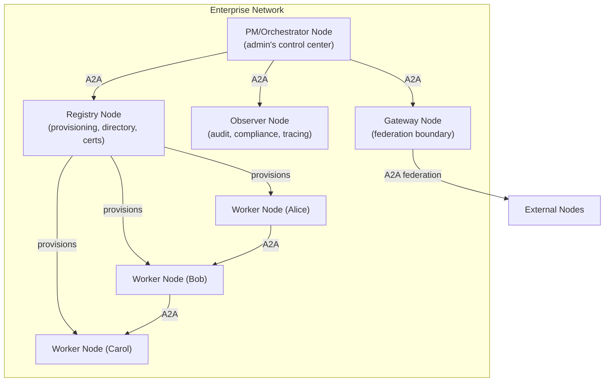

# Modnet Implementation

> **Status: ACTIVE** — Design rationale for the modnet architecture. Implementation patterns (code sketches, transport tables, access control predicates, enterprise node specs) are in `skills/modnet-node/`. Cross-references: `Modnet.md` (design standards), `Structural-IA.md` (design grammar), `CONSTITUTION.md` (governance enforcement), `PROJECT-ISOLATION.md` (modules vs. projects).

## Topology: 1 Node : 1 User

A **modnet** (modular network) is a network of user-owned nodes connected peer-to-peer. Each node is one agent serving one user. There is no central server, no shared tenancy, no platform operator. Nodes communicate via the **A2A (Agent-to-Agent) protocol**.

- Each **node** is a Plaited agent instance (agent loop + modules + memory + constitution)
- Each node is **owned and controlled** by one user — their data lives on their node, nowhere else
- Nodes connect to other nodes via A2A — no intermediary, no aggregator
- A node going offline means its data disappears from the network, not from the owner
- Nodes can connect to **multiple networks simultaneously** — team workspace, public skill marketplace, private dev environment

This is not multiplayer (multiple users sharing one agent). It is a network of sovereign agents cooperating.

## Modules Are Internal

A module is an internal artifact — code, data, tools, skills, bThreads — living inside the agent. Modules are not exposed directly to the network. When one node wants to work with another node's module, it requests a **service** or receives an **artifact**. The module stays internal; the output crosses the boundary.

The Agent Card is the node's **public entry point** — a projection of capabilities, not an inventory of internals.

## Module Architecture: Module-Per-Repo

The node directory is a git repo (`.gitignore` excludes `modules/`). Each module in `modules/` has its own `git init`. This gives two layers of version history: node-level (constitution, global config, node `.memory/`) and module-level (code, data, module `.memory/`). Bun workspace resolution (`workspace:*`) works regardless of whether subdirectories have `.git/`.

Modules follow the AgentSkills specification. Each module has a seed skill (named after the module) and optional capability skills. MSS bridge-code tags and CONTRACT fields live in the `metadata` field of SKILL.md frontmatter. The PM reads SKILL.md metadata for module discovery, cross-module queries, and dependency resolution — no sidecar database needed.

Key architectural choices:
- `@node` scope for all module packages, `workspace:*` resolution
- Code never leaves the node; only `data/` contents cross A2A boundaries
- No compilation needed for server-side code (Bun runs TypeScript natively). Only `Bun.build({ target: 'browser' })` for behavioral modules sent to clients.
- Large assets are symlinked from outside the workspace (no git LFS)

> **Implementation details** (node directory layout, package.json manifest, scale mapping, code vs. data boundary, dependency isolation, asset management, module registry): [`skills/modnet-node/references/module-architecture.md`](../skills/modnet-node/references/module-architecture.md)

### Modules vs. Projects

Modules and projects are distinct concepts with different isolation models:

| Concern | Module | Project |
|---|---|---|
| **What** | Internal package within the node's workspace | External codebase (user's repo) |
| **Git** | Own git repo within `modules/` | Separate git repo, external |
| **Isolation** | Bun workspace dependency isolation | Process isolation (Bun.spawn + IPC) |
| **Scope** | `@node/` scope, workspace:* resolution | Independent, orchestrator-routed |
| **Lifecycle** | Created/modified by agent as workspace packages | Registered on encounter, independent subprocess |

The orchestrator (see `PROJECT-ISOLATION.md`) manages projects as separate subprocesses. Modules are packages within the node's own workspace — they don't need process isolation because they're the agent's own code.

## A2A Protocol

A2A is a transport-agnostic protocol for agent-to-agent communication with three layers:

1. **Canonical Data Model** — Protocol-agnostic core semantics (tasks, messages, artifacts, parts)
2. **Abstract Operations** — Binding-independent behaviors (SendMessage, GetTask, CancelTask)
3. **Protocol Bindings** — Concrete transport (HTTP/REST, JSON-RPC, gRPC)

**Streaming** uses SSE framing (`text/event-stream`) over POST — not GET. The browser's `EventSource` API cannot be used; streaming requires `fetch()` with `ReadableStream`. Each SSE `data:` line contains a JSON-RPC 2.0 response wrapping one of: `task`, `message`, `statusUpdate`, or `artifactUpdate`.

**A2A maps naturally to BP's event model.** Request-response maps to `trigger` → `waitFor`. Streaming maps to SSE events → `trigger()` per event. Push notifications map to inbound webhook → `trigger()`. No separate adapter layer — A2A calls are tool calls flowing through the same Gate → Execute pipeline.

Transport is **per-interaction, not per-node.** A node can use HTTP for one task and WebSocket for another with the same peer. The Agent Card declares supported interfaces; the client selects based on interaction needs.

### Transport by Deployment

The A2A spec requires encrypted communication but is transport-agnostic. The requirement is **encryption**, not specifically HTTPS — `wss://` satisfies it for WebSocket, and unix sockets need no encryption (traffic never leaves the kernel).

Bun-native implementation — one `Bun.serve()` handles HTTP, WebSocket, and unix sockets with native mTLS. Three deployment contexts:

- **Same box** (k8s pod, docker-compose) — Unix domain socket. OS-level security, no network overhead.
- **Same cluster** (k8s services, docker network) — TCP over internal DNS. mTLS via cert-manager/Istio or direct.
- **Cross-network** (sovereign nodes) — TCP over internet. mTLS (`MutualTlsSecurityScheme`).

Four interaction patterns map to protocols: HTTP POST (one-shot), SSE (streaming), WebSocket (active collaboration), webhook (async). Each is independent — the client picks per interaction.

> **Implementation details** (transport selection tables, `Bun.serve()` configuration, interaction strategy, networking surface): [`skills/modnet-node/references/a2a-bindings.md`](../skills/modnet-node/references/a2a-bindings.md)

## Identity & Authentication

The framework does not define its own identity system. A2A handles authentication at the protocol layer via standard web security mechanisms. The framework adds a **trust layer** on top:

- **Agent Card signing (JWS)** — Peers verify card authenticity and integrity
- **Security schemes** — Cards declare required auth (mTLS, OAuth 2.0, API key, HTTP Bearer, OpenID Connect)
- **Extended Agent Card** — Authenticated peers see additional capabilities beyond the public card
- **Known-peers table** — Local trust store, TOFU like SSH `known_hosts`
- **Owner approval** — First connection to a new peer requires human confirmation; subsequent connections verify automatically

For sovereign nodes, **mTLS is the natural fit** — both sides prove identity, no third party needed. For team deployments, OAuth 2.0 works. The framework is auth-scheme-agnostic.

> **Implementation details** (known-peers SQL schema, first connection flow, TOFU lifecycle): [`skills/modnet-node/references/access-control.md`](../skills/modnet-node/references/access-control.md)

## Module Discovery: Three Tiers

Module discovery uses the same three-tier model for both local and inter-agent contexts:

| Tier | Mechanism | What's Visible | Jaffe Boundary |
|---|---|---|---|
| **Public Card** | Agent Card at well-known URL | Broad capability categories — "generative UI", "code review" | Minimal — existence and category only |
| **Extended Card** | Authenticated Agent Card (A2A native) | Detailed skills, module categories — curated by owner | `ask` — identity verified, more revealed |
| **Task Negotiation** | SendMessage within a task | "I need form validation — do you have something?" Agent responds dynamically per policy | Contextual — full negotiation scoped to interaction |

The card surfaces broad capabilities. The task flow handles specific module negotiation. Modules are never listed exhaustively in the card — that would violate boundary constraints and leak internal structure.

Discovery **transport** (how you find a card) is deployment-specific: DNS, Bluetooth, QR codes, registries, geofencing for emergent networks. The framework defines how an agent publishes and evaluates cards, not how cards are found.

## Access Control: DAC + MAC + ABAC

Three layers of access control, each serving a different purpose:

| Layer | Model | Who Controls It | What It Does |
|---|---|---|---|
| **Surface** | DAC (Discretionary) | Owner | Sets boundary tags on modules (`all`/`none`/`ask`). Familiar mental model — like Google Drive sharing. |
| **Floor** | MAC (Mandatory) | Constitution bThreads | Constraints the owner **cannot override**. Even with boundary `all`, the constitution blocks sharing credentials, private keys, or modules missing bridge-code. |
| **Evaluation** | ABAC (Attribute-Based) | BP predicates | When boundary is `ask`, evaluates requester attributes + module attributes + context. Owner sets policy; BP enforces deterministically. |

**Why not RBAC?** There are no fixed roles between sovereign nodes. Trust between agents is contextual — the same agent might be a trusted peer in one network and unknown in another. Attributes (what the requester's card declares, what the module's tags say, what context this request is in) are the right evaluation basis.

**How the layers compose:**

```
Owner sets boundary: "all"
  → DAC: approved
  → MAC (constitution): blocks sharing of credentials module (mandatory)
  → Result: everything shared EXCEPT what the constitution protects

Owner sets boundary: "ask" + approves peer
  → DAC: approved
  → MAC: no mandatory block
  → ABAC: evaluates peer's card attributes against module boundary policy
  → Result: shared if attributes match policy

Owner sets boundary: "none"
  → DAC: blocked
  → No further evaluation needed
```

The MAC layer uses the same ratchet principle as the local constitution — mandatory bThreads only add, never remove. The security floor only rises.

> **Implementation details** (BP block predicates, DAC/MAC/ABAC code examples, payment as ABAC attribute): [`skills/modnet-node/references/access-control.md`](../skills/modnet-node/references/access-control.md)

## Payment (x402)

Payment is an essential feature of the modnet — approval contingent on payment is normal for any content on the web. The modnet makes it machine-negotiable.

[x402](https://github.com/coinbase/x402) layers on HTTP via the `402 Payment Required` status code. Since A2A uses HTTP, x402 composes without a protocol bridge. Payment is bidirectional — a node can both charge for its services and pay for others'. Payment status becomes an ABAC attribute with the boundary taxonomy extending to: `all` | `ask` | `paid` | `none`.

Owner approval follows the same human-in-the-loop flow as any BP-gated action — same `trigger()` → bThread → owner confirmation pattern.

## Inter-Agent Task Flow

When Agent A wants to work with Agent B's module:

1. **A sends a task** via A2A SendMessage — "I need validation for these form fields"
2. **A's BP evaluates the outbound request** — authority constraints, boundary checks
3. **B receives the task** — B's BP evaluates the inbound request via access control layers (DAC + MAC + ABAC)
4. **B's module processes internally** — the module is never exposed
5. **B returns artifacts** via streaming — generated code, validation result, whatever the module produces
6. **A receives artifacts** — SSE events become `trigger()` calls, bThreads process results

For **module transfer** (sending the module itself, not just output) — a higher-trust operation. Both agents' BP engines must approve: B's outbound sharing policy and A's inbound installation policy. Owner confirmation required on both sides.

## Modnet vs. Platform

| Property | Platform (centralized) | Modnet (Plaited) |
|---|---|---|
| **Data ownership** | Platform holds user data | User's agent holds user data |
| **Cost scaling** | Linear with usage (API calls) | Fixed per node regardless of usage |
| **Failure mode** | Platform down = all users affected | One node down = one user offline |
| **Composition** | Platform APIs, vendor lock-in | A2A protocol, agent-to-agent |
| **Training data** | Platform captures trajectories | User owns their trajectories |
| **Access control** | Platform-defined RBAC | Owner DAC + constitution MAC + BP ABAC |
| **Payment** | Platform billing (subscriptions, metered) | Per-request x402 between nodes (bidirectional) |

The framework ships primitives for building modnet nodes. It does not operate a modnet. Consumers deploy their own agents, publish their own Agent Cards, and connect to whichever peers they choose.

## Enterprise Network Topology

The sovereign "1 Node : 1 User" model extends naturally to enterprise deployments. In an enterprise, the "user" of shared-service nodes is the organization itself (or a service account). Each node remains sovereign — it has its own constitution, own memory, own Agent Card — but its role is infrastructure rather than personal assistance.

### PM/Orchestrator Node

Every enterprise network has one **PM (orchestrator) node** — the admin's sovereign agent and centralized control center. It doesn't replace infrastructure nodes; it **uses** them via A2A.



The PM node's relationship to infrastructure nodes mirrors the orchestrator pattern in `PROJECT-ISOLATION.md` — same concept (centralized coordination, delegated execution), different blast radius (network-level instead of project-level).

### Node Generation via Seeds

Nodes are generated by **seed skills** — build-time specifications consumed by Claude Code. Seeds are ephemeral: they generate the node, then are discarded. The generated node runs with its constitution + modules + Agent Card. The PM carries seed templates as internal modules.

A node's role is structural — constitution (what it cannot do) + modules (what it can do) + Agent Card (what it tells others). No "awareness skill" needed.

**Lifecycle:**

1. **Bootstrap** — Enterprise genome generates PM node (one-shot, genome archived)
2. **Infrastructure** — PM uses registry to provision infrastructure nodes (observer, gateway)
3. **Workers** — PM uses registry to provision worker nodes per employee
4. **Evolution** — PM pulls new seeds to add node types (CI/CD, code review, training orchestrator)
5. **Ongoing** — PM monitors via observer (A2A), rotates certs via registry (A2A), adjusts federation via gateway (A2A)

### Enterprise MAC Composition

The org distributes a base constitution that ALL nodes must run. Each node type adds role-specific MAC on top. The MAC ratchet principle applies: org-level bThreads only add constraints, never remove. Workers can add their own DAC preferences (personal boundary tags, skill choices), but cannot weaken the org floor.

```
Org base MAC (all nodes):
  + enforce-audit-logging        ← all decisions must be logged
  + block-credential-sharing     ← credentials never cross A2A
  + require-org-cert             ← all A2A must use org-issued certs

+ Role-specific MAC (per node type)
+ Owner DAC preferences (personal, non-weakening)
```

### Multi-Client Access

"1 Node : 1 User" means one sovereign agent per person, not one device. A single node supports multiple simultaneous client connections (phone, desktop, CLI) via WebSocket. The server's pub/sub model broadcasts BP events to all subscribed clients.

> **Implementation details** (infrastructure node types, seed lifecycle, MAC composition, discovery mechanisms, A2A implementation status): [`skills/modnet-node/references/enterprise-topology.md`](../skills/modnet-node/references/enterprise-topology.md)
