# Generative UI Agent + Modnet Architecture (V8)

> **Architecture**: V8 Generative UI Agent + Sprites/Turso/Fly.io + Modnet
> **Last Updated**: 2026-02-07 (Infrastructure revision — Sprites + Turso + Fly.io)
> **Evolved From**: V7 Neuro-Symbolic with Unified Capability Host
> **Research Notes**: [Notion - BP-GRPO Research](https://www.notion.so/plaited/Research-notes-ideas-2fd978090ff1800e8b0ec5548cdacaa6)

This plan implements a **generative UI agent** that:
- **Specializes** in generating user-owned UI modules (not a general-purpose coding agent)
- **Runs remotely** on **Sprites** (Fly.io Firecracker VMs) with **Turso** for per-user state
- **Self-hosts** its own tools (file-ops, search, bash-exec) and model inference (Falcon-H1R via llama.cpp)
- **Facilitates modnets** (modular networks) where modules compose into crowd-sourced networks
- Uses **A2A protocol** for module-to-module communication
- Uses **AT Protocol OAuth (DIDs)** for decentralized identity
- Uses **x402** for monetizing module data via micropayments
- Uses **BP constraints** as symbolic reasoning layer for boundary enforcement + payment authorization
- Uses **browser world model** for sim(o,a) prediction before execution
- Trains via **SFT → GRPO** cycles
- Preserves user **data ownership** — data lives on user's agent, not a central service

---

## Architectural Shift: V7 → V8

| V7 (Standalone Agent) | V8 (Self-Hosted Agent + Modnet) |
|---|---|
| General-purpose coding agent | Specialized generative UI agent |
| Local machine execution | Remote execution on Sprites (Fly.io) |
| No persistent state strategy | Turso per-user SQLite (edge-distributed) |
| MCP host for everything | A2A for modnet; tools self-hosted in Sprite |
| Generic security interfaces (future) | AT Protocol OAuth + x402 (concrete) |
| Agent as MCP server (future) | Agent as A2A server (Sprite HTTP endpoint) |
| Unified Capability Host | Agent self-hosts tools + model inference |
| Federated discovery pools | Agent-local tool/skill discovery |
| No module ownership concept | User-owned modules, ephemeral networks |

---

## Architecture Overview


### Core Decisions

| Decision | Choice | Rationale |
|---|---|---|
| Agent role | Generative UI agent | Specialization > generalization |
| Execution | Self-hosted in Sprite (Fly.io) | User-owned remote VM, persistent state |
| State | Turso per-user SQLite | Edge-distributed, embedded replicas, vector search |
| Module communication | A2A protocol | Peer-to-peer, not client-server |
| Identity | AT Protocol OAuth (DIDs) | Decentralized, portable across servers |
| Payments | x402 (HTTP 402) | HTTP-native, stablecoin micropayments |
| Constraints | BP as symbolic overlay | Boundaries, payment auth, modnet rules |
| World model | Browser (stories + play()) | Ground truth for UI validation |
| Training approach | SFT → GRPO cycles | DeepSeek-R1 validated |
| Personalization | BP bThreads (symbolic) | Instant adaptation, interpretable |
| Data ownership | User's agent owns data | Ephemeral networks, disconnect = gone |
| Modnet unlock | Agent generates modules from intent | Removes "who builds?" barrier |

---

## Protocol Stack

| Layer | Technology | Purpose |
|---|---|---|
| **Identity** | AT Protocol OAuth (DIDs) | Decentralized identity, no central authority |
| **Communication** | A2A (Agent-to-Agent) | Module ↔ module: tasks, skills, push notifications |
| **Payment** | x402 (HTTP 402 headers) | Monetize module data, stablecoin micropayments |
| **Constraints** | BP (bThreads) | Boundary enforcement, payment authorization |
| **UI Generation** | Plaited Agent | Compose resources into live interfaces |
| **Compute** | Sprites (Fly.io) | Persistent Firecracker VMs, checkpoint/restore |
| **State** | Turso | Per-user SQLite, edge replicas, vector search |
| **Tool Access** | Self-hosted (file-ops, search, bash-exec) | Agent runs its own tools in Sprite |

### Protocol Responsibilities


**Key boundary**: The agent self-hosts its tools (file-ops, search, bash-exec) inside its Sprite. The Sprite's HTTP endpoint serves as the A2A server. Turso provides persistent state across Sprite sleep/wake cycles.

### A2A for Modnet Communication

A2A provides the peer-to-peer protocol for modnet:

```typescript
type ModuleAgentCard = {
  name: string
  description: string
  url: string // Agent's A2A endpoint
  did: string // AT Protocol DID
  skills: ModuleSkill[]
  capabilities: {
    streaming: boolean
    pushNotifications: boolean
    x402: boolean // Supports paid access
  }
  boundary: ModuleBoundary
}

type ModuleSkill = {
  id: string
  name: string
  description: string
  contentType: string // Template tag / element name
  structuralVocab: string[] // objects, channels, levers, loops, blocks
  price?: X402Price // Cost to access this skill's data
}

type ModuleBoundary = {
  search: 'all' | 'none' | 'ask' // Who can discover this module
  participation: 'all' | 'none' | 'ask' // Who can interact
}
```

### x402 Payment Flow

x402 layers directly on HTTP — no protocol bridge needed:


BP decides payment authorization — bThreads check budget constraints before paying:

```typescript
bThreads.set({
  budgetGuard: bThread([
    bSync({
      block: ({ type, detail }) =>
        type === 'x402-payment' && detail.amount > remainingBudget
    })
  ], true),

  maxPerTransaction: bThread([
    bSync({
      block: ({ type, detail }) =>
        type === 'x402-payment' && detail.amount > MAX_SINGLE_PAYMENT
    })
  ], true)
})
```

---

## Modnet Architecture

### The Modnet Concept

Modnets (modular networks) are crowd-sourced networks where user-owned modules compose into larger structures. Each module has:

| Modnet Tag | Plaited Equivalent | Description |
|---|---|---|
| **Content type** | Template tag / element name | What kind of module this is |
| **Structure** | Structural vocabulary | How information is organized (objects, channels, levers, loops, blocks) |
| **Mechanics** | bThreads | Cross-cutting composable behaviors |
| **Boundary** | Shadow DOM + publicEvents + A2A capability negotiation | What's exposed vs private |
| **Scale** | Template composition via slots (S1–S8) | From singular objects to super-structures |

### The Modnet Unlock

**Before**: Modnets required people to manually build UIs and templates.
**After**: The agent generates modules from user intent, then saves and constrains them.


### Module Lifecycle


### Ephemeral Networks

Modnet connections are ephemeral — disconnect and your data disappears from others' views:

```typescript
// When user disconnects, their A2A server stops
// Other agents' subscriptions fail gracefully
// No data residue on other agents
```

This is enforced by the A2A protocol: agents subscribe to live resources. No subscription = no access.

### Scale System (S1–S8)

From Rachel Jaffe's modnet theory, mapped to template composition:

| Scale | Name | Template Mapping |
|---|---|---|
| S1 | Singular Object | Single element (button, input) |
| S2 | Object Pair | Two related elements |
| S3 | Group | Named slot with children |
| S4 | Array | Repeated pattern (list items) |
| S5 | Stack | Vertical composition |
| S6 | Grid | 2D layout |
| S7 | Page | Full surface |
| S8 | Super-structure | Multi-page / multi-surface |

---

## Infrastructure (Sprites + Turso + Fly.io)

Each user's agent runs as a persistent Firecracker VM on Fly.io via Sprites, with per-user SQLite state in Turso.

### Why This Stack

| Concern | Org-Level Solution | User-Level Solution (V8) |
|---|---|---|
| Compute | Modal VMs (ephemeral, multi-tenant) | **Sprites** (persistent, user-owned Firecracker VMs) |
| State | Cloudflare Durable Objects (org-scoped) | **Turso** (per-user SQLite, edge replicas) |
| Multiplayer | Central server broadcasts | **A2A** (peer-to-peer between Sprites) |
| Auth | GitHub SSO (org membership) | **AT Protocol DIDs** (decentralized) |
| Model inference | External API routing | **llama.cpp in Sprite** (self-hosted) |

### Sprites = Agent Host

Each user gets a Sprite — a persistent Firecracker VM that survives sleep/wake cycles:

```mermaid
flowchart TB
    subgraph Sprite["User's Sprite"]
        Agent["Plaited Agent<br/>(BP + UI Gen + Tools)"]
        LlamaCpp["llama.cpp<br/>(Falcon-H1R)"]
        A2AEndpoint["A2A Server<br/>(Sprite HTTP URL)"]
    end

    subgraph Lifecycle["Sprite Lifecycle"]
        Create["Create → persistent VM"]
        Sleep["Idle → auto-sleep"]
        Wake["HTTP request → auto-wake"]
        Checkpoint["Checkpoint → snapshot state"]
    end

    Create --> Sleep
    Sleep -->|"A2A task arrives"| Wake
    Wake --> Sleep
    Checkpoint -->|"migrate / restore"| Create
```



- **Sprite HTTP URL** = A2A endpoint (`https://{sprite}.sprites.dev/.well-known/agent.json`)
- **Auto-wake on HTTP** = modnet presence (peer sends task → Sprite wakes → responds → sleeps)
- **Persistent filesystem** = model weights, generated modules, bThreads survive sleep
- **Checkpoint/restore** = snapshot agent state for migration or rollback

### Sprites SDK Usage

```typescript
import { SpritesClient } from '@fly/sprites'

const client = new SpritesClient(process.env.SPRITE_TOKEN)

// Create user's agent Sprite
const sprite = await client.createSprite('agent-{did}')

// Execute agent tools inside Sprite
const result = await sprite.execFile('bun', ['run', 'agent', '--headless'])

// Stream long-running agent output
const cmd = sprite.spawn('bun', ['run', 'agent', '--serve-a2a'])
for await (const line of cmd.stdout) {
  process.stdout.write(line)
}
```

### Turso = Agent State

Per-user SQLite replaces centralized state management:

| Agent Need | Turso Feature |
|---|---|
| Module registry | SQLite tables (maps to `relation-store`) |
| Semantic cache | SQLite + vector search (maps to `semantic-cache`) |
| Tool/skill index | FTS5 (maps to `tool-discovery`, `skill-discovery`) |
| Training trajectories | JSONL stored in SQLite rows |
| bThread state | SQLite snapshots |
| Session history | Message tables |

Turso features that map to modnet:
- **Embedded replicas** — sync state to edge for fast reads from anywhere
- **Copy-on-write branching** — experiment with module changes without risk
- **Vector search** — semantic similarity for tool/skill discovery (no separate embedder needed)
- **Per-user databases** — each user's data is fully isolated

### Fly.io GPU Machines

For model inference requiring GPU:

| Model | Compute | Notes |
|---|---|---|
| FunctionGemma (edge) | Sprite CPU | Small model, CPU inference sufficient |
| Falcon-H1R (remote) | Fly GPU Machine (A10/L40S) | Sprite calls via Fly internal network (`.internal` DNS) |
| Frontier (training only) | External API | Claude/GPT via API during AI-Assisted Design phase |

### Ephemeral Presence via Sprites

Sprite sleep/wake maps directly to modnet presence:

| State | Sprite | Modnet |
|---|---|---|
| **Online** | Running | A2A requests served, modules discoverable |
| **Idle** | Sleeping | Auto-wakes on A2A request (transparent to peers) |
| **Offline** | Destroyed | Data gone, modules undiscoverable |
| **Migrating** | Checkpoint → restore on new Sprite | Same DID, new endpoint |

---

## Observable / Affectable Taxonomy

Updated for the self-hosted agent + modnet architecture:


---

## Model Architecture

The agent uses a dual-model architecture optimized for different deployment phases.

### Model Stack

| Layer | Model | Role | Training |
|---|---|---|---|
| Edge | FunctionGemma | Fast local inference, common UI patterns | Distilled from Remote |
| Remote | Falcon-H1R | Complex reasoning, novel compositions | GRPO with 3-source pairs |
| Frontier | Claude/GPT (via API) | Reference trajectories (AI-Assisted Design only) | Frozen (oracle) |

### Deployment Modes


### Pattern Mixing Philosophy

| Pattern | Layer | Role |
|---|---|---|
| **Deterministic** | Grader (tsc, biome, stories) | Ground truth, no ambiguity |
| **Symbolic** | BP constraints (bThreads) | Verifiable safety, boundary enforcement |
| **Generative** | LLMs (FunctionGemma, Falcon-H1R) | Flexibility, intent understanding |

---

## BP Constraint Layer

BP provides the **symbolic reasoning layer**. In V8, constraints serve three roles:
1. **Safety** — block unsafe actions (ratchet: can add, cannot remove)
2. **Boundary enforcement** — modnet boundary rules (search + participation)
3. **Payment authorization** — x402 budget management

### Ratchet Property

```typescript
// Agent CAN add new bThreads at runtime
bThreads.set({
  newConstraint: bThread([
    bSync({ block: ({ type, detail }) =>
      type === 'generate' && violatesModnetBoundary(detail)
    })
  ], true)
})

// Agent CANNOT remove existing bThreads
```

### Modnet Boundary Enforcement

```typescript
bThreads.set({
  // Enforce module boundary (search visibility)
  searchBoundary: bThread([
    bSync({ block: ({ type, detail }) =>
      type === 'a2a-respond' &&
      detail.skill.boundary.search === 'none' &&
      !isAuthorizedPeer(detail.requester)
    })
  ], true),

  // Enforce participation boundary
  participationBoundary: bThread([
    bSync({ block: ({ type, detail }) =>
      type === 'a2a-task' &&
      detail.skill.boundary.participation === 'ask' &&
      !hasUserApproval(detail.requester)
    })
  ], true),

  // Budget guard for x402 payments
  budgetGuard: bThread([
    bSync({ block: ({ type, detail }) =>
      type === 'x402-payment' && detail.amount > remainingBudget
    })
  ], true),

  // Block generation that violates structural vocabulary
  structuralGuard: bThread([
    bSync({ block: ({ type, detail }) =>
      type === 'generate' && !isValidStructure(detail.structure)
    })
  ], true)
})
```

### Two-Tier Constraint Approval

| Phase | Who Approves | Mechanism | Can Delete? |
|---|---|---|---|
| **AI-Assisted Design** | Dev/Designer | Explicit approval of proposed bThreads | Yes (full control) |
| **Generative UI Production** | End User | Can delete threads generated from their intent | User-generated only |

**Key insight**: Users don't need to understand the code—they can delete threads based on outcomes they don't like. This is implicit preference feedback.

### Learning Constraints from Blocks

BP blocks are training signal:

1. **Block capture**: Every BP block logged with context
2. **Pattern detection**: Cluster similar blocks
3. **bThread proposal**: Auto-generate constraints from recurring patterns
4. **Validation**: Ensure proposed constraints don't over-constrain

---

## World Model Layer

The world model predicts outcomes **before** execution. For V8, this is specifically the **browser as world model**.

### Browser IS the World

```mermaid
flowchart TB
    subgraph Browser["Browser (World Model)"]
        Stories["Stories + play()"]
        Inspector["Inspector Snapshots"]
        Assertions["Assertions"]
    end

    subgraph Symbolic["Tiered Symbolic Analysis"]
        Static["Tier 1: Static Analysis<br/>(tsc, biome — free)"]
        Judge["Tier 2: Model-as-Judge<br/>(selective)"]
        BrowserExec["Tier 3: Browser Execution<br/>(ground truth)"]
    end

    subgraph Agent["Agent"]
        Workflow["Workflow bThreads"]
        Tools["Tool Execution"]
    end

    Agent -->|"Generate"| Static
    Static -->|"Pass"| Judge
    Judge -->|"Pass"| BrowserExec
    BrowserExec --> Stories
    Stories --> Inspector
    Inspector -->|"Observations"| Agent
    Assertions -->|"Reward Signal"| Agent
```



### World Model Interface

```typescript
type WorldModel = {
  /** Predict outcome of UI generation action */
  predict: (params: {
    observation: UIObservation
    action: GenerationAction
  }) => Promise<WorldModelPrediction>

  /** Update model based on actual browser outcome */
  learn?: (params: {
    prediction: WorldModelPrediction
    actual: StoryResult
  }) => Promise<void>
}

type UIObservation = {
  /** Current template state */
  templates: TemplateState[]
  /** Active structural vocabulary */
  structuralContext: StructuralContext
  /** Active bThreads */
  constraints: string[]
  /** Modnet context (what peers expose) */
  modnetContext?: ModnetContext
}

type WorldModelPrediction = {
  predictedOutcome: {
    type: 'success' | 'failure' | 'partial'
    changes: PredictedChange[]
    accessibilityIssues?: string[]
  }
  confidence: number
  reasoning: string
  constraintViolations?: string[]
}
```

---

## Agent Loop

The agent loop orchestrates: intent → generation → world model → BP → execution → grading.

### Agent Loop Flow

```mermaid
flowchart TB
    Intent["User Intent"] --> Structure["1. Structural Analysis<br/>(map intent to vocabulary)"]
    Structure --> Generate["2. Generate<br/>(create template code)"]
    Generate --> WorldModel["3. World Model<br/>sim(o,a) — predict outcome"]
    WorldModel --> BP["4. BP Check<br/>(boundary + payment + safety)"]
    BP -->|Blocked| Learn["Learn from block"]
    Learn --> Generate
    BP -->|Allowed| Execute["5. Execute<br/>(write files, run tools in Sprite)"]
    Execute --> Grade["6. Grade<br/>(static + stories + a11y)"]
    Grade --> Capture["7. Capture<br/>(trajectory)"]
    Capture -->|Not done| Generate
    Capture -->|Done| Save["8. Save Module<br/>(A2A Card + boundary)"]
```



### Agent Loop Types

```typescript
type GenerationAction = {
  /** Intent mapped to structural vocabulary */
  structure: {
    objects: string[]
    channels: string[]
    levers: string[]
    loops: string[]
    blocks: string[]
  }
  /** Generated template code */
  code: string
  /** Dependencies (templates, styles, tokens) */
  dependencies: string[]
  /** Expected outcome for verification */
  expectedOutcome: {
    type: string
    assertions: string[]
  }
}

type AgentEvent =
  | { type: 'structural_analysis'; structure: StructuralContext }
  | { type: 'generation'; code: string; confidence: number }
  | { type: 'world_model'; prediction: WorldModelPrediction }
  | { type: 'bp_check'; allowed: boolean; reason?: string }
  | { type: 'tool_execution'; result: ToolExecutionResult }
  | { type: 'grading'; result: GraderResult }
  | { type: 'module_saved'; card: ModuleAgentCard }
  | { type: 'trajectory_step'; step: TrajectoryStep }
  | { type: 'done'; success: boolean; iterations: number }
```

---

## Grader

Updated for UI-focused verification. Multi-tier approach:

### Grader Interface

```typescript
type Grader = (params: {
  action: GenerationAction
  executionResult: ToolExecutionResult
  cwd: string
}) => Promise<GraderResult>

type GraderResult = {
  pass: boolean
  score: number // 0-1
  reasoning: string
  outcome: {
    tier1: boolean // Static (tsc + biome)
    tier2: boolean // Functional (stories + a11y)
  }
  details?: {
    tsc: { exitCode: number; errors?: string[] }
    biome: { exitCode: number; errors?: string[] }
    stories: { exitCode: number; passed: number; failed: number }
    a11y: { passed: boolean; violations?: string[] }
  }
}
```

### Grader Implementation

```typescript
const grade: Grader = async ({ action, executionResult, cwd }) => {
  // Tier 1: Static Analysis (runs in Sprite via bash-exec)
  const tsc = await bashExec({ command: 'tsc --noEmit', cwd })
  const biome = await bashExec({ command: 'biome check', cwd })

  // Tier 2: Functional (UI-specific)
  const stories = await bashExec({ command: 'bun plaited test', cwd })
  const a11y = runAccessibilityAudit(executionResult.output)

  const results = [tsc, biome, stories, a11y]
  const score = results.filter(r => r.passed).length / 4

  return {
    pass: score >= 0.75,
    score,
    reasoning: `tsc:${tsc.exitCode} biome:${biome.exitCode} stories:${stories.exitCode} a11y:${a11y.passed}`,
    outcome: {
      tier1: tsc.exitCode === 0 && biome.exitCode === 0,
      tier2: stories.exitCode === 0 && a11y.passed
    }
  }
}
```

---

## Training Pipeline

Training follows SFT → GRPO cycles. The three-source preference pair innovation carries forward from V7.

### Three-Source Preference Pairs

| Source | When Generated | Preferred | Dispreferred | What It Teaches |
|---|---|---|---|---|
| **Success/Fail** | During trials (k=5 per prompt) | Run that passed grader | Run that failed grader | Basic UI competence |
| **Frontier/Yours** | AI-Assisted Design only | Frontier trajectory (when better) | Your agent trajectory | Quality ceiling |
| **Allowed/Blocked** | Any execution with BP | Action that executed | Action that BP blocked | Constraint compliance + boundaries |

The **Allowed/Blocked** source is especially valuable for modnet boundary learning — BP blocks on boundary violations provide clean negative examples.

### Training Phases


### Integration with agent-eval-harness

```bash
# Capture UI generation trajectories
bunx @plaited/agent-eval-harness capture prompts.jsonl \
  --schema ./agent-headless.json \
  --grader ./grader.ts \
  -o trajectories.jsonl

# Multi-run for pass@k analysis
bunx @plaited/agent-eval-harness trials prompts.jsonl \
  --schema ./agent-headless.json \
  -k 5 \
  --grader ./grader.ts \
  -o trials.jsonl
```

---

## Completed Infrastructure (311 tests)

These modules form the foundation. All modules are retained — the agent self-hosts everything in its Sprite:

| Module | V7 Role | V8 Role | Tests |
|---|---|---|---|
| `tool-discovery` | Discovery Layer | **Active** — index agent's tools for runtime discovery | 45 |
| `skill-discovery` | Discovery Layer | **Active** — index skills for runtime discovery | 62 |
| `rules-discovery` | Discovery Layer | **Active** — index modnet rules + structural vocabulary | 25 |
| `embedder` | Memory/Search | **Active** — embeddings for semantic similarity (Turso vector search alternative) | - |
| `semantic-cache` | Memory | **Active** — cache generation patterns (backed by Turso) | 27 |
| `relation-store` | Memory/Planning | **Active** — DAG for module relationships (backed by Turso) | 41 |
| `formatters` | Prediction Layer | **Active** — format tools for model | 22 |
| `file-ops` | Execution Layer | **Active** — file operations in Sprite filesystem | 13 |
| `search` | Execution Layer | **Active** — search in Sprite filesystem | 11 |
| `bash-exec` | Execution Layer | **Active** — bash execution in Sprite | 11 |
| `schema-utils` | Tooling | **Active** — Zod → ToolSchema for A2A | 6 |
| `markdown-links` | Discovery Layer | **Active** — extract references | 25 |

**Note**: All 311 tests remain valid. The agent uses these modules directly — no external delegation.

---

## Phase 4: Infrastructure Bootstrap (Sprites + Turso)

Set up the remote execution environment and per-user state.

### Implementation Order

1. **Infrastructure Types** (`src/agent/infrastructure/infrastructure.types.ts`)
   - Sprite lifecycle types (create, sleep, wake, checkpoint, destroy)
   - Turso connection types (per-user DB, embedded replicas)
   - Agent bootstrap configuration

2. **Sprite Manager** (`src/agent/infrastructure/sprite-manager.ts`)
   - Create/destroy user Sprites via `@fly/sprites` SDK
   - Checkpoint/restore for migration
   - Health monitoring (sleep/wake state)
   - A2A endpoint URL management

3. **Turso Adapter** (`src/agent/infrastructure/turso-adapter.ts`)
   - Per-user database creation
   - Embedded replica sync
   - Migration from existing SQLite modules (semantic-cache, relation-store, tool/skill-discovery)
   - Vector search configuration

4. **Agent Bootstrap** (`src/agent/infrastructure/agent-bootstrap.ts`)
   - Initialize Sprite with model weights, tools, and agent runtime
   - Connect to Turso for persistent state
   - Start A2A server on Sprite HTTP endpoint
   - Register llama.cpp process for model inference

### Sprite Manager Skeleton

```typescript
const createSpriteManager = (config: {
  token: string
  did: string
}) => {
  return useBehavioral<SpriteEvents, SpriteContext>({
    publicEvents: ['bootstrap', 'checkpoint', 'destroy'],

    async bProgram({ outbound, disconnect }) {
      const client = new SpritesClient(config.token)
      const spriteName = `agent-${config.did}`
      const sprite = await client.createSprite(spriteName)

      return {
        async bootstrap({ modelPath, agentConfig }) {
          // Install agent runtime in Sprite
          await sprite.execFile('bun', ['install'])

          // Start llama.cpp with model weights
          const llama = sprite.spawn('llama-server', [
            '-m', modelPath,
            '--port', '8081',
          ])

          // Start A2A server on Sprite HTTP endpoint
          const a2a = sprite.spawn('bun', [
            'run', 'agent', '--serve-a2a',
          ])

          outbound.set({ type: 'sprite_ready', url: sprite.url })
        },
        async checkpoint() {
          // Snapshot Sprite state for migration/rollback
          outbound.set({ type: 'checkpoint_created' })
        },
        destroy() {
          client.deleteSprite(spriteName)
          disconnect()
        },
      }
    },
  })
}
```

---

## Phase 5: A2A Adapter + Modnet

Implement A2A protocol support for modnet participation.

### Implementation Order

1. **A2A Types** (`src/agent/a2a/a2a.types.ts`)
   - Agent Card, Task, Skill, Message types
   - x402 payment types

2. **A2A Server** (`src/agent/a2a/a2a-server.ts`)
   - HTTP server exposing `/.well-known/agent.json` (Agent Card)
   - Task submission, status, streaming endpoints
   - x402 payment header handling

3. **A2A Client** (`src/agent/a2a/a2a-client.ts`)
   - Discover peer agents via Agent Cards
   - Submit tasks to peers
   - Subscribe to peer resources

4. **A2A Adapter** (`src/agent/a2a/a2a-adapter.ts`)
   - useBehavioral-based adapter
   - Bidirectional signal wiring (same orchestrator pattern)
   - BP integration for boundary enforcement

5. **Module Manager** (`src/agent/modnet/module-manager.ts`)
   - Generate → Save → Constrain → Share lifecycle
   - Agent Card generation from module metadata
   - Boundary configuration

### A2A Adapter Skeleton

```typescript
const createA2AAdapter = (config: {
  port: number
  did: string
  skills: ModuleSkill[]
}) => {
  return useBehavioral<A2AEvents, A2AContext>({
    publicEvents: ['task', 'disconnect'],

    async bProgram({ outbound, disconnect }) {
      // Serve Agent Card at /.well-known/agent.json
      const server = createA2AServer({
        card: buildAgentCard(config),
        onTask: (task) => {
          outbound.set({ type: 'a2a_task', detail: task })
        },
      })

      await server.listen(config.port)

      return {
        task({ taskId, skill, input }) {
          // Handle incoming A2A task
          // BP checks boundary before responding
        },
        disconnect() {
          server.close()
          disconnect()
        },
      }
    },
  })
}
```

---

## Phase 6: AT Protocol + x402 Integration

### Implementation Order

1. **AT Protocol Auth** (`src/agent/identity/atproto-auth.ts`)
   - DID resolution (did:plc:, did:web:)
   - OAuth flow for AT Protocol
   - Token management

2. **x402 Payment** (`src/agent/payment/x402.ts`)
   - Payment header parsing (402 responses)
   - Payment proof generation
   - Budget tracking

3. **BP Payment Constraints** (`src/agent/payment/payment-constraints.ts`)
   - Budget guard bThreads
   - Per-transaction limits
   - Payment logging via BP snapshots

### Identity Types

```typescript
type AgentIdentity = {
  did: string // e.g., did:plc:abc123 or did:web:agent.example.com
  handle: string // e.g., @user.bsky.social
  type: 'atproto'
}

type IdentityResolver = {
  resolve: (did: string) => Promise<AgentIdentity | undefined>
  authenticate: (token: string) => Promise<AgentIdentity>
}
```

### x402 Types

```typescript
type X402Price = {
  amount: string // In smallest unit (e.g., cents)
  currency: string // e.g., 'USDC'
  network: string // e.g., 'base'
}

type X402PaymentProof = {
  scheme: 'exact'
  payload: string // Signed payment proof
}

type X402Config = {
  wallet: WalletConfig
  maxPerTransaction: number
  dailyBudget: number
  requireApproval: boolean // Ask user for payments above threshold
}
```

---

## Phase 7: World Model + BP Wiring

Connect the browser world model to the BP constraint layer and tool execution.

### Implementation (same as V7, adjusted for UI focus)

1. **World Model Types** (`src/agent/world-model/world-model.types.ts`)
2. **World Model** (`src/agent/world-model/world-model.ts`)
3. **BP-Agent Wiring** (`src/agent/core/agent-loop.ts`)

---

## Phase 8: Agent Loop + Grader

Full agent loop: intent → structural analysis → generation → world model → BP → execute (tools in Sprite) → grade → capture trajectory.

### Implementation

1. **Agent Core** (`src/agent/core/agent.ts`) — createWorldAgent with modnet context
2. **Grader** (`src/agent/grader/grader.ts`) — tsc + biome + stories + a11y
3. **Trajectory Capture** — integration with agent-eval-harness

---

## Phase 9: Training Pipeline

Same SFT → GRPO approach from V7, now with modnet-specific training signal:

- **UI pattern competence** — generate correct templates
- **Structural vocabulary usage** — appropriate objects/channels/levers/loops/blocks
- **Boundary compliance** — respect module boundaries
- **Payment authorization** — handle x402 correctly
- **Modnet composition** — compose peer modules effectively

---

## Phase 10: Orchestrator Wiring

Wire all adapters together via the orchestrator pattern:


Each adapter is a separate useBehavioral program wired via the orchestrator's bidirectional signals. The agent self-hosts its tools (file-ops, search, bash-exec) — no external coding server adapter needed.

---

## Foundation Product Model

This agent is a **modnet foundation** — users extend it with their own modules, constraints, and peer connections.

### What You Ship (Foundation)

| Layer | Description |
|---|---|
| Infrastructure | Sprites (Fly.io) + Turso (per-user SQLite) + Fly GPU Machines |
| Model stack | FunctionGemma (edge) + Falcon-H1R (remote via llama.cpp) |
| BP runtime | Core bThreads + ratchet + boundary enforcement |
| Training loop | agent-eval-harness + GRPO with 3-source pairs |
| Structural vocabulary | Objects, channels, levers, loops, blocks |
| A2A adapter | Modnet peer communication |
| AT Protocol auth | Decentralized identity |
| x402 payment | Micropayment infrastructure |
| Grader | tsc + biome + stories + a11y |

### What Users Add (Extensions)

| Layer | Description |
|---|---|
| Modules | Generated UI modules from their intents |
| Boundaries | Custom search/participation rules per module |
| bThreads | Personal constraints (budget, content, access) |
| Peers | A2A connections to other users' agents |
| Monetization | x402 pricing on their module data |

### Differentiation

| Aspect | General Coding Agents | Your Foundation |
|---|---|---|
| Scope | Everything | UI generation + modnet orchestration |
| Coding | Built-in | Self-hosted in Sprite (file-ops, search, bash-exec) |
| Data | Central service | User-owned (on their agent) |
| Network | Isolated | Modnet (peer-to-peer via A2A) |
| Identity | Platform accounts | Decentralized (AT Protocol DIDs) |
| Monetization | None | x402 micropayments |
| Safety | Model intelligence | BP constraints (verifiable, symbolic) |

---

## Implementation Phases Summary

### Phase 1–3: Complete ✅

| Phase | Components | Tests | Status |
|---|---|---|---|
| 1 | semantic-cache, relation-store | 68 | ✅ |
| 2 | file-ops, search, bash-exec | 34 | ✅ (self-hosted in Sprite) |
| 3 | skill-discovery refs, rules-discovery | 87 | ✅ |

### Phase 4–10: Planned

| Phase | Components | Priority | Effort |
|---|---|---|---|
| 4 | Infrastructure Bootstrap (Sprites + Turso) | High | Medium |
| 5 | A2A Adapter + Modnet | High | High |
| 6 | AT Protocol + x402 | High | High |
| 7 | World Model + BP Wiring | High | High |
| 8 | Agent Loop + Grader | High | High |
| 9 | Training Pipeline | Medium | High |
| 10 | Orchestrator Wiring | Medium | Medium |

---

## File Structure

```
src/agent/
├── agent.types.ts              # ✅ Shared types
├── formatters.ts               # ✅ Token formatting
├── schema-utils.ts             # ✅ Zod → ToolSchema
├── markdown-links.ts           # ✅ Link extraction
│
├── infrastructure/              # Sprites + Turso (NEW)
│   ├── infrastructure.types.ts # 🔲 Sprite lifecycle, Turso connection types
│   ├── sprite-manager.ts       # 🔲 Create/destroy/checkpoint Sprites
│   ├── turso-adapter.ts        # 🔲 Per-user DB, embedded replicas
│   └── agent-bootstrap.ts      # 🔲 Initialize Sprite with agent runtime
│
├── a2a/                        # A2A Protocol (NEW)
│   ├── a2a.types.ts            # 🔲 Agent Card, Task, Skill
│   ├── a2a-server.ts           # 🔲 HTTP server + Agent Card
│   ├── a2a-client.ts           # 🔲 Discover + connect to peers
│   └── a2a-adapter.ts          # 🔲 useBehavioral adapter
│
├── identity/                   # AT Protocol (NEW)
│   ├── identity.types.ts       # 🔲 DID, AgentIdentity
│   └── atproto-auth.ts         # 🔲 OAuth flow, token mgmt
│
├── payment/                    # x402 (NEW)
│   ├── x402.types.ts           # 🔲 Price, PaymentProof
│   ├── x402.ts                 # 🔲 Payment header handling
│   └── payment-constraints.ts  # 🔲 BP budget guards
│
├── modnet/                     # Modnet (NEW)
│   ├── modnet.types.ts         # 🔲 Module, Boundary, Scale
│   ├── module-manager.ts       # 🔲 Lifecycle: generate → share
│   └── structural-vocab.ts     # 🔲 Objects, channels, levers, loops, blocks
│
├── discovery/                  # Discovery Layer (retained)
│   ├── tool-discovery.ts       # ✅ FTS5 + vector for tools
│   ├── skill-discovery.ts      # ✅ FTS5 + vector + refs
│   └── rules-discovery.ts      # ✅ AGENTS.md-only, agent-indexed
│
├── storage/                    # Memory (retained)
│   ├── semantic-cache.ts       # ✅ LLM response cache
│   └── relation-store.ts       # ✅ DAG for module relationships
│
├── world-model/                # World Model
│   ├── world-model.types.ts    # 🔲 UIObservation, prediction
│   └── world-model.ts          # 🔲 Browser-based sim(o,a)
│
├── core/                       # Agent Core
│   ├── agent.types.ts          # 🔲 AgentEvent, AgentConfig
│   ├── agent-loop.ts           # 🔲 BP orchestration
│   ├── agent.ts                # 🔲 createWorldAgent()
│   └── agent.spec.ts           # 🔲 Tests
│
├── grader/                     # Verification
│   ├── grader.types.ts         # 🔲 GraderResult (UI-focused)
│   └── grader.ts               # 🔲 tsc + biome + stories + a11y
│
├── embedder.ts                 # ✅ GGUF embeddings (training use)
│
└── tools/                      # Self-hosted in Sprite (active)
    ├── file-ops.ts             # ✅ File operations in Sprite filesystem
    ├── search.ts               # ✅ Search in Sprite filesystem
    └── bash-exec.ts            # ✅ Bash execution in Sprite
```

---

## Verification

```bash
# Discovery tests (retained modules)
bun test src/agent/discovery

# A2A adapter compliance
bun test src/agent/a2a

# Infrastructure (Sprites + Turso)
bun test src/agent/infrastructure

# Tool execution (self-hosted)
bun test src/agent/tools

# x402 payment logic
bun test src/agent/payment

# World model predictions
bun test src/agent/world-model

# BP integration
bun test src/agent/core

# Grader accuracy (UI-focused)
bun test src/agent/grader

# End-to-end trajectory capture
bunx @plaited/agent-eval-harness capture test-prompts.jsonl \
  --schema ./agent-headless.json \
  -o results.jsonl
```

---

## Session Pickup Notes

### V8 Architecture Key Changes (from V7)

| V7 | V8 |
|---|---|
| Standalone general-purpose agent | Specialized generative UI agent |
| Local machine execution | Remote execution on Sprites (Fly.io) |
| No persistent state strategy | Turso per-user SQLite (edge-distributed) |
| Unified Capability Host (MCP + Skills) | Self-hosted tools + A2A for modnet |
| Federated discovery pools | Agent-local tool/skill discovery |
| MCP for all communication | A2A for modnet; tools self-hosted in Sprite |
| Generic security interfaces (future) | AT Protocol OAuth + x402 (concrete) |
| Agent as MCP server (future) | Agent as A2A server (Sprite HTTP endpoint) |
| No module ownership concept | User-owned modules, ephemeral networks |
| No payment infrastructure | x402 micropayments with BP budget guards |

### Start Next Session With

```
Read PLAITED-AGENT-PLAN.md and implement the Infrastructure Bootstrap.

IMPLEMENTATION ORDER:

1. src/agent/infrastructure/infrastructure.types.ts
   - Sprite lifecycle types (create, sleep, wake, checkpoint, destroy)
   - Turso connection types (per-user DB, embedded replicas)
   - Agent bootstrap configuration

2. src/agent/infrastructure/sprite-manager.ts
   - Create/destroy user Sprites via @fly/sprites SDK
   - Checkpoint/restore for migration
   - Health monitoring (sleep/wake state)
   - A2A endpoint URL management

3. src/agent/infrastructure/turso-adapter.ts
   - Per-user database creation
   - Embedded replica sync
   - Migration from existing SQLite modules
   - Vector search configuration

4. src/agent/infrastructure/agent-bootstrap.ts
   - Initialize Sprite with model weights + tools + agent runtime
   - Connect to Turso for persistent state
   - Start A2A server on Sprite HTTP endpoint
   - Register llama.cpp process for Falcon-H1R inference

KEY PATTERNS:
- useBehavioral for sprite-manager adapter
- Bidirectional signals via orchestrator
- Sprite HTTP URL = A2A endpoint
- Auto-wake on A2A request = modnet presence
- All 311 tests from Phase 1-3 modules remain active
- SDKs: @fly/sprites, @libsql/client (Turso)
```

---

## Open Threads

- How does module discovery work? (mDNS, registry, AT Protocol relay?)
- How do ephemeral/proximity-based connections map to A2A transport?
- Training pipeline: how to capture trajectories from agent's tool execution in Sprite?
- Can Sprites get GPU access directly, or does Falcon-H1R need a separate Fly GPU Machine?
- How does the structural vocabulary inform A2A Agent Card schema design?
- What's the minimum viable Agent Card for modnet participation?
- How do x402 payments integrate with AT Protocol identity for receipts?

---

## References

| Resource | Description |
|---|---|
| [Modnet concept](assets/Modnet.md) | Rachel Jaffe — modular network theory |
| [x402](https://www.x402.org/) | HTTP 402 Payment Required protocol |
| [AT Protocol OAuth](https://atproto.com/specs/oauth) | Decentralized identity via DIDs |
| [A2A Protocol](https://google.github.io/A2A/) | Agent-to-Agent communication |
| [a2a-x402](https://github.com/google-agentic-commerce/a2a-x402) | A2A + x402 integration reference |
| [Sprites](https://sprites.dev/) | Persistent Firecracker VMs (Fly.io) — agent execution host |
| [Sprites SDK](https://docs.sprites.dev/quickstart/) | `@fly/sprites` — create, exec, spawn, checkpoint |
| [Turso](https://turso.tech/) | Per-user distributed SQLite — agent state |
| [Fly.io GPUs](https://fly.io/docs/gpus/) | A10/L40S/A100 for model inference |
| [Org agent design (gist)](https://gist.github.com/EdwardIrby/9e06d246fd9a8150cb408f95b9365e54) | Reference: multi-client org architecture (contrast with user-owned) |
| [qmd multi-surface](https://github.com/tobi/qmd) | CLI + MCP + plugin + skill pattern |

---

## Learnings

### From V7 (retained)
- 2024: World model = prediction before execution, not execution itself
- 2024: BP constraints should be overlay on ALL execution
- 2024: SFT→GRPO cycles validated by DeepSeek-R1
- 2024: bThreads can be ADDED at runtime but not REMOVED (ratchet)
- 2024: PESO is for continual learning, not world model prediction (removed)
- 2024: Security interfaces defined now, implementations later (future-proof)
- 2026-02: Edge-remote model architecture (FunctionGemma + Falcon-H1R)
- 2026-02: Three-source preference pairs for GRPO (novel)
- 2026-02: Allowed/Blocked pairs provide training signal with explicit symbolic reasoning
- 2026-02: Two-tier constraint approval: dev approval + user-deletable threads
- 2026-02: User-deletable threads = implicit RLHF
- 2026-02: Pattern mixing: Deterministic + Symbolic + Generative follows compiler/database patterns
- 2026-02: agent-eval-harness enables model-agnostic training

### From V8 (new)
- 2026-02: Agent scope drifted to general-purpose — refocused on generative UI specialization
- 2026-02: A2A is the right protocol for peer-to-peer modnet communication
- 2026-02: x402 layers directly on HTTP — no protocol bridge needed for payments
- 2026-02: AT Protocol DIDs give decentralized identity without central authority
- 2026-02: BP decides payment authorization — bThreads check budget constraints
- 2026-02: Modnet unlock: agent removes "who builds the modules?" barrier by generating from intent
- 2026-02: Ephemeral networks via A2A subscriptions — disconnect = data disappears
- 2026-02: Structural vocabulary (objects, channels, levers, loops, blocks) IS the modnet design language
- 2026-02: Rachel Jaffe's structural vocabulary already exists in loom skill — modnet was always implicit
- 2026-02: A2A Agent Card = module declaration format (skills, boundaries, pricing)
- 2026-02: User's data lives ON their agent (Sprite + Turso)
- 2026-02: Agent is both A2A server (exposes module data) and A2A client (consumes peer modules)
- 2026-02: Foundation model shifts: orgs → users. Users extend with modules, boundaries, peers

### From Infrastructure Revision (new)
- 2026-02: Org agent needs heavy infra (Modal + Cloudflare DO + SSH gateway) — user agent doesn't
- 2026-02: User-owned agent = one Sprite per user, not shared multi-tenant infrastructure
- 2026-02: Sprites auto-wake on HTTP = A2A presence model for free (task arrives → wake → respond → sleep)
- 2026-02: Sprites persistent filesystem means model weights, modules, bThreads survive sleep cycles
- 2026-02: Turso per-user SQLite replaces Cloudflare Durable Objects — same isolation, simpler model
- 2026-02: Turso embedded replicas = edge-distributed reads, same pattern as DO but user-scoped
- 2026-02: Turso vector search eliminates need for separate embedder in production
- 2026-02: Turso copy-on-write branching = safe experimentation with module changes
- 2026-02: All 311 Phase 1-3 tests remain active — agent self-hosts its tools, no delegation
- 2026-02: Multiplayer is A2A peer-to-peer (Sprite ↔ Sprite), not central server broadcasting
- 2026-02: Gemini CLI headless evaluated but rejected — JSONL streaming fits but locks to Gemini models
- 2026-02: The "who needs a coding server?" answer: orgs do (hotel model), users don't (neighborhood model)
- 2026-02: Fly GPU Machines (A10/L40S) available for Falcon-H1R inference alongside Sprite
