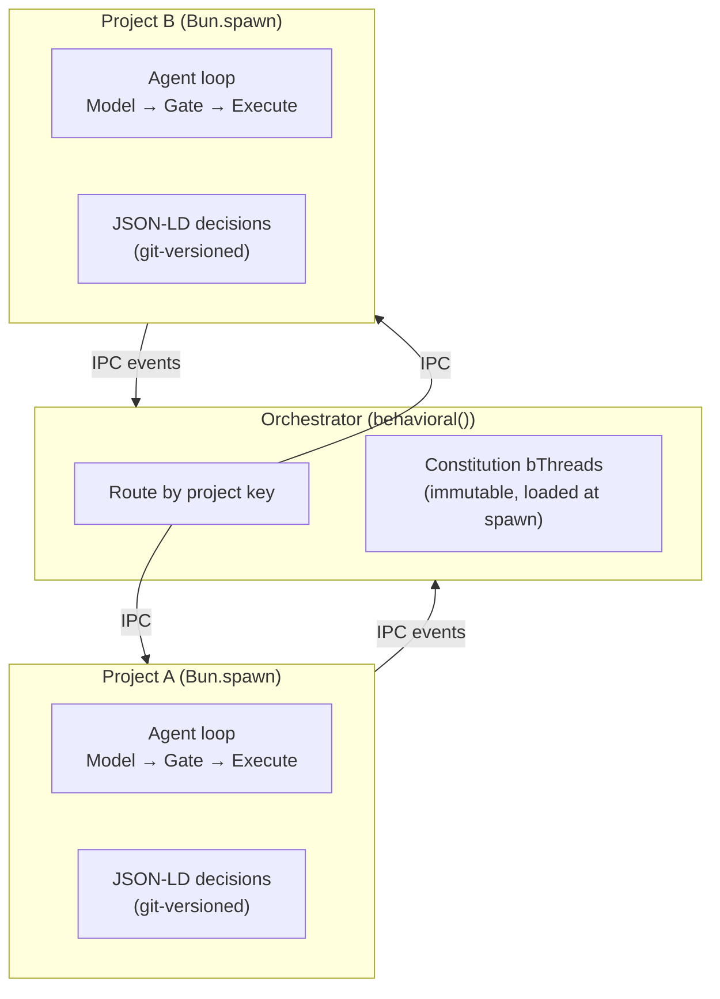

# Project Isolation

> **Status: ACTIVE** — Extracted from SYSTEM-DESIGN-V3.md. Cross-references: `SAFETY.md` (sandbox Layer 2), `CONSTITUTION.md` (constitution loading), `HYPERGRAPH-MEMORY.md` (event log partitioning via JSON-LD).

## Overview

A single agent may work across multiple projects — separate git repositories, different codebases, distinct security contexts. These need **hard process boundaries**, not logical partitioning.

## Project Registry

A project is a git repository. The project key is the absolute path to the git root:

```sql
CREATE TABLE projects (
  path        TEXT PRIMARY KEY,   -- absolute path to git root
  name        TEXT,               -- from package.json, Cargo.toml, go.mod, directory name
  description TEXT,               -- from README, package.json description, or user-provided
  last_active INTEGER,            -- epoch ms — for cleanup/ordering
  created_at  INTEGER NOT NULL    -- when the agent first saw this project
);
```

Projects are indexed on first encounter — when a task arrives with a `cwd` path, the orchestrator derives the git root and registers it if new. Metadata is extracted from what the repo already carries.

**Routing:** A task arrives with a path. The orchestrator resolves the git root, looks up the project, spawns (or reuses) a subprocess, and forwards the task via IPC.

## Tool Layers

Tools are assembled from three layers:

| Layer | Location | Scope | Discovery |
|---|---|---|---|
| **Framework built-ins** | Shipped with `plaited/agent` | All projects | Always available |
| **Global user config** | `~/.agents/skills/`, `~/.agents/mcp.json` | All projects | Loaded at subprocess spawn |
| **Project skills** | `skills/*` | This repo, all agents | Discovered from repo |

Project skills live in `skills/` at the project root — portable, publishable, versioned with the repo.

**Approval model** — mapped to the authority axis of the risk model:

| Tool source | Authority level | Approval |
|---|---|---|
| Framework built-ins | N/A | Always available |
| Global skills / MCP | User-configured | User installs explicitly |
| Project skills / MCP | Project-scoped | Discovered from repo |
| Project-local CLIs | Low (scoped to repo) | Auto-install if user opts in |
| OS PATH / global CLIs | High (affects all projects) | Always requires user approval |
| Global CLI upgrades | High | Requires approval + dependency scanning |

Global CLI approval is enforced by a looping bThread that blocks `install_global_tool` and `upgrade_global_tool` events until a `user_confirm` event arrives.

**Subprocess tool assembly at spawn:**

```
Framework built-ins (read_file, write_file, bash, save_plan, etc.)
  + ~/.agents/skills/*          → global skills
  + ~/.agents/mcp.json servers  → global MCP tools
  + skills/*                    → project skills
  + OS PATH binaries            → discovered, approval-gated
  + project-local binaries      → node_modules/.bin/, etc.
  → model sees available tools in context
```

## Architecture: Orchestrator + Project Subprocesses



## Bun IPC Trigger Bridge

Each project subprocess is a `Bun.spawn()` with `ipc: true`. BP events `{ type, detail }` are natively compatible with `structuredClone` serialization:

```typescript
// Orchestrator → Project subprocess
const project = Bun.spawn(['bun', 'run', projectEntry], {
  ipc(message) {
    const event = BPEventSchema.safeParse(message)
    if (event.success) trigger(event.data)
  }
})

// Send task to project
project.send({ type: 'task', detail: { prompt, context } })

// Project subprocess side
process.on('message', (message) => {
  const event = BPEventSchema.safeParse(message)
  if (event.success) trigger(event.data)
})

// Results back to orchestrator
useFeedback({
  tool_result({ detail }) {
    process.send!({ type: 'tool_result', detail })
  }
})
```

## Two Levels of `Bun.spawn()`

The architecture uses `Bun.spawn()` at two distinct levels — project isolation and sub-agent coordination. They serve different purposes but use the same IPC mechanism:

| Level | Purpose | Lifecycle | Spawned By |
|---|---|---|---|
| **Project subprocess** | Isolate codebases with different security contexts | Long-lived (reused across tasks) | Orchestrator |
| **Sub-agent process** | Isolate inference + tool execution per sub-task | Ephemeral (per-task, fresh context) | PM engine within a project subprocess |

A project subprocess contains the PM's `behavioral()` engine. The PM spawns sub-agents within that subprocess's context — sub-agents inherit the project's cwd, tool assembly, and constitution. The orchestrator doesn't manage sub-agents directly; it routes tasks to the right project, and the project's PM handles decomposition.

```
Orchestrator (behavioral())
  └─ Project A (Bun.spawn)     ← long-lived, per-project
       └─ PM Engine (behavioral())
            ├─ Sub-agent 1 (Bun.spawn)  ← ephemeral, per-task
            ├─ Sub-agent 2 (Bun.spawn)  ← ephemeral, per-task
            └─ Judge (Bun.spawn)        ← ephemeral, per-verification
  └─ Project B (Bun.spawn)
       └─ PM Engine (behavioral())
            └─ ...
```

## What Isolation Provides

| Concern | Solution |
|---|---|
| **Memory isolation** | Each subprocess has its own address space. Project A's memory cannot leak to Project B. |
| **Crash containment** | A failing subprocess doesn't take down the orchestrator or other projects. |
| **Security boundaries** | Each subprocess runs with its own sandbox profile. Different projects can have different capability restrictions. |
| **Network proxy** | Subprocesses have no outbound network. All network requests are IPC events to the orchestrator, which proxies after BP gate approval. |
| **Independent lifecycle** | Projects can be started, stopped, and restarted independently. |
| **Event log partitioning** | Each subprocess's `useSnapshot` callbacks produce JSON-LD files in project-scoped directories. |

## Constitution Loading

The constitution is loaded at subprocess spawn time and is **immutable for the lifetime of that process.** The orchestrator passes constitution bThreads as part of the spawn configuration. The subprocess cannot modify its own constitution — this is the MAC layer in action.

## Cross-Project Knowledge

Project subprocesses have hard process boundaries — Project A's memory cannot leak to Project B. Patterns learned in one project are valuable in another. The resolution: **the model is the cross-project knowledge channel.**

The training pipeline operates above the isolation boundary. It reads decision files from all projects (with user consent), extracts trajectories, and trains the model. Updated weights carry generalized patterns into every project.

No subprocess reads another's memory. Knowledge transfer happens through weights, not data sharing.

For *explicit* sharing:

| What | Mechanism |
|---|---|
| Shared tool configs | `~/.agents/mcp.json` (user installs globally) |
| Shared skills | `~/.agents/skills/` (user installs globally), `skills/` (project-level) |
| Style and patterns | Model weights (training flywheel) + code-pattern skills |
| Project-specific knowledge | Per-project JSON-LD files only (never crosses boundary) |
