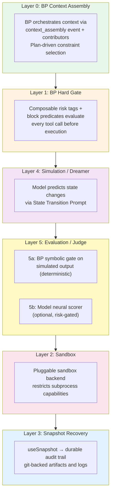

# Safety & Risk Model

> **Status: ACTIVE** — Extracted from SYSTEM-DESIGN-V3.md. Cross-references:
> `CONSTITUTION.md` (governance enforcement), `AGENT-LOOP.md` (pipeline
> stages), `INFRASTRUCTURE.md` (sandbox and durable state boundaries).

## Three-Axis Risk Model

Agent risk is not a single dimension. It is the product of three independent axes:

```
Risk = Capability × Autonomy × Authority
```

| Axis | Definition | Example |
|---|---|---|
| **Capability** | What tools the agent can invoke | File read/write, bash execution, network access, payment sending |
| **Autonomy** | How many actions before requiring human confirmation | Fully supervised (every action confirmed) → fully autonomous (runs unattended) |
| **Authority** | What resources the agent can access or modify | Read-only workspace → full workspace write → system config → external APIs |

Risk grows **geometrically** when all three axes scale simultaneously. The key insight: **cap each axis independently.** An agent can have:

- High capability + low autonomy → powerful tools, but human confirms each use
- High autonomy + low authority → runs unattended, but can only read files
- High authority + low capability → can access everything, but only has one tool

BP bThreads compose additively — adding a constraint on one axis doesn't affect the others.

## Defense in Depth (Six Layers)

No single safety mechanism is sufficient. The system is safe because **six independent layers** must all fail simultaneously for harm to occur:



### Layer 0 — BP Context Assembly (Soft Pre-Filter)

BP orchestrates context assembly via the `context_assembly` event. Active
constraints are selected based on area-of-effect scoping and injected into the
model's context. The model plans *around* constraints rather than into them.

**What it catches:** Most constraint violations, before they're even proposed. The model learns the constraint landscape through experience.

**Failure mode:** The model is neural. It may ignore or misinterpret constraints. This layer is probabilistic, not deterministic. That's why Layer 1 exists.

### Layer 1 — Hard Gate (Risk Tags + Domain Checks)

Every structured tool call is evaluated before execution:

1. **Composable risk tags** — each tool call carries a `Set<string>` of tags (`workspace`, `crosses_boundary`, `inbound`, `outbound`, `irreversible`, `external_audience`). Tags are declared at tool/wrapper definition time, not classified at runtime. Gate bThread predicates inspect tag sets to determine routing.
2. **Default-deny** — unknown/untagged tool calls route to Simulate + Judge. Only explicitly tagged `workspace`-only operations skip the pipeline.
3. **Domain-specific checks** — custom `block` predicates enforce semantic rules. These encode intent constraints a sandbox cannot express. Constitution bThreads compose additively — each rule is an independent blocking thread.

Containment (filesystem, network, process isolation) is delegated to Layer 2 (Sandbox). The gate does not validate paths or commands — the sandbox enforces those at the OS level.

**Failure mode:** Wrapper modules may declare incorrect tags. Untagged calls default to full pipeline (conservative). Custom checks may have gaps. That's why Layer 4 exists.

### Layer 4 — Simulation / Dreamer (Predicted Consequences)

For side-effect actions that pass the Gate, the model predicts the outcome via the State Transition Prompt. This catches commands that look safe syntactically but have dangerous consequences. `bash -c "rm -rf $(pwd)"` passes a naive path check, but the Dreamer predicts "all files deleted" — which Layer 5a blocks on keyword match.

**Failure mode:** Wrong predictions (hallucination). False negatives pass to the sandbox (Layer 2). False positives waste a loop iteration but cause no harm.

### Layer 5 — Evaluation / Judge (Simulated Output Assessment)

**5a — Symbolic Gate:** BP `block` predicates evaluate the Dreamer's text output via regex/keyword matching. Deterministic — if the simulated output contains blocked patterns, the action is rejected immediately.

**5b — Neural Scorer:** For high-ambiguity actions where symbolic patterns are insufficient, the model scores the simulated state on progress toward the goal. This is the only soft layer in evaluation.

**Failure mode:** 5a misses patterns not in its predicate set. 5b is neural and probabilistic. Both are mitigated by Layer 2.

### Layer 2 — Sandbox (Capability Restriction)

Tool execution runs in a sandboxed subprocess. The framework defines the **security contract** — what the sandbox must enforce — not the mechanism:

| Requirement | What it means |
|---|---|
| **File restriction** | Subprocess can only read/write within the project workspace |
| **Network isolation** | Subprocess cannot make outbound HTTP — only the main process can |
| **No privilege escalation** | Subprocess cannot gain capabilities beyond what it was spawned with |
| **Process isolation** | Subprocess cannot inspect or signal other processes |

**Bash sandboxing via Bun Shell:** The bash tool uses `Bun.$` (not `/bin/sh`) for command execution. Bun Shell provides: `$.cwd(workspace)` to lock the working directory, `$.env()` for environment variable allowlisting, auto-escaping of template literal interpolations to prevent injection, and `$.nothrow()` for error management. This is an application-level defense — it complements but does not replace OS-level sandboxing below.

The OS-level enforcement mechanism is pluggable and deployment-specific:

| Environment | Per-Tool Isolation | Session Isolation | Key Mechanism |
|---|---|---|---|
| **macOS local** | `sandbox-exec` via srt (Seatbelt) | Host OS | Deny-default profile, selective allow |
| **Linux local** | `bubblewrap` + `seccomp` via srt | Host OS | Mount/PID/network namespaces, BPF syscall filter |
| **Modal** | Landlock LSM via `landrun` | Modal Sandbox (gVisor) | VFS-layer filesystem + TCP restriction |
| **Firecracker** | `bubblewrap` + `seccomp` via srt | Firecracker microVM | Full namespace isolation inside VM |

**Git-versioned workspace** provides a universal rollback layer — not a security boundary, but a recoverability mechanism. The entire node workspace is git-tracked (`.gitignore` excludes `modules/`), so destructive workspace operations can be reverted.

### Layer 3 — Snapshot Recovery (Audit & Replay)

The snapshot and git-backed audit trail records BP decisions and retained artifacts. If all five prior layers fail:

- **Complete audit trail** — every event selection, every blocked candidate, every gate rejection
- **Replay capability** — rebuild state from JSON-LD decision files
- **Per-project isolation** — damage in one project doesn't affect another's partition

The audit trail is append-only and lives outside the sandbox — the subprocess cannot modify its own decision files.

## Independence Guarantee

Each layer operates on a different level of the stack and uses a different mechanism:

| Layer | Stack Level | Mechanism | Bypassed By |
|---|---|---|---|
| 0 | Application | BP-orchestrated context assembly | Model ignoring instructions |
| 1 | Application | Composable risk tags + domain checks | Incorrect tag declaration; untagged defaults to full pipeline |
| 4 | Application | Model predicts consequences | Inaccurate prediction (hallucination) |
| 5a | Application | Deterministic BP block predicates on simulated output | Patterns not in predicate set |
| 5b | Application | Model scores simulated state | Inaccurate scoring (neural) |
| 2 | Operating system | Pluggable sandbox | Backend-specific escape |
| 3 | Data layer | Snapshots, retained artifacts, and git | Log corruption or data loss |

No single attack vector compromises more than one layer.

## Environmental Hardening + Behavioral Alignment

The six layers form a coupled system:

**Environmental hardening** (Layers 1, 4–5, 2) creates hard boundaries. Risk tags determine which defenses engage — unknown/untagged actions face the full pipeline. The model encounters these as blocked actions and rejected simulations. Over time, through the feedback loop, the model internalizes the constraint landscape.

**Behavioral alignment** (Layer 0) is the result. The model's behavior aligns with constraints not through instruction-following (fragile) but through accumulated experience (robust). The hard gates fire less over time — not because constraints relaxed, but because the model learned to navigate them.

This is the neuro-symbolic coupling: the symbolic layer (BP) creates terrain; the neural layer learns to read it. The symbolic layer grows monotonically (ratchet principle). The neural layer adapts continuously.

## Human in the Loop

The three-axis model supports **variable autonomy**:

- **High-stakes actions** (payment, external API, destructive ops): Always require owner confirmation via ACP channel adapter. BP bThreads enforce this — blocked until `confirm` event arrives.
- **Routine actions** (file reads, builds, test runs): Execute autonomously within sandbox constraints.
- **bThread approval**: When the training flywheel proposes a new bThread, the owner must explicitly approve it. The symbolic layer never grows without human consent.

The autonomy axis is a spectrum the owner tunes through installed constraints.
