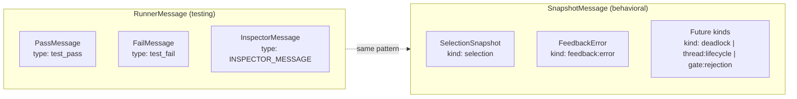

# SnapshotMessage Discriminated Union

## Motivation

The `useSnapshot` channel is the BP engine's **observability boundary** — the single point where internal decisions become externally observable. Per SYSTEM-DESIGN-V3, `useSnapshot` feeds the event log (the source of truth), fires before side-effects, and supports async listeners that don't block the super-step.

Currently, `SnapshotMessage` is a homogeneous array of bid objects. This captures only one kind of observation: **event selection**. But the BP engine produces other observable moments — notably, errors thrown by `useFeedback` handlers during side-effect execution. Today these are silently swallowed:

```typescript
try {
  void handlers[type]!(detail)
} catch (_) {
  // What should we do here?
}
```

Rather than introducing a new channel (console, separate publisher, phantom BP events), we evolve `SnapshotMessage` into a **discriminated union** — the same pattern used by `RunnerMessage` in the test runner. This gives `useSnapshot` a typed, extensible vocabulary for all BP engine observations.

## Design

### Discriminator: `kind`

We use `kind` (not `type`) as the discriminator because bid objects already have a `type` field representing the event type string. Collision-free narrowing:

```typescript
useSnapshot((msg) => {
  switch (msg.kind) {
    case 'selection': /* msg.bids */ break
    case 'feedback:error': /* msg.handler, msg.error */ break
  }
})
```

### Message Types

#### `SelectionSnapshot` (replaces current `SnapshotMessage`)

A snapshot of all bids considered during one event selection step. This is the existing data, wrapped in a discriminated envelope.

```typescript
type SelectionSnapshot = {
  kind: 'selection'
  bids: {
    thread: string
    trigger: boolean
    selected: boolean
    type: string
    detail?: unknown
    priority: number
    blockedBy?: string
    interrupts?: string
  }[]
}
```

#### `FeedbackError` (new)

A `useFeedback` handler threw during side-effect execution. Published *after* the action publisher fires, so the selection snapshot for this super-step has already been emitted. The error surfaces through the same channel without polluting the BP event space.

```typescript
type FeedbackError = {
  kind: 'feedback:error'
  handler: string
  event: { type: string; detail?: unknown }
  error: string
}
```

#### Union

```typescript
type SnapshotMessage = SelectionSnapshot | FeedbackError
```

### Changes Required

#### `behavioral.types.ts`

- Export `SelectionSnapshot` and `FeedbackError` as named types
- Redefine `SnapshotMessage` as their union
- Update `SnapshotFormatter` return type to `SelectionSnapshot`
- `SnapshotListener` and `UseSnapshot` remain unchanged (they reference `SnapshotMessage`)

#### `behavioral.ts`

**`snapshotFormatter`** — wrap the sorted bid array:

```typescript
return { kind: 'selection', bids: ruleSets.sort((a, b) => a.priority - b.priority) }
```

**`useFeedback` catch block** — publish error through snapshot channel:

```typescript
} catch (error) {
  snapshotPublisher?.({
    kind: 'feedback:error',
    handler: type,
    event: { type, detail },
    error: error instanceof Error ? error.message : String(error),
  })
}
```

**`snapshotPublisher` type** — already accepts `SnapshotMessage`, no change needed.

#### `inspector.ts`

Narrow before `console.table`:

```typescript
const callback = (message: SnapshotMessage) => {
  if (message.kind !== 'selection') return
  queueMicrotask(() => {
    console.group()
    console.info(element)
    console.table(message.bids)
    console.groupEnd()
  })
  inspectorCallback?.({
    type: INSPECTOR_MESSAGE,
    detail: { element, message },
  })
}
```

#### `b-element.types.ts`

`InspectorMessageDetail.message` stays typed as `SnapshotMessage`. The inspector only sends selection snapshots, but the type remains the union — consumers can narrow if needed.

#### Test files

- `water.spec.ts`, `interruptes.spec.ts` — snapshot baselines regenerate with new `kind: 'selection'` wrapper
- Add test for `feedback:error` message shape in `useFeedback` error path

## Why Not the Alternatives

| Approach | Problem |
|---|---|
| **`trigger({ type: 'feedback:error' })`** | Re-enters BP event space. Risk of infinite loops. Error becomes a BP *decision* that other threads coordinate around — but the error isn't a coordination event, it's an observation. Also requires `queueMicrotask` to avoid re-entering the synchronous super-step. |
| **`console.warn`** | Not programmatically observable. Lost in CI. No event log capture. No typed data for downstream consumers. |
| **Separate error publisher** | New API surface, new subscription lifecycle, new cleanup. Fragments observability across channels instead of unifying it. |
| **`onError` callback on `useFeedback`** | Opt-in means silent-by-default. Doesn't integrate with event log. Each feedback registration needs its own error handler. |

## Architectural Alignment

From SYSTEM-DESIGN-V3:

> *"The event log is the source of truth. Everything else is a materialized view derived from the log."*

The `useSnapshot` → event log pipeline already exists in the V3 design. By making `SnapshotMessage` a discriminated union, `feedback:error` messages flow into the event log through the same pipeline — no new infrastructure. The event log `appendToLog` handler simply persists whatever `useSnapshot` emits, distinguished by `kind`.

> *"The full decision history is preserved — every selected event, every blocked candidate, every gate rejection."*

Feedback errors are part of the full execution history. An error in a side-effect handler is as important as a blocked candidate — both represent moments where the system's behavior diverged from the nominal path.

## Future Extensions

The discriminated union is designed to grow. Each new `kind` is a new observation the BP engine can surface without changing the channel, the listener API, or the event log pipeline.

### `kind: 'deadlock'`

When `selectNextEvent` finds no candidates and no running threads remain. Currently this is a silent halt — the BP program just stops. A deadlock snapshot captures the pending threads and their blocked requests, making the halt diagnosable.

```typescript
type DeadlockSnapshot = {
  kind: 'deadlock'
  pending: {
    thread: string
    waitFor: string[]
    blockedBy?: string
  }[]
}
```

### `kind: 'thread:lifecycle'`

Thread addition (`bThreads.set`) and interruption are state changes that happen outside event selection. Surfacing them through `useSnapshot` gives the event log a complete picture of thread population over time.

```typescript
type ThreadLifecycle = {
  kind: 'thread:lifecycle'
  event: 'added' | 'interrupted' | 'completed'
  thread: string
  trigger?: string
}
```

### `kind: 'gate:rejection'`

From the V3 safety model — when a BP hard gate blocks an action. The audit trail should capture what was rejected and why.

```typescript
type GateRejection = {
  kind: 'gate:rejection'
  action: { type: string; detail?: unknown }
  gate: string
  reason: string
}
```

### Full future union

```typescript
type SnapshotMessage =
  | SelectionSnapshot
  | FeedbackError
  | DeadlockSnapshot
  | ThreadLifecycle
  | GateRejection
```

Each extension is additive — existing consumers that only match `case 'selection'` continue to work unchanged. New consumers opt into the messages they care about.

## Relationship to RunnerMessage Pattern

The `RunnerMessage` discriminated union in `testing.schemas.ts` established this pattern in the codebase:



Both use a string literal discriminator to create a type-safe union where consumers narrow by field value. `RunnerMessage` uses `type` as the discriminator (no collision in its domain). `SnapshotMessage` uses `kind` (avoids collision with BP event `type`).
