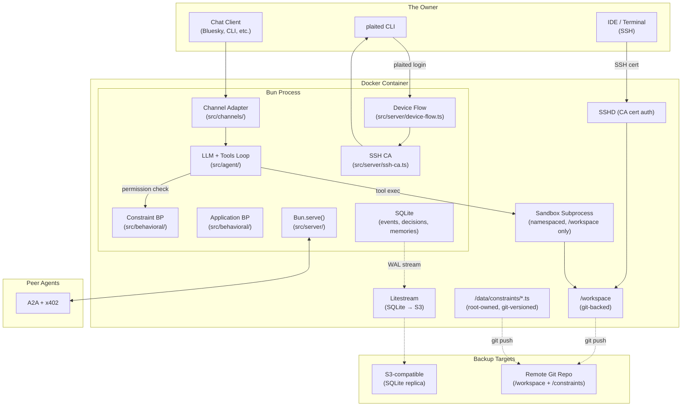
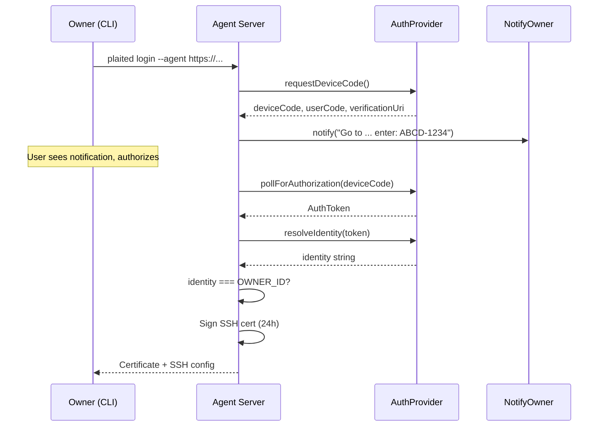
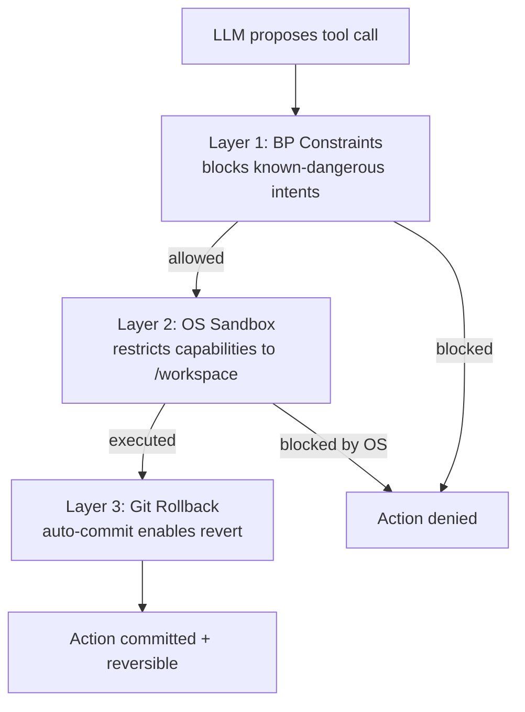
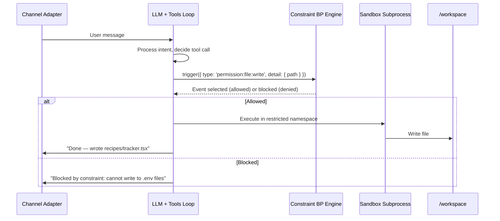
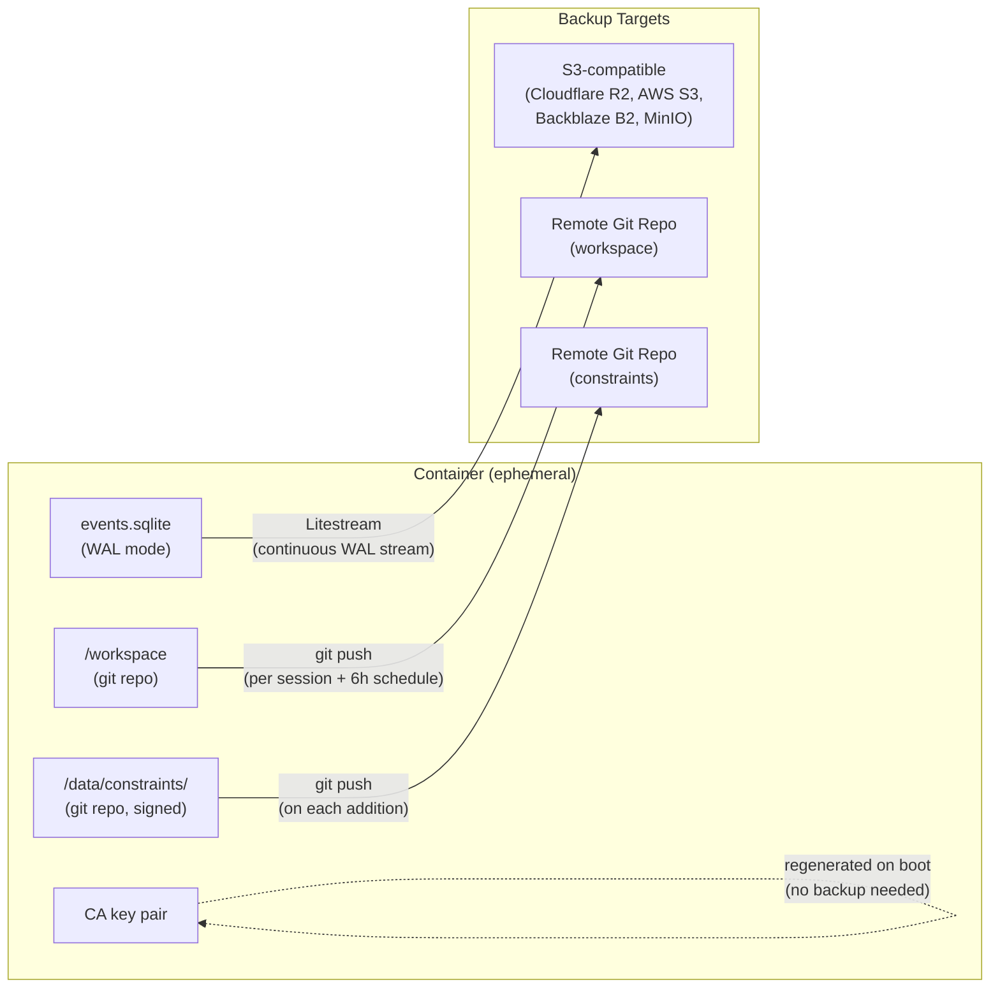
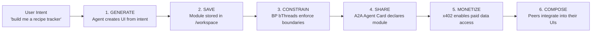
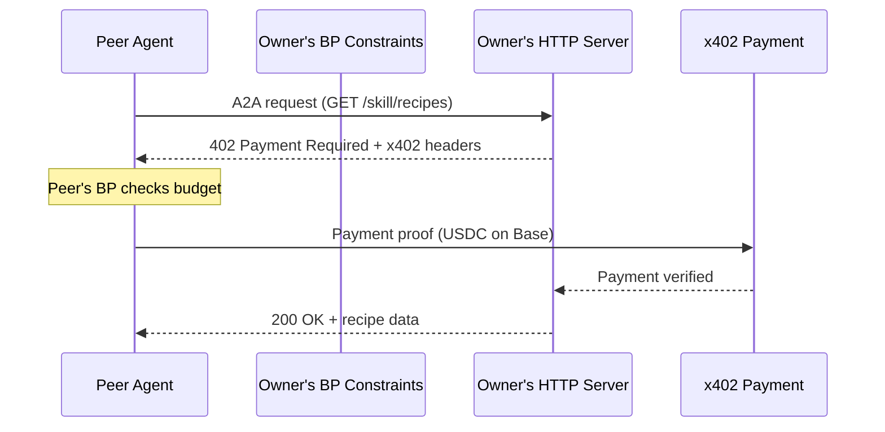

# Plaited Personal Agent — System Design V2

## Executive Summary

**Architecture Foundation:** A single-tenant, self-hosted personal AI agent that generates modnet UIs, running as one process in one container.

**Core Philosophy:** "One User, One Brain, One Process." Deployed by an individual for their exclusive use. Identity is pluggable — AT Protocol (Bluesky) is the first adapter, but the agent core is provider-agnostic. Each agent is a **modnet node** — a user-owned unit in a modular network where modules compose peer-to-peer.

### Key Design Principles

- **Single Tenancy:** 1 User : 1 Agent instance.
- **Pluggable Identity:** Authentication relies on an `AuthProvider` interface. AT Proto (DID) is the first implementation; others (GitHub OAuth, passkeys) slot in without changing agent core.
- **Channel-Agnostic:** The owner communicates through a `Channel` adapter. Bluesky chat is the first adapter; CLI, Matrix, Discord, or custom protocols can be added independently.
- **Modnet Node:** Each agent is a node in a modular network. Modules are user-owned, peer-to-peer via A2A, monetized via x402.
- **Persistent State:** State is local and persistent. User data lives on their agent — nowhere else.
- **BP-Constrained:** Two behavioral programming engines — Constraint-level (permission gating) and Application-level (module behavior) — enforce safety via bThread code. Both run in-process.
- **Defense in Depth:** Three independent safety layers — BP intent blocking, OS sandbox capability restriction, git rollback recovery.

### What Changed from V1

| V1 (Three-Process) | V2 (Single-Process) |
|---|---|
| Rivet Actor (singleton orchestrator) | Removed — Bun process is the orchestrator |
| sandbox-agent daemon (Rust HTTP/SSE) | Removed — LLM tools loop runs directly |
| Universal Event Schema (11 event types) | Removed — no inter-process events |
| Web Control Center (browser UI) | Replaced by **channel adapters** (Bluesky chat first) |
| Reverse proxy (Actor → Bun Server) | Removed — Bun.serve() is the HTTP server |
| Sync Daemon (fs.watch → Actor) | Removed — no secondary process to sync |
| Two-container docker-compose | **Single container** |
| Hardcoded AT Proto identity | **Pluggable AuthProvider + Channel interfaces** |

### Infrastructure Components

| Component | Stack | Function |
|---|---|---|
| **Identity** | `AuthProvider` interface | Pluggable identity verification. First adapter: AT Protocol OAuth (`did:plc:...`). |
| **Runtime** | Single Bun Process | LLM + tools loop, BP engines, channel client, HTTP server, SSH CA — all in-process. |
| **Chat Interface** | `Channel` interface | Pluggable owner communication. First adapter: Bluesky `chat.bsky.*` API. |
| **SSH Access** | SSHD + Certificate Authority | CA-authenticated SSH for direct workspace access. |
| **Modnet** | A2A Protocol | Peer-to-peer module communication between agents. |
| **Payments** | x402 (HTTP 402) | Micropayments for module data access between nodes. |
| **Sandbox** | Linux Namespaces + seccomp | Tool execution subprocess restricted to `/workspace`. Defense-in-depth alongside BP gating. |
| **Compute** | Docker Container (single) | Bun process + SSHD + Litestream. `tini` init for proper signal handling. |
| **State** | SQLite + Code Files | Event stream, constraint bThreads (`/data/constraints/`), module code (`/workspace`). |
| **Backup** | Litestream + Git + S3 | Continuous SQLite replication to S3. Git-backed workspace and constraints pushed to remote. |

## System Architecture



## Repository Structure

Plaited is becoming a background agent framework for generating modnet UIs. The `src/` directory reflects this:

```
src/
├── behavioral/              # Core BP algorithm (renamed from main/)
│   ├── behavioral.ts        # behavioral() factory — bThreads, trigger, useFeedback, useSnapshot
│   ├── behavioral.types.ts  # BPEvent, Trigger, Idioms, RulesFunction, BThread, BSync
│   ├── behavioral.utils.ts  # bThread, bSync, useRandomEvent, shuffleSyncs, isBPEvent
│   ├── use-behavioral.ts    # useBehavioral factory pattern (publicEvents + bProgram)
│   ├── use-public-trigger.ts # Whitelist-based event filtering
│   ├── use-signal.ts        # Signal/reactive primitives
│   └── tests/               # BP unit tests (tic-tac-toe, etc.)
│
├── ui/                      # UI template library (unchanged)
│   ├── b-element.ts         # Custom elements with Shadow DOM
│   ├── create-styles.ts     # CSS-in-JS system
│   └── ...
│
├── agent/                   # Core agent loop (reshaped)
│   ├── agent.ts             # Main loop: receive intent → LLM → tools → respond
│   ├── constraint-engine.ts # Constraint BP instance, permission check pattern
│   ├── sandbox.ts           # Bun.spawn() subprocess with namespace restrictions
│   ├── persistence.ts       # SQLite WAL (events, sessions, bp_decisions, memories)
│   ├── tools/               # File ops, bash exec, search — each gated by constraint BP
│   └── discovery/           # Tool/skill/rules discovery (existing code moves here)
│
├── channels/                # Client adapters (Nanobot/NanoClaw pattern)
│   ├── channels.types.ts    # Channel, IncomingMessage, OutgoingMessage interfaces
│   ├── bluesky/             # First adapter: Bluesky chat.bsky.* polling
│   │   └── bluesky.ts
│   └── cli/                 # SSH CLI adapter
│       └── cli.ts
│
├── server/                  # HTTP + auth + device flow
│   ├── server.ts            # Bun.serve() — A2A, x402, cert API
│   ├── server.types.ts      # AuthProvider, NotifyOwner, DeviceFlowConfig, AuthToken
│   ├── device-flow.ts       # Generic RFC 8628 device flow orchestration
│   ├── auth/                # Pluggable auth providers
│   │   ├── atproto.ts       # AT Protocol OAuth (first adapter)
│   │   └── github.ts        # GitHub OAuth (fallback/recovery)
│   ├── ssh-ca.ts            # SSH Certificate Authority
│   ├── a2a.ts               # A2A Agent Card endpoints
│   └── x402.ts              # x402 payment verification
│
├── testing/                 # Test utilities (unchanged)
├── workshop/                # Story runner CLI (unchanged)
└── utils/                   # Shared utilities (unchanged)

skills/                      # Shipped skills (symlinked to .claude/skills/)
├── behavioral-core/         # BP patterns, neuro-symbolic reasoning
├── ui-patterns/             # Templates, bElements, styling
├── standards/               # Code conventions
├── loom/                    # AI-assisted design → generative UI
├── web-patterns/            # Default Web API patterns
└── adapter-guide/           # Channel + auth adapter creation guide
    ├── SKILL.md
    └── references/
        ├── channel-adapter.md
        ├── auth-provider.md
        └── testing-adapters.md
```

### Why This Structure

- **`src/behavioral/`** (renamed from `src/main/`): The BP algorithm is the core of Plaited — it predates and outlives the agent use case. Renaming clarifies purpose.
- **`src/channels/`**: Follows the Nanobot/NanoClaw adapter pattern. The agent core is channel-agnostic; adapters implement `Channel`. Adding a new chat provider means adding a directory here — no changes to agent core.
- **`src/server/`**: HTTP, auth, and device flow are server concerns. The key design: `AuthProvider` and `NotifyOwner` are pluggable interfaces. AT Proto is the first implementation; others slot in without touching `device-flow.ts`.
- **`src/agent/`**: Reshaped from scattered files into the core loop. Tools move here; discovery moves here. The constraint engine is a dedicated BP instance.
- **`skills/`**: Root directory for skills shipped with Plaited. Symlinked to `.claude/skills/` so they're available to agents working in Plaited repos.

## Pluggable Interfaces

### Channel Adapter

The `Channel` interface decouples the agent core from any specific chat provider:

```typescript
// src/channels/channels.types.ts

type IncomingMessage = {
  id: string
  senderId: string
  text: string
  timestamp: Date
}

type OutgoingMessage = {
  text: string
  replyTo?: string
}

type Channel = {
  /** Yields incoming messages as an async stream */
  poll: () => AsyncGenerator<IncomingMessage>
  /** Sends a response message */
  send: (msg: OutgoingMessage) => Promise<void>
  /** Returns the identity of this channel endpoint */
  identity: () => { id: string }
}
```

The agent core consumes `Channel` — it doesn't know or care whether messages arrive via Bluesky DMs, CLI stdin, or a Matrix room. The Bluesky adapter implements `poll()` with `chat.bsky.convo.getMessages` and adaptive intervals (2s active → 30s idle). A CLI adapter implements `poll()` with readline.

### AuthProvider + NotifyOwner (Device Flow)

The device flow (RFC 8628) is decoupled from any specific identity provider through two pluggable interfaces:

```typescript
// src/server/server.types.ts

type AuthToken = {
  accessToken: string
  tokenType: string
  scope?: string
}

type AuthProvider = {
  /** Request a device code from the identity provider */
  requestDeviceCode: () => Promise<{
    deviceCode: string
    userCode: string
    verificationUri: string
    expiresIn: number
    interval: number
  }>
  /** Poll for authorization completion */
  pollForAuthorization: (deviceCode: string) => Promise<AuthToken>
  /** Resolve the authenticated identity from the token */
  resolveIdentity: (token: AuthToken) => Promise<string>
}

type NotifyOwner = (message: string) => Promise<void>

type DeviceFlowConfig = {
  auth: AuthProvider
  notify: NotifyOwner
  ownerId: string  // Generic — could be a DID, GitHub user ID, email, etc.
}
```

- **`AuthProvider`**: Who verifies identity. AT Proto OAuth is the first implementation (`src/server/auth/atproto.ts`). GitHub OAuth is a fallback (`src/server/auth/github.ts`). Any OAuth/OIDC provider can be added.
- **`NotifyOwner`**: Who delivers the user code. Could be a Bluesky DM, an SMS, a push notification, or a terminal prompt. The device flow orchestrator (`src/server/device-flow.ts`) doesn't know — it calls `notify()`.
- **`ownerId`**: A generic string. For AT Proto it's a DID (`did:plc:...`), for GitHub it's a user ID, for passkeys it might be a credential ID. The agent checks `resolvedIdentity === ownerId`.

### Device Flow Orchestration

```typescript
// src/server/device-flow.ts (simplified)

const executeDeviceFlow = async ({ auth, notify, ownerId }: DeviceFlowConfig) => {
  // 1. Request device code from pluggable auth provider
  const { deviceCode, userCode, verificationUri } = await auth.requestDeviceCode()

  // 2. Notify owner through pluggable channel
  await notify(`Go to ${verificationUri} — enter: ${userCode}`)

  // 3. Poll for authorization
  const token = await auth.pollForAuthorization(deviceCode)

  // 4. Resolve identity
  const identity = await auth.resolveIdentity(token)

  // 5. Verify against owner
  if (identity !== ownerId) throw new Error('Identity mismatch')

  return token
}
```

This is provider-agnostic. The same `executeDeviceFlow` works whether the auth provider is AT Proto, GitHub, Google, or a custom OIDC server.

## Authentication

### Owner Identity

The agent is configured with a single owner identity:

```bash
# The owner's identity (provider-dependent format)
ENV OWNER_ID="did:plc:z72i7hdynkq6kh7..."   # AT Proto DID
# or: ENV OWNER_ID="12345678"                # GitHub user ID
# or: ENV OWNER_ID="alice@example.com"       # Email-based

# The auth provider to use
ENV AUTH_PROVIDER="atproto"                   # or "github", etc.
```

Every incoming message (from any channel) is verified: `message.senderId` must resolve to `OWNER_ID` through the configured `AuthProvider`.

### The Login Flow (SSH)

1. **Initiation:** User runs `plaited login --agent https://my-agent.railway.app`.
2. **Device Flow:** Agent executes the pluggable device flow — `auth.requestDeviceCode()` → `notify(userCode)` → `auth.pollForAuthorization()` → `auth.resolveIdentity()`.
3. **Verification:** `resolvedIdentity === OWNER_ID` — if not, 403 Forbidden.
4. **Certificate:** Agent signs the user's public SSH key → short-lived certificate (24h).
5. **Config:** CLI writes cert + key to `~/.ssh/plaited-*`, updates `~/.ssh/config`.



**Generated `~/.ssh/config`:**

```
Host sandbox
    HostName my-agent.railway.app
    Port 2222
    User dev
    IdentityFile ~/.ssh/plaited-key
    CertificateFile ~/.ssh/plaited-key-cert.pub
```

**After login, any IDE works immediately:** `ssh sandbox`, VS Code Remote-SSH, Cursor, Zed.

### Certificate Properties

- **Validity:** 24 hours (no revocation infrastructure needed — certs simply expire)
- **Principals:** `[OWNER_ID, "dev"]` — embedded in the certificate
- **Key ID:** `OWNER_ID` — logged by `sshd` for audit trail
- **Extensions:** `permit-pty`, `permit-port-forwarding` enabled
- **Renewal:** `plaited login` again. Same flow — new cert signed.

### Why SSH CA over `authorized_keys`

- No file injection/cleanup inside the container
- Certificates expire automatically — no dangling keys
- `sshd` logs the certificate's `key_id` for audit
- Adding the CA key to `sshd_config` is a one-time setup; no per-login changes

### Recovery: Device Flow over Channel

If the primary auth provider is unavailable (PDS down, lost credentials), the owner needs a fallback path to regain SSH access.

**Setup (one-time):** During initial agent provisioning, the owner links a secondary identity by authorizing through a second `AuthProvider`. The agent stores the secondary identity alongside the primary `OWNER_ID`.

**Recovery flow:**

1. Owner sends message via any connected channel: `"plaited recover"`
2. Agent executes device flow with the **fallback** `AuthProvider` (e.g., GitHub OAuth)
3. Channel delivers the user code via `notify()`
4. Owner authorizes at the provider's verification URL
5. Agent verifies: `resolvedIdentity === storedSecondaryId`
6. Agent signs a new 24h SSH cert
7. Channel delivers: `"Recovery cert ready. Run: plaited recover-cert --agent ..."`

**Why this works:**
- Uses the channel as the device flow display — the agent is the "device," the channel is the "screen"
- Secondary identity is independent of the primary provider
- Device flow requires no redirect URI — works even without browser access to the agent's domain
- Rate-limited: agent accepts only one recovery attempt per hour per identity

## Component Deep Dive

### 1. The Bun Process (Single Runtime)

A single Bun process replaces the three-process architecture. Everything runs in one event loop.

**Responsibilities:**

- **LLM + Tools Loop** (`src/agent/`): Intent processing, code generation, grading, module lifecycle. Calls tools with synchronous BP permission checks.
- **Constraint BP Engine** (`src/agent/constraint-engine.ts`): In-process `behavioral()` instance loaded with bThreads from `/data/constraints/*.ts`. Evaluates permissions before tool execution.
- **Application BP Engine**: Separate in-process `behavioral()` instance(s) for module runtime behavior. Loaded from `/workspace`.
- **Channel Client** (`src/channels/`): Pluggable adapter polls for messages, verifies sender identity, processes intent, responds.
- **HTTP Server** (`src/server/`): `Bun.serve()` handles A2A endpoints, x402-gated data, SSH certificate signing, device flow.
- **SSH Certificate Authority** (`src/server/ssh-ca.ts`): Signs 24h ed25519 certs after identity verification.
- **SQLite** (`src/agent/persistence.ts`): WAL-mode database for events, sessions, BP decisions, memories.

**Why single process:**

- No inter-process communication overhead (HTTP/SSE, Universal Events)
- No event schema translation layer
- BP evaluation is a synchronous function call, not a network round-trip
- No state synchronization between processes
- Simpler deployment, simpler debugging, simpler recovery

### 2. Sandbox Subprocess (Tool Execution)

The BP constraint engine gates the **intent** to perform an action. The sandbox subprocess restricts the **capability** to perform it. These are independent layers — if one fails, the other catches it.

**How it works:**

All LLM-directed tool calls (file writes, bash commands) execute in a restricted subprocess via `Bun.spawn()`, not in the main Bun process. The main process handles BP evaluation, chat, HTTP, and SQLite — the subprocess handles only the dangerous work.

**Sandbox restrictions:**

| Layer | Mechanism | What It Restricts |
|---|---|---|
| **User namespace** | `unshare --user --map-root-user` | Subprocess runs as mapped UID with access only to `/workspace` |
| **Mount namespace** | Bind-mount `/workspace` as the subprocess root | Cannot see `/data`, `/etc/ssh`, CA keys, or SQLite database |
| **seccomp profile** | BPF filter on syscalls | Blocks `mount`, `ptrace`, `reboot`, `clone` (namespace creation), raw socket creation |
| **Network** | No network namespace escape | Subprocess cannot make outbound HTTP calls; only the main process can |

**Why not just BP:**

The BP constraint engine runs in userspace — it's a `behavioral()` instance in the same JavaScript runtime. If the LLM crafts a tool call that embeds a shell escape (e.g., `bash -c "cat /data/ca_key"`), the BP check might pass (it checks the stated command, not what the command does internally). The OS-level sandbox ensures that even if the BP check is fooled, the subprocess literally cannot access `/data` or `/etc/ssh`.

**Three-layer defense model:**



### 3. Git-Backed Workspace

`/workspace` is a git repository. Every file write the agent makes is auto-committed, providing rollback safety, audit trail, and off-container backup.

**Auto-commit behavior:**

- The tool executor commits after each successful conversation turn (not per-file — one squashed commit per turn).
- Commit messages include: the user's original intent, a summary of files changed, and the LLM's reasoning.
- The agent uses conventional commits: `feat:`, `fix:`, `refactor:`, etc.
- The owner can use branches when SSHing in; the agent works on `main`.

**Off-container backup:**

- On a configurable schedule (default: after each session ends + every 6 hours), the agent runs `git push` to a private remote repo.
- A BP bThread enforces: never force-push, never push without auto-commit first.
- If the container's workspace volume is lost, `git clone` from the remote recovers all module code.

**Rollback via chat:**

The owner can send via any channel: "Undo the last change" → agent runs `git revert HEAD` → responds with the diff summary.

**What git covers and what it doesn't:**

| Backed up by git | NOT backed up by git |
|---|---|
| `/workspace/**` (module code, templates, bThreads, stories) | `/data/events.sqlite` (use Litestream) |
| `/data/constraints/*.ts` (separate git repo, see below) | CA key pair (regenerated on first boot) |
| | Auth credentials (env vars) |

### 4. Channel Client

The channel client replaces the Web Control Center as the primary conversational interface. The owner communicates through any connected `Channel` adapter.

**Bluesky adapter (first implementation):**

1. Agent authenticates with AT Proto `chat.bsky.*` API on startup.
2. Polls `chat.bsky.convo.getMessages` with adaptive intervals:
   - **Active:** 2s polling when the owner is actively chatting (recent message within 2 minutes).
   - **Idle:** 30s polling when no recent activity.
3. Incoming messages are verified: sender identity must resolve to `OWNER_ID`.
4. Verified messages enter the LLM + tools loop for processing.
5. Responses are sent back via `chat.bsky.convo.sendMessage`.

**CLI adapter:**

- Reads from stdin via readline, writes to stdout.
- Used when the owner SSHs into the container and invokes the agent directly.
- Identity verified by the SSH certificate (which was issued after auth verification).

**Adding a new adapter:**

Implement the `Channel` interface (see `src/channels/channels.types.ts`) and register it with the agent core. See the `adapter-guide` skill (`skills/adapter-guide/`) for the full guide.

### 5. LLM + Tools Loop

The LLM + tools loop is the agent's core intelligence. It receives intent (from any channel or SSH CLI), processes it through an LLM, and executes tool calls with BP permission gating.

**Tool execution flow:**



**Responsibilities:**

- **UI Generation:** Translates user intent into Plaited templates, bElements, styles, and bThread modules.
- **bThread Generation:** Writes behavioral program code — generator functions with closures and predicates.
- **File Operations:** Reads, writes, and edits files in `/workspace`. Each write gated by Constraint BP.
- **Bash Execution:** Runs shell commands (builds, linters, test runners). Each command gated by Constraint BP.
- **Grading:** Multi-tier verification — tsc, biome, `bun plaited test` (headless), accessibility audits.
- **Module Lifecycle:** Generate → Save → Constrain → Share (via A2A Agent Cards).

### 6. SSH Security: Certificate Authority

Instead of managing `authorized_keys`, the Bun process acts as an SSH Certificate Authority. The `plaited login` CLI bridges the pluggable identity system into SSH credentials.

**Setup (one-time):**

The Bun process generates a CA key pair on first boot. The CA public key is written to the container's `sshd_config`:

```
# /etc/ssh/sshd_config (inside container)
TrustedUserCAKeys /etc/ssh/ca.pub
AuthorizedPrincipalsFile /etc/ssh/auth_principals/%u
```

### 7. HTTP Server

`Bun.serve()` handles external HTTP traffic:

| Method | Path | Purpose |
|---|---|---|
| POST | `/api/ssh/cert` | Sign SSH certificate after identity verification |
| POST | `/api/device-flow` | Device flow for login/recovery |
| GET | `/.well-known/agent.json` | A2A Agent Card (modnet discovery) |
| GET | `/skill/*` | Module data endpoints (x402-gated) |

The HTTP server does **not** serve a web UI. The conversational interface is channel adapters; the development interface is SSH.

## BP Constraint Architecture

### Two BP Engines (In-Process)

The system runs **two separate `behavioral()` instances** within the same Bun process:

| | Constraint BP Engine | Application BP Engine |
|---|---|---|
| **Purpose** | Gate agent permissions (safety) | Module runtime behavior (UX) |
| **Runs in** | Bun process (in-process) | Bun process (in-process) |
| **bThreads come from** | `/data/constraints/*.ts` (append-only) | `/workspace/modules/**/*.ts` (generated) |
| **Who writes them** | Owner (via channel → `plaited constrain`) or Agent (ratcheted) | Agent (generated, iterable) |
| **Ratchet** | Yes — can add, cannot remove or modify | No — agent iterates freely |
| **Events** | `permission:*` events from tool executor | UI events, user interactions |

### Self-Constraining Process

The key design decision: the agent constrains itself through **synchronous BP evaluation before tool execution**.

This follows the same pattern as `src/behavioral/use-public-trigger.ts` — validate before allowing — but with arbitrary bThread predicates instead of a static whitelist.

**How it works:**

1. The tool executor calls `trigger({ type: 'permission:file:write', detail: { path } })` on the Constraint BP engine.
2. bThreads evaluate synchronously — the `behavioral()` super-step runs to completion.
3. If any bThread `block`s the event, the tool executor receives the blocked signal and denies the action.
4. If no bThread blocks, the event is selected and the action proceeds.

**Why this works (from the real API):**

- `behavioral()` returns `{ bThreads, trigger, useFeedback, useSnapshot }` — a frozen, immutable API.
- `trigger()` creates a temporary thread with priority 0 that requests the event. The super-step runs synchronously.
- `bThreads.set(threads)` takes a `Record<string, RulesFunction>` — an object mapping thread names to generator factories. Attempting to add a thread with an existing name triggers a warning and is ignored — this is the additive composition principle that enables the ratchet.
- `useFeedback(handlers)` subscribes handlers that fire when events are selected — this is how the tool executor learns whether the permission was granted.

**Concrete permission check pattern:**

```typescript
// src/agent/constraint-engine.ts

import { behavioral } from '../behavioral/behavioral.ts'

// Create the Constraint BP engine
const constraintBP = behavioral()

// Load all constraint files
for (const file of constraintFiles) {
  const module = await import(file)
  constraintBP.bThreads.set(
    Object.fromEntries(
      Object.entries(module).filter(([_, v]) => typeof v === 'function')
    )
  )
}

// Subscribe to permission outcomes
let lastDecision: 'allowed' | 'blocked' = 'allowed'
constraintBP.useFeedback({
  'permission:file:write': () => { lastDecision = 'allowed' },
  'permission:bash:exec': () => { lastDecision = 'allowed' },
  'permission:payment:send': () => { lastDecision = 'allowed' },
})

// Before each tool execution:
const checkPermission = (type: string, detail: Record<string, unknown>) => {
  lastDecision = 'blocked' // default to blocked; overwritten if event is selected
  constraintBP.trigger({ type, detail })
  return lastDecision // 'allowed' if no bThread blocked, 'blocked' if any did
}

// Usage in tool executor:
if (checkPermission('permission:file:write', { path: '/workspace/recipes/tracker.tsx' }) === 'blocked') {
  throw new Error('Blocked by constraint')
}
```

**How this maps to `behavioral()` internals:** When `trigger()` is called, it creates a `Symbol`-keyed thread that requests the permission event. The super-step runs synchronously through `step()` → `selectNextEvent()` → `nextStep()`. If a constraint bThread's `block` predicate matches the event, the event is filtered out of candidates. If no candidates remain, no event is selected, `useFeedback` is never called, and `lastDecision` stays `'blocked'`. If the event passes all blocks, it's selected, `useFeedback` fires, and `lastDecision` becomes `'allowed'`.

### Ratchet Enforcement

The ratchet — constraints can be added but never removed — is enforced at two levels:

**1. Linux filesystem permissions:**
- Agent runs as user `agent` (non-root).
- `/data/constraints/` is owned by `root` with permissions `755`.
- The agent cannot write to, modify, or delete files in `/data/constraints/`.
- New constraints are appended via a **setuid-root `plaited constrain` helper** — a minimal binary that validates the file and writes it to the directory.

**2. BP additive composition:**
- `bThreads.set(threads)` takes a `Record<string, RulesFunction>`. If a thread name already exists (in `running` or `pending`), it logs a warning and skips that entry.
- Once a constraint bThread is loaded, it cannot be overwritten by a thread with the same name.
- To terminate a thread, the `interrupt` idiom would be required — but constraint threads use `true` for infinite repetition with no interrupt listeners.

### Git-Versioned Constraints

`/data/constraints/` is a separate git repository with **signed commits**, providing tamper-evident provenance for all safety rules.

**How it works:**

1. The `plaited constrain` setuid helper writes the new constraint file.
2. The helper also runs `git add` + `git commit -S` with a signed commit (using the CA key as GPG signing key).
3. The commit message includes: who requested the constraint (owner via chat or agent autonomously), the natural language intent, and a timestamp.
4. Periodically, the agent pushes to a private remote repo (same schedule as workspace backup).

**Why signed commits matter:**

- `git log --show-signature` proves each constraint was added through the legitimate `plaited constrain` path.
- If someone gains filesystem access and manually edits a constraint file, the unsigned commit is detectable.
- The git history is the tamper-evident audit log — who added what safety rule and when.

### Constraint bThread Examples

**Block sensitive file writes:**

```typescript
// /data/constraints/block-sensitive-files.ts
import { bThread, bSync } from 'plaited'

const sensitivePattern = /\.(env|pem|key|credentials)$/

export const blockSensitiveWrites = bThread([
  bSync({
    waitFor: ({ type, detail }) =>
      type === 'permission:file:write' &&
      sensitivePattern.test(detail.path),
    block: ({ type, detail }) =>
      type === 'permission:file:write' &&
      sensitivePattern.test(detail.path),
  }),
], true)
```

**Block dangerous bash commands:**

```typescript
// /data/constraints/block-dangerous-bash.ts
import { bThread, bSync } from 'plaited'

const dangerousPatterns = [/rm\s+-rf\s+\//, /mkfs/, /dd\s+if=/, /:(){ :|:& };:/]

export const blockDangerousBash = bThread([
  bSync({
    block: ({ type, detail }) =>
      type === 'permission:bash:exec' &&
      dangerousPatterns.some(p => p.test(detail.cmd)),
  }),
], true)
```

### Adding a New Constraint

1. **Owner (via channel):** "Never allow payments over $5."
2. **LLM + Tools Loop:** Translates natural language to a bThread generator function:

```typescript
// /data/constraints/max-payment-5usd.ts
import { bThread, bSync } from 'plaited'

export const blockLargePayments = bThread([
  bSync({
    waitFor: ({ type, detail }) =>
      type === 'permission:payment:send' &&
      parseFloat(detail.amount) > 5.0,
    block: ({ type, detail }) =>
      type === 'permission:payment:send' &&
      parseFloat(detail.amount) > 5.0,
  }),
], true)
```

3. **Constraint addition:** The LLM invokes the setuid-root `plaited constrain` helper, which validates the file and writes it to `/data/constraints/`.
4. **Bun process:** Detects new file, dynamically imports it, calls `bThreads.set()`:

```typescript
const module = await import('/data/constraints/max-payment-5usd.ts')
constraintBP.bThreads.set({ blockLargePayments: module.blockLargePayments })
```

5. **Channel response:** "Added constraint: payments over $5 are now blocked."

### Application BP Engine (Module Behavior)

The Application BP engine runs separate `behavioral()` instance(s) for UI-level behavior. These bThreads are generated by the agent as part of module creation and live in `/workspace`.

```typescript
// /workspace/modules/recipes/recipes.behavioral.ts
import { bThread, bSync } from 'plaited'

export const enforceSaveBeforeShare = bThread([
  bSync({ waitFor: 'shareRecipe', block: 'publishToModnet' }),
  bSync({ waitFor: 'recipeSaved' }),
  bSync({ request: { type: 'publishToModnet' } }),
], true)

export const limitBatchDelete = bThread([
  bSync({
    block: ({ type, detail }) =>
      type === 'deleteRecipes' && detail.count > 10,
  }),
], true)
```

These bThreads are **not ratcheted** — the agent can iterate on them freely as part of the design process.

## Data Flows

### Flow A: Channel Message → Module Generation

**Scenario:** Owner asks for a new UI module via any connected channel.

1. **Owner:** "Build me a recipe tracker with ingredient lists."
2. **Channel adapter:** Polls provider, receives message, verifies sender identity === `OWNER_ID`.
3. **LLM + Tools Loop:** Maps intent to structural vocabulary (objects, channels, levers).
4. **LLM + Tools Loop:** Generates template files, styles, bThread modules, story tests.
5. **Each file write:** `trigger({ type: 'permission:file:write', detail: { path } })` on Constraint BP.
6. **Constraint BP:** Evaluates against bThreads. `/workspace` writes allowed. Event selected (not blocked).
7. **Sandbox subprocess:** Writes files to `/workspace` within restricted namespace.
8. **Git auto-commit:** Tool executor commits changes: `feat: add recipe tracker templates`.
9. **LLM + Tools Loop:** Runs grading — tsc, biome, `bun plaited test` (headless), a11y audit. If grading fails, iterates.
10. **Channel adapter:** Sends response: "Built recipe tracker — 4 templates, 2 bThreads, all tests passing."
11. **Background:** Git pushes to remote. Litestream streams event to S3.

### Flow B: SSH → Direct Development

**Scenario:** Developer SSHs in to work alongside the agent.

1. **Dev:** `plaited login --agent https://my-agent.railway.app` → device flow → cert signed → SSH config written.
2. **Dev:** `ssh sandbox` → shell access to `/workspace`.
3. **Dev:** Can invoke the agent via CLI adapter inside the container.
4. **Dev:** Edits files directly, runs builds, uses familiar tools.
5. **Agent:** Continues processing channel messages in parallel — both work on the same `/workspace`.

### Flow C: Modnet → Module Composition

**Scenario:** A peer agent discovers and composes a module from this agent.

1. **Peer Agent:** Discovers this agent's A2A endpoint (via social graph, QR code, or direct URL).
2. **Peer Agent:** Fetches `/.well-known/agent.json` — reads Agent Card with skills, boundary, scale, and pricing.
3. **Peer Agent:** Requests recipe data: `GET /skill/recipes`.
4. **HTTP Server:** Returns `402 Payment Required` with x402 headers (price: 0.01 USDC).
5. **Peer Agent:** Its own Constraint BP checks budget constraints. Allowed. Sends payment proof.
6. **HTTP Server:** Verifies payment, checks boundary. Owner's Constraint BP has pre-approved this peer.
7. **HTTP Server:** Returns recipe data. Peer agent composes it into their own UI.
8. **Ongoing:** Peer subscribes to updates. When this agent's owner adds a new recipe, the peer's UI updates via A2A push.
9. **Disconnect:** Owner revokes access (or goes offline). Peer's subscription fails. Recipe data disappears from peer's UI.

## Event Persistence

### Three Persistence Layers

```
/data/events.sqlite        ← Event stream (Bun process writes, source of truth)
/data/constraints/*.ts     ← Constraint bThread code (root-owned, append-only)
/workspace/**              ← Generated modules + bThread code (agent writes)
```

### Event Stream (SQLite)

The Bun process persists all significant events directly to SQLite in WAL mode.

| SQLite Table | Contains | Purpose |
|---|---|---|
| `events` | Chat messages, tool calls, results, timestamps | Full conversation transcript |
| `sessions` | Session metadata (start/end time, message count) | Session index |
| `bp_decisions` | Permission request + decision + bThread that blocked/allowed | Audit trail |
| `memories` | Long-term user preferences, context, summaries | Cross-session state |

### Session Continuity After Container Restart

When the container restarts, the LLM's in-memory context is lost. Recovery uses a hybrid approach:

- **Periodic conversation summaries** in the `memories` table — compressed context from previous sessions.
- **Last N raw events** from the `events` table — recent messages for immediate context.
- **On restart:** The Bun process loads the most recent summary + last N events into the LLM's system prompt as historical context.

### Constraint Code (Append-Only Files)

Constraint bThreads persist as TypeScript files in `/data/constraints/`. The Bun process imports all files on startup and loads their exported `RulesFunction`s into the Constraint BP engine via `bThreads.set({ name: fn, ... })`. New files are appended; existing files are never modified or deleted.

### Module Code (Workspace)

Generated templates, styles, stories, and bThread modules persist in `/workspace`. The agent writes them; the Application BP engine loads and executes them. Git-backed with auto-commit and push to remote.

## Backup & Recovery

### Backup Strategy: Three Layers

Every piece of agent state is backed up through at least one mechanism. The goal: **total container loss** (volume deleted, host crashes, provider goes down) should be recoverable.



### Layer 1: Litestream (SQLite → S3)

[Litestream](https://litestream.io/) runs as a sidecar process in the container, continuously replicating SQLite WAL pages to S3-compatible object storage.

**How it works:**
- Litestream monitors `events.sqlite` in WAL mode.
- WAL pages are streamed to the replica in near-real-time (sub-second lag).
- On recovery: `litestream restore -o /data/events.sqlite` rebuilds the full database from S3.

**Configuration:**

```yaml
# /etc/litestream.yml (inside container)
dbs:
  - path: /data/events.sqlite
    replicas:
      - type: s3
        bucket: my-agent-backup
        path: sqlite
        endpoint: ${LITESTREAM_ENDPOINT}
        access-key-id: ${LITESTREAM_ACCESS_KEY_ID}
        secret-access-key: ${LITESTREAM_SECRET_ACCESS_KEY}
        retention: 720h  # 30 days of WAL history
        sync-interval: 1s
```

### Layer 2: Git Push (Code → Remote)

Two git repositories are pushed to private remote repos:

| Repo | Push Trigger | Contains |
|---|---|---|
| `/workspace` | After each session + every 6 hours | Module code, templates, bThreads, stories |
| `/data/constraints` | After each constraint addition | Safety rules with signed commits |

**Recovery:** `git clone` both repos into a new container. All module code and safety constraints are restored with full history.

### Layer 3: Volume Snapshots (Full Filesystem)

For providers that support it, periodic volume snapshots provide a belt-and-suspenders backup.

| Provider | Mechanism | Notes |
|---|---|---|
| **Hetzner Cloud** | Server + volume snapshots | Cost-effective for self-hosted agents |
| **DigitalOcean** | Droplet + volume snapshots | Built-in automated backups |
| **Railway** | Volume snapshots on deploy | Automatic on each deployment |
| **Fly.io** | Volume snapshots via `flyctl` | Requires scripting |
| **Self-hosted VPS** | Restic or Borg | Cron to any S3-compatible target |

### Recovery Procedures

**Scenario A: Container restart (volume intact)**
- Litestream: no action needed (WAL is on disk).
- Git: no action needed (repos are on disk).
- Bun process: loads last summary + recent events from SQLite on startup.

**Scenario B: Volume loss (container + storage gone)**
1. Provision new container with same env vars.
2. `litestream restore -o /data/events.sqlite` — restores SQLite from S3.
3. `git clone` workspace and constraints repos from remote.
4. CA key pair regenerated on first boot (owner runs `plaited login` for new cert).
5. Agent resumes with full history.

**Scenario C: Owner loses primary credentials**
1. Use device flow recovery with fallback AuthProvider (see [Recovery: Device Flow over Channel](#recovery-device-flow-over-channel)).
2. If all auth providers are lost: volume snapshot or VPS console access is the last resort.

## Modnet Architecture

### One Agent = One Modnet Node

Each personal agent deployment is a **modnet node** — a user-owned unit in a modular network. Rachel Jaffe's modnet concept describes a world where individuals own discrete modules composed of front-end and back-end, separate from any platform. These modules connect peer-to-peer to form crowd-sourced networks (modnets) that exist only as long as participants stay connected.

In this architecture, the agent IS the modnet node:

| Modnet Concept | System Mapping |
|---|---|
| **Module** | Generated UI module (template + bThreads + boundary) stored in `/workspace` |
| **Module owner** | The agent's `OWNER_ID` — identity via pluggable AuthProvider |
| **Module host** | The Docker container (persistent, with Bun process) |
| **Network connection** | A2A protocol between agents |
| **Data residency** | User's data lives ON their agent — nowhere else |
| **Disconnect** | Agent offline or connection revoked → data disappears from peers |

### Structural Vocabulary

The Plaited Agent's base model is trained on Rachel Jaffe's structural information architecture — a functional design language for digital systems. This vocabulary is the **shared language** between modnet nodes and the constraint language for BP bThreads.

**Core vocabulary (functional units, not visual elements):**

| Element | Description | Role in Agent |
|---|---|---|
| **Objects** | Anything conceived as one unit | Base model understands what constitutes "one thing" in a UI |
| **Channels** | Connections that exchange information between objects | Model understands information flow between elements |
| **Levers** | Tools that change energy demand or alter energy inputs | Model understands affordances, mechanics, engagement |
| **Loops** | Two connected dynamics — action and response | Model understands feedback patterns |
| **Blocks** | Multiple modules organized to create emergent interactions | Model understands composition (pools, streams, walls, threads) |

**Three-layer approach:**

1. **Training data** — Base model is trained on structural IA patterns so it understands what functional patterns exist in digital spaces.
2. **BP constraints** — bThreads use the vocabulary + scale + boundary to constrain generation.
3. **Template generation** — The actual Plaited templates are the output. The mapping from vocabulary to templates is **learned** (emergent from training), not hardcoded.

### Scale (S1–S8)

Scale defines how modules compose into larger structures in the modnet:

| Scale | Name | Modnet Role |
|---|---|---|
| S1 | Singular Object | Atomic data (a price, a name, a photo) |
| S2 | Object Group | Related objects (a product listing, a step sequence) |
| S3 | Block | Composed modules (a pool, a stream, a thread) |
| S4 | Block Group | A room — related blocks forming a section |
| S5 | Module | A complete user-owned unit (a recipe tracker, a portfolio) |
| S6 | Module Group | Multiple modules from one or more agents |
| S7 | Platform Structure | A neighborhood — emergent structure from connected modules |
| S8 | Super-structure | A city — cross-cutting modnet spanning many agents |

When a module declares its scale in its A2A Agent Card, it tells peer agents how it can be composed. BP bThreads enforce scale compatibility.

### Discovery

The A2A Agent Card URL (`/.well-known/agent.json`) is the universal connection point:

| Mechanism | How It Works |
|---|---|
| **Social graph** | Follow someone → their agent is discoverable. Handle resolves to identity, identity resolves to agent endpoint. |
| **Direct URL share** | Send someone your agent URL (paste, email, DM). |
| **QR code** | Scan a QR code → opens the agent's `.well-known/agent.json`. |
| **Bluetooth / NFC** | Mobile app broadcasts A2A Agent Card. Walk near someone → discover their modules. |
| **Web link** | Agent URL embedded in a website, email signature, blog post. |

### Ephemeral Networks

Modnet connections are ephemeral — two mechanisms enforce this:

**1. Agent offline = gone:**
When the container is down, the A2A endpoint is unreachable. Peers' subscriptions fail gracefully. No data residue. Come back online = rejoin.

**2. Explicit disconnect:**
The owner can revoke individual A2A connections while the agent stays online. BP bThreads enforce boundary rules.

**Why this matters:** Unlike platforms where your data persists after you leave, modnet data lives ON the agent. There is no copy on a central server. Disconnect and your contribution to the network vanishes.

### Module Lifecycle



- **Generate:** The agent translates user intent into structural vocabulary, writes templates, styles, stories, and bThread code to `/workspace`. This is the modnet unlock — the agent removes the "who builds?" barrier.
- **Save:** Module persists in `/workspace`.
- **Constrain:** BP bThreads enforce boundary rules. The ratchet property applies.
- **Share:** An A2A Agent Card is generated declaring the module's skills, boundary, and scale.
- **Monetize:** If the owner sets a price, x402 headers are added to the module's HTTP endpoint.
- **Compose:** Peer agents discover the module and integrate it into their own UIs via A2A.

### A2A Agent Card (Module Declaration)

```json
{
  "name": "Alice's Recipe Tracker",
  "description": "Seasonal recipes with ingredient lists and prep steps",
  "url": "https://alice-agent.railway.app",
  "identity": "did:plc:alice123...",
  "skills": [
    {
      "id": "recipes",
      "name": "Recipe Collection",
      "contentType": "recipe-tracker",
      "structuralVocab": ["objects", "channels", "loops"],
      "scale": "S5",
      "price": { "amount": "0.01", "currency": "USDC", "network": "base" }
    }
  ],
  "boundary": {
    "search": "all",
    "participation": "ask"
  }
}
```

## x402 Micropayments

### Payment Between Modnet Nodes

x402 layers directly on HTTP — no protocol bridge needed:



### BP Budget Authorization

BP bThreads authorize payments on both sides:

**Requester side (outgoing payments):**
- Budget guard — block payments exceeding remaining budget
- Per-transaction limit — block single payments above threshold
- User approval — require owner confirmation for large payments

**Owner side (incoming payments):**
- Pricing enforcement — ensure correct amount received before serving data
- Boundary check — verify requester is allowed to participate
- Payment logging — record all transactions via BP snapshots

### Why x402 + Modnet

x402 is the economic layer that makes modnets sustainable. Without monetization, modules are charity. With x402:
- A farmer's stall module can charge for real-time produce data
- An artist's portfolio can charge for high-resolution access
- A researcher's dataset can charge per-query
- BP constraints make payments **programmable** — the agent autonomously handles micropayments within owner-set budgets

## Adapter Guide Skill

The `adapter-guide` skill ships with Plaited to help third parties create channel adapters and auth providers. Located at `skills/adapter-guide/`, symlinked to `.claude/skills/adapter-guide`.

**What it covers:**

| Reference | Content |
|---|---|
| `channel-adapter.md` | How to implement the `Channel` interface — `poll()`, `send()`, `identity()`. Includes a walkthrough of the Bluesky adapter as reference implementation. |
| `auth-provider.md` | How to implement the `AuthProvider` interface — `requestDeviceCode()`, `pollForAuthorization()`, `resolveIdentity()`. Includes AT Proto and GitHub implementations as references. |
| `testing-adapters.md` | How to test adapters — mock message streams, identity verification, error handling, rate limiting. |

**SKILL.md frontmatter:**

```yaml
---
name: adapter-guide
description: Create channel adapters and auth providers for the Plaited agent. Includes interface specs, reference implementations, and testing guides.
compatibility: Bun >= 1.2.9
---
```

## Deployment Guide (Self-Hosted)

### Single Container docker-compose

```yaml
version: '3.8'

services:
  plaited-agent:
    image: plaited/agent:latest
    init: true  # tini for proper signal handling
    ports:
      - "80:3000"     # HTTP (A2A, x402, cert API, device flow)
      - "2222:22"     # SSH
    environment:
      # Identity (required)
      - OWNER_ID=did:plc:1234...
      - AUTH_PROVIDER=atproto
      # LLM (required)
      - ANTHROPIC_API_KEY=sk-...
      # Server (required)
      - PUBLIC_URL=https://my-agent.railway.app
      # Channel adapter config (provider-specific)
      - CHANNEL_PROVIDER=bluesky
      - BSKY_CHAT_HANDLE=alice-agent.bsky.social
      - BSKY_CHAT_APP_PASSWORD=xxxx-xxxx-xxxx-xxxx
      # Litestream (SQLite → S3 backup)
      - LITESTREAM_ACCESS_KEY_ID=xxx
      - LITESTREAM_SECRET_ACCESS_KEY=xxx
      - LITESTREAM_BUCKET=my-agent-backup
      - LITESTREAM_ENDPOINT=https://xxx.r2.cloudflarestorage.com
      # Git backup (workspace + constraints)
      - GIT_BACKUP_REMOTE=git@github.com:alice/my-agent-workspace.git
      - GIT_CONSTRAINTS_REMOTE=git@github.com:alice/my-agent-constraints.git
      # Recovery (optional — secondary auth provider)
      - RECOVERY_AUTH_PROVIDER=github
      - RECOVERY_GITHUB_CLIENT_ID=Ov23li...
    volumes:
      - agent-data:/data       # SQLite + constraint bThreads
      - workspace:/workspace   # Generated modules

volumes:
  agent-data:
  workspace:
```

**Container structure:**

```
/
├── data/
│   ├── events.sqlite          # WAL-mode event database (Litestream → S3)
│   ├── ca_key                 # CA private key (root:600, regenerated on first boot)
│   └── constraints/           # root-owned, 755, git repo with signed commits
│       ├── .git/
│       ├── block-sensitive-files.ts
│       ├── block-dangerous-bash.ts
│       └── max-payment-5usd.ts
├── workspace/                 # agent-owned, git repo with auto-commit
│   ├── .git/
│   └── modules/
│       └── recipes/
│           ├── recipes.tsx
│           ├── recipes.behavioral.ts
│           └── recipes.stories.tsx
├── etc/
│   ├── litestream.yml
│   └── ssh/
│       ├── sshd_config        # TrustedUserCAKeys /etc/ssh/ca.pub
│       └── ca.pub             # CA public key (generated on first boot)
└── usr/local/bin/
    └── plaited-constrain      # setuid-root helper for appending constraints
```

**Process supervision:**

- `tini` (`init: true`) is PID 1, handles signal forwarding and zombie reaping.
- `tini` starts a supervisor script that launches:
  1. `litestream replicate` — continuous SQLite → S3 replication
  2. `sshd` — SSH daemon (CA cert auth)
  3. `bun run agent.ts` — the Bun process (LLM + tools + BP + channel + HTTP)
- If the Bun process crashes, the supervisor restarts it. Litestream continues independently.
- On first boot: if `events.sqlite` doesn't exist but S3 replica does, `litestream restore` runs automatically.

## Security Considerations

### Defense in Depth (Three Independent Layers)

| Layer | Mechanism | What It Catches | Failure Mode |
|---|---|---|---|
| **1. BP Constraints** | `behavioral()` bThreads block dangerous intents | Known-dangerous patterns (file paths, commands, payment amounts) | LLM crafts a novel bypass the predicates don't cover |
| **2. OS Sandbox** | Linux namespaces + seccomp restrict subprocess capabilities | Any attempt to access `/data`, `/etc/ssh`, network, or escalate privileges | Kernel vulnerability allows namespace escape |
| **3. Git Rollback** | Auto-commit before each change, push to remote | Any damage that makes it past layers 1 and 2 | Owner doesn't notice the damage before retention expires |

No single layer's failure compromises the system. An LLM prompt injection that bypasses BP constraints still can't access the CA key (sandbox). A sandbox escape that reads `/workspace` can't delete the git history (remote backup). Volume loss that destroys everything is recoverable (Litestream + remote git).

### Self-Constraining Process

The agent constrains itself — it runs the BP engine that evaluates its own tool calls. This is not security theater because:

1. **The ratchet is enforced by the OS, not the process.** The agent runs as user `agent`. `/data/constraints/` is owned by `root`. The agent literally cannot delete constraint files.
2. **The setuid helper is minimal.** `plaited constrain` validates and writes a file. It cannot delete or modify existing files.
3. **BP additive composition is enforced by the library.** `bThreads.set()` warns and ignores duplicate thread names. This is not agent code — it's framework behavior.
4. **Git-versioned constraints provide tamper evidence.** If a constraint file is modified outside the legitimate path, the unsigned commit is detectable.

### Exposed Ports

| Port | Service | Protection |
|---|---|---|
| 80/443 | HTTP (A2A, x402, cert API, device flow) | AuthProvider verification for cert/device-flow endpoints; x402 for data endpoints |
| 2222 | SSH | CA certificate auth only. No password, no key-only auth. |

### CA Key Protection

The CA private key (`/data/ca_key`) is the crown jewel. If compromised, anyone can sign SSH certificates.

**Mitigation:**
- File permissions: `600`, owned by `root`.
- The Bun process reads the CA key at startup and holds it in memory. Not accessible to the `agent` user.
- On compromise: rotate the CA key pair, update `sshd_config` with new `ca.pub`, re-run `plaited login`.

## Open Questions

### Carried Forward

- **Scale-to-template mapping:** Explicit mappings from scale levels to Plaited templates, or emergent (learned by the model)?
- **Emergent network assembly:** When enough agents connect, does a higher-order structure emerge automatically?
- **Mobile discovery:** QR codes and Bluetooth A2A Card sharing need a mobile app. Minimum viable mobile client?
- **Subscription model for A2A:** WebSocket push? Polling? Event streams?
- **x402 wallet integration:** Which wallet provider? How does the agent manage keys?
- **BP constraint portability:** When a module is composed into a peer's UI, do constraints travel with it?
- **Constraint authoring UX:** Natural language translated by the agent, or a structured format?
- **Agent base model:** Custom agent built on Plaited, or an existing coding agent configured with Plaited skills?

### V2-Specific

- **Bluesky chat identity:** Dedicated agent account (`@alice-agent.bsky.social`) vs. monitoring owner's inbox. Both are valid Bluesky channel adapter configurations.
- **`chat.bsky.*` API stability:** Rate limits, rich content support, and long-term API stability. Is a custom lexicon needed?
- **Channel adapter ecosystem:** Which adapters beyond Bluesky and CLI should ship first? Matrix? Discord? Slack?
- **AuthProvider ecosystem:** Which auth providers beyond AT Proto and GitHub should ship first? Passkeys? OIDC?
- **Session continuity fidelity:** How much context can be recovered from summaries + recent events? Degradation cliff?
- **Setuid helper security:** The `plaited constrain` binary is a privileged surface. Minimal Rust binary? Formal verification?
- **Sandbox performance:** Linux namespace creation per tool call adds latency. Long-lived subprocess (persistent namespace) or per-call (fresh namespace each time)?
- **S3 provider choice:** Cloudflare R2, AWS S3, Backblaze B2, or self-hosted MinIO?
- **Git push auth:** Deploy keys (per-repo) vs. App installation tokens (more auditable)?
- **Volume snapshot automation:** Agent self-manages via provider API, or external cron?
- **Litestream restore validation:** `PRAGMA integrity_check` before starting the Bun process?
- **Adapter testing infrastructure:** How do adapter authors test against the agent core without running a full container?
