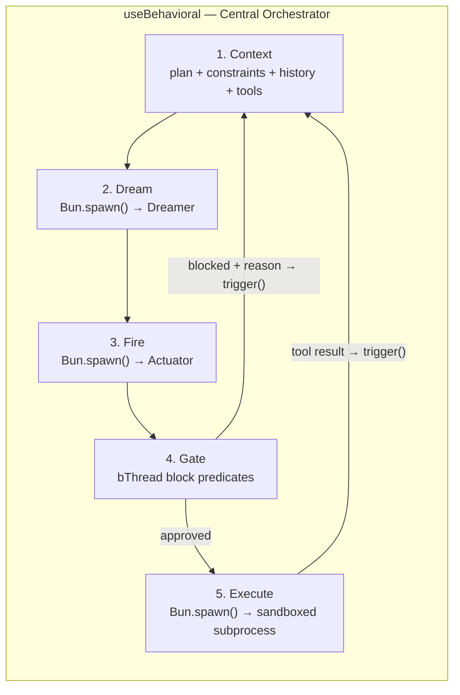
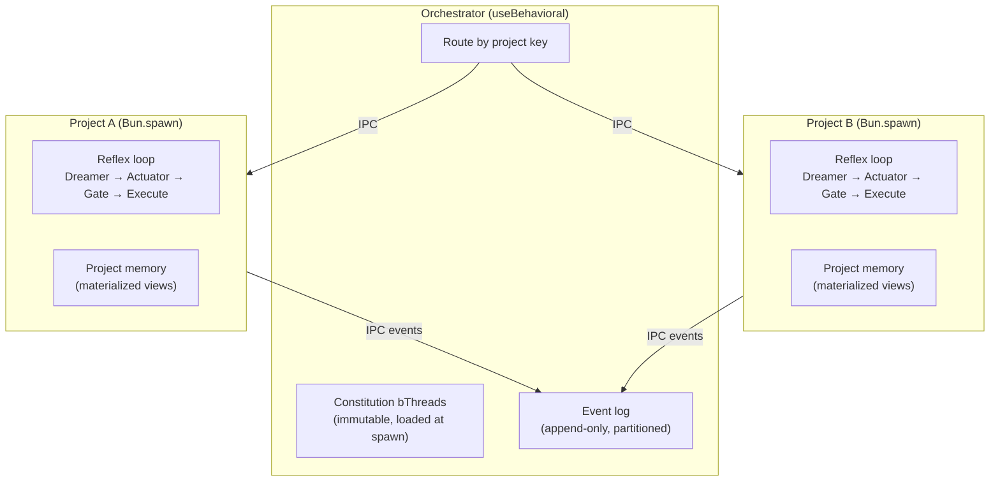
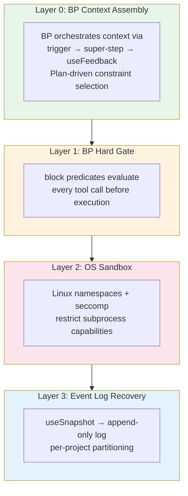

# Plaited Agent — System Design V3

## First Principles

Three axioms drive every decision in this architecture:

1. **Decouple logic from syntax.** Reasoning and structured output are different cognitive tasks. One model thinks in natural language. A separate model translates thoughts into tool calls. Neither does the other's job.

2. **Symbolic persists, neural evolves.** Behavioral programs (bThreads) encode safety constraints and domain knowledge as deterministic code. They survive model upgrades, hardware changes, and architecture pivots. The neural layer — whichever models fill the Dreamer and Actuator roles — is replaceable.

3. **Architecture outlives models.** Today's Dreamer is Falcon-H1R 7B. Today's Actuator is FunctionGemma 270M. Tomorrow's may be different. The interfaces, the constraint engine, the memory taxonomy, and the safety layers are designed to remain stable across model generations.

## Overview

Plaited's agent layer is a **framework** — composable primitives shipped as a subpath export (`plaited/agent`) alongside the existing UI, testing, and workshop modules. It is not a platform. Platforms are what consumers build with it.

The framework provides:

- **Interfaces** for three model roles (Dreamer, Actuator, Indexer)
- **BP orchestration** for the agent loop, safety constraints, and context assembly
- **Discovery and memory primitives** for tool indexing, semantic cache, and relation tracking
- **A constitution** encoding Structural-IA and Modnet concepts as bThreads

The framework is **not prescriptive** about inference backend. Consumers choose how to serve models — vLLM, llama.cpp, Ollama, cloud APIs, or any OpenAI-compatible endpoint. Code ships via npm (`plaited`). Base-trained models ship via Hugging Face ([huggingface.co/plaited](https://huggingface.co/plaited)).

### Reference Model Stack

The architecture is designed around three specialized roles. The reference implementation uses small, fine-tunable models that fit together on modest hardware:

| Role | Reference Model | Params | Function |
|---|---|---|---|
| **Dreamer** | Falcon-H1R 7B (Mamba/SSM hybrid) | 7B | Reasons in natural language. Reads constraints, history, and tool descriptions. Produces English-language plans and decisions. Never writes JSON. |
| **Actuator** | FunctionGemma (Gemma 3 270M base) | 270M | Foundation model for function calling. Fine-tuned on the agent's tool schemas. Translates the Dreamer's natural language into structured tool calls. Not a dialogue model — translates, never reasons. |
| **Indexer** | EmbeddingGemma (Gemma 3 300M base) | 300M | 768-dim embeddings (Matryoshka truncation to 512/256/128). Powers semantic similarity in the discovery layer. 2K token context. Not part of the Reflex loop — part of the memory layer. |

**Reference total: ~7.6B parameters (~15GB at fp16).** Any model that satisfies the Dreamer, Actuator, or Indexer interface can be substituted — including frontier API models for consumers who prefer pay-per-use over self-hosting.

### Pluggable Models

The Dreamer, Actuator, and Indexer are interfaces, not implementations:

```typescript
interface Dreamer {
  dream(context: DreamerContext): AsyncIterable<string>
}

interface Actuator {
  fire(dream: string, tools: ToolSchema[]): Promise<ToolCall>
}

interface Indexer {
  embed(text: string): Promise<Float32Array>
  search(params:{query: string, corpus: string[], topK: number}): Promise<SearchResult[]>
}
```

The reference models (Falcon-H1R, FunctionGemma, EmbeddingGemma) ship as base-trained checkpoints from `huggingface.co/plaited`. Consumers fine-tune for their own tool schemas and usage patterns. The symbolic layer (BP + bThreads) persists across every model swap.

## The Reflex Architecture

The cognitive split between Dreamer and Actuator is called the **Reflex Architecture**. The name reflects the biological metaphor: the Dreamer is the cortex (deliberation), the Actuator is the reflex arc (fast, mechanical translation).

One central `useBehavioral` program orchestrates the entire loop. There are no actors, no workers, no separate signal stores. BP manages state through bThread closures and coordinates compute via `Bun.spawn()` subprocesses for inference and sandboxed execution.



### The Loop

1. **Context** — BP assembles the Dreamer's prompt via trigger → super-step → useFeedback chains: the current plan (if one exists), active constraints from the plan's current step, conversation history, relevant tool descriptions, and any prior gate rejections.
2. **Dream** — Dreamer reasons in natural language: *"I should read src/index.ts to understand the entry point. Then I'll check the exports."* On the first cycle for a new task, the Dreamer produces a plan. On subsequent cycles, it adjusts the plan based on tool results.
3. **Fire** — Actuator translates the dream into a structured tool call: `{ "tool": "read_file", "args": { "path": "src/index.ts" } }`. If the dream is a plan, the Actuator translates it into a `save_plan` tool call — the plan enters the pipeline like any other tool result.
4. **Gate** — BP evaluates the tool call via `block` predicates. Deterministic: if any bThread blocks the event, the action is denied. The rejection reason feeds back to step 1 as context. The Dreamer re-plans around the constraint.
5. **Execute** — Approved tool call runs in a sandboxed `Bun.spawn()` subprocess restricted to `/workspace`. Output returns via `trigger()` as new context. Loop continues.

### Plan-Driven Context Assembly

The Dreamer's plan is the key to efficient context assembly. Rather than BP guessing what context to include (wasteful) or always including everything (expensive), the plan provides a **neural-generated, symbolically-consumed** optimization signal:

```
trigger('task', { prompt })
  → bThread: initial context assembly (constraints + prompt + discovery)
  → Dreamer produces plan
  → Actuator fires save_plan tool call
  → Gate approves → plan saved → trigger('tool_result', { plan })

  loop:
    → plan + last tool result are already in history
    → BP selects constraints relevant to current plan step
       (deterministic: step involves "bash" → bash constraints,
        step involves "write" → file write constraints)
    → Dreamer sees: current plan + last result + relevant constraints
    → Dreamer adjusts plan if needed, proposes next action
    → Actuator → Gate → Execute → loop
```

**Why this works:** The plan is just another tool result. It flows through the exact same Actuator → Gate → Execute pipeline. No special machinery. BP reads the plan's structure — not its meaning. Deterministic predicates match on step metadata (read-only vs. write, which tools are referenced) to select which constraints to inject. The neural layer produces the signal; the symbolic layer consumes it mechanically.

**What BP does:**
- Assembles context dynamically via trigger → super-step → useFeedback chains
- Evaluates every tool call via deterministic `block` predicates (Layer 1 hard gate)
- Selects relevant constraints per plan step via structural predicate matching
- Reads plan state from SQLite materialized view (synchronous `bun:sqlite` lookups in predicates)
- Manages lifecycle (when to stop, when to ask for human confirmation)

**What BP does NOT do:**
- Interpret dream content — symbolic cannot do semantic analysis
- Judge plan quality — bad plans produce bad tool calls, which the Gate catches
- Monitor token streams — unnecessary overhead; Defense in Depth handles safety

### Plan Schema

The plan is a structured artifact produced by the Actuator from the Dreamer's natural language reasoning. It must carry enough structural metadata for BP predicates to match on, while being simple enough for a 270M model to reliably produce.

```typescript
interface PlanStep {
  intent: string        // natural language — for Dreamer context, not for BP
  tools: string[]       // which tools this step will use — the predicate signal
  depends?: number[]    // step indices this depends on
}

interface Plan {
  goal: string          // natural language — for Dreamer context
  steps: PlanStep[]     // ordered steps
}
```

The Dreamer says: *"First I should read src/ui/form.tsx, then check existing validation patterns, then write a validation bThread, then run tests."* The Actuator translates:

```json
{
  "tool": "save_plan",
  "args": {
    "goal": "Add validation to form component",
    "steps": [
      { "intent": "Read component to understand structure", "tools": ["read_file"] },
      { "intent": "Check existing validation patterns", "tools": ["read_file", "search"] },
      { "intent": "Write validation bThread", "tools": ["write_file"], "depends": [0, 1] },
      { "intent": "Run tests", "tools": ["bash_exec"], "depends": [2] }
    ]
  }
}
```

#### Storage and Access

Plans are stored in a SQLite materialized view, keyed by task ID. All events carry a `taskId` in their detail — this is the partition key for concurrent plans.

The `useFeedback` handler stores the plan (side effect). bThread predicates read it via synchronous `bun:sqlite` lookups:

```typescript
// Handler: side effect — store the plan
return {
  save_plan({ detail }) {
    db.run(
      'INSERT OR REPLACE INTO plans (task_id, plan_json, step_index) VALUES (?, ?, 0)',
      [detail.taskId, JSON.stringify(detail.plan)]
    )
  }
}

// bThread: orchestration — select constraints based on current step's tools
bThreads.set({
  writeGuard: bThread([
    bSync({
      waitFor: ({ type, detail }) => {
        if (type !== 'context_assembly') return false
        const row = db.query(
          'SELECT plan_json, step_index FROM plans WHERE task_id = ?'
        ).get(detail.taskId)
        if (!row) return false
        const step = JSON.parse(row.plan_json).steps[row.step_index]
        return step.tools.includes('write_file')
      }
    }),
    bSync({
      request: { type: 'inject_constraints', detail: { constraints: writeConstraints } }
    })
  ], true),

  bashGuard: bThread([
    bSync({
      waitFor: ({ type, detail }) => {
        if (type !== 'context_assembly') return false
        const row = db.query(
          'SELECT plan_json, step_index FROM plans WHERE task_id = ?'
        ).get(detail.taskId)
        if (!row) return false
        const step = JSON.parse(row.plan_json).steps[row.step_index]
        return step.tools.includes('bash_exec')
      }
    }),
    bSync({
      request: { type: 'inject_constraints', detail: { constraints: bashConstraints } }
    })
  ], true),
})
```

Each constraint domain is a separate bThread — adding a new domain (e.g., `networkGuard` for A2A) means adding a new bThread with zero changes to existing code. This is BP's additive composition: handlers store, bThreads orchestrate.

#### Plan as Optimization, Not Security

The plan is an optimization signal for Layer 0 (context assembly). It is not a security boundary:

| Layer | Depends on Plan? | What It Uses Instead |
|---|---|---|
| **0 — Context Assembly** | Yes — selects constraints by `step.tools` | — |
| **1 — Hard Gate** | No — constitution bThreads evaluate independently | Tool call structure, file paths, command content |
| **2 — OS Sandbox** | No — kernel enforces capabilities | Namespace restrictions, seccomp profile |
| **3 — Event Log** | No — records everything | `useSnapshot` captures all BP decisions |

A "dishonest" plan (wrong tool declarations) produces worse context assembly — the Dreamer sees irrelevant constraints or misses relevant ones. But safety doesn't degrade because Layers 1–3 are plan-independent.

### Why Two Models, Not One

A single model that both reasons and generates structured output must constantly context-switch between natural language thinking and JSON formatting. This creates two failure modes:

- **Reasoning contaminated by syntax:** The model spends tokens on brace-matching and schema compliance instead of thinking about the problem.
- **Structure contaminated by reasoning:** The model injects commentary into JSON, breaks schemas, or hallucinates field names.

The Reflex Architecture eliminates both. The Dreamer never sees JSON. The Actuator never decides what to do. Each model operates in its native modality.

## Discovery Layer

The discovery layer uses **three independent mechanisms**, each suited to a different kind of lookup:

| Mechanism | Backing | What It Finds | Speed |
|---|---|---|---|
| **FTS5** | SQLite full-text search | Tools by name/description, skills by keyword, rules by content | Fast, no model |
| **Dependency Graph** | In-memory DAG (persisted to SQLite) | Module relationships, structural dependencies, import chains | Fast, no model |
| **Semantic Search** | EmbeddingGemma (768-dim vectors) | Similar tools by intent, cached responses by semantic proximity | Slower, requires Indexer |

### FTS5 — Keyword Search

SQLite's FTS5 extension provides fast, exact keyword matching. Tool descriptions, skill manifests, and rule content are indexed at startup. Most discovery queries resolve here without touching the Indexer.

### Dependency Graph — Structural Relations

An in-memory directed acyclic graph (DAG) tracks module relationships: which modules import which, which tools belong to which skills, which rules apply to which contexts. The graph is built from static analysis and persisted to SQLite for session recovery. Traversal is O(edges) with no model inference.

### Semantic Search — Similarity by Embedding

EmbeddingGemma handles queries that keyword search can't resolve — "find a tool that does something like X." Uses task-prefix format (`task: code retrieval | query: ...`) to produce context-appropriate embeddings. Matryoshka truncation (768 → 512 → 256 → 128 dims) allows trading precision for speed.

## Memory Architecture

The agent's memory is built on a single principle from *Designing Data-Intensive Applications*: **the event log is the source of truth.** Everything else — plans, semantic cache, relation store, session history — is a materialized view derived from the log.

### Event Log — Source of Truth

An append-only log in SQLite records every BP decision. The log is populated via `useSnapshot`, which fires after event selection but before `useFeedback` handlers execute side effects:

```typescript
const disconnect = useSnapshot(async (candidates: SnapshotMessage) => {
  const selected = candidates.find(c => c.selected)
  if (!selected) return

  await appendToLog({
    ts: Date.now(),
    project: currentProject,
    type: selected.type,
    detail: selected.detail,
    priority: selected.priority,
    thread: selected.thread,
    blockedBy: selected.blockedBy,
    trigger: selected.trigger,
  })
})
```

**Why `useSnapshot`, not `useFeedback`:**
- `useSnapshot` fires AFTER event selection but BEFORE side effects — the log captures the BP *decision*, not the outcome
- `SnapshotMessage` contains ALL candidates with blocking/interruption relationships — the log can record not just what was selected, but what was blocked and why
- The listener supports async — log writes don't block the BP event loop
- `useSnapshot` is lazily initialized — zero overhead when no listener is registered

The log is **partitioned by project key.** Each project's events are independent. Recovery, replay, and materialized view rebuilds operate per-partition.

### Materialized Views

The four memory categories from the discovery layer are views materialized from the event log:

| View | Source Events | Rebuild Strategy |
|---|---|---|
| **Plans** | `save_plan`, `task_complete`, `task_fail` | Replay plan lifecycle events; reconstruct success/failure metadata |
| **Semantic Cache** | `dream_response` + `tool_result` pairs | Re-embed cached responses; skip if embedding model changed |
| **Relation Store** | `tool_use`, `skill_invoke`, `module_import` | Rebuild DAG from structural events |
| **Session History** | All events in chronological order | Direct projection — the log IS the history |

**Benefits of log-first architecture:**
- **Recovery**: Replay the log to rebuild any materialized view. No separate backup needed for agent state.
- **Debugging**: The full decision history is preserved — every selected event, every blocked candidate, every gate rejection.
- **Training**: Trajectories are log slices. SFT/GRPO training data is a query over the event log, not a separate export pipeline.
- **Migration**: When the schema for a materialized view changes, rebuild from the log. The log schema is stable (it's just BP events + timestamps).

### Plans — Reusable Task Knowledge

Plans remain first-class memory artifacts. When the Dreamer produces a plan and the Actuator saves it via `save_plan`, the plan and its task breakdown are persisted with metadata: outcome (success/failure), tools used, skills invoked, gate rejections encountered.

Stored plans are discoverable via all three discovery mechanisms:

| Mechanism | What It Finds | Example |
|---|---|---|
| **FTS5** | Plans by keyword — tool names, file paths, error types | "plans that used `write_file` on `src/ui/`" |
| **Dependency Graph** | Structural relationships — which tools each task needed, task ordering, skill dependencies | "Task 3 depended on Tasks 1 and 2, invoked `ui-patterns` skill" |
| **Semantic Search** | Similar plans by intent, even if they used different tools | "find a plan similar to 'refactor the export structure'" |

When a new task arrives, the discovery layer surfaces proven plans for similar work. The Dreamer adapts from a plan that already succeeded rather than inventing from scratch.

### Memory and the Training Flywheel

The event log feeds the training pipeline directly:

```
Event log slices (by project, time range, outcome)
  → Filter: successful plan trajectories → SFT data
  → Filter: failed plans + corrections → GRPO preference pairs
  → Filter: recurring blocking patterns → bThread candidates → Owner approval
```

Memory is the bridge between the per-session agent loop and the cross-session training flywheel. The event log is the richest signal — it captures not just what the agent did, but the full BP decision state at each step.

## Project Isolation

A single agent may work across multiple projects — separate git repositories, different codebases, distinct security contexts. These need **hard process boundaries**, not logical partitioning.

### Architecture: Orchestrator + Project Subprocesses



### Bun IPC Trigger Bridge

Each project subprocess is a `Bun.spawn()` with `ipc: true`. BP events `{ type, detail }` are natively compatible with `structuredClone` serialization — no marshalling layer needed:

```typescript
// Orchestrator → Project subprocess
const project = Bun.spawn(['bun', 'run', projectEntry], {
  ipc(message) {
    // Events from subprocess flow back via trigger()
    const event = BPEventSchema.safeParse(message)
    if (event.success) trigger(event.data)
  }
})

// Send task to project
project.send({ type: 'task', detail: { prompt, context } })

// Project subprocess side
process.on('message', (message) => {
  const event = BPEventSchema.safeParse(message)
  if (event.success) trigger(event.data)
})

// Results back to orchestrator
useFeedback({
  tool_result({ detail }) {
    process.send!({ type: 'tool_result', detail })
  }
})
```

This pattern is proven — `src/workshop/get-server.ts` uses the same `Bun.spawn()` + IPC + `BPEventSchema.safeParse()` approach for bidirectional BP events between parent and child processes.

### What Isolation Provides

| Concern | Solution |
|---|---|
| **Memory isolation** | Each subprocess has its own address space. Project A's memory cannot leak to Project B. |
| **Crash containment** | A failing project subprocess doesn't take down the orchestrator or other projects. |
| **Security boundaries** | Each subprocess runs with its own sandbox profile (Layer 2). Different projects can have different capability restrictions. |
| **Independent lifecycle** | Projects can be started, stopped, and restarted independently. The orchestrator manages lifecycle via IPC. |
| **Event log partitioning** | Each subprocess's `useSnapshot` callbacks tag events with their project key. The event log is naturally partitioned. |

### Constitution Loading

The constitution is loaded at subprocess spawn time and is **immutable for the lifetime of that process.** The orchestrator passes constitution bThreads as part of the spawn configuration. The subprocess cannot modify its own constitution — this is the MAC layer in action.

## Training: Both Models Evolve

The framework ships with base-trained checkpoints for generative UI and general-purpose coding tasks. New deployments start useful. Over time, real-world usage generates training data:

- **Actuator fine-tuning:** FunctionGemma's base accuracy on function calling is ~58%. Fine-tuned on a deployment's specific tool schemas, it reaches 85%+. Each deployment fine-tunes for its owner's tools — the Actuator becomes a specialist.
- **Dreamer fine-tuning:** Falcon-H1R is trained via SFT and GRPO on successful task trajectories. The Dreamer learns the owner's coding style, preferred patterns, and constraint landscape. Mamba's persistent state accelerates this — recurring patterns reinforce in state without explicit retraining.
- **The flywheel:** Usage → trajectories → SFT/GRPO → better models → better usage → more trajectories. Recurring patterns crystallize into explicit bThreads, growing the symbolic layer monotonically. The neural layer gets smarter; the symbolic layer gets stricter. Both improve together.
- **bThread approval:** When the flywheel proposes a new bThread (crystallized from recurring patterns), the owner must explicitly approve it before it's added to the constraint engine. The symbolic layer never grows without human consent.

## Key Design Principles

- **Framework, Not Platform:** Plaited ships composable primitives. Code via npm, models via Hugging Face. Platforms are built with it, not by it.
- **Single Tenancy:** 1 User : 1 Agent instance. User data lives on their agent — nowhere else.
- **Pluggable Models:** Dreamer, Actuator, and Indexer are interfaces. Implementations swap freely — self-hosted small models, frontier APIs, or anything in between.
- **BP-Orchestrated:** One central `useBehavioral` coordinates the entire agent loop. Context assembly, gate evaluation, lifecycle management — all BP. No actors, no workers, no external signal stores. bThread closures hold state.
- **Plan-Driven Context:** The Dreamer's plan provides the optimization signal for context assembly. BP consumes the plan's structure deterministically. Neural produces, symbolic consumes.
- **Defense in Depth:** Layer 0 (BP-orchestrated context assembly) → Layer 1 (BP hard gate) → Layer 2 (OS sandbox) → Layer 3 (event log recovery). Four independent layers, four different stack levels.
- **Three-Axis Risk Awareness:** Capability × Autonomy × Authority. Risk grows geometrically when all three scale simultaneously. BP constraints cap each axis independently.

## Safety & Risk Model

### Three-Axis Risk Model

Agent risk is not a single dimension. It is the product of three independent axes:

```
Risk = Capability × Autonomy × Authority
```

| Axis | Definition | Example |
|---|---|---|
| **Capability** | What tools the agent can invoke | File read/write, bash execution, network access, payment sending |
| **Autonomy** | How many actions before requiring human confirmation | Fully supervised (every action confirmed) → fully autonomous (runs unattended) |
| **Authority** | What resources the agent can access or modify | Read-only workspace → full workspace write → system config → external APIs |

Risk grows **geometrically** when all three axes scale simultaneously. An agent with high capability, high autonomy, and high authority is maximally dangerous. The key insight: **cap each axis independently.** An agent can have:

- High capability + low autonomy → powerful tools, but human confirms each use
- High autonomy + low authority → runs unattended, but can only read files
- High authority + low capability → can access everything, but only has one tool

BP bThreads compose additively — adding a constraint on one axis doesn't affect the others. The owner tunes each axis to their comfort level, and the constraint landscape evolves as trust is established.

### Defense in Depth (Four Layers)

No single safety mechanism is sufficient. Neural models are probabilistic — they can violate any instruction. OS sandboxes have kernel vulnerabilities. Event logs can be corrupted. The system is safe because **four independent layers** must all fail simultaneously for harm to occur:



#### Layer 0 — BP Context Assembly (Soft Pre-Filter)

BP orchestrates context assembly dynamically via trigger → super-step → useFeedback chains — the same pattern used throughout Plaited (UI elements, workshop test runner). Active constraints are selected based on the current plan step's structure and injected into the Dreamer's context as natural language. The Dreamer plans *around* constraints rather than into them.

This is not a static snapshot. Each loop iteration assembles context fresh, with BP selecting which constraints are relevant to the current plan step via deterministic predicates. The plan itself — saved through the normal tool call pipeline — provides the signal for what constraints to include.

**What it catches:** Most constraint violations, before they're even proposed. The Dreamer learns the constraint landscape through experience — and through Mamba's persistent state, across sessions.

**Failure mode:** The Dreamer is a neural model. It may ignore or misinterpret constraints. This layer is probabilistic, not deterministic. That's why Layer 1 exists.

#### Layer 1 — BP Hard Gate (Deterministic)

Every structured tool call from the Actuator is evaluated by BP `block` predicates before execution. `trigger()` creates a temporary thread with priority 0. The super-step runs synchronously. If any bThread blocks the event, the action is denied. The rejection reason feeds back to the Dreamer as context for re-planning.

**What it catches:** Everything that Layer 0 misses. Any tool call that violates a constraint is blocked deterministically — no probability, no hallucination, no prompt injection can bypass a `block` predicate.

**Failure mode:** The BP engine runs in userspace JavaScript. If the LLM crafts a tool call that embeds a shell escape (e.g., `bash -c "cat /data/ca_key"`), the BP check evaluates the stated command, not what the command does internally. Novel attack patterns the predicates don't cover can slip through.

#### Layer 2 — OS Sandbox (Capability Restriction)

Tool execution runs in a sandboxed `Bun.spawn()` subprocess with OS-level restrictions:

| Mechanism | What It Restricts |
|---|---|
| **User namespace** | Subprocess runs as mapped UID, access only to `/workspace` |
| **Mount namespace** | Bind-mount `/workspace` as root — cannot see `/data`, CA keys, or SQLite |
| **seccomp profile** | BPF filter blocks `mount`, `ptrace`, `reboot`, `clone`, raw sockets |
| **Network isolation** | Subprocess cannot make outbound HTTP — only the main process can |

**What it catches:** Any attempt to access protected resources, regardless of how the tool call was constructed. Even if Layers 0 and 1 both fail, the subprocess literally cannot read `/data` or escalate privileges.

**Failure mode:** Kernel vulnerability allows namespace escape. This is a known OS-level risk, mitigated by keeping the kernel patched and the seccomp profile tight.

#### Layer 3 — Event Log Recovery (Audit & Replay)

The event log (populated via `useSnapshot`) records every BP decision with timestamps and project keys. If all three prior layers fail and the agent takes harmful action, the owner has:

- **Complete audit trail** — every event selection, every blocked candidate, every gate rejection
- **Replay capability** — rebuild any materialized view from the log
- **Per-project isolation** — damage in one project's subprocess doesn't affect another's log partition

Workspace backup (snapshotting the actual file system) is **deployment infrastructure**, not framework responsibility. The framework provides the event log for agent state recovery. Skills or external tooling handle workspace-level backup — rsync, cloud snapshots, or whatever the deployment tier supports.

**What it catches:** Any damage that makes it past Layers 0–2. The audit trail is append-only and lives outside the sandbox — the subprocess cannot modify its own log.

**Failure mode:** Owner doesn't review the audit log. Mitigated by the event log's queryability — materialized views surface anomalies, and the training flywheel flags unusual patterns.

### Independence Guarantee

Each layer operates on a different level of the stack and uses a different mechanism:

| Layer | Stack Level | Mechanism | Can Be Bypassed By |
|---|---|---|---|
| 0 | Application logic | BP-orchestrated context assembly | Model ignoring instructions |
| 1 | Application logic | Deterministic BP block predicates | Novel attack patterns predicates don't cover |
| 2 | Operating system | Kernel namespaces + BPF | Kernel vulnerability |
| 3 | Data layer | Append-only event log + `useSnapshot` | Log corruption or physical data loss |

No single attack vector compromises more than one layer. A prompt injection bypasses Layer 0 but hits Layer 1. A novel tool call bypasses Layer 1 but hits Layer 2. A namespace escape bypasses Layer 2 but the damage is recoverable via Layer 3.

### Environmental Hardening + Behavioral Alignment

The four layers form a coupled system where each makes the others more effective:

**Environmental hardening** (Layers 1–2) creates hard boundaries. The Dreamer encounters these boundaries as blocked actions and restricted capabilities. Over time, through the feedback loop and Mamba's persistent state, the Dreamer internalizes the constraint landscape. It stops proposing actions that will be blocked — not because it was told to, but because it learned through experience.

**Behavioral alignment** (Layer 0) is the result. The Dreamer's behavior aligns with the constraints not through instruction-following (fragile) but through accumulated experience (robust). Each Layer 1 rejection is a training signal that strengthens Layer 0. The hard gate fires less and less — not because constraints relaxed, but because the Dreamer learned to navigate them.

This is the neuro-symbolic coupling at work: the symbolic layer (BP) creates terrain; the neural layer (Dreamer + Mamba state) learns to read it. The symbolic layer grows monotonically (ratchet principle — constraints only add, never remove). The neural layer adapts continuously. Together they produce an agent that is both capable and constrained — and becomes more of both over time.

### Human in the Loop

The three-axis model explicitly supports **variable autonomy**. The owner controls how much the agent does before asking for confirmation:

- **High-stakes actions** (payment, external API calls, destructive file ops): Always require owner confirmation via channel adapter. BP bThreads enforce this — the action is blocked until a `confirm` event arrives from the channel.
- **Routine actions** (file reads, builds, test runs): Execute autonomously within sandbox constraints.
- **bThread approval**: When the training flywheel proposes a new bThread (crystallized from recurring patterns), the owner must explicitly approve it before it's added to the constraint engine. The symbolic layer never grows without human consent.

The autonomy axis is not binary. It's a spectrum the owner tunes through the constraints they install, and the agent respects through the coupled hardening/alignment system.

## Constitution

The framework ships with a set of foundational bThreads — the **constitution** — encoding two bodies of work as deterministic constraints:

### Structural Information Architecture

Rachel Jaffe's structural vocabulary defines the primitives that digital environments are built from. The constitution encodes these as bThreads that constrain how the agent generates and modifies modules:

- **Objects** — discrete data containers with defined boundaries
- **Channels** — pathways for information flow between objects
- **Levers** — interaction points that change system state
- **Loops** — feedback mechanisms that reinforce or dampen behavior
- **Blocks** — constraints that prevent certain interactions

These are not guidelines the Dreamer "follows." They are `block` predicates that prevent the agent from generating structures that violate the vocabulary. A module without a defined boundary is blocked. A channel without source and destination is blocked. The symbolic layer enforces structural coherence that neural models cannot guarantee alone.

### Modnet Concepts

Jaffe's modular network architecture defines how user-owned modules compose into networks. The constitution encodes modnet principles as constraints on module generation and composition:

- **1 module : 1 user** — modules are owned, not shared. The agent cannot generate modules that store data for multiple users.
- **Bridge-code** — every module must declare content type, structure, mechanics, boundary, and scale. The agent cannot generate a module missing any bridge-code tag.
- **Transportability** — modules must be self-contained. The agent cannot generate modules with hard dependencies on a specific platform's APIs.
- **A2A compatibility** — module interfaces must be expressible as A2A Agent Cards. The agent cannot generate interfaces that A2A cannot describe.

The constitution is **additive and append-only** (ratchet principle). New bThreads can be added to the constitution; existing ones cannot be removed or weakened. The symbolic layer grows monotonically.

## Modnet & A2A

A **modnet** (modular network) is a network of user-owned nodes connected peer-to-peer. Each node is one agent serving one user. There is no central server, no shared tenancy, no platform operator. Nodes communicate via the **A2A (Agent-to-Agent) protocol**.

### Topology: 1 Node : 1 User

- Each **node** is a Plaited agent instance (Reflex loop + modules + memory + constitution)
- Each node is **owned and controlled** by one user — their data lives on their node, nowhere else
- Nodes connect to other nodes via A2A — no intermediary, no aggregator
- A node going offline means its data disappears from the network, not from the owner
- Nodes can connect to **multiple networks simultaneously** — team workspace, public skill marketplace, private dev environment

This is not multiplayer (multiple users sharing one agent). It is a network of sovereign agents cooperating.

### Modules Are Internal

A module is an internal artifact — code, data, tools, skills, bThreads — living inside the agent. Modules are not exposed directly to the network. When one node wants to work with another node's module, it requests a **service** or receives an **artifact**. The module stays internal; the output crosses the boundary.

The Agent Card is the node's **public entry point** — a projection of capabilities, not an inventory of internals.

### A2A Protocol

A2A is a transport-agnostic protocol for agent-to-agent communication with three layers:

1. **Canonical Data Model** — Protocol-agnostic core semantics (tasks, messages, artifacts, parts)
2. **Abstract Operations** — Binding-independent behaviors (SendMessage, GetTask, CancelTask)
3. **Protocol Bindings** — Concrete transport (HTTP/REST, JSON-RPC, gRPC)

**Streaming** uses SSE framing (`text/event-stream`) over POST — not GET. The browser's `EventSource` API cannot be used; streaming requires `fetch()` with `ReadableStream`. Each SSE `data:` line contains a JSON-RPC 2.0 response wrapping one of: `task`, `message`, `statusUpdate`, or `artifactUpdate`.

**A2A maps naturally to BP's event model.** Request-response maps to `trigger` → `waitFor`. Streaming maps to SSE events → `trigger()` per event. Push notifications map to inbound webhook → `trigger()`. No separate adapter layer — A2A calls are tool calls flowing through the same Actuator → Gate → Execute pipeline.

### Module Discovery: Three Tiers

Module discovery uses the same three-tier model for both local and inter-agent contexts:

| Tier | Mechanism | What's Visible | Jaffe Boundary |
|---|---|---|---|
| **Public Card** | Agent Card at well-known URL | Broad capability categories — "generative UI", "code review" | Minimal — existence and category only |
| **Extended Card** | Authenticated Agent Card (A2A native) | Detailed skills, module categories — curated by owner | `ask` — identity verified, more revealed |
| **Task Negotiation** | SendMessage within a task | "I need form validation — do you have something?" Agent responds dynamically per policy | Contextual — full negotiation scoped to interaction |

The card surfaces broad capabilities. The task flow handles specific module negotiation. Modules are never listed exhaustively in the card — that would violate boundary constraints and leak internal structure.

Discovery **transport** (how you find a card) is deployment-specific: DNS, Bluetooth, QR codes, registries, geofencing for emergent networks. The framework defines how an agent publishes and evaluates cards, not how cards are found.

### Access Control: DAC + MAC + ABAC

Three layers of access control, each serving a different purpose:

| Layer | Model | Who Controls It | What It Does |
|---|---|---|---|
| **Surface** | DAC (Discretionary) | Owner | Sets boundary tags on modules (`all`/`none`/`ask`). Familiar mental model — like Google Drive sharing. |
| **Floor** | MAC (Mandatory) | Constitution bThreads | Constraints the owner **cannot override**. Even with boundary `all`, the constitution blocks sharing credentials, private keys, or modules missing bridge-code. |
| **Evaluation** | ABAC (Attribute-Based) | BP predicates | When boundary is `ask`, evaluates requester attributes + module attributes + context. Owner sets policy; BP enforces deterministically. |

**Why not RBAC?** There are no fixed roles between sovereign nodes. Trust between agents is contextual — the same agent might be a trusted peer in one network and unknown in another. Attributes (what the requester's card declares, what the module's tags say, what context this request is in) are the right evaluation basis.

**How the layers compose:**

```
Owner sets boundary: "all"
  → DAC: approved
  → MAC (constitution): blocks sharing of credentials module (mandatory)
  → Result: everything shared EXCEPT what the constitution protects

Owner sets boundary: "ask" + approves peer
  → DAC: approved
  → MAC: no mandatory block
  → ABAC: evaluates peer's card attributes against module boundary policy
  → Result: shared if attributes match policy

Owner sets boundary: "none"
  → DAC: blocked
  → No further evaluation needed
```

The MAC layer uses the same ratchet principle as the local constitution — mandatory bThreads only add, never remove. The security floor only rises.

**BP is the single policy engine.** The same `block` predicates that govern local tool execution govern inter-agent module sharing. The three-axis risk model (Capability × Autonomy × Authority) applies to outbound sharing just as it applies to local actions:

```typescript
bSync({
  block: ({ type, detail }) => {
    if (type !== 'share_module') return false
    const mod = getModule(detail.moduleId)
    const requester = detail.requesterCard

    // MAC: constitution blocks credentials regardless of owner setting
    if (mod.contentType === 'credentials') return true

    // DAC: owner's boundary decision
    if (mod.boundary === 'none') return true

    // ABAC: evaluate requester attributes when boundary is 'ask'
    if (mod.boundary === 'ask') {
      return !evaluatePolicy(requester, mod, detail.context)
    }

    return false
  }
})
```

### Inter-Agent Task Flow

When Agent A wants to work with Agent B's module:

1. **A sends a task** via A2A SendMessage — "I need validation for these form fields"
2. **A's BP evaluates the outbound request** — authority constraints, boundary checks
3. **B receives the task** — B's BP evaluates the inbound request via access control layers (DAC + MAC + ABAC)
4. **B's module processes internally** — the module is never exposed
5. **B returns artifacts** via streaming — generated code, validation result, whatever the module produces
6. **A receives artifacts** — SSE events become `trigger()` calls, bThreads process results

For **module transfer** (sending the module itself, not just output) — a higher-trust operation. Both agents' BP engines must approve: B's outbound sharing policy and A's inbound installation policy. Owner confirmation required on both sides.

### Modnet vs. Platform

| Property | Platform (centralized) | Modnet (Plaited) |
|---|---|---|
| **Data ownership** | Platform holds user data | User's agent holds user data |
| **Cost scaling** | Linear with usage (API calls) | Fixed per node regardless of usage |
| **Failure mode** | Platform down = all users affected | One node down = one user offline |
| **Composition** | Platform APIs, vendor lock-in | A2A protocol, agent-to-agent |
| **Training data** | Platform captures trajectories | User owns their trajectories |
| **Access control** | Platform-defined RBAC | Owner DAC + constitution MAC + BP ABAC |

The framework ships primitives for building modnet nodes. It does not operate a modnet. Consumers deploy their own agents, publish their own Agent Cards, and connect to whichever peers they choose.

## Deployment Tiers

The framework is not prescriptive about deployment. Three tiers are viable:

| Tier | Example | Trade-off |
|---|---|---|
| **Local** | Mac Mini, DGX Spark, any box with sufficient RAM/VRAM | Zero ongoing cost. Full data sovereignty. Requires hardware. |
| **Cloud GPU** | RunPod, Lambda, Fly.io GPU Machines | Pay monthly. No hardware to maintain. Provider has physical access. |
| **API-backed** | MiniMax, OpenRouter, any OpenAI-compatible endpoint | Pay per use. No GPU needed. No fine-tuning (unless provider supports it). |

The pluggable model interfaces make tier selection a deployment decision, not an architectural one. A consumer can start API-backed, move to cloud, and eventually self-host — swapping model implementations without changing their bThreads, tools, or application logic.

**Workspace backup** is a deployment concern, not a framework concern. The framework provides the event log for agent state recovery. Workspace-level backup (file system snapshots, remote git mirrors, cloud storage sync) is infrastructure that varies by tier — a local deployment might use Time Machine, a cloud deployment might use volume snapshots, an API-backed deployment might use nothing at all. Skills can provide backup tooling, but it lives outside the agent's core architecture.

Deployment guides and cost analysis belong in skills, not in this document.
