# System Diagrams — Agent Loop

Detailed Mermaid diagrams capturing every bThread, feedback handler, and trigger in `src/agent/`.

---

## 1. Module Dependency Graph

How `src/agent/` files import from each other and from `src/tools/`.

```mermaid
graph TD
    subgraph "src/agent/ (core)"
        AT[agent.ts<br/><i>createAgentLoop</i>]
        AC[agent.constants.ts<br/><i>AGENT_EVENTS, RISK_CLASS,<br/>TOOL_STATUS, BUILT_IN_TOOLS</i>]
        AS[agent.schemas.ts<br/><i>Zod schemas + inferred types</i>]
        ATY[agent.types.ts<br/><i>Seam types, event details</i>]
        AU[agent.utils.ts<br/><i>parseModelResponse,<br/>buildContextMessages,<br/>createTrajectoryRecorder,<br/>toToolResult,<br/>createInferenceCall</i>]
        AO[agent.orchestrator.ts<br/><i>createOrchestrator,<br/>createBunProcessManager</i>]
        AOC[agent.orchestrator.constants.ts<br/><i>ORCHESTRATOR_EVENTS</i>]
        AOT[agent.orchestrator.types.ts<br/><i>ProjectConfig, IPC messages,<br/>ProcessManager, Orchestrator</i>]
        AOW[agent.orchestrator-worker.ts<br/><i>child process entry point</i>]
    end

    subgraph "src/tools/ (pluggable seams)"
        TC[constitution/constitution.ts<br/><i>createConstitution,<br/>createGateCheck,<br/>classifyRisk</i>]
        TCT[constitution/constitution.types.ts<br/><i>ConstitutionRule, Constitution</i>]
        TCRUD[crud/crud.ts<br/><i>createToolExecutor,<br/>builtInToolSchemas</i>]
        TE[evaluate/evaluate.ts<br/><i>checkSymbolicGate,<br/>createEvaluate,<br/>buildRewardPrompt</i>]
        TM[memory/memory.ts<br/><i>createMemoryDb,<br/>createSearchHandler</i>]
        TMT[memory/memory.types.ts<br/><i>MemoryDb, EventLogRow</i>]
        TS[simulate/simulate.ts<br/><i>createSimulate,<br/>createSubAgentSimulate</i>]
    end

    subgraph "src/behavioral/ (BP engine)"
        B[behavioral.ts<br/><i>behavioral&#40;&#41;</i>]
        BU[behavioral.utils.ts<br/><i>bSync, bThread</i>]
    end

    %% agent.ts imports
    AT --> B
    AT --> BU
    AT --> AC
    AT --> AS
    AT --> ATY
    AT --> AU
    AT --> TC
    AT --> TCT
    AT --> TE
    AT --> TMT

    %% agent.utils.ts imports
    AU --> AC
    AU --> AS
    AU --> ATY
    AU --> TMT

    %% agent.types.ts imports
    ATY --> AC
    ATY --> AS

    %% agent.schemas.ts imports
    AS --> AC

    %% orchestrator imports
    AO --> B
    AO --> BU
    AO --> AOC
    AO --> AOT
    AO --> AS

    AOT --> AOC
    AOT --> AS

    AOW --> TCRUD
    AOW --> AOT
    AOW --> AT
    AOW --> ATY
    AOW --> AU

    %% tools → agent (reverse dependency)
    TC --> AC
    TC --> AS
    TC --> ATY
    TC --> BU
    TCT --> AS
    TCT --> ATY

    TCRUD --> AC
    TCRUD --> AS
    TCRUD --> ATY

    TE --> AC
    TE --> AS
    TE --> ATY

    TM --> AS
    TM --> ATY
    TMT -.->|no imports| TMT

    TS --> AS
    TS --> ATY

    style AT fill:#e6f3ff,stroke:#0066cc
    style AO fill:#e6f3ff,stroke:#0066cc
    style B fill:#fff3e6,stroke:#cc6600
    style BU fill:#fff3e6,stroke:#cc6600
```

---

## 2. Barrel File Re-Export Surface (`src/agent.ts`)

Every symbol exposed through the public barrel and its source module.

```mermaid
graph LR
    BARREL["src/agent.ts<br/><b>Public Barrel</b>"]

    subgraph "src/agent/"
        AC2["agent.constants.ts<br/><code>AGENT_EVENTS</code><br/><code>RISK_CLASS</code><br/><code>TOOL_STATUS</code><br/><code>BUILT_IN_TOOLS</code>"]
        AOC2["agent.orchestrator.constants.ts<br/><code>ORCHESTRATOR_EVENTS</code>"]
        AO2["agent.orchestrator.ts<br/><code>createOrchestrator</code><br/><code>createBunProcessManager</code>"]
        AOT2["agent.orchestrator.types.ts<br/><code>type ProjectConfig</code><br/><code>type Orchestrator</code><br/><code>type ProcessManager</code><br/><code>type ManagedProcess</code><br/><code>type OrchestratorEventDetails</code><br/><code>type WorkerInboundMessage</code><br/><code>type WorkerOutboundMessage</code>"]
        AS2["agent.schemas.ts<br/><code>AgentToolCallSchema</code><br/><code>AgentPlanSchema</code><br/><code>TrajectoryStepSchema</code><br/><code>ToolResultSchema</code><br/><code>GateDecisionSchema</code><br/><code>ToolDefinitionSchema</code><br/><code>AgentConfigSchema</code><br/>+ inferred types"]
        AT2["agent.ts<br/><code>createAgentLoop</code>"]
        ATY2["agent.types.ts<br/><code>type AgentNode</code><br/><code>type GateCheck</code><br/><code>type InferenceCall</code><br/><code>type Simulate</code><br/><code>type Evaluate</code><br/><code>type ToolExecutor</code><br/><code>type ChatMessage</code><br/><code>type AgentEventDetails</code><br/>+ 16 detail types"]
        AU2["agent.utils.ts<br/><code>createInferenceCall</code><br/><code>parseModelResponse</code><br/><code>createTrajectoryRecorder</code><br/><code>buildContextMessages</code><br/><code>toToolResult</code>"]
    end

    subgraph "src/tools/"
        TC2["constitution/constitution.ts<br/><code>createConstitution</code><br/><code>createGateCheck</code><br/><code>classifyRisk</code><br/><code>constitutionRule</code><br/><code>classifyRiskCli</code>"]
        TCT2["constitution/constitution.types.ts<br/><code>type ConstitutionRule</code><br/><code>type ConstitutionRuleConfig</code><br/><code>type Constitution</code>"]
        TCRUD2["crud/crud.ts<br/><code>createToolExecutor</code><br/><code>builtInToolSchemas</code><br/><code>readFileCli</code><br/><code>writeFileCli</code><br/><code>listFilesCli</code><br/><code>bashCli</code>"]
        TE2["evaluate/evaluate.ts<br/><code>checkSymbolicGate</code><br/><code>createEvaluate</code><br/><code>buildRewardPrompt</code><br/><code>parseRewardScore</code><br/><code>DANGEROUS_PREDICTION_PATTERNS</code><br/><code>evaluateCli</code>"]
        TM2["memory/memory.ts<br/><code>createMemoryDb</code><br/><code>searchToolSchema</code><br/><code>createSearchHandler</code><br/><code>searchCli</code>"]
        TMT2["memory/memory.types.ts<br/><code>type MemoryDb</code><br/><code>type EventLogEntry</code><br/><code>type EventLogRow</code><br/>+ row types"]
        TS2["simulate/simulate.ts<br/><code>createSimulate</code><br/><code>createSubAgentSimulate</code><br/><code>buildStateTransitionPrompt</code><br/><code>parseSimulationResponse</code><br/><code>simulateCli</code>"]
    end

    BARREL --> AC2
    BARREL --> AOC2
    BARREL --> AO2
    BARREL -->|"export type *"| AOT2
    BARREL --> AS2
    BARREL --> AT2
    BARREL -->|"export type *"| ATY2
    BARREL --> AU2
    BARREL --> TC2
    BARREL -->|"export type *"| TCT2
    BARREL --> TCRUD2
    BARREL --> TE2
    BARREL --> TM2
    BARREL -->|"export type *"| TMT2
    BARREL --> TS2

    style BARREL fill:#ffe6e6,stroke:#cc0000
```

---

## 3. Feedback Handler Inventory

Every handler registered in `createAgentLoop`, what it receives, and what it triggers.

```mermaid
graph TD
    subgraph "Primary Handlers (useFeedback #1)"

        H_TASK["<b>task</b> handler<br/>─────────────<br/><b>Receives:</b> detail.prompt<br/><b>Does:</b><br/>1. bThreads.set maxIterations<br/>2. history.push user message<br/><b>Triggers:</b> invoke_inference"]

        H_INV["<b>invoke_inference</b> handler<br/>─────────────<br/><b>Receives:</b> nothing<br/><b>Does:</b> async callInference&#40;&#41;<br/><b>Triggers:</b> model_response<br/><b>On error:</b> message &#40;error text&#41;"]

        H_MR["<b>model_response</b> handler<br/>─────────────<br/><b>Receives:</b> detail.parsed, detail.raw<br/><b>Does:</b><br/>1. recorder.addThought<br/>2. history.push assistant msg<br/>3. Separate save_plan vs action calls<br/>4. bThreads.set batchCompletion &#40;N actions&#41;<br/><b>Triggers:</b><br/>• context_ready ×N &#40;per action call&#41;<br/>• save_plan &#40;per plan call&#41;<br/>• message &#40;if no tool calls&#41;"]

        H_CR["<b>context_ready</b> handler<br/>─────────────<br/><b>Receives:</b> detail.toolCall<br/><b>Does:</b> composedGateCheck&#40;toolCall&#41;<br/><b>Triggers:</b><br/>• gate_rejected &#40;if !approved&#41;<br/>• gate_read_only<br/>• gate_side_effects<br/>• gate_high_ambiguity"]

        H_GRO["<b>gate_read_only</b> handler<br/>─────────────<br/><b>Receives:</b> detail.toolCall<br/><b>Triggers:</b> execute &#40;riskClass: read_only&#41;"]

        H_GSE["<b>gate_side_effects</b> handler<br/>─────────────<br/><b>Receives:</b> detail.toolCall<br/><b>Does:</b> triggerSimulate&#40;&#41;<br/>1. bThreads.set sim_guard_&#123;id&#125;<br/><b>Triggers:</b> simulate_request"]

        H_GHA["<b>gate_high_ambiguity</b> handler<br/>─────────────<br/><b>Receives:</b> detail.toolCall<br/><b>Does:</b> triggerSimulate&#40;&#41;<br/>1. bThreads.set sim_guard_&#123;id&#125;<br/><b>Triggers:</b> simulate_request"]

        H_GR["<b>gate_rejected</b> handler<br/>─────────────<br/><b>Receives:</b> detail.toolCall, detail.decision<br/><b>Does:</b> history.push synthetic rejection<br/><b>Triggers:</b> nothing &#40;event itself counted by batchCompletion&#41;"]

        H_SIM["<b>simulate_request</b> handler<br/>─────────────<br/><b>Receives:</b> detail.toolCall, detail.riskClass<br/><b>Does:</b> async simulate?.&#40;&#41;<br/>• If prediction dangerous → bThreads.set safety_&#123;id&#125;<br/><b>Triggers:</b> simulation_result"]

        H_SR["<b>simulation_result</b> handler<br/>─────────────<br/><b>Receives:</b> detail.toolCall, detail.prediction, detail.riskClass<br/><b>Does:</b> async evaluate?.&#40;&#41;<br/><b>Triggers:</b><br/>• eval_approved &#40;if approved&#41;<br/>• eval_rejected &#40;if rejected&#41;"]

        H_EA["<b>eval_approved</b> handler<br/>─────────────<br/><b>Receives:</b> detail.toolCall, detail.prediction, detail.riskClass<br/><b>Does:</b> checkSymbolicGate&#40;prediction&#41;<br/><b>Triggers:</b><br/>• execute &#40;if safe&#41;<br/>• eval_rejected &#40;if dangerous&#41;"]

        H_ER["<b>eval_rejected</b> handler<br/>─────────────<br/><b>Receives:</b> detail.toolCall, detail.reason<br/><b>Does:</b> history.push synthetic rejection<br/><b>Triggers:</b> nothing &#40;event itself counted by batchCompletion&#41;"]

        H_EX["<b>execute</b> handler<br/>─────────────<br/><b>Receives:</b> detail.toolCall, detail.riskClass<br/><b>Does:</b> async toolExecutor&#40;toolCall&#41;<br/>• recorder.addToolCall<br/>• history.push tool result<br/><b>Triggers:</b> tool_result"]

        H_SP["<b>save_plan</b> handler<br/>─────────────<br/><b>Receives:</b> detail.plan, detail.toolCallId<br/><b>Does:</b> currentPlan = plan; recorder.addPlan<br/><b>Triggers:</b> plan_saved"]

        H_PS["<b>plan_saved</b> handler<br/>─────────────<br/><b>Receives:</b> detail.plan<br/><b>Triggers:</b> invoke_inference"]

        H_MSG["<b>message</b> handler<br/>─────────────<br/><b>Receives:</b> detail.content<br/><b>Does:</b> recorder.addMessage<br/><b>Triggers:</b> resolveRun&#40;&#41; &#40;Promise resolve&#41;"]
    end

    H_TASK --> H_INV
    H_INV --> H_MR
    H_MR --> H_CR
    H_MR --> H_SP
    H_MR --> H_MSG
    H_CR --> H_GRO
    H_CR --> H_GSE
    H_CR --> H_GHA
    H_CR --> H_GR
    H_GRO --> H_EX
    H_GSE --> H_SIM
    H_GHA --> H_SIM
    H_SIM --> H_SR
    H_SR --> H_EA
    H_SR --> H_ER
    H_EA --> H_EX
    H_EA --> H_ER
    H_EX --> |"tool_result<br/>counted by batchCompletion"| H_INV
    H_SP --> H_PS
    H_PS --> H_INV

    style H_TASK fill:#e6ffe6,stroke:#009900
    style H_MSG fill:#ffe6e6,stroke:#cc0000
    style H_EX fill:#e6f3ff,stroke:#0066cc
    style H_GR fill:#fff0e6,stroke:#cc6600
    style H_ER fill:#fff0e6,stroke:#cc6600
```

---

## 4. Observer Handlers (useFeedback #2 — persistence layer)

Registered per-run when `memory` is provided. Mirrors primary handlers for SQLite persistence.

```mermaid
graph TD
    subgraph "Observer Handlers (useFeedback #2 — per-run)"
        O_TASK["<b>task</b> observer<br/>memory.saveMessage&#40;role: user&#41;"]
        O_MR["<b>model_response</b> observer<br/>memory.saveMessage&#40;role: assistant&#41;"]
        O_SP["<b>save_plan</b> observer<br/>memory.saveMessage&#40;role: tool&#41;"]
        O_GR["<b>gate_rejected</b> observer<br/>memory.saveMessage&#40;role: tool, error&#41;"]
        O_ER["<b>eval_rejected</b> observer<br/>memory.saveMessage&#40;role: tool, error&#41;"]
        O_TR["<b>tool_result</b> observer<br/>memory.saveMessage&#40;role: tool&#41;"]
        O_MSG["<b>message</b> observer<br/>memory.saveMessage&#40;role: assistant&#41;<br/>memory.completeSession&#40;&#41;"]
    end

    subgraph "Snapshot Listener (useSnapshot)"
        S_SEL["<b>selection</b> snapshots<br/>memory.saveEventLog&#40;&#41; per bid<br/>— eventType, thread, selected,<br/>trigger, priority, blockedBy, interrupts"]
        S_FE["<b>feedback_error</b> snapshots<br/>diagnostics ring buffer &#40;in-memory&#41;"]
        S_RT["<b>restricted_trigger_error</b> snapshots<br/>diagnostics ring buffer &#40;in-memory&#41;"]
        S_BW["<b>bthreads_warning</b> snapshots<br/>diagnostics ring buffer &#40;in-memory&#41;"]
    end

    style O_MSG fill:#ffe6e6,stroke:#cc0000
    style S_SEL fill:#e6f3ff,stroke:#0066cc
```

---

## 5. bThread Inventory

Every bThread, its lifetime, synchronization rules, and what events it interacts with.

### 5a. Session-Level Threads (set once at creation)

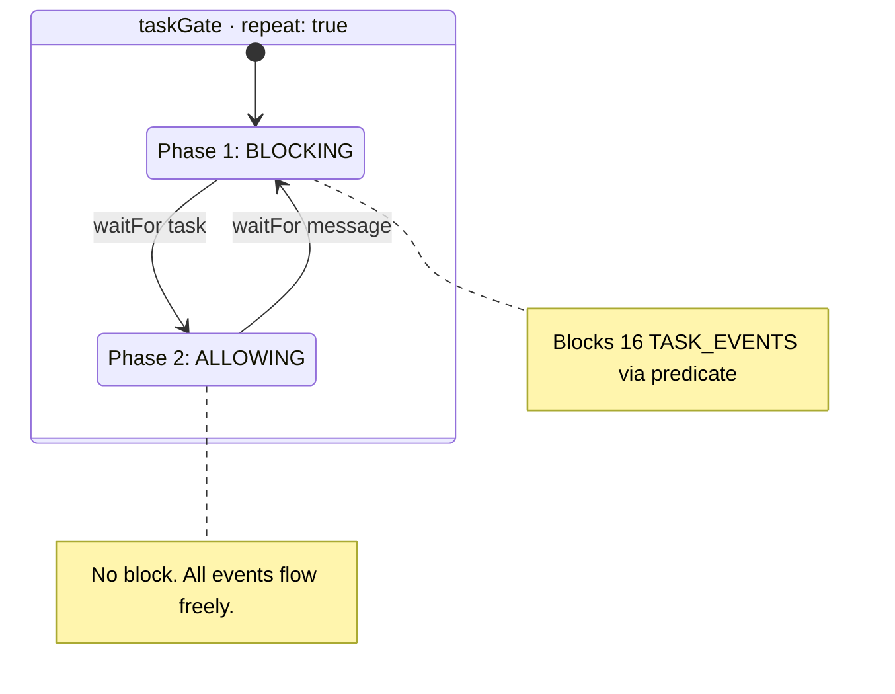

**taskGate block predicate:** `(e) => TASK_EVENTS.has(e.type)` — blocks: invoke_inference, model_response, gate_rejected, gate_read_only, gate_side_effects, gate_high_ambiguity, simulate_request, simulation_result, eval_approved, eval_rejected, execute, tool_result, save_plan, plan_saved, context_ready, loop_complete.

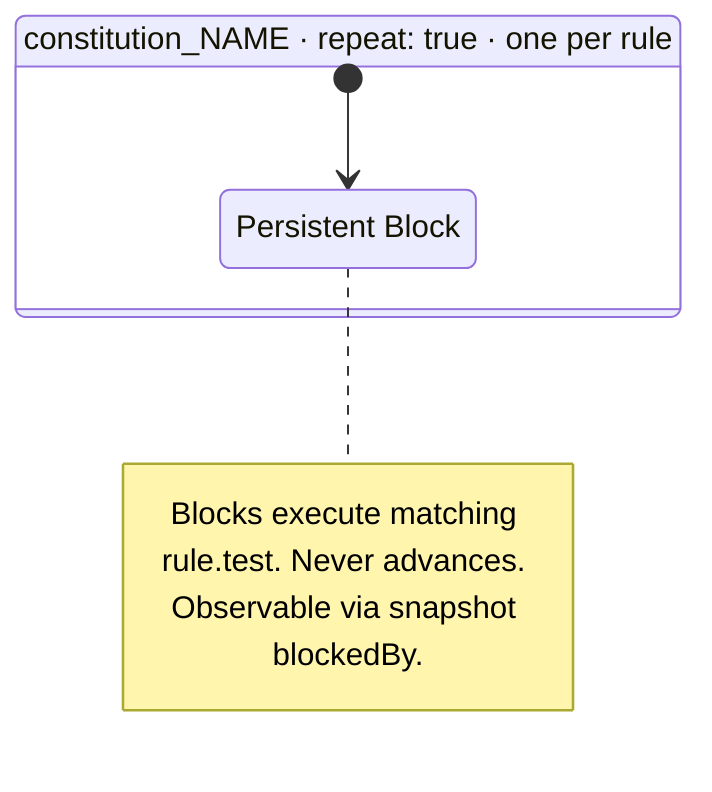

**constitution block predicate:** `(event) => event.type === 'execute' && rule.test(event.detail?.toolCall)` — defense-in-depth layer. `SelectionBid.blockedBy = "constitution_{name}"` appears in snapshots.

### 5b. Per-Task Thread (added dynamically in `task` handler)

```mermaid
stateDiagram-v2
    state "maxIterations · one-shot · per-task" as MI {
        state "Counting step 1..N" as MIC
        state "Limit Reached" as MIL
        state "Terminated" as MIT

        [*] --> MIC
        MIC --> MIC : waitFor tool_result
        MIC --> MIL : after N tool_results
        MIC --> MIT : interrupt message
        MIL --> MIT : interrupt message or request fires
        MIT --> [*]
    }

    note right of MIC : N = maxIterations, default 50. interrupt: message
    note right of MIL : block execute + request message. EPHEMERAL block.
```

**maxIterations sync points:**
- Counting: `bSync({ waitFor: 'tool_result', interrupt: ['message'] })` repeated N times
- Limit: `bSync({ block: 'execute', request: { type: 'message', detail: { content: 'Max iterations reached' } }, interrupt: ['message'] })` — block is ephemeral, vanishes after request fires

### 5c. Per-Response Thread (added dynamically in `model_response` handler)

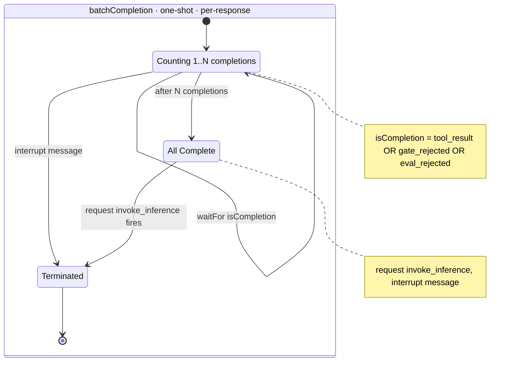

**batchCompletion details:** N = number of action calls in model response. Each completion event (tool_result, gate_rejected, eval_rejected) advances one step. After all N complete, requests `invoke_inference` to re-enter the loop.

### 5d. Per-Call Dynamic Threads (added per tool call)

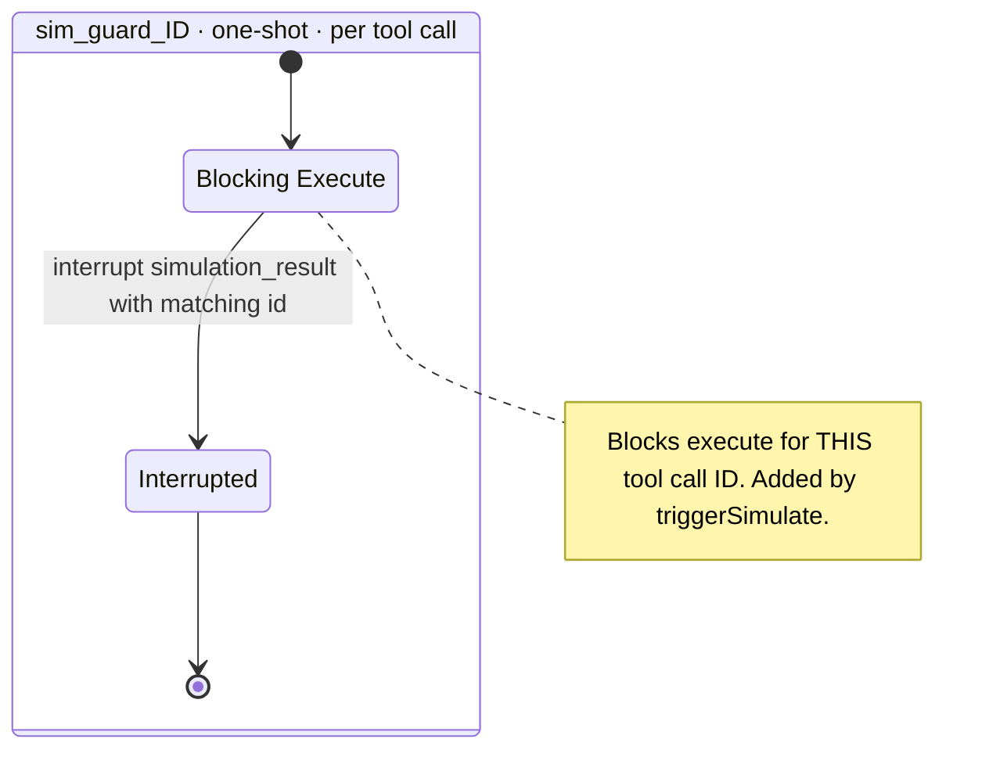

**sim_guard block/interrupt predicates:**
- block: `(e) => e.type === 'execute' && e.detail?.toolCall?.id === id`
- interrupt: `(e) => e.type === 'simulation_result' && e.detail?.toolCall?.id === id`
- Added by: gate_side_effects / gate_high_ambiguity handlers via `triggerSimulate()`

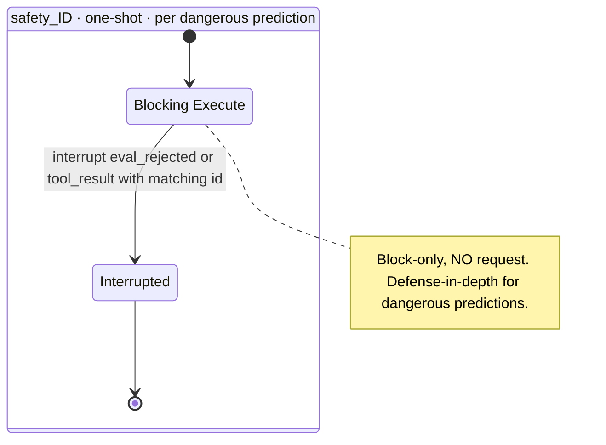

**safety block/interrupt predicates:**
- block: `(e) => e.type === 'execute' && e.detail?.toolCall?.id === id`
- interrupt: `(e) => (e.type === 'eval_rejected' && e.detail?.toolCall?.id === id) || (e.type === 'tool_result' && e.detail?.result?.toolCallId === id)`
- Added by: simulate_request handler ONLY when `checkSymbolicGate` returns blocked
- **Block-only (no request)** because of Interrupted Thread Timing discovery: bonus super-step after interrupt could prematurely select a request. The eval_approved handler produces eval_rejected for workflow coordination; this bThread catches anything the handler misses.

---

## 6. Trigger Map — Who Triggers What

Every `trigger()` call and its source location.

```mermaid
graph LR
    subgraph "External Entry"
        RUN["run&#40;prompt&#41;<br/>triggers: <b>task</b>"]
    end

    subgraph "task handler"
        T1["triggers: <b>invoke_inference</b>"]
    end

    subgraph "invoke_inference handler"
        T2["triggers: <b>model_response</b>"]
        T2E["on error triggers: <b>message</b>"]
    end

    subgraph "model_response handler"
        T3A["per action: triggers: <b>context_ready</b>"]
        T3B["per plan: triggers: <b>save_plan</b>"]
        T3C["no tools: triggers: <b>message</b>"]
    end

    subgraph "context_ready handler"
        T4A["!approved → triggers: <b>gate_rejected</b>"]
        T4B["read_only → triggers: <b>gate_read_only</b>"]
        T4C["side_effects → triggers: <b>gate_side_effects</b>"]
        T4D["high_ambiguity → triggers: <b>gate_high_ambiguity</b>"]
    end

    subgraph "gate_read_only handler"
        T5["triggers: <b>execute</b>"]
    end

    subgraph "gate_side_effects / gate_high_ambiguity handlers"
        T6["triggers: <b>simulate_request</b>"]
    end

    subgraph "simulate_request handler"
        T7["triggers: <b>simulation_result</b>"]
    end

    subgraph "simulation_result handler"
        T8A["approved → triggers: <b>eval_approved</b>"]
        T8B["rejected → triggers: <b>eval_rejected</b>"]
    end

    subgraph "eval_approved handler"
        T9A["safe → triggers: <b>execute</b>"]
        T9B["dangerous → triggers: <b>eval_rejected</b>"]
    end

    subgraph "execute handler"
        T10["triggers: <b>tool_result</b>"]
    end

    subgraph "save_plan handler"
        T11["triggers: <b>plan_saved</b>"]
    end

    subgraph "plan_saved handler"
        T12["triggers: <b>invoke_inference</b>"]
    end

    subgraph "batchCompletion bThread"
        T13["after N completions<br/>requests: <b>invoke_inference</b>"]
    end

    subgraph "maxIterations bThread"
        T14["after N tool_results<br/>requests: <b>message</b>"]
    end

    RUN --> T1
    T1 --> T2
    T2 --> T3A
    T2E -.->|error path| T3C
    T3A --> T4A
    T3A --> T4B
    T3A --> T4C
    T3A --> T4D
    T3B --> T11
    T4B --> T5
    T4C --> T6
    T4D --> T6
    T6 --> T7
    T7 --> T8A
    T7 --> T8B
    T8A --> T9A
    T8A --> T9B
    T5 --> T10
    T9A --> T10
    T10 --> T13
    T4A --> T13
    T8B --> T13
    T9B --> T13
    T11 --> T12
    T12 --> T2
    T13 --> T2

    style RUN fill:#e6ffe6,stroke:#009900
    style T3C fill:#ffe6e6,stroke:#cc0000
    style T2E fill:#ffe6e6,stroke:#cc0000
    style T14 fill:#ffe6e6,stroke:#cc0000
```

---

## 7. Full Pipeline — Per-Tool-Call Event Sequence

The complete path a single tool call takes from `context_ready` through to completion.

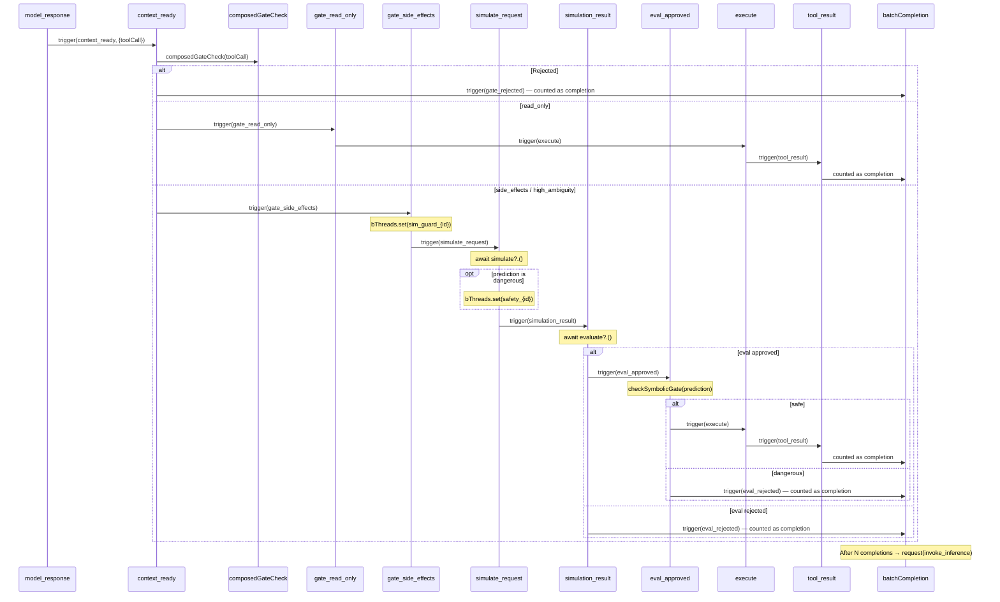

---

## 8. Orchestrator BP + IPC

```mermaid
graph TD
    subgraph "Orchestrator Process (parent)"
        subgraph "BP Program"
            OAT["<b>oneAtATime</b> bThread &#40;repeat: true&#41;<br/>Phase 1: waitFor dispatch<br/>Phase 2: block dispatch, waitFor project_result / project_error"]
            DYN["<b>project_&#123;taskId&#125;</b> bThread &#40;one-shot&#41;<br/>waitFor: project_result or project_error &#40;matching taskId&#41;<br/>interrupt: shutdown"]
        end

        subgraph "Feedback Handlers"
            HD["<b>dispatch</b> handler<br/>getOrSpawnProcess&#40;&#41;<br/>await ready handshake<br/>proc.send&#40;task message&#41;"]
            HR["<b>project_result</b> handler<br/>resolver.resolve&#40;&#41;<br/>activeTask = false<br/>drainQueue&#40;&#41;"]
            HE["<b>project_error</b> handler<br/>resolver.reject&#40;&#41;<br/>activeTask = false<br/>drainQueue&#40;&#41;"]
        end

        Q["Task Queue<br/>&#40;external to BP — blocked dispatches queued here&#41;"]
        PM["Pending Resolvers Map<br/>taskId → &#123; resolve, reject &#125;"]
        PP["Process Pool Map<br/>projectName → ManagedProcess"]
    end

    subgraph "Worker Process (child)"
        W_INIT["Receive 'init' →<br/>createAgentLoop&#40;&#41;<br/>subscribe + send 'ready'"]
        W_TASK["Receive 'task' →<br/>trigger client_connected + task<br/>message handler sends 'result'"]
        W_SHUT["Receive 'shutdown' →<br/>node.destroy&#40;&#41;<br/>process.exit&#40;&#41;"]
    end

    HD -->|"proc.send({type: 'task'})"| W_TASK
    W_TASK -->|"IPC: {type: 'result'}"| HR
    W_TASK -->|"IPC: {type: 'error'}"| HE
    HR --> Q
    HE --> Q
    Q -->|"drainQueue → trigger(dispatch)"| HD

    style OAT fill:#fff3e6,stroke:#cc6600
    style Q fill:#f0f0f0,stroke:#666
```

### IPC Message Protocol

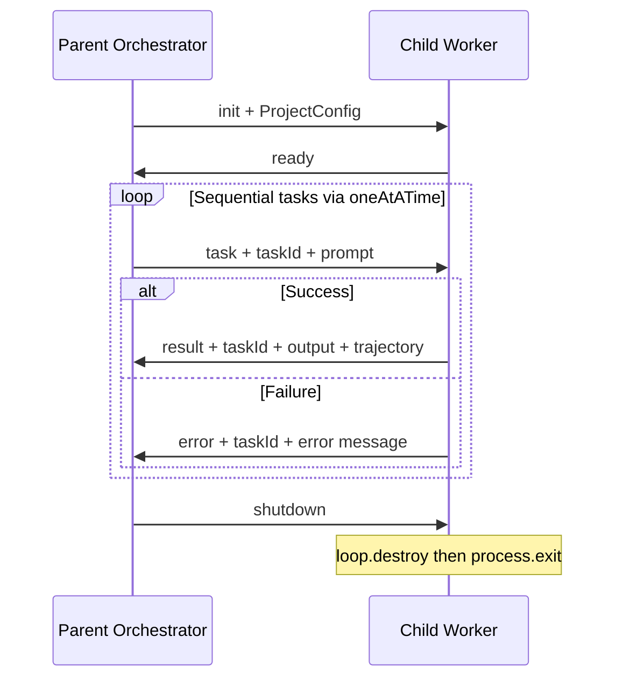

---

## 9. Three-Layer Safety Architecture

How constitution rules, handlers, and bThreads form three non-substitutable layers.

```mermaid
graph TB
    subgraph "Layer 1: Snapshot (Observability)"
        L1["useSnapshot → SQLite event_log<br/>Model sees: 'Blocked: execute &#40;thread: constitution_noRmRf&#41; by constitution_noRmRf'<br/>in system prompt via formatSelectionContext&#40;&#41;"]
    end

    subgraph "Layer 2: Handler (Workflow Coordination)"
        L2A["context_ready handler<br/>composedGateCheck&#40;&#41; → gate_rejected<br/>batchCompletion COUNTS this event"]
        L2B["eval_approved handler<br/>checkSymbolicGate&#40;&#41; → eval_rejected<br/>batchCompletion COUNTS this event"]
    end

    subgraph "Layer 3: bThread (Defense-in-Depth)"
        L3A["constitution_&#123;name&#125; bThread<br/>block: execute matching rule.test&#40;&#41;<br/>Blocked events DON'T fire handlers"]
        L3B["safety_&#123;id&#125; bThread<br/>block: execute for dangerous prediction<br/>Catches anything handler misses"]
    end

    L1 -.->|"passive observation"| L2A
    L2A -->|"produces workflow event<br/>&#40;gate_rejected&#41;"| L3A
    L2B -->|"produces workflow event<br/>&#40;eval_rejected&#41;"| L3B
    L3A -->|"blocks if handler fails<br/>to reject"| L1
    L3B -->|"blocks if handler fails<br/>to reject"| L1

    style L1 fill:#e6f3ff,stroke:#0066cc
    style L2A fill:#e6ffe6,stroke:#009900
    style L2B fill:#e6ffe6,stroke:#009900
    style L3A fill:#ffe6e6,stroke:#cc0000
    style L3B fill:#ffe6e6,stroke:#cc0000
```

**Why all three are non-substitutable:**

| Layer | What happens if removed |
|-------|------------------------|
| **Snapshot** | Model can't see blocks/rejections in context → can't learn from them |
| **Handler** | Blocked events don't produce workflow events → batchCompletion deadlocks (counts N, gets N-1) |
| **bThread** | Handler bug lets dangerous call through → no structural safety net |
