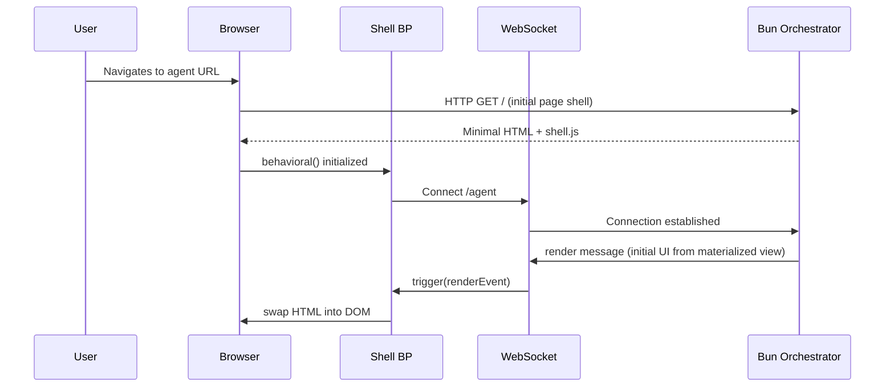
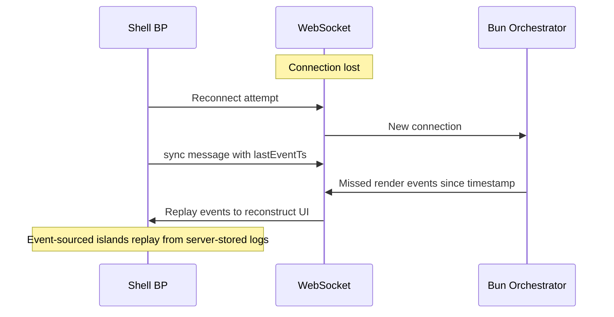

# UI Rewrite Guide

Practical guide for rewriting `src/ui/`, `src/testing/`, and `src/workshop/` to support the generative web UI architecture defined in [UI.md](UI.md).

## Guiding Principles

1. **Server-push, not component-library.** The agent generates JSX; the server calls `ssr()`; the client is a thin behavioral shell.
2. **bElement is escalation, not default.** Most generative UI is Level 0–2. bElement exists for Level 3–4 (form association, true encapsulation).
3. **`src/testing/` is fully deleted.** Testing moves to `bun test` (primitives) + eval harness (agent trajectories) + V5 layered pipeline (generated UI validation). Bun's built-in `expect()` replaces custom assertion helpers. Playwright MCP / Chrome DevTools MCP replace DOM query/interaction utilities.
4. **Atomic CSS eliminates Shadow DOM's style value.** `createStyles` hash-based class names prevent collision without encapsulation.

## `src/ui/` File Inventory

### Keep — Core Primitives

These files power the generative web UI rendering pipeline. They stay, possibly with modifications.

| File | Role | Changes Needed |
|---|---|---|
| `create-template.ts` | JSX factory (`h`, `Fragment`) | None — this IS the generation pipeline |
| `create-template.types.ts` | `TemplateObject`, `FunctionTemplate`, HTML/ARIA/SVG attribute types | None |
| `create-template.constants.ts` | `P_TARGET`, `P_TRIGGER`, `VOID_TAGS`, `BOOLEAN_ATTRS` | None |
| `ssr.ts` | Server-side rendering `TemplateObject` → HTML string | Modify: style collection needs to work with style deduplication tracker (see new files) |
| `create-styles.ts` | Atomic CSS with hash-based class names | Review: ensure it works in light DOM context (no Shadow DOM adoption needed for L0-L2) |
| `create-tokens.ts` | Design tokens as CSS custom properties | Review: tokens should scope to `:root` or document, not `:host` |
| `create-keyframes.ts` | `@keyframes` animation generation | None |
| `css.types.ts` | CSS type definitions | Keep — may need to add types for style deduplication |
| `css.constants.ts` | CSS reserved keys | None |
| `css.utils.ts` | Hash generation, rule creation, type guards | None |
| `join-styles.ts` | Combine multiple style objects | None |
| `delegated-listener.ts` | Event listener class for delegation | Keep — used by shell BP for `p-trigger` handling |

### Modify — Scope Changes

| File | Current Role | New Role | What Changes |
|---|---|---|---|
| `create-host-styles.ts` | `:host` styles for Shadow DOM | Keep but not primary path | Only used for Level 3–4 (bElement). L0–L2 use `createStyles` with light DOM. |
| `create-tokens.ts` | Tokens scoped to `:host` | Tokens scoped to `:root` or document | Default scope changes from Shadow DOM host to document root. Server pushes token sets via `patch` message. |

### Keep — bElement (Level 3–4 Only)

These files stay but are no longer the primary rendering path. They're escalation for form association and true encapsulation.

| File | Role | Notes |
|---|---|---|
| `b-element.ts` | Custom element factory with BP | Level 3–4 only |
| `b-element.types.ts` | Type definitions | Keep for bElement consumers |
| `b-element.constants.ts` | Callback names, template identifier | Keep |
| `b-element.guards.ts` | `isBehavioralElement()`, `isBehavioralTemplate()` | Keep for runtime detection |
| `b-element.utils.ts` | DOM binding, template cloning | Keep for bElement internals |
| `use-template.ts` | Template factory for dynamic content | Keep — useful for bElement contexts |
| `use-emit.ts` | Custom event dispatcher | Keep for bElement cross-shadow communication |
| `use-attributes-observer.ts` | MutationObserver for slotted elements | Keep for bElement slot patterns |

### Removed

| File | Fate |
|---|---|
| `inspector.ts` | Removed. Inspector concept moved to the agent loop's `useSnapshot`. |

## New Files Needed

### Style Deduplication Tracker

**`src/ui/create-style-tracker.ts`**

Tracks which stylesheets have been sent to each WebSocket connection. First render sends all styles; subsequent renders only send new ones.

```typescript
// Per-connection style tracker
export const createStyleTracker = () => {
  const sent = new Set<string>()
  return {
    dedup: (stylesheets: string[]): string => {
      const fresh = stylesheets.filter(s => !sent.has(s))
      for (const s of fresh) sent.add(s)
      return fresh.length ? `<style>${fresh.join('')}</style>` : ''
    },
    reset: () => sent.clear(),
  }
}
```

### Message Protocol — Implemented

**`src/ui/shell.schema.ts`**

Zod schemas are the single source of truth for the server ↔ client protocol. All types are derived via `z.infer`. Event type literals come from `SHELL_EVENTS` constants.

**Server → Client**: `RenderMessageSchema`, `AttrsMessageSchema`, `StreamMessageSchema`, `DisconnectMessageSchema`
**Client → Server**: `UserActionMessageSchema` (detail: action name string), `RenderedMessageSchema` (detail: target string)

`ShellHandlers` is derived automatically via a mapped type over the `ShellMessage` union.

#### Streaming Protocol

Cortex output streams token-by-token:

1. Server starts inference → sends `render` with a stream target region
2. Each token → sends `stream` message with content fragment
3. Shell BP accumulates chunks, flushes on `requestAnimationFrame`
4. Inference complete → sends `render` replacing the stream region with final content

### Client Shell — Complete

**`src/ui/shell.ts`** — Implemented. Uses `useBehavioral` with feedback handlers for render, attrs, stream, user_action, rendered, and disconnect. See source for details.

## Server Render Pipeline

The agent generates UI through a tool-call pipeline:

```
Cortex reasons → Actuator emits render tool call → useFeedback handler → JSX → ssr() → WebSocket
```

The server-side rendering uses Plaited's type-safe JSX throughout. Templates are `FT<Props>` functions that produce `TemplateObject`s — never raw HTML strings.

Type safety flows end-to-end: `FT<Props>` validates prop types at compile time, `h()` produces typed `TemplateObject`s, `ssr()` converts to HTML strings. Invalid attributes, wrong prop types, and bad nesting are caught by the TypeScript compiler — feeding back into the agent loop as gate rejections.

### Level 2+ Bundling

For interactive UI (Level 2+), the server bundles typed thread modules via `Bun.build()`:

```typescript
import { ssr } from 'plaited/ui'

// In the render tool call handler
const template = FormWizard({ steps })
const html = ssr(template)
const styleTag = styleTracker.dedup(template.stylesheets)

// Bundle the typed thread module
const bundle = await Bun.build({
  entrypoints: [generatedThreadModulePath],
  external: ['plaited'],
  minify: true,
})
const bundleHash = Bun.hash(await bundle.outputs[0]!.text())
serveBundleAtPath(`/gen/${bundleHash}.js`, bundle.outputs[0]!)

// Send HTML + script tag
ws.send(JSON.stringify({
  type: 'render',
  detail: {
    target: 'main',
    html: `${styleTag}${html}<script type="module" src="/gen/${bundleHash}.js"></script>`,
    swap: 'innerHTML',
  },
}))
```

Because thread modules are TypeScript with typed imports, the compiler catches errors before the agent's code reaches the client. Invalid `bSync` arguments, wrong event types, missing imports — all caught at build time and fed back to the Cortex as gate rejections.

### Tool Call Format

The agent's Actuator makes tool calls. UI generation is a tool call like any other, processed through the same Actuator → Gate → Execute pipeline:

```typescript
// Level 0 — static plan view
{ tool: 'render_ui', args: { view: 'plan', data: { steps: [...] } } }

// Level 2 — interactive form wizard with behavioral threads
{ tool: 'render_ui', args: { view: 'form_wizard', data: { steps: [...] }, interactive: true } }

// Level 3 — custom element with form association
{ tool: 'render_ui', args: { view: 'custom_toggle', data: { ... }, formAssociated: true } }
```

The server-side `useFeedback` handler interprets these:

1. Generates or selects JSX (`FT` templates) for the requested view
2. If `interactive`, generates a typed behavioral thread module
3. If `formAssociated`, generates a typed custom element class
4. Type-checks and bundles any client JS via `Bun.build()`
5. Calls `ssr()` to produce HTML from `TemplateObject`
6. Deduplicates styles against the connection's sent set
7. Pushes over WebSocket

## Lifecycle & Recovery

### Connection



### Reconnection



### Crash Recovery

- **Browser refresh:** Shell reconnects. Server re-renders current state from materialized views. Event-sourced islands restore from server-stored event logs.
- **Server restart:** Event log persists in SQLite. Materialized views rebuild. WebSocket reconnects. Fresh render sent.
- **Both crash:** On next connection, event log replays. Agent resumes from last recorded decision.

## Generation Spectrum — Reference Examples

The agent generates UI at any point on this spectrum. These examples show what flows through the server render pipeline at each level.

### Level 0–1: Server-Rendered JSX

Zero client JS beyond the shell. Native HTML interactivity provides instant feedback: `<details>` expands/collapses, `<dialog>` manages focus trapping, CSS `:checked` + sibling selectors toggle visual state — all without JS or server round-trips.

```typescript
import type { FT } from 'plaited/ui'
import { createStyles } from 'plaited/ui'

const styles = createStyles({
  toolOutput: { fontFamily: 'monospace', fontSize: '0.875rem' },
  confirmDialog: { padding: '1.5rem', maxWidth: '24rem' },
  actions: { display: 'flex', gap: '0.5rem', justifyContent: 'flex-end' },
})

// Expandable tool output — Level 1, no JS, no round-trip
const ToolOutput: FT<{ command: string; output: string }> = ({ command, output }) => (
  <details>
    <summary {...styles.toolOutput}>{command}</summary>
    <pre><code>{output}</code></pre>
  </details>
)

// Confirmation dialog — Level 1, native <dialog>, accessible
const ConfirmDialog: FT<{ prompt: string; action: string }> = ({ prompt, action }) => (
  <dialog p-target="confirm-dialog" open {...styles.confirmDialog}>
    <p>{prompt}</p>
    <div {...styles.actions}>
      <button p-trigger={{ click: `${action}:approve` }}>Approve</button>
      <button p-trigger={{ click: `${action}:deny` }}>Deny</button>
    </div>
  </dialog>
)
```

### Level 2: JSX + Behavioral Threads

When the agent needs client-side coordination that native HTML can't provide, it generates typed behavioral thread modules alongside the JSX. The server bundles these via `Bun.build()` and includes a `<script>` tag in the rendered HTML.

```typescript
// Generated by the agent: wizard-threads.ts
import { bThread, bSync } from 'plaited'
import type { BThreads, Trigger } from 'plaited'

type WizardDetail = {
  stepIndex: number
  valid: boolean
}

export const registerWizardThreads = (
  bThreads: BThreads,
  trigger: Trigger,
) => {
  let currentStep = 0

  bThreads.set({
    'wizard:validation': bThread([
      bSync({
        waitFor: ({ type }) => type === 'wizard:next',
        block: ({ type, detail }) =>
          type === 'wizard:advance' && !(detail as WizardDetail).valid,
      }),
      bSync({ request: { type: 'wizard:showErrors' } }),
    ], true),

    'wizard:progress': bThread([
      bSync({ waitFor: 'wizard:advance' }),
      bSync({
        request: () => {
          currentStep++
          return { type: 'wizard:renderStep', detail: { stepIndex: currentStep } }
        },
      }),
    ], true),

    'wizard:syncToServer': bThread([
      bSync({ waitFor: 'wizard:advance' }),
      bSync({ request: { type: 'sendToServer' } }),
    ], true),
  })
}
```

The corresponding JSX template:

```typescript
import type { FT } from 'plaited/ui'
import { createStyles } from 'plaited/ui'

type WizardStep = { label: string; fields: FT[] }

const styles = createStyles({
  wizard: { display: 'flex', flexDirection: 'column', gap: '1rem' },
  stepIndicator: { display: 'flex', gap: '0.5rem' },
  activeStep: { fontWeight: '700', color: 'var(--text-1)' },
})

const FormWizard: FT<{ steps: WizardStep[] }> = ({ steps }) => (
  <div p-target="wizard" {...styles.wizard}>
    <nav {...styles.stepIndicator}>
      {steps.map((s, i) => (
        <span data-step={i} {...(i === 0 ? styles.activeStep : {})}>
          {s.label}
        </span>
      ))}
    </nav>
    <div p-target="wizard-content">
      {steps[0]?.fields}
    </div>
    <button p-trigger={{ click: 'wizard:next' }}>Next</button>
  </div>
)
```

### Level 3–4: Custom Elements

Custom elements are used when the platform demands them — form association via `ElementInternals`, true DOM encapsulation, or slot-based composition.

```typescript
// Level 3 — custom element for form association, no behavioral needed
import { createStyles } from 'plaited/ui'

const styles = createStyles({
  track: {
    width: '2.5rem',
    height: '1.25rem',
    borderRadius: '0.625rem',
    backgroundColor: 'var(--surface-2)',
    transition: 'background-color 150ms',
    cursor: 'pointer',
  },
  thumb: {
    width: '1rem',
    height: '1rem',
    borderRadius: '50%',
    backgroundColor: 'var(--surface-1)',
    transition: 'transform 150ms',
  },
})

class CustomToggle extends HTMLElement {
  static formAssociated = true
  #internals: ElementInternals

  constructor() {
    super()
    this.#internals = this.attachInternals()
  }

  connectedCallback() {
    if (this.hasAttribute('checked')) {
      this.#internals.states.add('checked')
      this.#internals.setFormValue('on', this.getAttribute('value') ?? 'checked')
    }
    this.addEventListener('click', this.#handleClick)
  }

  disconnectedCallback() {
    this.removeEventListener('click', this.#handleClick)
  }

  #handleClick = () => {
    if (this.#internals.states.has('disabled')) return
    const checked = !this.#internals.states.has('checked')
    this.#internals.states.toggle('checked')
    this.#internals.setFormValue(checked ? 'on' : 'off')
    this.dispatchEvent(new Event('change', { bubbles: true }))
  }
}
```

For Level 4 (custom element + behavioral coordination), the element uses `bElement` from `plaited/ui` when it needs the full BP toolkit — blocking, thread composition, `useSnapshot` observability.

### Event-Sourced State (Complex Elements)

For elements with state worth preserving — code editors, multi-step workflows, drag-and-drop builders — the agent generates event-sourced behavioral programs. State is derived from an event log, never directly mutated. `useSnapshot()` captures every BP decision. Undo is log replay.

```typescript
import { behavioral, bThread, bSync } from 'plaited'
import type { BPEvent, Trigger } from 'plaited'

type EditorState = {
  content: string
  cursor: number
  selections: Array<{ start: number; end: number }>
}

const createEditor = (el: HTMLElement, shellTrigger: Trigger) => {
  const { trigger, bThreads, useFeedback, useSnapshot } = behavioral()

  const eventLog: BPEvent[] = []
  let state: EditorState = { content: '', cursor: 0, selections: [] }

  // Every BP decision is logged — state is derived, not mutated
  useSnapshot((candidates) => {
    const selected = candidates.find(c => c.selected)
    if (selected) {
      eventLog.push(selected)
      state = reduceEditorState(state, selected)
    }
  })

  bThreads.set({
    edit: bThread([
      bSync({ waitFor: 'keystroke' }),
      bSync({
        request: ({ detail }) => ({
          type: 'applyEdit',
          detail: computeEdit(state, detail as KeyboardEvent),
        }),
      }),
    ], true),

    undoRedo: bThread([
      bSync({ waitFor: ({ type }: BPEvent) => type === 'undo' || type === 'redo' }),
      bSync({
        request: ({ type }: BPEvent) => {
          if (type === 'undo') {
            const withoutLast = eventLog.filter(e => e.type === 'applyEdit').slice(0, -1)
            return { type: 'restoreState', detail: replayLog(withoutLast) }
          }
          return { type: 'noop' }
        },
      }),
    ], true),

    periodicSync: bThread([
      bSync({ waitFor: 'applyEdit' }),
      bSync({ request: { type: 'syncToServer' } }),
    ], true),
  })

  useFeedback({
    applyEdit() { renderEditor(el, state) },
    restoreState({ detail }: { detail: EditorState }) {
      state = detail
      renderEditor(el, state)
    },
    syncToServer() {
      shellTrigger({
        type: 'islandEvent',
        detail: { islandId: el.id, event: { type: 'editorSync', detail: state } },
      })
    },
  })

  return {
    trigger,
    // Restore from server-provided event log — crash recovery
    restore(events: BPEvent[]) {
      for (const e of events) {
        eventLog.push(e)
        state = reduceEditorState(state, e)
      }
      renderEditor(el, state)
    },
  }
}
```

| Use Case | Event-Sourced? | Reason |
|----------|---------------|--------|
| Code editor | Yes | Undo/redo, crash recovery, collaborative potential |
| Multi-step form wizard | Maybe | Undo is valuable; crash recovery depends on session length |
| Drag-and-drop reorder | Yes | Undoable, state is complex |
| Toggle / checkbox | No | Trivial state, no undo needed |
| Confirmation dialog | No | Stateless — appears, user responds, gone |
| Streaming text | No | Ephemeral — replaced by final render |

## `src/testing/` — Fully Deleted

The entire `src/testing/` module is removed. Every file:

| File | Reason for Deletion |
|---|---|
| `story.tsx` | Story factory — stories removed |
| `plaited-fixture.tsx` | bElement test harness — stories removed |
| `plaited-header.tsx` | Workshop UI chrome — stories removed |
| `plaited-mask.tsx` | Workshop overlay — stories removed |
| `plaited-orchestrator.tsx` | Browser test orchestrator — replaced by eval harness |
| `use-interact.ts` | DOM interaction bridge — coupled to fixture architecture, replaced by Playwright MCP |
| `use-messenger.ts` | WebSocket fixture communication — stories removed |
| `use-web-socket.ts` | WebSocket client for test runner — stories removed |
| `testing.utils.ts` | Custom `assert`/`match`/`throws`/`findBy*`/`fireEvent`/`accessibilityCheck` — all replaced by Bun's `expect()`, standard DOM APIs, Playwright MCP, and eval harness graders |
| `testing.types.ts` | Types for story testing API — stories removed |
| `testing.schemas.ts` | Zod schemas for fixture ↔ runner protocol — stories removed |
| `testing.constants.ts` | Event types and fixture constants — stories removed |
| `testing.errors.ts` | Custom error classes for story failures — stories removed |
| All `.stories.tsx` files | Stories removed |
| All test fixtures | Coupled to story infrastructure |

**`src/testing.ts` barrel file** — deleted entirely.

**`package.json` exports** — remove `"./testing"` and `"./testing/*.ts"` and `"./testing/*.tsx"` subpath exports.

## `src/workshop/` — What Stays, What Goes

### Keep

| File | New Role |
|---|---|
| `get-server.ts` | Web adapter dev server — serves the generative web UI preview. Modify for WebSocket message protocol. |
| `use-dev-command.ts` | Dev command for the design workstation (ACP + web preview loop) |
| `workshop.types.ts` | Update for new server patterns |

### Delete

| File | Reason |
|---|---|
| `collect-stories.ts` | Story discovery — stories removed |
| `collect-behavioral-templates.ts` | BehavioralTemplate discovery for workshop — not needed |
| `get-paths.ts` | Story URL routing — stories removed |
| `get-entry-routes.ts` | Story JS bundling — stories removed |
| `get-html-routes.tsx` | Story HTML pages — stories removed |
| `get-root.ts` | Common root for story paths — stories removed |
| `use-runner.ts` | Playwright test orchestrator — replaced by eval harness |
| `use-test-command.ts` | Test command — rewritten or removed |
| `check-playwright.ts` | Playwright availability check — Playwright managed differently now |
| `workshop.schemas.ts` | Schemas for story runner protocol — stories removed |
| `workshop.utils.ts` | Story/template discovery utilities — stories removed |

## Barrel File Changes

### `src/ui.ts`

**Add exports:**
- `./ui/create-style-tracker.ts`
- `./ui/protocol.types.ts`
- `./ui/protocol.schemas.ts`
- `./ui/shell.ts`
- `./ui/thread-region-tracker.ts`

**Keep all existing exports** — the core primitives don't change.

### `src/testing.ts`

**Delete entirely.**

### `src/workshop.ts`

**Rewrite** — remove story collection/routing exports, keep server and dev command exports.

### `package.json`

Remove testing subpath exports. Keep workshop exports (narrowed).

## Testing Strategy

### Tier 1: `bun test` — Primitives

Unit tests for the UI primitives using Bun's built-in `expect()`.

| What | Test File | What to Assert |
|---|---|---|
| JSX factory (`h`, `Fragment`) | `create-template.spec.ts` (exists) | Template objects, escaping, attributes, children |
| `ssr()` | `ssr.spec.tsx` (exists) | HTML output, style collection, content escaping |
| `createStyles` | `css.spec.tsx` (exists) | Hash determinism, class name generation, rule output |
| `createTokens` | `css.spec.tsx` (exists) | Custom property generation, nesting, `:root` scoping |
| `createKeyframes` | `css.spec.tsx` (exists) | Animation rule output |
| `joinStyles` | New spec | Style merging, deduplication |
| `createStyleTracker` | New spec | Dedup logic, reset, first-render vs subsequent |
| Protocol schemas | New spec | Zod parse/reject for each message type |
| `DelegatedListener` | New spec | Event delegation, sync/async callbacks |
| Shell BP threads | New spec (with happy-dom) | Input protection, stream batching, render ack |
| bElement | New spec (with happy-dom) | Level 3–4 custom element lifecycle, form association |

### Tier 2: Eval Harness — Agent UI Generation

Design tasks with graders that validate the agent's ability to generate correct UI.

```jsonl
{"id":"gen-nav","input":"Generate a responsive navigation bar","hint":"nav element, responsive breakpoints, keyboard navigable"}
{"id":"gen-form","input":"Generate an accessible login form","hint":"labels, ARIA, error states, form validation"}
{"id":"gen-table","input":"Generate a sortable data table","hint":"table element, sort controls, ARIA sort attributes"}
```

Graders validate: semantic HTML, accessibility (axe-core), style token usage, bThread correctness.

### Tier 3: V5 Pipeline — Generated UI Validation

The three-layer pipeline from [UI.md](UI.md#v5-layered-validation-pipeline):

1. **Constitution Gate** — bThread block predicates validate Structural-IA/Modnet compliance
2. **Agent Self-Exercise** — Agent uses Playwright MCP / Chrome DevTools MCP on its own generated UI
3. **Human Critique** — Engineer feedback via design workstation

## Migration Order

### Phase 1: Core Primitives (No Breaking Changes)

1. Add `src/ui/create-style-tracker.ts` + spec
2. Add `src/ui/protocol.types.ts`
3. Add `src/ui/protocol.schemas.ts` + spec
4. Review `create-tokens.ts` for `:root` scoping (currently `:host`)
5. Review `create-styles.ts` for light DOM context
6. Ensure all existing `bun test` specs pass

### Phase 2: Client Shell

1. Add `src/ui/shell.ts` — behavioral shell with core threads (see [Client Shell](#client-shell) above)
2. Add `src/ui/thread-region-tracker.ts`
3. Write shell spec with happy-dom

### Phase 3: Server Integration

1. Modify `src/workshop/get-server.ts` for WebSocket message protocol
2. Update `src/workshop/use-dev-command.ts` for design workstation
3. Wire `ssr()` + style tracker + WebSocket push (see [Server Render Pipeline](#server-render-pipeline) above)

### Phase 4: Delete Legacy

1. Delete `src/testing/` entirely
2. Delete `src/testing.ts` barrel
3. Delete all `.stories.tsx` files
4. Delete story infrastructure from `src/workshop/`
5. Update `package.json` exports
6. Update `src/workshop.ts` barrel

### Phase 5: ACP + CLI

1. Define CLI JSON interface (capability surface)
2. Implement ACP adapter as flag (`plaited acp`) using `@agentclientprotocol/sdk`
3. Create headless adapter schema for the plaited CLI
