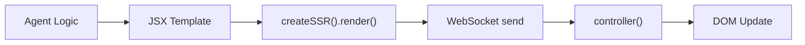

# UI Rewrite Guide

Status report on the generative web UI framework. Documents what `plaited` and `plaited/ui` provide today, what was removed and why, and what open questions remain before server integration.

**Audience:** This framework is designed for an agent, not a human. The agent generates files, the server serves them. Some files are prebuilt, some are generated on-the-fly.

## Guiding Principles

1. **Server-push, not component-library.** The agent generates JSX; the server calls `createSSR().render()`; the client is a thin behavioral controller.
2. **`controlIsland` is escalation, not default.** Most generative UI is server-rendered HTML + `p-trigger` bindings. Islands exist for isolated interactivity with their own BP engine and WebSocket.
3. **`behavioral()` is the only primitive.** `useBehavioral` was removed — it was too prescriptive. Direct `behavioral()` + `useFeedback` is the single coordination pattern. A new skill (distinct from the old `behavioral-core`) is needed to teach agents the genome approach for composing BP programs directly.
4. **Atomic CSS eliminates Shadow DOM's style value.** `createStyles` hash-based class names prevent collision without encapsulation. Shadow DOM is only for `decorateElements` presentational wrappers.
5. **Errors are already observable.** The `useSnapshot` listener in `controller.ts` captures all BP engine errors and sends them to the server as `snapshot` messages. No separate error protocol is needed.

## What the Framework Provides

### `plaited` — Behavioral Programming (45 exports)

| Concern | Key Exports | Purpose |
|---------|-------------|---------|
| Engine | `behavioral()` | Creates `{ trigger, bThreads, useFeedback, useRestrictedTrigger, useSnapshot }` |
| Composition | `bThread`, `bSync` | Thread sequences and synchronization idioms |
| Guards | `isBPEvent`, `isRulesFunction` | Runtime type validation |
| Utilities | `useRandomEvent`, `shuffleSyncs` | Randomization for BP |
| Schemas | `BPEventSchema`, `SelectionBidSchema`, `SnapshotMessageSchema` + inferred types | Zod runtime validation |
| Types | `Trigger`, `BThreads`, `UseFeedback`, `Handlers`, `Disconnect`, `UseRestrictedTrigger`, etc. (23 types) | Full type surface for the BP engine |

### `plaited/ui` — Generative Web UI (96 exports)

#### Server-Side Rendering

| Export | Source | Purpose |
|--------|--------|---------|
| `createSSR` | `create-ssr.ts` | Per-connection renderer: `{ render, clearStyles }`. Style dedup built-in. `:host{` -> `:root{` replacement for SSR. |

#### CSS-in-JS

| Export | Source | Purpose |
|--------|--------|---------|
| `createStyles` | `create-styles.ts` | Hash-based class names, light DOM (primary path) |
| `createHostStyles` | `create-host-styles.ts` | `:host` styles for shadow DOM (`decorateElements` only) |
| `createRootStyles` | `create-root-styles.ts` | `:root` styles for document-level styling |
| `createKeyframes` | `create-keyframes.ts` | `@keyframes` animation generation |
| `createTokens` | `create-tokens.ts` | Design tokens as CSS custom properties |
| `joinStyles` | `join-styles.ts` | Merge multiple style objects |

#### Template Types (JSX)

| Export | Source | Purpose |
|--------|--------|---------|
| `FT` | `create-template.types.ts` | Function template generic — `FT<Props>` |
| `TemplateObject` | `create-template.types.ts` | What JSX produces (tag, attrs, children, stylesheets, registry) |
| `FunctionTemplate` | `create-template.types.ts` | Callable template with `.tag` |
| `Attrs`, `CustomElementTag` | `create-template.types.ts` | Attribute types and tag-name constraint |
| + 6 detailed attribute types | `create-template.types.ts` | HTML/SVG/ARIA attribute unions |

#### Custom Elements

| Export | Source | Purpose |
|--------|--------|---------|
| `controlIsland` | `control-island.ts` | Island of control: own BP engine, WebSocket, scoped DOM. Returns a template the agent can render with or without `decorateElements` for encapsulated styling. |
| `decorateElements` | `decorate-elements.ts` | Presentational wrapper: shadow DOM + slots, no BP engine. Encapsulates styling and reduces DOM node concerns. Can wrap `controlIsland` output or stand alone. |
| `controlDocument` | `control-document.ts` | Document-level BP engine for MPA view transitions. Optional `onPageReveal` factory. |

#### Controller Protocol (Server <-> Client)

| Export | Source | Purpose |
|--------|--------|---------|
| `CONTROLLER_EVENTS` | `controller.constants.ts` | All event type strings (`render`, `attrs`, `update_behavioral`, `disconnect`, `user_action`, etc.) |
| `RESTRICTED_EVENTS` | `controller.constants.ts` | Events allowed through `restrictedTrigger` (trust boundary) |
| `SWAP_MODES` | `controller.constants.ts` | DOM insertion modes (`innerHTML`, `outerHTML`, `afterbegin`, etc.) |
| `RenderMessageSchema`, `AttrsMessageSchema`, etc. | `controller.schemas.ts` | Zod schemas for protocol validation |
| `UpdateBehavioralModuleSchema`, `UpdateBehavioralResultSchema` | `controller.schemas.ts` | Dynamic code loading contract |
| `ShellHandlers` | `controller.schemas.ts` | Mapped handler type for all controller events |

#### Document Event Types

| Export | Source | Purpose |
|--------|--------|---------|
| `DOCUMENT_EVENTS` | `control-document.ts` | `on_pagereveal`, `on_pageswap` event strings |
| `OnPageRevealMessage`, `OnPageSwapMessage` | `control-document.ts` | Message types with `detail: ViewTransition` |
| `BehavioralDocumentEventDetails` | `control-document.ts` | Mapped type for handler detail inference |
| `PageRevealFactory` | `control-document.ts` | `(trigger: Trigger) => (detail: ViewTransition) => void` |

#### Element Callback Types

| Export | Source | Purpose |
|--------|--------|---------|
| `ELEMENT_CALLBACKS` | `control-island.ts` | `on_connected`, `on_disconnected`, `on_attribute_changed`, etc. |
| `OnConnectedMessage`, `OnAttributeChangedMessage`, etc. (8 types) | `control-island.ts` | Message types with typed details |
| `BehavioralElementCallbackDetails` | `control-island.ts` | Mapped type for handler detail inference |

## What Was Removed and Why

### `useBehavioral` (from `plaited`)

**Was:** Factory pattern with `publicEvents` whitelist, `bProgram` callback, automatic `disconnect()`.

**Why removed:** Too prescriptive. It combined BP setup, event filtering, and lifecycle management into one opinionated pattern. For generative UI, the server agent needs direct access to `behavioral()` primitives — it composes `bThreads.set()`, `useFeedback()`, and `useRestrictedTrigger()` in whatever configuration the task demands. A factory with a fixed callback signature doesn't accommodate the variety of server-side orchestration patterns.

**Replace with:** `behavioral()` directly. The caller manages lifecycle. `useRestrictedTrigger()` handles the trust boundary that `publicEvents` used to provide.

**Skill note:** A new agent skill is needed that pulls the useful parts from `behavioral-core` (event selection, thread composition, synchronization idioms) but teaches the genome approach — agents compose `behavioral()` directly rather than reaching for a prescriptive factory.

### `bElement` family (from `plaited/ui`)

**Was:** `b-element.ts`, `b-element.types.ts`, `b-element.constants.ts`, `b-element.guards.ts`, `b-element.utils.ts` — a custom element factory that bundled BP engine, shadow DOM, template cloning, event delegation, and attribute observation into one abstraction.

**Why removed:** The generative UI architecture splits that concern into composable primitives:
- **`controlIsland`** handles BP + WebSocket + custom element registration for interactive islands
- **`decorateElements`** handles shadow DOM + declarative shadow root for presentational wrappers
- **`update_behavioral`** handles dynamic client-side behavior loading

These three cover all of bElement's use cases without the monolithic abstraction.

### `useWorker` (from `plaited`)

**Was:** Web Worker wrapper with structured clone messaging.

**Why removed:** `update_behavioral` replaces the need for workers. The server sends a module URL, the client `import()`s it within the BP engine's trust boundary (`restrictedTrigger`). No worker overhead, same isolation guarantees.

### `ssr()` function

**Was:** Standalone `ssr(template)` that returned HTML string.

**Why replaced:** Needed per-connection style deduplication. `createSSR()` returns `{ render, clearStyles }` — the `render` function tracks which stylesheets have been sent and only emits new ones. `clearStyles()` resets on reconnection.

### `shell.ts` / `shell.schema.ts` / `shell.constants.ts`

**Was:** Client-side behavioral shell using `useBehavioral`.

**Why renamed:** Renamed to `controller.ts` / `controller.schemas.ts` / `controller.constants.ts`. The "shell" metaphor was confusing — it's a controller that manages WebSocket lifecycle, DOM updates, and user action forwarding. The rename also dropped `useBehavioral` dependency in favor of direct `behavioral()`.

### Support utilities

| Removed | Reason |
|---------|--------|
| `use-template.ts` | Template factory was bElement-specific |
| `use-emit.ts` | Custom event dispatch was for cross-shadow communication in bElement |
| `use-attributes-observer.ts` | MutationObserver for slotted elements was bElement-specific |
| `inspector.ts` | Inspector replaced by `useSnapshot` on the BP engine |
| `use-web-socket.ts` | WebSocket client moved into `controller.ts` |

## `src/ui/` File Inventory (Current)

### Core — Server Rendering

| File | Export | Role |
|------|--------|------|
| `create-template.ts` | (JSX factory, not re-exported directly) | `h()` and `Fragment` — produces `TemplateObject` |
| `create-template.types.ts` | 11 type exports | JSX type surface |
| `create-template.constants.ts` | (internal) | `P_TARGET`, `P_TRIGGER`, `VOID_TAGS`, `BOOLEAN_ATTRS` |
| `create-ssr.ts` | `createSSR` | Per-connection renderer with style dedup |

### Core — CSS-in-JS

| File | Export | Role |
|------|--------|------|
| `create-styles.ts` | `createStyles` | Hash-based class names (primary path) |
| `create-host-styles.ts` | `createHostStyles` | `:host` styles for shadow DOM |
| `create-root-styles.ts` | `createRootStyles` | `:root` document-level styles |
| `create-keyframes.ts` | `createKeyframes` | `@keyframes` animations |
| `create-tokens.ts` | `createTokens` | Design tokens as custom properties |
| `join-styles.ts` | `joinStyles` | Merge style objects |
| `css.types.ts` | 20 type exports | CSS type definitions |
| `css.constants.ts` | (internal) | CSS reserved keys |
| `css.utils.ts` | (internal) | Hash generation, rule creation, type guards |

### Core — Client Controller

| File | Export | Role |
|------|--------|------|
| `controller.ts` | (internal, called by controlIsland/controlDocument) | WebSocket lifecycle, DOM rendering, user action forwarding, `update_behavioral` loading |
| `controller.constants.ts` | `CONTROLLER_EVENTS`, `RESTRICTED_EVENTS`, `SWAP_MODES` | Protocol event types and swap modes |
| `controller.schemas.ts` | 24 exports (schemas + inferred types) | Protocol validation |
| `delegated-listener.ts` | (internal) | Event delegation for `p-trigger` bindings |

### Core — Custom Elements

| File | Export | Role |
|------|--------|------|
| `control-island.ts` | `controlIsland` + 13 callback type exports | Interactive island with BP engine + WebSocket |
| `control-document.ts` | `controlDocument` + 7 event type exports | Document-level controller for MPA view transitions |
| `decorate-elements.ts` | `decorateElements` + 2 identifier exports | Presentational shadow DOM wrapper |

## Server Render Pipeline

The agent generates UI through this flow:



```typescript
import { createSSR, createStyles } from 'plaited/ui'
import type { FT } from 'plaited/ui'

// Per-connection — create once per WebSocket open
const { render, clearStyles } = createSSR()

// Agent generates a template
const styles = createStyles({
  card: { padding: '16px', borderRadius: '8px' },
})

const Card: FT<{ title: string }> = ({ title, children }) => (
  <div p-target="card" {...styles.card}>
    <h2>{title}</h2>
    {children}
  </div>
)

// Render and send
const html = render(<Card title="Result">Content here</Card>)
ws.send(JSON.stringify({
  type: 'render',
  detail: { target: 'main', html, swap: 'innerHTML' },
}))
```

### Dynamic Behavior Loading

For interactive UI, the server sends an `update_behavioral` message instead of `<script>` tags:

```typescript
// Server: after rendering the form UI
ws.send(JSON.stringify({
  type: 'update_behavioral',
  detail: 'https://example.com/gen/form-validation.js',
}))

// Client controller automatically:
// 1. import(url) — fetches the module
// 2. Validates: must have default export (factory function)
// 3. Calls factory(restrictedTrigger)
// 4. Registers { threads, handlers } into BP engine
// 5. Sends behavioral_updated confirmation
```

### Module Contract

```typescript
// form-validation.js — served by the server
import type { Trigger } from 'plaited'
import type { UpdateBehavioralResult } from 'plaited/ui'
import { bThread, bSync } from 'plaited'

const factory = (trigger: Trigger): UpdateBehavioralResult => ({
  threads: {
    validation: bThread([
      bSync({ waitFor: 'user_action' }),
      bSync({ request: { type: 'validate' } }),
    ], true),
  },
  handlers: {
    validate(detail) {
      // Validation logic
      trigger({ type: 'user_action', detail: { type: 'validated' } })
    },
  },
})

export default factory
```

## Protocol Message Reference

### Server -> Client

| Message | Schema | Detail | Purpose |
|---------|--------|--------|---------|
| `render` | `RenderMessageSchema` | `{ target, html, swap? }` | Insert/replace DOM content |
| `attrs` | `AttrsMessageSchema` | `{ target, attr: Record<string, string\|number\|boolean\|null> }` | Update element attributes |
| `update_behavioral` | `UpdateBehavioralMessageSchema` | `httpUrl` | Load behavioral module |
| `disconnect` | `DisconnectMessageSchema` | `undefined` | Tear down controller |

### Client -> Server

| Message | Schema | Detail | Purpose |
|---------|--------|--------|---------|
| `root_connected` | `RootConnectedMessageSchema` | `string` (element tag) | Report root element type |
| `user_action` | `UserActionMessageSchema` | `string` (action type) | User triggered an action |
| `behavioral_updated` | `BehavioralUpdatedMessageSchema` | `{ src, threads?, handlers? }` | Module loaded confirmation |
| `snapshot` | `SnapshotEventSchema` | `SnapshotMessage` | BP engine observability (includes errors) |

## Generation Spectrum

### Level 0-1: Server-Rendered JSX

Zero client JS beyond the controller. Native HTML interactivity: `<details>`, `<dialog>`, CSS `:checked` + sibling selectors.

```typescript
import type { FT } from 'plaited/ui'
import { createStyles } from 'plaited/ui'

const styles = createStyles({
  toolOutput: { fontFamily: 'monospace', fontSize: '0.875rem' },
  actions: { display: 'flex', gap: '0.5rem', justifyContent: 'flex-end' },
})

// No JS, no round-trip — <details> provides expand/collapse
const ToolOutput: FT<{ command: string; output: string }> = ({ command, output }) => (
  <details>
    <summary {...styles.toolOutput}>{command}</summary>
    <pre><code>{output}</code></pre>
  </details>
)

// p-trigger sends user_action to server — server decides what happens
const ConfirmDialog: FT<{ prompt: string; action: string }> = ({ prompt, action }) => (
  <dialog p-target="confirm-dialog" open>
    <p>{prompt}</p>
    <div {...styles.actions}>
      <button p-trigger={{ click: `${action}:approve` }}>Approve</button>
      <button p-trigger={{ click: `${action}:deny` }}>Deny</button>
    </div>
  </dialog>
)
```

### Level 2: Server JSX + Dynamic Behavioral Threads

When native HTML can't provide the coordination, the server loads behavioral modules via `update_behavioral`. Threads use pure BP — `bThread`/`bSync` with no DOM APIs.

```typescript
// Server renders the wizard UI
ws.send(JSON.stringify({
  type: 'render',
  detail: { target: 'main', html: render(<FormWizard steps={steps} />), swap: 'innerHTML' },
}))

// Server loads the validation behavior
ws.send(JSON.stringify({
  type: 'update_behavioral',
  detail: 'https://example.com/gen/wizard-validation.js',
}))

// Server waits for behavioral_updated before accepting form submissions
```

### Level 3: controlIsland + decorateElements

For regions that need their own BP engine and WebSocket, use `controlIsland`. It returns a template the agent renders. Optionally wrap with `decorateElements` for encapsulated styling that reduces DOM node concerns.

**controlIsland** — interactive island with own BP engine:

```typescript
import { controlIsland } from 'plaited/ui'

const ChatWidget = controlIsland({
  tag: 'chat-widget',
  observedAttributes: ['session-id'],
})

// Server renders the island
const html = render(
  <ChatWidget session-id="abc123">
    <div p-target="messages">Loading...</div>
    <input p-trigger={{ keydown: 'chat:send' }} />
  </ChatWidget>
)
```

**decorateElements** — presentational shadow DOM for style encapsulation:

```typescript
import { decorateElements, createHostStyles } from 'plaited/ui'

const Card = decorateElements({
  tag: 'ui-card',
  shadowDom: (
    <>
      <div class={styles.wrapper}>
        <slot name="header" />
        <slot />
      </div>
    </>
  ),
  hostStyles: createHostStyles({ display: 'block' }),
})
```

`decorateElements` can also wrap a `controlIsland` to add style encapsulation to an interactive island.

## Open Design Questions

These are unresolved architectural decisions. See also [WEBSOCKET-ARCHITECTURE.md](WEBSOCKET-ARCHITECTURE.md) for WebSocket-specific decisions (including WebSocket-to-island mapping and MPA session management).

### 1. Server-Side BP Orchestration

**Resolved direction:** Favor `behavioral()` directly. The agent composes `bThreads.set()`, `useFeedback()`, and `useRestrictedTrigger()` in whatever configuration the task demands. No prescriptive factory.

**Remaining work:** Create a new agent skill (distinct from `behavioral-core`) that teaches the genome approach — how agents compose BP programs directly for server-side coordination. Should pull useful parts from `behavioral-core` (event selection, thread composition, synchronization idioms) but frame them for agent-centric building rather than human developer patterns.

### 2. Module Serving Strategy for `update_behavioral`

The protocol sends an HTTP(S) URL for `import()`. The agent generates files and the server serves them. Some modules are prebuilt, some are generated on-the-fly.

**Prior art:** The old workshop used `Bun.build()` with `splitting: true` at startup, producing a `Record<string, Response>` passed to `Bun.serve({ routes })`. Each entry became a pre-built `Response` with content-type headers. `Bun.serve`'s static `routes` map handles these with zero per-request overhead.

**Recommendations:**

#### A. Hybrid Static + Dynamic Routes

Pre-build known modules at server startup with `Bun.build({ splitting: true })` into the static `routes` map. Agent-generated modules go through the `fetch` fallback with content-hash URLs for cache busting:

```typescript
const staticRoutes = await buildKnownModules(entrypoints) // Record<string, Response>

Bun.serve({
  routes: staticRoutes,
  async fetch(req, server) {
    const { pathname } = new URL(req.url)
    // Agent-generated modules served from in-memory map
    const generated = generatedModules.get(pathname)
    if (generated) return generated
    // WebSocket upgrade, 404, etc.
  },
})
```

#### B. All-Dynamic with Bun.build Per-Request

Skip the static `routes` map entirely. Every `update_behavioral` URL triggers `Bun.build()` on demand, cached by content hash. Simpler startup, but first-request latency per module:

```typescript
const moduleCache = new Map<string, Response>()

// When agent generates a behavioral module:
const hash = Bun.hash(source).toString(36)
const path = `/gen/${hash}.js`
if (!moduleCache.has(path)) {
  const { outputs } = await Bun.build({ entrypoints: [tempFile], minify: true })
  moduleCache.set(path, new Response(await outputs[0].text(), {
    headers: { 'content-type': 'text/javascript' },
  }))
}
// Send update_behavioral with the hash URL
```

#### C. Write-to-Disk + Static Serve

Agent writes `.ts` files to a `gen/` directory. A file watcher (or explicit trigger) runs `Bun.build()` and the output goes to a static directory served by `Bun.serve({ routes })` or `Bun.file()`:

```typescript
// Agent writes source
await Bun.write(`gen/src/${name}.ts`, source)
// Build to servable JS
await Bun.build({ entrypoints: [`gen/src/${name}.ts`], outdir: 'gen/dist', minify: true })
// Serve from gen/dist/ via fetch handler
```

### 3. `createSSR` + Route Lifecycle

`createSSR()` returns `{ render, clearStyles }` — one per connection. The server uses Bun route functions for HTTP and `server.upgrade()` for WebSocket.

**Recommendations:**

#### A. Per-WebSocket-Connection Ownership

Create `createSSR()` in the WebSocket `open` handler. The instance lives in `ws.data` alongside session state. `clearStyles()` on close, discard on disconnect:

```typescript
Bun.serve({
  async fetch(req, server) {
    const sessionId = getSessionCookie(req)
    server.upgrade(req, { data: { sessionId } })
  },
  websocket: {
    open(ws) {
      ws.data.ssr = createSSR()
    },
    message(ws, message) {
      const html = ws.data.ssr.render(<Component />)
      ws.send(JSON.stringify({ type: 'render', detail: { target: 'main', html } }))
    },
    close(ws) {
      ws.data.ssr.clearStyles()
    },
  },
})
```

#### B. Per-Session with Reconnection Reuse

Maintain a `Map<sessionId, { ssr, state }>`. WebSocket `open` looks up or creates. On reconnect (same session, new socket), reuse the existing `ssr` instance — styles already sent don't need re-sending:

```typescript
const sessions = new Map<string, { ssr: ReturnType<typeof createSSR>, state: unknown }>()

websocket: {
  open(ws) {
    const { sessionId } = ws.data
    if (!sessions.has(sessionId)) {
      sessions.set(sessionId, { ssr: createSSR(), state: {} })
    }
    // Reuse existing ssr — client still has previously-sent styles
  },
}
```

#### C. Route Function Creates, WebSocket Consumes

HTTP route renders the initial page (full HTML with `<head>` styles). WebSocket takes over for incremental updates. The route function creates `createSSR()`, renders the shell, then hands the instance to the WebSocket via session state:

```typescript
Bun.serve({
  routes: {
    '/app': async (req, server) => {
      const ssr = createSSR()
      const sessionId = getSessionCookie(req)
      const html = ssr.render(<AppShell />)
      sessions.set(sessionId, { ssr })
      return new Response(`<!DOCTYPE html>\n${html}`, {
        headers: { 'content-type': 'text/html;charset=utf-8' },
      })
    },
  },
  async fetch(req, server) {
    // WebSocket upgrade picks up the existing ssr from sessions
    server.upgrade(req, { data: { sessionId: getSessionCookie(req) } })
  },
})
```

### 4. Render Acknowledgment

Current protocol is fire-and-forget: the server sends `render` and the client applies it. Should the controller send a success message back?

**Context:** Session IDs and island IDs could play a role in correlating acknowledgments. The `snapshot` listener already sends all BP engine decisions and errors to the server.

**Recommendations:**

#### A. Fire-and-Forget (Current)

No acknowledgment. The server sequences via `behavioral_updated` (for code loading) and `user_action` (for interactions). DOM rendering is assumed synchronous and reliable. The `snapshot` stream provides observability if needed.

**Pro:** Simplest. No protocol addition. Server doesn't block on render.
**Con:** Server can't sequence render-dependent actions (e.g., "render form, then load validation").

#### B. Implicit via `user_action` Sequencing

No new message type. The server knows rendering is complete when the next `user_action` arrives from a `p-trigger` binding in the newly-rendered content. For render-then-load sequences, use `behavioral_updated` as the gate:

```typescript
// Server sends render, then update_behavioral
// behavioral_updated confirms both render AND code loading completed
ws.send(JSON.stringify({ type: 'render', detail: { target: 'main', html } }))
ws.send(JSON.stringify({ type: 'update_behavioral', detail: moduleUrl }))
// Wait for behavioral_updated — this implies render succeeded
```

**Pro:** No new message type. Works for the most common sequence.
**Con:** No confirmation for render-only messages.

#### C. Explicit `rendered` Message with Correlation ID

Add a `rendered` client-to-server message. The server includes an optional `id` in render messages; the client echoes it back. Session ID or island ID scopes the acknowledgment:

```typescript
// Server -> Client
{ type: 'render', detail: { target: 'main', html, id: 'r1' } }

// Client -> Server (after DOM update)
{ type: 'rendered', detail: { id: 'r1' } }
```

**Pro:** Server can precisely sequence render-dependent actions.
**Con:** Protocol complexity. Most renders don't need acknowledgment.

### 5. Streaming Protocol

The old guide described `stream` messages for token-by-token output. Current protocol doesn't include this.

**Recommendations:**

#### A. Multiple `render` Messages with `beforeend` Swap

Use the existing protocol. Server sends incremental `render` messages with `swap: 'beforeend'` to append fragments. No new message type:

```typescript
// Server streams tokens by appending to a container
for await (const chunk of llmStream) {
  ws.send(JSON.stringify({
    type: 'render',
    detail: { target: 'stream-output', html: chunk, swap: 'beforeend' },
  }))
}
```

**Pro:** Zero protocol changes. Works today.
**Con:** One WebSocket message per chunk. No client-side batching.

#### B. New `stream` Message with Client-Side RAF Batching

Add a `stream` message type. The controller buffers incoming chunks and flushes via `requestAnimationFrame` for smooth rendering:

```typescript
// Server -> Client
{ type: 'stream', detail: { target: 'stream-output', chunk: 'partial text...' } }
{ type: 'stream', detail: { target: 'stream-output', chunk: ' more text', done: true } }
```

**Pro:** Optimized rendering. Server controls granularity.
**Con:** New protocol message. Client needs buffering logic.

#### C. Server-Side Buffering

Server batches tokens on a timer (e.g., 50ms) and sends periodic `render` messages. Client sees normal renders at a human-perceivable rate:

```typescript
const buffer: string[] = []
const flush = () => {
  if (buffer.length === 0) return
  ws.send(JSON.stringify({
    type: 'render',
    detail: { target: 'stream-output', html: buffer.join(''), swap: 'beforeend' },
  }))
  buffer.length = 0
}
const timer = setInterval(flush, 50)
```

**Pro:** No protocol changes. Client is simple. Controllable frequency.
**Con:** Fixed latency floor. Server manages timer lifecycle.

## Testing Strategy

### Tier 1: `bun test` — Primitives

| What | Test File | Status |
|------|-----------|--------|
| JSX factory | `create-template.spec.ts` | Exists |
| SSR rendering | `create-ssr.spec.tsx` | Exists (renamed from `ssr.spec.tsx`) |
| CSS utilities | Split into `create-styles.spec.tsx`, `create-host-styles.spec.tsx`, `create-keyframes.spec.ts`, `create-tokens.spec.ts`, `join-styles.spec.ts`, `css-utils.spec.ts` | Pending (see test split plan) |
| Protocol schemas | `controller.schemas.spec.ts` | Needed |
| Controller logic | `controller.spec.ts` (with happy-dom) | Needed |
| `controlIsland` | `control-island.spec.ts` (with happy-dom) | Needed |
| `controlDocument` | `control-document.spec.ts` (with happy-dom) | Needed |

### Tier 2: Eval Harness — Agent UI Generation

Design tasks with graders that validate the agent's ability to generate correct UI via the protocol.

### Tier 3: End-to-End — Generated UI Validation

Playwright-based validation of rendered output in a real browser.

## Migration Status

### Done

- [x] Combine `ssr.ts` + `create-style-tracker.ts` into `createSSR`
- [x] Rename `shell.*` to `controller.*`
- [x] Rename `controlElements` to `controlIsland`
- [x] Remove `useBehavioral` (source + test)
- [x] Remove `useWorker`
- [x] Remove `bElement` family
- [x] Remove `use-template.ts`, `use-emit.ts`, `use-attributes-observer.ts`
- [x] Remove `inspector.ts`
- [x] Add `controlDocument` with `pageswap`/`pagereveal` view transition support
- [x] Add `decorateElements` for presentational shadow DOM
- [x] Add `update_behavioral` protocol for dynamic code loading
- [x] Export typed message types (`OnPageRevealMessage`, `OnPageSwapMessage`, element callback types)
- [x] Create generative-ui skill documentation

### Remaining

- [ ] Create new agent-centric behavioral skill (genome approach, distinct from `behavioral-core`)
- [ ] Decide module serving strategy (Q2 above: A, B, or C)
- [ ] Decide `createSSR` + route lifecycle (Q3 above: A, B, or C)
- [ ] Decide render acknowledgment pattern (Q4 above: A, B, or C)
- [ ] Decide streaming protocol (Q5 above: A, B, or C)
- [ ] Implement server-side WebSocket handler with `Bun.serve()`
- [ ] Add missing test files (controller, schemas, controlIsland, controlDocument)
- [ ] Split CSS test file (see test split plan)
- [ ] Update `package.json` exports
- [ ] Update README with current API surface
