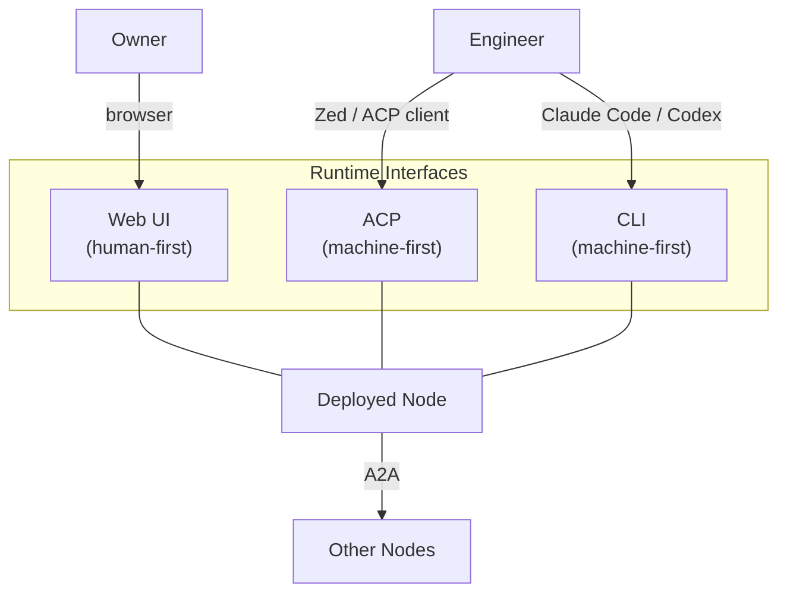
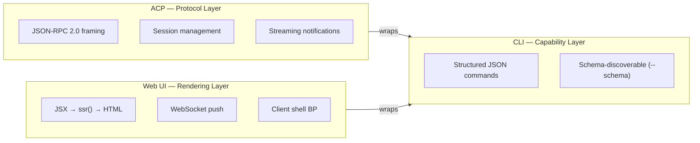
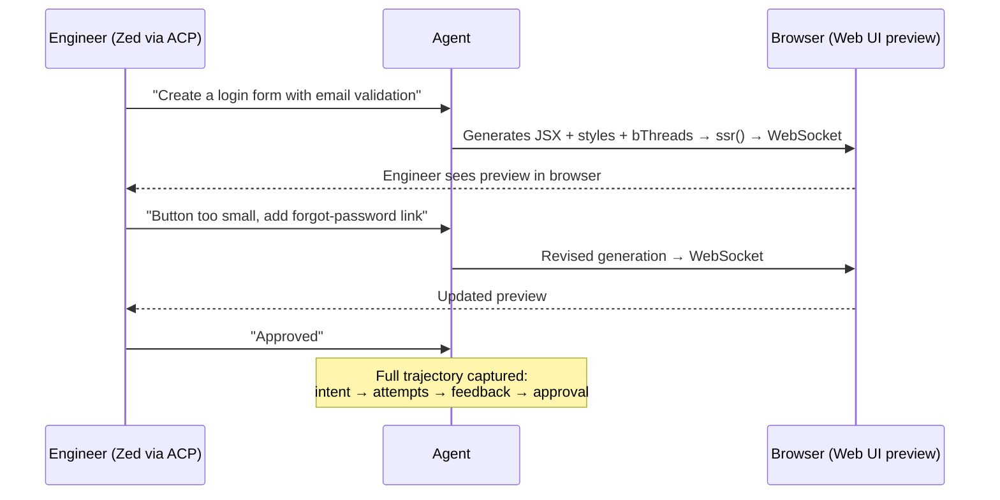
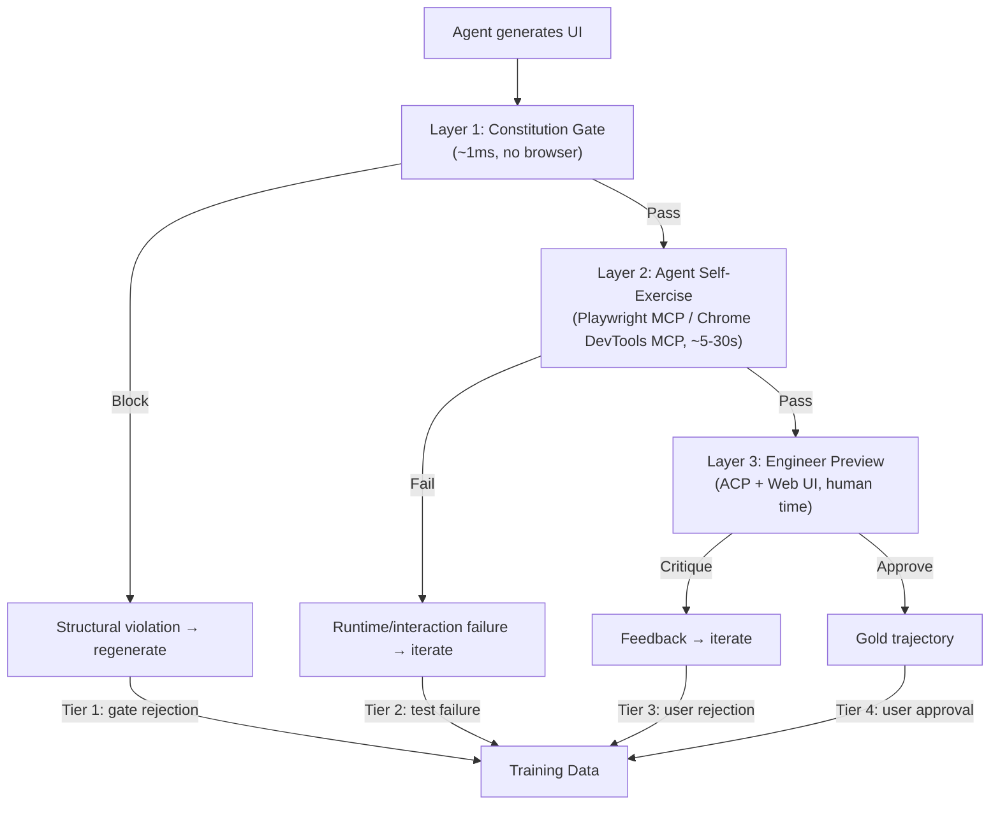

# UI Architecture — Channel Adapters & AI-Assisted Design

Three runtime interfaces serve the deployed agent node. Each is designed for a different consumer; all wrap the same internal capability surface.

## Runtime Interfaces



| Interface | Designed For | Human Uses It Via | Transport | Purpose |
|---|---|---|---|---|
| **Web UI** | Humans directly | Browser | WebSocket (`Bun.serve`) | Daily use, generated Modnet interfaces |
| **ACP** | Machines (JSON-RPC) | Zed, other ACP clients | stdio (JSON-RPC 2.0) | Debugging, auditing, training, AI-assisted design |
| **CLI** | Machines (schema-driven JSON) | Coding agents (Claude Code, Codex, OpenCode) | stdin/stdout (JSON/JSONL) | Debugging, inspection, exposed as a skill |

**A2A** is the inter-node protocol (not an adapter) — defined in [SYSTEM-DESIGN-V3.md](SYSTEM-DESIGN-V3.md#modnet--a2a).

### Layering

The CLI defines the **capability surface** — what the node can do. ACP and Web UI are protocol/rendering wrappers over the same capabilities.



ACP sits on top of CLI output. The `@agentclientprotocol/sdk` provides JSON-RPC framing; the CLI provides the structured data. A flag activates ACP mode:

```bash
plaited acp          # ACP mode — JSON-RPC over stdio
plaited acp --cwd .  # ACP with working directory
```

Reference: [OpenCode's ACP implementation](https://opencode.ai/docs/acp/) follows this same pattern — `opencode acp` wraps the internal SDK in JSON-RPC.

### CLI Design

The CLI follows the [`@youdotcom-oss/api`](https://www.npmjs.com/package/@youdotcom-oss/api) pattern:

- Schema-driven JSON input (`--json '{"query":"..."}'`)
- Structured JSON/JSONL output (bash-pipeable, jq-friendly)
- `--schema` flag for parameter discovery
- Dual interface: CLI for agents, programmatic API for code
- Not designed for direct human consumption — coding agents interpret the output

The CLI exists at runtime. Engineers use it through their coding agent to debug, inspect, and configure the deployed node.

## Web UI — Generative Interface

Key points:

- **Server-push** — JSX → `ssr()` → WebSocket. Server generates everything; client is a thin shell.
- **Behavioral shell** — A single `behavioral()` instance on the client coordinates rendering, input protection, event forwarding, and stream batching.
- **Generation spectrum** — The agent generates UI at Levels 0–4, from pure HTML to full bElement + BP coordination.
- **Atomic CSS** — `createStyles` produces hash-based class names. No Shadow DOM needed for style isolation.
- **Style deduplication** — Server tracks sent styles per connection, only ships deltas.

### Generation Spectrum

```
Level 0  JSX → HTML + CSS                     Zero client JS. Native elements only.
Level 1  JSX → HTML + CSS + native behavior    <details>, <dialog>, :checked, CSS states
Level 2  JSX → HTML + CSS + behavioral threads Agent generates typed thread modules
Level 3  JSX → HTML + CSS + Custom Element     Form association, true encapsulation
Level 4  JSX → HTML + CSS + bElement + BP      Full behavioral coordination
```

**bElement is Level 3–4 escalation only** — used when the platform demands it (form association via `ElementInternals`, true DOM encapsulation, slot-based composition). Most generative UI is Level 0–2.

## ACP — Engineering Interface

ACP (Agent Client Protocol) replaces the TUI adapter (`docs/GENERATIVE-TUI.md` is deleted).

ACP serves the engineering use case:
- **Debugging** — Inspect node state, event logs, BP decisions
- **Auditing** — Review tool call history, gate rejections
- **Training** — Capture trajectories, provide feedback, run eval harness
- **AI-assisted design** — The design workstation workflow (see below)

Protocol: JSON-RPC 2.0 over stdio. Methods follow the ACP spec:
- `initialize` — capability negotiation
- `session/new`, `session/load` — session lifecycle
- `session/prompt` — send user messages
- `session/update` — streaming notifications (thought chunks, tool calls, plan updates)
- `session/cancel` — abort in-flight requests

## AI-Assisted Design — The Design Workstation

ACP + Web UI work together as a design workstation for training the model to generate interfaces.



**Output of the design workstation:**
- Base styles and reusable templates for the agent's generative UI process
- SFT/GRPO training data from the full conversation trajectory
- The model learns to generate UI that matches the engineer's preferences

## V5 Layered Validation Pipeline

Generated UI is validated through three layers, each catching different classes of issues. Cheaper layers run first.



| Layer | What It Validates | Training Tier | Mechanism |
|---|---|---|---|
| **L1: Constitution Gate** | Structural-IA compliance, Modnet MSS tags, bThread correctness | Tier 1 (gate rejection) | bThread block predicates on template AST |
| **L2: Agent Self-Exercise** | Runtime behavior, interaction correctness, accessibility | Tier 2 (test failure) | Agent uses Playwright MCP / Chrome DevTools MCP on its own generated UI |
| **L3: Human Critique** | Style, taste, usability, design coherence | Tier 3-4 (rejection/approval) | Engineer feedback via design workstation |

Maps directly to the [V3 four-tier training hierarchy](SYSTEM-DESIGN-V3.md#training-distillation-from-frontier-agents).

## Base Model Training

The base model ships trained to:
- **Generate Modnet-compliant interfaces** using Structural-IA as the design grammar
- **Handle Modnet patterns** — modules with bridge-code tags, boundary-aware composition
- **Understand Structural-IA vocabulary** — objects, channels, levers, loops, blocks
- **Use the UI primitives** — `h`/JSX, `ssr`, `createStyles`, `createTokens`, `behavioral()`

Framework users extend from this base. They don't teach the model Modnet or Structural-IA from scratch — they fine-tune for their domain via the design workstation and eval harness.

### The UI Primitives Dual Role

The UI primitives (`h`/JSX, `ssr`, `createStyles`, `createTokens`) are both **infrastructure** and **training subject**:

- As infrastructure: they power the generative web UI rendering pipeline
- As training subject: the model learns to use them to generate interfaces
- The training loop: eval harness captures agent using primitives → grader validates output → SFT/GRPO improves generation

## Relationship to Other Documents

| Document | Scope |
|---|---|
| **This document (UI.md)** | Architecture — three interfaces, layering, training, validation |
| **[SYSTEM-DESIGN-V3.md](SYSTEM-DESIGN-V3.md)** | System design — agent loop, safety, constitution, modnet |
| **[UI-REWRITE-GUIDE.md](UI-REWRITE-GUIDE.md)** | Implementation — rewriting `src/ui/`, spec detail (protocol, shell BP, generation levels), and testing strategy |
