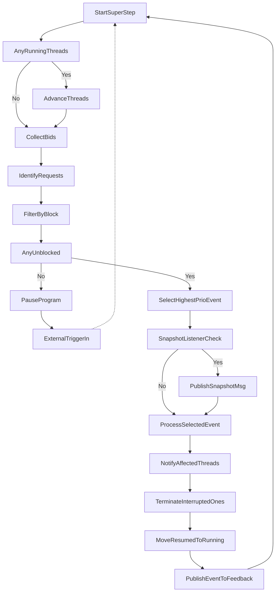

# Plaited API Guide

This guide provides a comprehensive overview of the Plaited framework's public API, organized by module.

## Behavioral Module (`plaited/behavioral`)

The Behavioral Module (`plaited/behavioral`) implements **Behavioral Programming (BP)**, a paradigm that treats behavior as the primary unit of modularity. Unlike traditional object-oriented or functional approaches, BP centers on independent, concurrent behavioral threads (`b-threads`) that communicate through event synchronization rather than direct method calls.

### Understanding Behavioral Programming

Behavioral Programming decomposes complex system logic into discrete, modular units of intent called **b-threads**. Each b-thread encapsulates a single facet of the system's required behavior and executes independently while coordinating with other threads through a sophisticated event-driven synchronization mechanism.

#### Core Concepts

**B-Threads as Modular Units of Intent**: In a design system context, separate b-threads might handle `HandleOpenState`, `EnforceAccessibility`, `BlockSubmitOnInvalid`, or `AnimateOnFocus`. Each thread focuses on a narrow behavioral concern, making the system more modular and easier to reason about.

**Event-Driven Synchronization**: B-threads communicate exclusively through events using four core idioms:
- **Request**: Propose that an event be triggered (expressing intent)
- **Wait**: Passively observe for an event (expressing interest)
- **Block**: Prevent an event from being triggered (expressing prohibition)
- **Interrupt**: Be terminated when a specific event occurs (expressing cancellation)

**Coordinated Execution**: The system waits for all b-threads to reach synchronization points, then selects an event that is requested by at least one thread and not blocked by any. Priority is determined by the order threads are added to the program - earlier threads get higher priority (lower numbers). Events triggered externally via `trigger` receive the highest priority (0) and are considered immediately unless blocked by existing threads.

### Actor-Like Coordination with Signals

Plaited extends BP with **signals** - reactive state primitives that enable pub/sub coordination between behavioral programs executing in different contexts:
- **Node.js programs** created with `defineBProgram`
- **Browser main thread programs** using `defineBProgram` and `defineElement`
- **Web Worker programs** using `defineBProgram` and `defineWorker`
- **Bun.js runtime programs** using `defineBProgram`

Signals provide actor-like message passing, allowing behavioral programs to coordinate state changes across execution boundaries while maintaining the BP paradigm's modular, event-driven nature.

### Core Functions

These are the foundational building blocks for creating behavioral programs. `bProgram` initializes a new program instance, while `bThread` and `bSync` are used to define the individual, synchronized strands of behavior that constitute the program.

#### `bProgram()`

Factory function that creates and initializes a new behavioral program instance.

```ts
(): Readonly<{
  bThreads: BThreads;
  trigger: Trigger;
  useFeedback: UseFeedback;
  useSnapshot: UseSnapshot;
}>
```

- Returns an object with:
  - `trigger: (event: BPEvent) => void`: A function to inject external events into the behavioral program. When an event is dispatched via `trigger`, it is treated as a high-priority request that initiates a new super-step (see "ExternalTriggerIn" in the activity diagram). This is the primary mechanism for external systems to interact with and influence the behavioral program.
  - `bThreads: BThreads`: An interface for dynamically managing the b-threads within the program (e.g., adding new threads with `set`, checking the status of existing threads with `has`).
  - `useFeedback: UseFeedback`: A hook to subscribe callback functions (handlers) to specific events selected and published by the bProgram. This allows external systems to react to the program's state changes and outputs.
  - `useSnapshot: UseSnapshot`: A hook to register a listener that receives detailed snapshots of the bProgram's internal state after each event selection step. This is primarily used for debugging, monitoring, and advanced analysis of program execution.


##### Activity Diagram: bProgram Super-Step Cycle

This diagram outlines the general process flow of a single "super-step" within the `bProgram`. A super-step can be initiated by an external event dispatched via the program's `trigger` function (see `ExternalTriggerIn` in the diagram) or by the program's natural progression as threads advance. In each super-step, the `bProgram` evaluates the current state of all active b-threads. Threads communicate their intentions by yielding `Idioms` objects, specifying events they `request` to trigger, conditions they `waitFor` to resume, events they `block` to prevent, or conditions that would `interrupt` them. The program then collects all `request`ed (and externally `trigger`ed) events as candidates, filters out any that are `block`ed by other threads, and selects the highest-priority, unblocked event. This selected event then triggers corresponding actions—notifying and potentially resuming `waitFor`ing threads or `interrupt`ing others—before the next super-step begins.



#### `bThread(rules, [repeat])`

Constructs a b-thread by composing multiple synchronization steps.

```ts
(rules: RulesFunction[], repeat?: true | (() => boolean)): RulesFunction
```

- `rules`: An array of `RulesFunction`s created with `bSync`.
- `repeat`: Optional. `true` for indefinite repeat, or a function returning `boolean` for conditional repeat.
- Returns: A `RulesFunction` (generator function) representing the b-thread.

#### `bSync(idioms)`

Creates a single synchronization step (a `RulesFunction`) for a b-thread.

```ts
<T>(idioms: Idioms<T>): () => Generator<Idioms, void, unknown>
```

- `idioms`: An `Idioms<T>` object defining `request`, `waitFor`, `block`, and/or `interrupt` declarations.
- Returns: A `RulesFunction` that yields the `idioms` object once.

**`Idioms<T = any>`**

An `Idioms` object declares what a b-thread intends to do at a specific synchronization point. It can have the following optional properties:

```ts
type Idioms<T = any> = {
  waitFor?: BPListener<T> | BPListener<T>[]     // Event(s) the thread is waiting for.
  interrupt?: BPListener<T> | BPListener<T>[]   // Event(s) that will interrupt the thread if selected.
  request?: BPEvent<T> | BPEventTemplate<T>     // An event the thread wishes to request.
  block?: BPListener<T> | BPListener<T>[]       // Event(s) the thread wants to prevent from being selected.
}
```

-   `waitFor`: A `BPListener` or an array of `BPListener`s. The b-thread will pause at this synchronization point until an event matching one of these listeners is selected by the `bProgram`.
-   `request`: A `BPEvent` or a `BPEventTemplate`. The b-thread proposes this event to be selected and triggered by the `bProgram`. Only one request can be active per sync point. A request is not guaranteed to be selected if it's blocked by another thread or if a higher priority event is selected.
-   `block`: A `BPListener` or an array of `BPListener`s. While this synchronization point is active, the b-thread will prevent any events matching these listeners from being selected by the `bProgram`. Blocking has higher precedence than requests.
-   `interrupt`: A `BPListener` or an array of `BPListener`s. If an event matching one of these listeners is selected, the current execution flow of the b-thread will be terminated. If the thread is configured to repeat, it may restart. This is useful for cancellation patterns.

### Higher-Order Program Utilities

These utilities provide higher-level abstractions for creating and managing behavioral programs, particularly suited for integration within frameworks or components that manage lifecycle and cleanup.

#### `defineBProgram(args)`

A higher-order function factory for creating and configuring behavioral programs. It simplifies setup by encapsulating the creation of the bProgram instance, feedback handler registration, public event filtering, and automatic cleanup management.

```ts
<A extends EventDetails, C extends { [key: string]: unknown } = { [key: string]: unknown }>(args: {
  publicEvents?: string[]
  bProgram: (
    args: {
      bSync: BSync
      bThread: BThread
      bThreads: BThreads
      disconnect: Disconnect
      trigger: PlaitedTrigger
      useSnapshot: UseSnapshot
    } & C
  ) => Handlers<A> | Promise<Handlers<A>>
}) => (ctx: C) => Promise<Trigger>
```

- `args.publicEvents`: An optional array of event type strings that define the public API of this bProgram instance. Only these events can be triggered via the returned public trigger.
- `args.bProgram`: The function that defines the threads and feedback handlers. It receives the standard bProgram utilities plus any context passed to the returned initialization function.
- Returns: An async initialization function that accepts an optional context object (`C`) and returns a restricted public `Trigger`.

**Usage Example:**

```ts
// Define a behavioral program for workshop functionality
const createWorkshop = defineBProgram<WorkshopDetails, DefineWorkshopParams>({
  publicEvents: ['TEST_ALL_STORIES', 'LIST_ROUTES'],
  async bProgram({ cwd, trigger, bThreads, bSync, bThread, disconnect }) {
    // Setup resources
    const server = await useServer({ cwd })

    // Register cleanup
    disconnect(() => server.close())

    // Define behavioral threads
    bThreads.set({
      reloadThread: bThread([
        bSync({ waitFor: { type: 'RELOAD_SERVER' } })
        // ... thread logic
      ])
    })

    // Return event handlers
    return {
      async TEST_ALL_STORIES() {
        // Handle test execution
      },
      async LIST_ROUTES() {
        // Handle route listing
      }
    }
  }
})

// Initialize the program with context
const workshopTrigger = await createWorkshop({ cwd: process.cwd() })

// Use the public trigger (only allowed events can be triggered)
workshopTrigger({ type: 'TEST_ALL_STORIES' }) // Allowed
// workshopTrigger({ type: 'INTERNAL_EVENT' }) // Filtered out (warning logged)
```

The `defineBProgram` utility automatically handles:
- Creating and configuring the underlying `bProgram` instance
- Registering feedback handlers from your returned handlers object
- Creating a public trigger that filters events based on `publicEvents`
- Managing cleanup through the provided `disconnect` callback
- Providing enhanced triggers with automatic disconnect management

### Web Worker Integration (Behavioral Programs in Workers)

Plaited facilitates running behavioral programs within Web Workers for background processing.

#### `defineWorker(config)`

Creates and configures a behavioral program to run inside a Web Worker. This function should be called in the worker's script file.

```ts
<A extends EventDetails>(config: {
  publicEvents: string[]; // Event types the worker will listen for from the main thread
  bProgram: (args: WorkerBProgramArgs) => Handlers<A>; // Function defining the worker's behavior
}): void
```
- `config.publicEvents`: An array of event type strings that this worker will accept from the main thread via `postMessage`.
- `config.bProgram`: A function similar to the `bProgram` in `defineElement`. It defines the worker's behavior, including its event handlers. It receives `WorkerBProgramArgs`.

**`WorkerBProgramArgs`** (provided to worker's `bProgram`)

The argument object provided to the `bProgram` function when using `defineWorker`.

```ts
type WorkerBProgramArgs = {
  send(data: BPEvent): void;       // Function to send messages (BPEvent) from the worker back to the main thread.
  disconnect: Disconnect;         // Function to manually terminate the worker and clean up its resources.
  trigger: PlaitedTrigger;        // Worker's internal trigger, augmented for automatic cleanup.
  bThreads: BThreads;             // For managing threads within the worker\'s bProgram.
  useSnapshot: UseSnapshot;       // For monitoring the worker\'s bProgram state.
  bThread: BThread;               // Utility to create behavioral threads.
  bSync: BSync;                   // Utility to define synchronization points.
  // Note: `useFeedback` is handled internally by defineWorker.
};
```

#### `useWorker(trigger, path)`

Creates a communication interface from a Plaited web component's `bProgram` (or any bProgram context) to a Web Worker defined with `defineWorker`.

```ts
<T = unknown>(trigger: PlaitedTrigger | Trigger, path: string): ((args: BPEvent<T>) => void) & { disconnect: () => void }
```

- `trigger`: The `trigger` function from the calling `bProgram`'s context. This is used to handle messages received *from* the worker. If a `PlaitedTrigger` is provided (as is the case within `defineElement`), the worker connection will automatically be disconnected when the component or module itself is disconnected.
- `path`: The string path to the worker's JavaScript module file.
- Returns: A function that acts like `worker.postMessage()` to send `BPEvent`s *to* the worker. This returned function is augmented with a `disconnect` method, allowing manual termination of the worker and cleanup of its listeners.

### State Management Utilities (Signals)

Signals are reactive state primitives that enable actor-like coordination between behavioral programs running in different execution contexts. They provide a pub/sub mechanism for synchronizing values and updates across programs, whether they're created using low-level `bProgram` functions or higher-level utilities like `defineBProgram`, `defineElement`, and `defineWorker`.

#### `useSignal(initialValue?)`

Creates a reactive signal for state management.

```ts
// With initial value
function useSignal<T>(initialValue: T): {
  set(value: T): void
  listen: Listen // (eventType: string, trigger: Trigger | PlaitedTrigger, getLVC?: boolean) => Disconnect
  get(): T
}

// Without initial value (value will be undefined until set)
function useSignal<T>(initialValue?: never): {
  set(value?: T): void
  listen: Listen // (eventType: string, trigger: Trigger | PlaitedTrigger, getLVC?: boolean) => Disconnect
  get(): T | undefined
}
```
- `initialValue`: Optional initial value for the signal.
- Returns an object with:
  - `get()`: Returns the current value of the signal.
  - `set(value)`: Sets the signal's value and notifies all subscribed behavioral programs.
  - `listen(eventType, trigger, getLVC?)`: Subscribes a behavioral program's `trigger` to signal changes, enabling cross-program state coordination.
    - `eventType`: The `type` of the `BPEvent` to dispatch to the subscribing program.
    - `trigger`: The `Trigger` or `PlaitedTrigger` function of the behavioral program.
    - `getLVC?` (Get Last Value Change, default: `false`): If `true`, immediately dispatches the current signal value upon subscription.
    - Returns a `Disconnect` function to unsubscribe. If a `PlaitedTrigger` is used, cleanup is automatic.

#### `useComputed(computeFn, dependencies)`

Creates a computed signal whose value is derived from other signals and automatically updates when its dependencies change.

```ts
<T>(
  computeFn: () => T,
  dependencies: Array<{ get: () => unknown; listen: Listen }>
): {
  get(): T;
  listen: Listen;
}
```
- `computeFn`: A function that is called to re-calculate the signal\'s value whenever any of its `dependencies` change.
- `dependencies`: An array of signal instances (created by `useSignal` or other `useComputed` calls) that this computed signal depends on. Each dependency must have `get` and `listen` methods.
- Returns an object with:
  - `get()`: Returns the current computed value. The `computeFn` is re-evaluated lazily if dependencies have changed since the last `get()`.
  - `listen(eventType, trigger, getLVC?)`: Subscribes behavioral programs to computed value changes, enabling reactive coordination across program boundaries.

### Utility Functions

This collection of utility functions aids in the construction of behavioral programs, offering ways to introduce non-determinism, manage event triggers, and enhance trigger capabilities for Plaited-specific contexts.

- **`randomEvent(...events: BPEvent[]): BPEvent`**
  Selects and returns a single `BPEvent` randomly from a provided list.
- **`shuffleSyncs(...syncs: BSync[]): BSync[]`**
  Randomly shuffles an array of `BSync` (synchronization points).
- **`getPublicTrigger(args: { trigger: Trigger; publicEvents?: string[] | ReadonlyArray<string> }): Trigger`**
  Creates a wrapped `Trigger` that filters events based on `publicEvents`. Only events listed in `publicEvents` will be passed to the underlying `trigger`.
- **`getPlaitedTrigger(trigger: Trigger, disconnectSet: Set<Disconnect>): PlaitedTrigger`**
  Augments a standard `Trigger` with `addDisconnectCallback` for cleanup management. This allows associating `Disconnect` functions with the trigger's lifecycle.

### Behavioral Type Guards

Runtime type-checking functions to safely identify and work with specific objects and concepts within the behavioral programming module, such as `BPEvent`s and `PlaitedTrigger`s.

- **`isBPEvent(data: unknown): data is BPEvent`**
  Checks if a value conforms to the `BPEvent` structure (`{ type: string, detail?: any }`).
- **`isPlaitedTrigger(trigger: Trigger): trigger is PlaitedTrigger`**
  Checks if a trigger is an enhanced `PlaitedTrigger` (has `addDisconnectCallback` method).

## Core Module (`plaited`)

The main module providing core functionalities for creating web components, managing their behavior, styling, and JSX-based templating. It re-exports several utilities from other specialized modules.

*Note: While behavioral utilities like `defineWorker`, `useSignal`, and `useWorker` are available when importing from `plaited` (as they are re-exported by this main module), their primary documentation can be found in the [Behavioral Module (`plaited/behavioral`)](#behavioral-module-plaitedbehavioral) section.*

### Web Component APIs

#### `defineElement(config)`

Defines and registers a Plaited custom element.

```ts
<A extends PlaitedEventDetails>(config: BehavioralElementArgs<A>): PlaitedTemplate
```

- `config`: A `BehavioralElementArgs` object specifying the element's configuration.
- Returns: A `PlaitedTemplate` function that can be used to create instances of the custom element in JSX.

**`BehavioralElementArgs<A extends PlaitedEventDetails>`**

An object with the following properties:

```ts
type BehavioralElementArgs<A extends PlaitedEventDetails> = {
  tag: CustomElementTag // The tag name for the custom element (e.g., 'my-element'). Must contain a hyphen.
  shadowDom: TemplateObject // The Plaited template object defining the element's shadow DOM structure.
  delegatesFocus?: boolean // If true (default), focus requests on the host are delegated to its shadow DOM.
  mode?: 'open' | 'closed' // Shadow DOM encapsulation mode (default: 'open').
  slotAssignment?: 'named' | 'manual' // Slot assignment mode (default: 'named').
  observedAttributes?: string[] // Attributes to observe for changes.
  publicEvents?: string[] // Event types allowed to be triggered externally on the component.
  formAssociated?: true // If true, registers as a Form-Associated Custom Element.
  streamAssociated?: true // If true, enables stream-based Light DOM (Slot) mutation handlers.
  bProgram?: (this: PlaitedElement, args: BProgramArgs) => Handlers<A> & PlaitedElementCallbackHandlers // Behavioral program function.
}
```

**`PlaitedElementCallbackHandlers`** (within `bProgram`'s return value)

An object mapping lifecycle and form-associated callbacks to their handlers:

```ts
type PlaitedElementCallbackHandlers = {
  onAdopted?: () => void | Promise<void>
  onAttributeChanged?: (args: {
    name: string
    oldValue: string | null
    newValue: string | null
  }) => void | Promise<void>
  onConnected?: () => void | Promise<void>
  onDisconnected?: () => void | Promise<void>
  onFormAssociated?: (args: { form: HTMLFormElement }) => void | Promise<void>
  onFormDisabled?: (args: { disabled: boolean }) => void | Promise<void>
  onFormReset?: () => void | Promise<void>
  onFormStateRestore?: (args: { state: unknown; reason: 'autocomplete' | 'restore' }) => void | Promise<void>
  // Note: onAppend, onPrepend, onReplaceChildren are handled internally if streamAssociated is true.
}
```

#### `useAttributesObserver(eventType, trigger)`

Creates a utility to observe attribute changes on a **slotted element**. When any of the designated attributes on the observed slotted element change, a custom event is dispatched via the provided `trigger` function. This utility is primarily intended for components that need to react to changes in the state or properties of content projected into them via slots.

```ts
(
  eventType: string,
  trigger: PlaitedTrigger | Trigger
): (assignedElement: Element, attributeFilter: string[]) => Disconnect
```

- `eventType`: The event type to dispatch when an observed attribute changes.
- `trigger`: The component\'s trigger function. Using a `PlaitedTrigger` is recommended as it handles automatic cleanup.
- Returns: A function that, when called with an `assignedElement` (the slotted element) and an `attributeFilter` array (names of attributes to observe), starts the observation and returns a `Disconnect` function to stop it. Manual disconnection is often unnecessary if `PlaitedTrigger` is used.

**`ObservedAttributesDetail`** (Event detail for attribute changes)

```ts
type ObservedAttributesDetail = {
  oldValue: null | string
  newValue: null | string
  name: string
}
```

#### `useTemplate(el, callback)`

Creates a template factory function for efficient dynamic content generation within a Plaited component.

```ts
<T>(
  el: BoundElement<HTMLTemplateElement>,
  callback: (
    $: <E extends Element = Element>(target: string, match?: SelectorMatch) => BoundElement<E>[],
    data: T
  ) => void
): (data: T) => DocumentFragment
```

- `el`: A `BoundElement<HTMLTemplateElement>` (obtained via the `$` query function) to be used as the template.
- `callback`: A function called for each data item to populate a cloned instance of the template.
  - `$`: A query selector function scoped to the cloned template instance.
  - `data`: The data item of type `T` for the current template instance.
- Returns: A factory function that takes a data item of type `T` and returns a populated `DocumentFragment`.

#### `useDispatch(element)`

Creates an event dispatch function for a PlaitedElement, enabling component-to-component communication.

```ts
<T = unknown>(element: PlaitedElement): (args: BPEvent<T> & {
  bubbles?: boolean;
  cancelable?: boolean;
  composed?: boolean;
}) => void
```

- `element`: The `PlaitedElement` instance from which events will be dispatched.
- Returns: A `Dispatch` function to create and send custom events.
  - `args.type`: The event type/name.
  - `args.detail`: Optional event-specific data.
  - `args.bubbles` (default: `false`): Whether the event bubbles.
  - `args.cancelable` (default: `true`): Whether the event can be canceled.
  * `args.composed` (default: `true`): Whether the event crosses shadow DOM boundaries.

### Type Guards

Utilities for runtime type checking of Plaited-specific objects.

- **`isPlaitedElement(el: unknown): el is PlaitedElement`**
  Checks if an element is a Plaited custom element (has a `trigger` method).
- **`isPlaitedTemplateFunction(template: FunctionTemplate): template is PlaitedTemplate`**
  Checks if a function template was created by `defineElement`.

### `BProgramArgs` (for `defineElement`\'s `bProgram` callback)

The argument object passed to the `bProgram` function when defining a Plaited element.

```ts
type BProgramArgs = {
  $: <E extends Element = Element>(
    target: string,
    match?: SelectorMatch, // e.g., \'=\', \'*=\', \'^=\'
  ) => NodeListOf<BoundElement<E>> // Scoped query selector for shadow DOM
  root: ShadowRoot // Reference to the component\'s shadow root
  host: PlaitedElement // Reference to the custom element instance
  internals: ElementInternals // ElementInternals instance (if formAssociated: true)
  trigger: PlaitedTrigger // Enhanced trigger function for the component\'s bProgram
  bThreads: BThreads // Interface for managing behavioral threads
  useSnapshot: UseSnapshot // Function to get bProgram state snapshot
  bThread: BThread // Utility to create behavioral threads
  bSync: BSync // Utility to define synchronization points
}
```

### Styling Utilities

Provides utilities for CSS-in-JS styling and design token management.

#### CSS-in-JS

##### `css.create(styles)`

Generates style objects with hashed class names from style definitions.

```ts
<T extends CSSClasses>(classNames: T): StyleObjects<T>
```

- `classNames`: An object where keys are logical style group names and values are `CSSProperties` objects.
- Returns: An object where each key holds a `StylesObject` (`{ class: string, stylesheet: string[] }`).

Example `styles` input:

```ts
const styles = css.create({
  element: {
    padding: \'10px\',
    backgroundColor: \'blue\',
    \':hover\': {
      backgroundColor: \'darkblue\',
    },
    \'@media (min-width: 768px)\': {
      padding: \'20px\',
    },
  },
})
// Usage: <div {...styles.element}>...</div>
```

##### `css.host(styles)`

Creates shadow DOM host styles.

```ts
(props: CSSHostProperties): StylesObject
```

- `props`: An object of `CSSHostProperties` where keys are CSS properties and values can be primitives or objects for conditional styling (e.g., `\':hover\'`, `\'[disabled]\'`).
- Returns: A `StylesObject` containing only the `stylesheet` array.

Example `styles` input:

```ts
const hostStyles = css.host({
  display: \'block\',
  borderColor: {
    default: \'gray\',
    \':focus-within\': \'blue\',
  },
})
// Usage: <my-element {...hostStyles}>...</my-element>
```

##### `css.keyframes(name, frames)`

Defines reusable CSS animations with unique identifiers.

```ts
(name: string, frames: CSSKeyFrames): (() => StylesObject) & { id: string }
```

-
 `name`: A base name for the animation (e.g., \\\'fadeIn\\\').
- `frames`: A `CSSKeyFrames` object defining animation steps (`\\\'from\\\'`, `\\\'to\\\'`, `\\\'0%\\\'`, etc.).
- Returns: A function that, when called, returns a `StylesObject` for the `@keyframes` rule. This function also has an `id` property (the hashed animation name).

Example `frames` input:

```ts
const fadeIn = css.keyframes(\'fadeIn\', {
  from: { opacity: 0 },
  to: { opacity: 1 },
})
// Usage: css.create({ animated: { animationName: fadeIn.id } }); ... assign(fadeIn())
```

##### `css.assign(...styles)`

Combines and conditionally applies multiple `StylesObject` instances.

```ts
(...styles: Array<StylesObject | undefined | false | null>): StylesObject
```

- `styles`: A variable number of `StylesObject` instances or falsy values.
- Returns: A new `StylesObject` with combined `class` and `stylesheet` properties.

Example usage:

```ts
const primaryButtonStyles = css.assign(
  baseStyles.button,
  themeStyles.primary,
  sizeStyles.large,
  isActive && activeStyles.active, // conditional
)
```

##### CSS Types (`main/css.types.js`)

This module exports various TypeScript types used by the CSS-in-JS system, such as `CSSProperties`, `CSSHostProperties`, `CSSKeyFrames`, `CSSClasses`, `StyleObjects`, and `StylesObject`. These are also available when importing `plaited` directly.

### JSX and Rendering

Plaited provides standard JSX factory functions for creating template objects and a server-side rendering utility.

#### `h(tag, attrs)` (alias for `jsx`, `jsxs`, `jsxDEV`)

The core JSX factory function.

```ts
<T extends Tag>(tag: T, attrs: InferAttrs<T>): TemplateObject
```

- `tag`: An HTML/SVG tag name (string), a `CustomElementTag`, or a `FunctionTemplate`.
- `attrs`: An object containing attributes/props for the element, including `children`.
- Returns: A `TemplateObject`.

**`Tag`** (Type for `h` function's first argument)

```ts
type Tag = string | CustomElementTag | FunctionTemplate
```

**`InferAttrs<T extends Tag>`** (Utility to infer attributes type based on tag)

```ts
type InferAttrs<T extends Tag> =
  T extends keyof ElementAttributeList ? ElementAttributeList[T]
  : T extends FunctionTemplate ? Parameters<T>[0]
  : T extends CustomElementTag ? DetailedHTMLAttributes
  : Attrs
```

#### `Fragment(props)`

A component that allows grouping children without adding an extra node to the DOM.

```ts
(props: { children?: Children }): TemplateObject
```

- `props.children`: The children to group.

#### `ssr(...templates)`

Generates a static HTML string from Plaited template objects.

```ts
(...templates: TemplateObject[]): string
```

- `templates`: One or more `TemplateObject` instances to render.
- Returns: A string representation of the rendered HTML, with collected stylesheets injected.

### Core Types

Essential types used throughout the Plaited framework.

- **`PlaitedElement`**: Interface extending `HTMLElement` for Plaited custom elements, including `trigger` and lifecycle callbacks.
- **`PlaitedTemplate`**: The type returned by `defineElement`, a function template that includes metadata like `tag`, `registry`, `observedAttributes`, and `publicEvents`.
- **`TemplateObject`**: The internal representation of a compiled JSX template (`{ html: string[], stylesheets: string[], registry: string[], parts: string[], $: unique_symbol }`).
- **`Position`**: DOM insertion positions (`\'beforebegin\' | \'afterbegin\' | \'beforeend\' | \'afterend\'`).
- **`Bindings`**: Helper methods (`render`, `insert`, `replace`, `attr`) bound to elements queried by `p-target`.
- **`BoundElement<T extends Element = Element>`**: An `Element` augmented with `Bindings`.
- **`SelectorMatch`**: Attribute selector match types (`\'=\' | \'~=\' | \'|=\' | \'^=\' | \'$=\' | \'*=\'`).
- **`JSONDetail`**: Types allowed in message detail payloads (JSON-serializable primitives, objects, arrays) if custom messaging solutions are built on top of Plaited event systems (e.g. `BPEvent`). Plaited itself does not provide a dedicated `PlaitedMessage` type anymore.


### JSX Types

Types relevant when using JSX with Plaited.

- **`PlaitedAttributes`**: Core attributes applicable to all Plaited elements (e.g., `class`, `children`, `p-target`, `p-trigger`, `stylesheet`, `trusted`, `style`).
- **`AriaAttributes`**: Standard WAI-ARIA attributes.
- **`DetailedHTMLAttributes`**: Base HTML attributes including ARIA and Plaited-specific ones, allowing `data-*`.
- **`ElementAttributeList`**: A mapping of HTML/SVG tag names to their detailed attribute types.
- **`Attrs<T extends DetailedHTMLAttributes = DetailedHTMLAttributes>`**: Generic type for template attributes/props.
- **`FunctionTemplate<T extends Attrs = Attrs>`**: Signature for Plaited functional templates.
- **`CustomElementTag`**: Type for custom element tag names (`\\${string}-\\${string}`).
- **`Children`**: Valid children in JSX (`number | string | TemplateObject | Child[]`).

### Re-exported Behavioral Utilities
The main `plaited` module also re-exports the following for convenience. See the [Behavioral Module (`plaited/behavioral`)](#behavioral-module-plaitedbehavioral) section for detailed documentation:
- `defineWorker(config)`
- `useSignal(initialValue?)`
- `useWorker(trigger, path)`

## Testing & Workshop Module (`plaited/workshop`)

This module provides the necessary infrastructure and types for writing and running tests for your Plaited components using "stories".

The core of the testing module is the `PlaitedFixture` custom element and the types used to define stories. The testing utilities themselves (like `assert`, `findByText`, etc.) are not directly exported for standalone use but are provided as arguments to a story\'s `play` function when executed by the `PlaitedFixture`.

### Core Exports

- **Constants:**
    - From `plaited/workshop/testing/testing.constants.js`:
        - `FAILED_ASSERTION`: String identifier for assertion failures.
        - `MISSING_ASSERTION_PARAMETER`: String identifier for errors when `assert` is called with missing parameters.
        - `TIMEOUT_ERROR`: String identifier for play function timeouts.
        - `FIND_BY_ATTRIBUTE`, `FIND_BY_TEXT`, `FIRE_EVENT`, `ASSERT`, `WAIT`: String identifiers for testing actions, mainly for internal use or advanced integration.
    - From `plaited/workshop/testing/plaited-fixture.constants.js`:
        - `PLAITED_FIXTURE`: Tag name for the test fixture element (`\'plaited-test-fixture\'`).
        - `PLAY_EVENT`: Event type to trigger story execution (`\'play\'`).
        - `FIXTURE_CONNECTED`: Event type indicating fixture connection.
        - `UNKNOWN_ERROR`: Event type for unknown test errors.
        - `TEST_PASSED`: Event type for successful test completion.
        - `SCALE`: Object mapping scale symbolic names to values (e.g., `{ \'1\': \'1\', ..., \'rel\': \'rel\' }`).

- **Types (from `plaited/workshop/testing/plaited-fixture.types.js`):**
    - `StoryObj<T extends Attrs = Attrs>`: The primary type for defining a story, which is a union of `InteractionStoryObj` and `SnapshotStoryObj`.
        - `args?: T`: Props for the story\'s template.
        - `description: string`: A mandatory description of the story.
        - `parameters?: Params`: Optional test environment configuration.
        - `play?: Play`: Optional asynchronous function for interactions and assertions (required by `InteractionStoryObj`, forbidden in `SnapshotStoryObj`).
        - `template?: FunctionTemplate<T>`: Optional Plaited template function.
    - `InteractionStoryObj<T extends Attrs = Attrs>`: A story object where the `play` function is **required**.
    - `SnapshotStoryObj<T extends Attrs = Attrs>`: A story object where the `play` function is **not allowed**.
    - `Params`: Defines parameters for a story (e.g., `a11y`, `headers`, `scale`, `styles`, `timeout`).
        ```ts
        type Params = {
          a11y?: Record<string, string> | false;
          scale?: keyof typeof SCALE; // e.g., \'1\', \'rel\'
          styles?: StylesObject;
          timeout?: number; // Default: 5000ms
          headers?: (env: NodeJS.ProcessEnv) => Headers | Promise<Headers>;
        };
        ```
    - `Args<T extends FunctionTemplate>`: Utility type to extract the props type from a `FunctionTemplate`.
    - `Play`: The signature for the `play` function provided to `InteractionStoryObj`. It receives an object with testing utilities:
        ```ts
        type Play = (args: {
          assert: Assert;
          findByAttribute: FindByAttribute;
          findByText: FindByText;
          fireEvent: FireEvent;
          hostElement: Element; // The PlaitedFixture element itself
          match: Match;
          throws: Throws;
          wait: Wait;
        }) => Promise<void>;
        ```
        *(Note: `Assert`, `FindByAttribute`, `FindByText`, `FireEvent`, `Match`, `Throws`, `Wait` are types for the testing utilities available inside `play`.)*
    - `InteractionTestFailureEvent`, `UnknownTestErrorEvent`: Types for events dispatched by `PlaitedFixture` on test failures.
    - `InteractionDetail`, `SnapshotDetail`, `StoryDetail`: Types related to the detail payload of the `PLAY_EVENT`.

- **Custom Element:**
    - `PlaitedFixture`: A custom element (`<plaited-test-fixture>`) that hosts and executes a single Plaited story test. It is configured via attributes by the test runner (`p-socket`, `p-route`, `p-file`, `p-entry`, `p-name`).

- **Design Token Utilities (Exported by Workshop):**
    - `DesignToken` (and related types like `Alias`, `DesignValue`, `DesignTokenGroup`, `DesignTokenEntry`): Types for defining design tokens.
    - `getDesignTokensElement(stylesheet, tag?)`: Creates a custom element for injecting design token stylesheets.


### Testing Utilities (Available within `play` function)

The following utilities are provided as arguments to a story\'s `play` function:

#### `assert(params)`

A powerful assertion function for testing with detailed error reporting.
```ts
<T>(params: {
  given: string; // Description of the test context
  should: string; // Expected behavior
  actual: T;      // The actual value
  expected: T;    // The expected value
}): void
```
Throws `FailedAssertionError` or `MissingAssertionParameterError`.

#### `findByText(searchText, [context])`

Asynchronously finds an element containing specific text content, searching through light and shadow DOM.
```ts
<T extends HTMLElement = HTMLElement>(\n  searchText: string | RegExp,\n  context?: HTMLElement // Default: document.body\n): Promise<T | undefined>
```

#### `findByAttribute(attribute, value, [context])`

Asynchronously finds an element by a specific attribute name and value, searching through light and shadow DOM.
```ts
<T extends HTMLElement | SVGElement = HTMLElement | SVGElement>(\n  attributeName: string,\n  attributeValue: string | RegExp,\n  context?: HTMLElement | SVGElement // Default: document\n): Promise<T | undefined>
```

#### `fireEvent(element, eventType, [eventArgs])`

Asynchronously dispatches DOM events with configurable options.
```ts
<T extends HTMLElement | SVGElement = HTMLElement | SVGElement>(\n  element: T,\n  eventName: string,\n  eventArgs?: { // EventArguments\n    bubbles?: boolean; // Default: true\n    composed?: boolean; // Default: true\n    cancelable?: boolean; // Default: true\n    detail?: Record<string, unknown>; // For CustomEvent\n  }\n): Promise<void>
```

#### `throws(fn, ...args)`

Tests if a function throws an error, capturing sync and async errors.
```ts
<U extends unknown[], V>(\n  fn: (...args: U) => V,\n  ...args: U\n): string | undefined | Promise<string | undefined>
```
Returns the error message as a string if thrown, or `undefined` otherwise.

#### `match(str)`

Creates a curried string pattern matcher.
```ts
(str: string): (pattern: string | RegExp) => string
```
- `str`: The source string to search within.
- Returns a function that takes a `pattern` and returns the first matched substring or `\'\'`.

#### `wait(ms)`
Utility to pause execution for a specified duration.
```ts
(ms: number): Promise<unknown>
```

### Error Classes

Custom error classes thrown by the testing utilities:

- `FailedAssertionError`: Thrown by `assert()` when a condition fails.
- `MissingAssertionParameterError`: Thrown by `assert()` if required parameters are missing.
- `TimeoutError`: Thrown by the test runner when a `play` function exceeds its timeout (defined in `Params`).

## Utilities Module (`plaited/utils`)

General-purpose utility functions.

### Type Checking

- **`isTypeOf<T>(obj: unknown, type: string): obj is T`**
  Checks if `obj` is of the specified `type` (e.g., \'string\', \'array\', \'date\') using precise type detection.
- **`trueTypeOf(obj?: unknown): string`**
  Returns the precise type of `obj` as a lowercase string (e.g., \'array\', \'asyncfunction\').

### DOM Utilities

- **`canUseDOM(): boolean`**
  Returns `true` if running in a browser-like environment with DOM access, `false` otherwise.

### String Manipulation

- **`camelCase(str: string): string`**
  Converts `str` to camelCase (e.g., \'hello-world\' -> \'helloWorld\').
- **`kebabCase(str: string): string`**
  Converts `str` to kebab-case (e.g., \'helloWorld\' -> \'hello-world\').
- **`escape(sub: string): string`**
  Escapes HTML special characters (`&`, `<`, `>`, `\\\'`, `\\\"`).
- **`unescape(sub: string): string`**
  Converts HTML entities back to their original characters.
- **`hashString(str: string): number | null`**
  Generates a 32-bit integer hash (djb2 algorithm) from `str`. Returns `null` for empty string.
- **`ueid(prefix?: string): string`**
  Generates a \"Unique Enough Identifier\" (e.g., `prefix + \'lpf98qw2\'`). Not cryptographically secure.

### Data Structures

- **`deepEqual(objA: unknown, objB: unknown, map?: WeakMap<object, unknown>): boolean`**
  Performs a deep equality comparison between `objA` and `objB`. Handles primitives, objects, arrays, Sets, Maps, Dates, RegExp, and circular references.
- **`keyMirror<Keys extends string[]>(...inputs: Keys): { readonly [K in Keys[number]]: K }`**
  Creates an immutable object where keys mirror their string values.

### Event Handling

- **`DelegatedListener<T extends Event = Event>`** (Class)
  An `EventListener` implementation for robust event delegation.
  `constructor(callback: (ev: T) => void | Promise<void>)`
  `handleEvent(evt: T): void`
- **`delegates: WeakMap<EventTarget, DelegatedListener>`**
  A global `WeakMap` used internally for storing event delegation relationships.

### Async Utilities

- **`wait(ms: number): Promise<unknown>`**
  Returns a Promise that resolves after `ms` milliseconds.

### Other Utilities

- **`noop<T = never>(..._: T[]): void`**
  A no-operation function that does nothing.

## JSX Configuration

To use JSX with Plaited, configure your `tsconfig.json` (or equivalent JavaScript build tool settings):

```json
{
  \"compilerOptions\": {
    \"jsx\": \"react-jsx\", // or \"react-jsxdev\" for development
    \"jsxImportSource\": \"plaited\"
  }
}
```

Plaited exports the standard JSX factory functions:

- `jsx` (typically for `h` or `React.createElement`)
- `jsxs` (optimized for multiple children)
- `jsxDEV` (development version of `jsx` with more checks)
- `Fragment` (for grouping elements without a DOM wrapper)
- `h` (an alias for `jsx`)

These are available via imports from `plaited/jsx-runtime` or `plaited/jsx-dev-runtime`.
", display_description = "Reorganize API guide based on corrected module exports and added details.", mode = "overwrite", path = "lab/plaited/docs/api-guide.md"))
