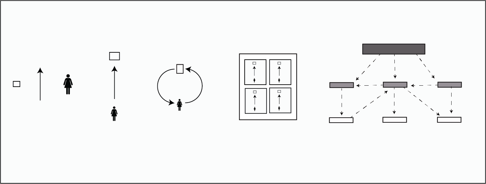
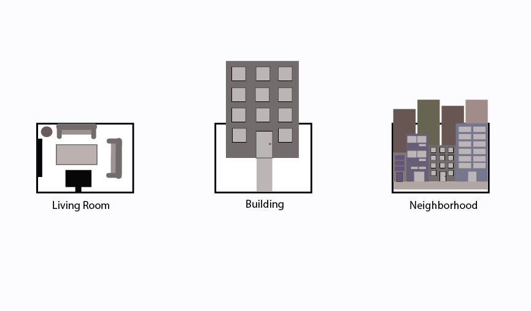
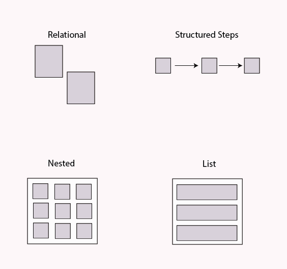
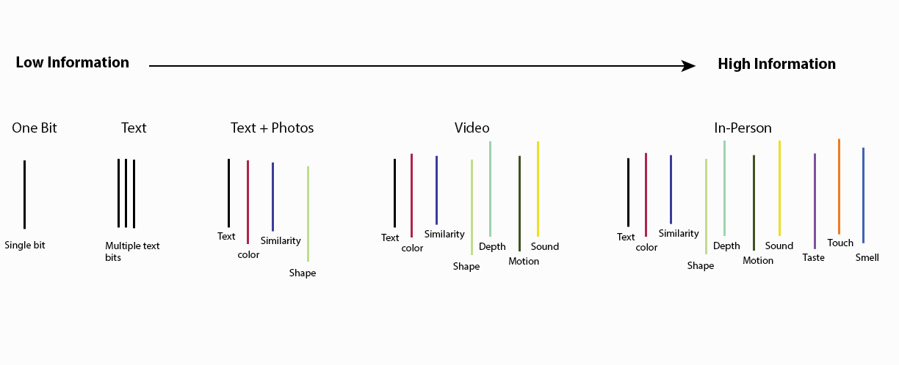
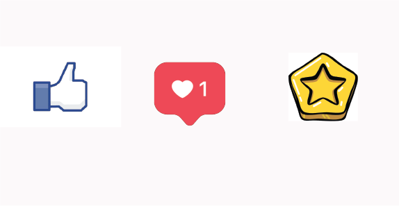
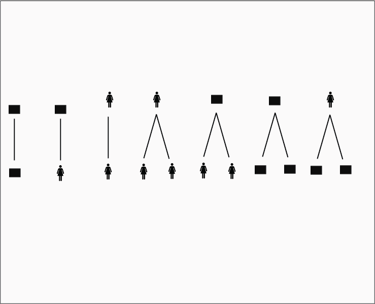
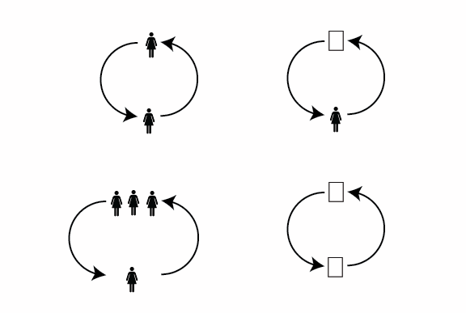
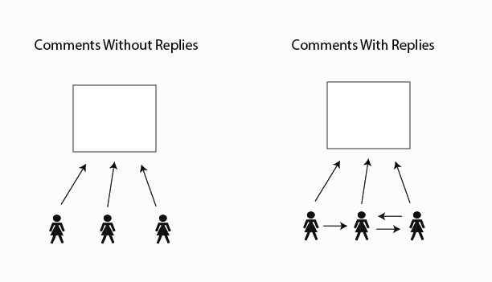
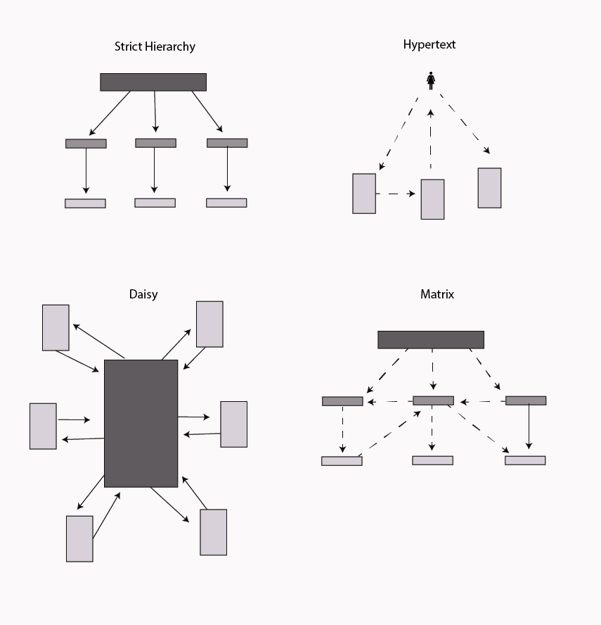

---
author: Rachel Jaffe
date: Jun 11, 2019
source: https://uxdesign.cc/a-unified-language-for-the-design-of-information-systems-8c3dc48b5839

---

# A unified language for the design of information systems

_A Part of “_[_Structuralism and a Pattern Language for Online Environments._](towards-a-larger-view-of-information-architecture.md)_”_

In the last section we looked at how Wurman’s ideas of functional structures and Alexander’s modular components created some of the foundational concepts for the Structural perspective on information architecture. In this section we will move from understanding the overall approach of structuralism to laying out the fundamental elements of this language. These elements will be used in the following section to create reusable patterns.

Defining these elements is so important because unlike in architecture and urban design, there is no centuries-long agreement of what basic information units are in the digital world and how they function. In architecture people know what chairs and tables and fountains are and what they are generally used for. Some have a good understanding of how these items can be combined to create interactions amongst people in a space. In the digital world, there are lots of different individual visual design languages created by different companies, but no general functional language that can be used across different products.

This section sets out the basic units of this language. It begins with fundamental units like objects, channels, and groups (letters), that build into modules (words), which combine to form blocks (sentences) and coalesce into platforms (books). This shared language can help designers better build online interactions across many different products and companies.

Key concepts are bolded and linked to longer articles should the reader wish to delve further into each concept.

# Objects

The basis of digital structures are  [**objects**](a-pattern-language-objects.md).  **Objects are anything that can be conceived as one**. What is viewed as “one” changes based on the goal of the system. A website that helps people decorate their rooms might have the primary object of the network be a room. If the platform is constructed to monitor energy of a building, a building might be the primary unit. If the platform is designed to track fresh food access, the primary unit might be the neighborhood. The goal of the network impacts what is perceived as one unit on the platform.

Objects are the core of information systems.

# Object Groups

Objects can be structured in many different ways.  [**Object groups**](https://medium.com/p/7ddc20f0f12/edit)  **are multiple objects that are linked together in a meaningful way**.

Objects can be grouped  **relationally**, meaning that a larger structure is created when two objects are set beside each other. This is seen through the Recommended songs section on Spotify located below a users’ playlists for other songs they might enjoy. Objects can also be  **nested** within each other to form a larger structure, such as when songs are contained in larger categories of a genre.

Objects can form larger functional units by being linked in  **structured steps**  across multiple pages, like songs are linked together in a playlist. If these steps have a defined order, such as when a person plays an album from start to finish, the individual songs become a  **list.**

# Channels

Objects are connected to each other via  [**channels**](a-pattern-language-channels.md).  **Channels are connections between objects that exchange information.**  Channels can be designed to transmit low or high levels of information between objects. Telegraph machines send only dots or dashes through air waves. On the other end of the spectrum during face-to-face communication people transmit many different layers of information simultaneously, such as smell, touch, body language, pheromones, and facial expressions. What information is passed between users in a system is a large decision for information architects, one which has implications for who has power in systems.

# Energy

Information systems are all around us. If you drive to get a bagel, you will have interacted with dozens of different systems. The car you drove in was constructed from a system of engineers and suppliers linked together to form an automotive company. The phone you checked for directions was crafted from a system of product designers and technologists connected in a specific way to form a technology company. The road you drove on was designed by transportation engineers and urban planners connected by systems of partnerships. The restaurant you went to was supported by systems of food suppliers.

People are generally unaware of the multitude of systems in which they are immersed. They have goals, like the desire for a bagel, and travel along pathways of least resistance in order to complete their goals. If you have ever tried to change a part of your routine, like take the bus instead of your car, you might have realized you did not have cash to buy a bus ticket. So you ended up taking the car. You might have tried to cook from home but realized you did not have an important ingredient. So you ended up eating out again.

Any time you have tried to change an element of how you interact with the systems around you, you will have learned something important about systems. Using systems takes energy, and people will exert the lowest amount of energy possible to achieve their desired end goals. Even if a new system is more eco-friendly or healthier, if it requires learning new steps that take a lot of energy, chances are they will not work.

As a designer your system is in constant competition with all other systems that people can interact with for their time, attention, and energy. You will need to become an expert at crafting systems that manage users’ energy well. You will need levers to increase and channel user energy.

# Levers

To design successful, energy efficient systems, information architects have two options:

-   Decrease the energy needed to interact with the system
-   Increase the energy that people are willing to exert in the system

How can information architects accomplish this? They can do this through  [**levers**](a-pattern-language-levers.md). **Levers are tools to change the energy demand of a system or alter energy inputs**.There are four different types of levers: affordances, mechanics, map generation, and games.

[**Affordances**](a-pattern-language-affordances.md) **are properties of an object that make explicit how a user can engage with that object.**  Affordances are a well-known concept in user experience design and often explained by the example of a door. Doors have either handles to pull or flat surfaces to designate where to push. The design of the door helps people understand how to interact with it.

The structural perspective adds another layer to the understanding of affordances: affordances  _affect the energy output required by a person interacting with an object._  Well-designed affordances  _decrease_  the energy output people have to exert to use the system by helping people effectively navigate through a system. This is why you might have felt frustrated when you pushed a door meant to be pulled or pulled a door meant to be pushed. You have to exert twice the amount of expected energy to achieve your goal of opening the door.

Affordances are one part of a larger system of signifiers:  [https://www.pexels.com/photo/bathroom-bulb-comfort-room-doors-589062/](https://www.pexels.com/photo/bathroom-bulb-comfort-room-doors-589062/)

Doors can also help us understand  [**mechanics**](a-pattern-language-mechanics.md)**.**  Mechanics are **specifically designed way to present and interact with one loop in a system that alters the dynamics between users in the system.**  Doors are used as mechanics on some gameshows as the host reveals whether the participant chose a door with a prize behind it. Opening a door  _reveals what is on the other side all at once_. This build-up and sudden information reveal creates a dopamine rush for people. Mechanics online can be designed in similar ways where people want to expend more energy in the system to gain more dopamine.

Contrast the quickly opened gameshow door with a person who plays scratch-off lotto tickets. Each person will find out in the end whether they have won or not won a prize. But in the game show the reveal happens suddenly. In the scratch-off game the reveal happens bit by bit.

Here’s another thing about doors: they tend to be a part of larger systems. A door  _leads somewhere_, whether it is a hallway, a room, or outside. The better a user understands the layout of the information system, the less energy they need to exert to navigate through it. If you have ever visited a new city, you might have found yourself quickly  _mentally_  exhausted. A part of this is because your brain is trying to quickly build new mental maps. Mental maps are a person’s **spatial understanding of the layout and organization of a space.** Mental maps can be physical cities or digital platforms. Contrast exotic travels to walking to a well-known supermarket or to work. You might not need to think at all about what street to take or where to turn. Websites are similar to physical spaces in the sense that people generate  [**mental maps**](http://www.miguelangelmartinez.net/IMG/pdf/1960_Kevin_Lynch_The_Image_of_The_City_book.pdf)  of each. The clearer a mental map is, the lower energy that people need to exert.

The example of bathroom doors can also be used to elucidate the use of games as levers in systems. People traditionally think of  [**games**](a-pattern-language-mechanics.md)  as having a board, or cards, with distinct winners and losers. For information architecture, games refer to  **a set of system rules and incentive structures that lead to desired interactions within the system.** Bathrooms have closed doors with locks for each stall which signals to people that personal hygiene is a private affair. The existence of a men’s and a woman’s bathroom shows that this is a society where differences in gender are important and these signifiers create a subtle understanding of how to win or lose in society. To break with this paradigm drastically increases the amount of energy and stress that a person would have to deal with. This is why all-gender restrooms are important to an inclusive society: a single bathroom no longer divides society by gender, so there are no losers.

These kinds of subtle games exist on many digital platforms. Facebook has Likes and Friends. High quality posts mean more people will see a post. Instagram has Followers where people “win” by amassing more attention. Reddit has upvotes and a system of Karma. Uber has ratings which amass into scores that in turn determine how many riders drivers get. Each platform creates incentivize structures to get people to exert more energy creating fundamental objects (posts, comments, rides) on the platform.

Incentivizers shape user action

# Base Dynamics

The combination of an object, a channel, and a lever is called a  [**base dynamic**](a-pattern-language-base-dynamics.md)**.**  Base dynamics are a  **one directional transfer of information.**

**(Person or object) + channel + lever= base dynamic**

Base dynamics are the smallest unit of interaction on the platform. While it might be hard to break down and analyze all of the potential interactions possible in a network, understanding what are the most common interaction types can help designers understand larger patterns of information flows across their systems.

There are four main classes of base dynamics: object-object, object-person, and person-person.  **Object-object** is when two objects share information, like a shipping address is automatically transferred to an available truck.  **Object-person** is when information is transferred between an object and a user, such as when a person inputs their steps for exercise, and when an object in turn notifies them that they have hit their step goals.  **Person-person** information transfer where two individuals are using digital platforms to converse between each other.

These base dynamics can then be grouped by one-to-one and one-to-many.  **One-to-one**  means that only one other place in the system is receiving a certain set of information.  **One-to-many** means that the same information is being sent in the same way to multiple users simultaneously.

Basic dynamics are groupings between people and objects

# Loops

Most networks include more than a one-way information transfer. They also include feedback, or a response to a users’ actions. A  [**loop**](a-pattern-language-loops.md)  is  **two connected base dynamics, or a user action and a response to this action**.

**Base dynamic + base dynamic = Loop**

A lot of designers’ work is to design both the input and feedback of a system in a way that incentivizes people to use the system more. More loops means more increments of energy that people exert on a platform. When loops are aligned with goals that users find valuable, loops will be  **positive reinforcing**, or increase the amount of energy users spend on the system. When loops provide inconsistent feedback or gives a response that is not aligned with user goals, they will expend less energy on the platform. Companies generally want to increase the loops that users do on their platform, but need to be careful to find places where loops that reinforce users’ goals within the system also are aligned with how the company generates revenue. Information architects must balance where users find value in a system and how a company generates revenue. The farther away these goals, the harder it is to create loops that incentivize long-term user engagement.

# Modules

[**Modules**](a-pattern-language-modules.md)  are combinations of loops and objects into simple  **interactive units**. They might be perceived like the equivalent of chairs and tables in the physical realm, or individual words in a language. Modules include formats like ‘comment on a thread’, ‘compose an email, and ‘create a post’.

# **Objects + Loops = Module**

Multiple loops join to become modules: www.reddit.com

On this Reddit page a module is a single comment block. Within the comment block there are many different potential actions that a person can take, such as Upvote or Downvote, Reply, Give Award, Share, Report, and Save, but the primary function is to comment.

# Blocks

Comment thread: www.reddit.com

[**Blocks**](a-pattern-language-interaction-blocks.md)  are  **multiple modules organized to create**  **emergent interactions.**  For example, compare the Reddit thread above to a comment on a New York Times article below.

A comment thread in which there is no reply functionality: www.nytimes.com

These pages both have comment modules on them. These modules share a lot of similar features, such as the ability to Recommend or Like a post, Share, and Flag. But the Reddit thread has the added functionality of a  **Reply.**  This makes it so people can comment on the primary article,  _or_ they can add comment modules as replies to what others posted. The fact that comment blocks are nested into threads means people can start dialogues amongst each other.

The structure of a website where users can only reply to the primary article maintains a many-to-one structure. There might be a large amount of comments, but the overall complexity of the system is still low.

Replies create emergent behavior.

With the ability for individuals to reply to each other conversations can emerge that can verge in very different directions. This ability can form community. It can also devolve into shouting matches and harassment. The design of greater potential interactions between people makes the ultimate outcome on the system more unpredictable.

Blocks have both  _situational_ connectedness and  _system_ connectedness.  **Situation connectedness** refers to how blocks are laid out visually.  **System connectedness**  refers to what kind of dynamic there is between the blocks. Blocks can (and will likely) have simultaneously both situation connectedness and system connectedness, and can be connected to several different situations or systems at once. In the photo of the Reddit comment thread above, the individual comment modules are nested under each other (Situation connectedness), and linked by an upvote/downvote dynamic (system connectedness).

Modules connected in patterns become blocks.

Above depicted are some  [**basic blocks.**](https://medium.com/p/a398b7ccf3fc/edit)  **Pools** are distinct modules arranged in a hierarchy while  **streams**  are distinct modules that can be scrolled through, generally organized by recency.  **Walls** contain both static profile information and collaboratively built streams while  **threads**  that are nested modules connected to the first input.

# Platform Structures

A city wanderer can feel the difference between the wide boulevards of Paris and the close corners of Boston, meet different people in different interaction patterns in the human-scale boulevards of Tel Aviv than the efficient corridors of Detroit. So too do the platform structures of the digital world shape the movements of people on the platforms and in turn the communities that grow within them. If modules are like chairs and tables, and blocks are similar to sidewalks and playgrounds, platform structures are more like neighborhoods or cities.

There are several types of structures, each of which has implications for user movements across platforms. In  **strict hierarchies**  system creators delineate every pathway a user can take through a system. Strict hierarchies are often used for top-down creator delineated pathways where there are clear tasks the user accomplishes and little focus on community, like New York’s  [DMV website](https://dmv.ny.gov/).

On the other end of the spectrum there is  **hypertext,** or user-generated structures where a user’s input of a word generates a collection of content related to this word. There is no defined hierarchy between objects before a user interacts with the objects. This is often used for places where users want to search through a wide variety of different objects but do need to quickly find the same objects again, like on  [Pinterest](https://www.pinterest.com/search/pins/?q=puppies&rs=typed&term_meta[]=puppies%7Ctyped).

Within  **daisy**  structures the user has a central portal but makes loops through secondary functions. This structure is used when there is a primary goal that a user wants to complete quickly then multiple secondary goals. In the  [LoseIt](https://www.loseit.com/)  weight loss app users want to quickly log their meals, but can also track their weight and get recipe recommendations.

There are also  **matrices**, which combine strict hierarchy and hypertext so a user can navigate through the site in many different ways. This model is used in Facebook where people can move from a group, to specific profiles, to interests of a specific person but can also use the hamburger menu to see all of their options.

These platform structures together with different modules and blocks can be combined in innumerable variations to create hundreds of potential site structures.

The rest of this chapter goes into more detail on each of the concepts laid out in this overview. You can read more in-depth about  [Objects](a-pattern-language-objects.md)  or move on to  [Pattern Structures](patterns-for-the-online-world.md)  where these basic components are assembled into repeatable design patterns.
