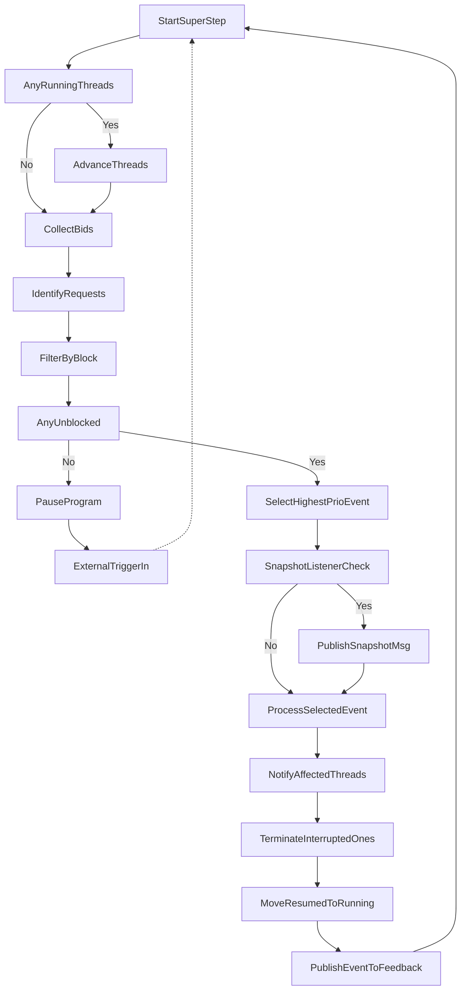

# Activity Diagram: bProgram Super-Step Cycle

This diagram outlines the general process flow of a single super-step within the bProgram.

```mermaid
graph TD
    StartSuperStep --> AnyRunningThreads;
    AnyRunningThreads -- Yes --> AdvanceThreads;
    AnyRunningThreads -- No --> CollectBids;
    AdvanceThreads --> CollectBids;
    CollectBids --> IdentifyRequests;
    IdentifyRequests --> FilterByBlock;
    FilterByBlock --> AnyUnblocked;
    AnyUnblocked -- Yes --> SelectHighestPrioEvent;
    AnyUnblocked -- No --> PauseProgram;
    PauseProgram --> ExternalTriggerIn;
    ExternalTriggerIn -.-> StartSuperStep;
    SelectHighestPrioEvent --> SnapshotListenerCheck;
    SnapshotListenerCheck -- Yes --> PublishSnapshotMsg;
    SnapshotListenerCheck -- No --> ProcessSelectedEvent;
    PublishSnapshotMsg --> ProcessSelectedEvent;
    ProcessSelectedEvent --> NotifyAffectedThreads;
    NotifyAffectedThreads --> TerminateInterruptedOnes;
    TerminateInterruptedOnes --> MoveResumedToRunning;
    MoveResumedToRunning --> PublishEventToFeedback;
    PublishEventToFeedback --> StartSuperStep;
```
