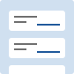

---
source: https://www.w3.org/WAI/ARIA/apg/patterns/feed/

---

# Feed Pattern

## About This Pattern

A  [feed](https://w3c.github.io/aria/#feed)  is a section of a page that automatically loads new sections of content as the user scrolls. The sections of content in a feed are presented in  [article](https://w3c.github.io/aria/#article)  elements. So, a feed can be thought of as a dynamic list of articles that often appears to scroll infinitely.

The feature that most distinguishes feed from other ARIA patterns that support loading data as users scroll, e.g., a  [grid](grid.md), is that a feed is a structure, not a widget. Consequently, assistive technologies with a reading mode, such as screen readers, default to reading mode when interacting with feed content. However, unlike most other WAI-ARIA structures, a feed establishes an interoperability contract between the web page and assistive technologies. The contract governs scroll interactions so that assistive technology users can read articles, jump forward and backward by article, and reliably trigger new articles to load while in reading mode.

For example, a product page on a shopping site may have a related products section that displays five products at a time. As the user scrolls, more products are requested and loaded into the DOM. While a static design might include a next button for loading five more products, a dynamic implementation that automatically loads more data as the user scrolls simplifies the user experience and reduces the inertia associated with viewing more than the first five product suggestions. But, unfortunately when web pages load content dynamically based on scroll events, it can cause usability and interoperability difficulties for users of assistive technologies.

The feed pattern enables reliable assistive technology reading mode interaction by establishing the following interoperability agreement between the web page and assistive technologies:

1.  In the context of a feed, the web page code is responsible for:
    -   Appropriate visual scrolling of the content based on which article contains DOM focus.
    -   Loading or removing feed articles based on which article contains DOM focus.
2.  In the context of a feed, assistive technologies with a reading mode are responsible for:
    -   Indicating which article contains the reading cursor by ensuring the article element or one of its descendants has DOM focus.
    -   providing reading mode keys that move DOM focus to the next and previous articles.
    -   Providing reading mode keys for moving the reading cursor and DOM focus past the end and before the start of the feed.

Thus, implementing the feed pattern allows a screen reader to reliably read and trigger the loading of feed content while staying in its reading mode.

Another feature of the feed pattern is its ability to facilitate skim reading for assistive technology users. Web page authors may provide both an accessible name and description for each article. By identifying the elements inside of an article that provide the title and the primary content, assistive technologies can provide functions that enable users to jump from article to article and efficiently discern which articles may be worthy of more attention.

## Example

[Example Implementation of Feed Pattern](https://www.w3.org/WAI/ARIA/apg/patterns/feed/examples/feed/)

## Keyboard Interaction

The feed pattern is not based on a desktop GUI widget so the  `feed`  role is not associated with any well-established keyboard conventions. Supporting the following, or a similar, interface is recommended.

When focus is inside the feed:

-   Page Down: Move focus to next article.
-   Page Up: Move focus to previous article.
-   Control + End: Move focus to the first focusable element after the feed.
-   Control + Home: Move focus to the first focusable element before the feed.

### Note

1.  Due to the lack of convention, providing easily discoverable keyboard interface documentation is especially important.
2.  In some cases, a feed may contain a nested feed. For example, an article in a social media feed may contain a feed of comments on that article. To navigate the nested feed, users first move focus inside the nested feed. Options for supporting nested feed navigation include:
    -   Users move focus into the nested feed from the content of the containing article with  Tab. This may be slow if the article contains a significant number of links, buttons, or other widgets.
    -   Provide a key for moving focus from the elements in the containing article to the first item in the nested feed, e.g.,  Alt + Page Down.
    -   To continue reading the outer feed,  Control + End  moves focus to the next article in the outer feed.
3.  In the rare circumstance that a feed article contains a widget that uses the above suggested keys, the feed navigation key will operate the contained widget, and the user needs to move focus to an element that does not utilize the feed navigation keys in order to navigate the feed.

## WAI-ARIA Roles, States, and Properties

-   The element that contains the set of feed articles has role  [feed](https://w3c.github.io/aria/#feed).
-   If the feed has a visible label, the  `feed`  element has  [aria-labelledby](https://w3c.github.io/aria/#aria-labelledby)  referring to the element containing the title. Otherwise, the  `feed`  element has a label specified with  [aria-label](https://w3c.github.io/aria/#aria-label).
-   Each unit of content in a feed is contained in an element with role  [article](https://w3c.github.io/aria/#article). All content inside the feed is contained in an  `article`  element.
-   Each  `article`  element has  [aria-labelledby](https://w3c.github.io/aria/#aria-labelledby)  referring to elements inside the article that can serve as a distinguishing label.
-   It is optional but strongly recommended for each  `article`  element to have  [aria-describedby](https://w3c.github.io/aria/#aria-describedby)  referring to one or more elements inside the article that serve as the primary content of the article.
-   Each  `article`  element has  [aria-posinset](https://w3c.github.io/aria/#aria-posinset)  set to a value that represents its position in the feed.
-   Each  `article`  element has  [aria-setsize](https://w3c.github.io/aria/#aria-setsize)  set to a value that represents either the total number of articles that have been loaded or the total number in the feed, depending on which value is deemed more helpful to users. If the total number in the feed is undetermined, it can be represented by a  `aria-setsize`  value of  `-1`.
-   When  `article`  elements are being added to or removed from the  `feed`  container, and if the operation requires multiple DOM operations, the  `feed`  element has  [aria-busy](https://w3c.github.io/aria/#aria-busy)  set to  `true`  during the update operation. Note that it is extremely important that  `aria-busy`  is set to  `false`  when the operation is complete or the changes may not become visible to some assistive technology users.

