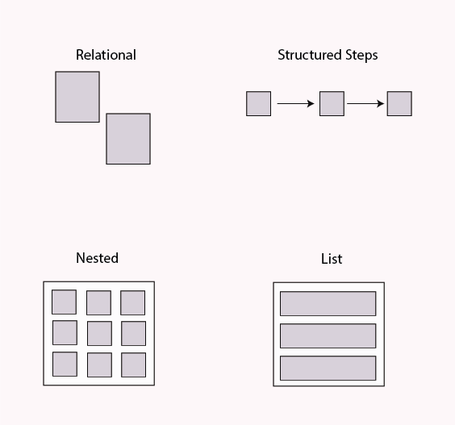
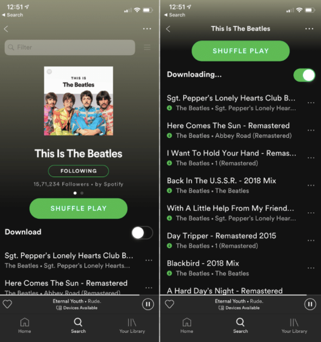
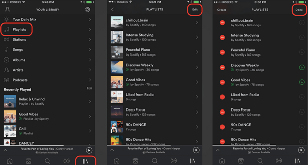
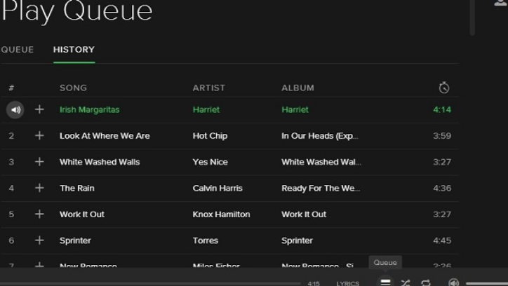

---
author: Rachel Jaffe
date: Jun 10, 2019
source: https://rachelaliana.medium.com/a-pattern-language-object-groups-7ddc20f0f12

---

# Object Groups

_This post is a part of_ [_“A Unified Language for the Design of Information Systems_](a-unified-language-for-the-design-of-information-systems.md)_”._

Objects can be added, subtracted, changed, and structured in many different ways.  **Object groups**  are multiple objects that are linked together into larger structures. Examples include:

**Relational grouping:**  These objects are set visually beside one another in some pattern. For example, the  **Pause** button is situated next to the  **Follow** button and the  **See More** button.

Buttons placed next to each other.

**Nested:** Many objects are collected within a larger object grouping. For example, within “The Beatles” playlist, there are several objects (songs) nested within the larger object of the playlist. Here you can see “Here Comes the Sun” and “Day Tripper” within the larger playlist.

The Beatles playlist contains many individual songs.

**Structured steps:** There is a link between objects across multiple pages. To create a Playlist in Spotify, users need to go to Playlists, then Edit, and Select Create. These objects are connected in a specific formation to help people complete a specific goal.

There are specific steps to set up a playlist.

**List:** In this  pattern there is a defined order between objects within one page. In a Queue on Spotify, songs play in a specific order instead of on Shuffle, where songs within a playlist can play at random.

In a Queue songs play in a specific order.

Relational, structured steps, nested, and lists are some of the most basic object group patterns. These basic groups are used over and over again throughout networks. Over time several more different grouping are likely to be identified.
