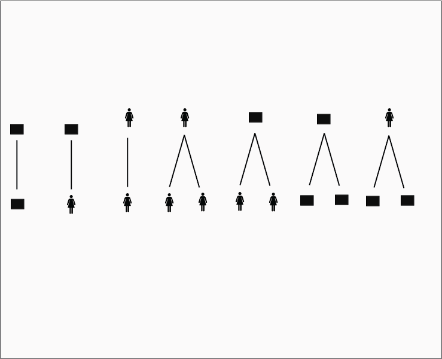
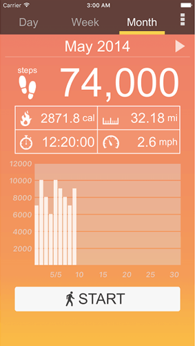
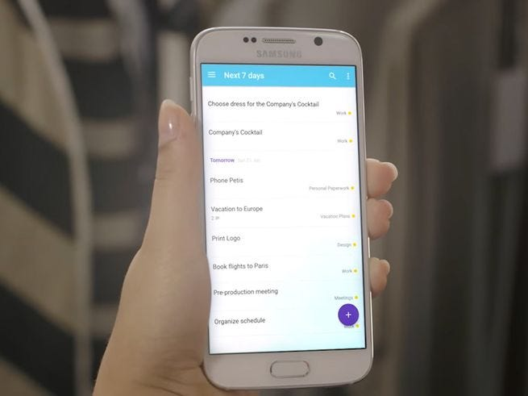
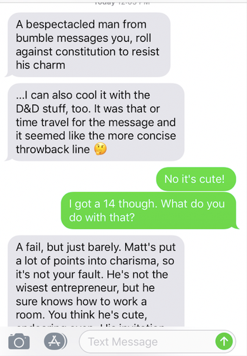
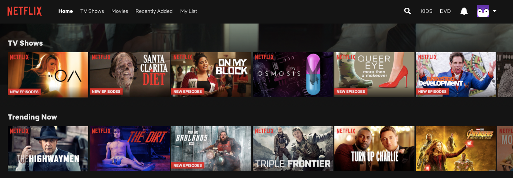
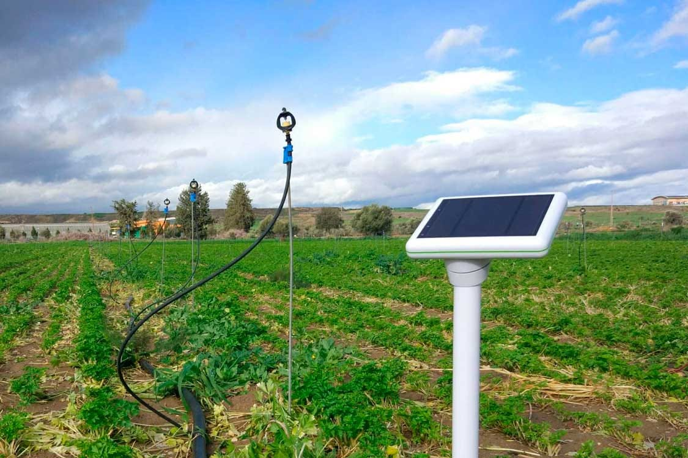
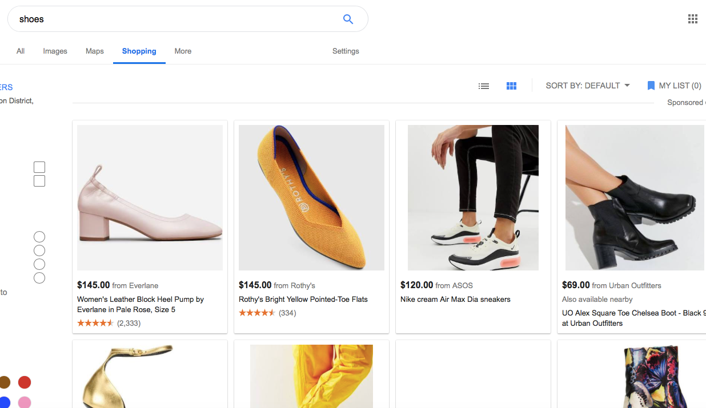

# Base Dynamics

Different basic pairings between objects and channels

_This post is a part of_ [_“A Unified Language for the Design of Information Systems_](a-unified-language-for-the-design-of-information-systems.md)_”._

Base dynamics are fundamental ways that  **objects** and  **channels** can be connected together. Base dynamics, when connected in various formations create complex structures. We will walk through the different kinds of base dynamics with examples of what they look like in practice.

## One Object to One Object

This kind of relationship denotes information transfer between two  **objects**. A real-world example might be when you order a package, this package is sent to a single truck. The information about the package that might be transferred to the truck could be such things as size and weight of the package, its final destination’s address, and the date by which it needs to arrive.

Packages loaded onto a truck:  [https://www.bloomberg.com/news/articles/2014-05-08/why-ups-might-not-match-fedex-s-higher-package-prices](https://www.bloomberg.com/news/articles/2014-05-08/why-ups-might-not-match-fedex-s-higher-package-prices)

## One Object to One Person

This base dynamic occurs when an object transfers information to a person, or a  **person** transfers information to an  **object.**

Fitness apps are a good example of  **person-to-object** information transfer. Throughout the course of the day, when users walk around their steps are translated into steps on their fitness apps.

Pedometer app:  [https://www.maketecheasier.com/free-android-pedometer-apps/](https://www.maketecheasier.com/free-android-pedometer-apps/)

This dynamic can also work in the other direction of  **object-to-person** communication. As the Internet of Things emerges, objects are also increasingly communicating with people. Your computer might send you a notification that you left the lights on in your house, your car might send you a notification that you need to get more gas, or your phone might remind you of an item you need to complete on your to-do list.

The object of the Reminder is sent to a person at a specified time or location:  [https://www.popsci.com/set-phone-reminders](https://www.popsci.com/set-phone-reminders)

## One Person to One Person

This base dynamic is  **person-to-person**. For centuries people have exchanged information through in-person conversations. Today there are a plethora of digital tools that people use to communicate with each other. Telephones and text messages act as channels for this mode of communication.

Text message conversation.

## One Versus Many

Base dynamics also include  **many-to-one** dynamics. A base dynamic that is when the  **same information is transferred in the same way to many people at once**. Even if a person talks on the phone in a room with another, and both the person on the line and the other person in the room heard the same information, this would be two one-to-one connections. Hearing information through a phone versus seeing and hearing the person deliver information are two different kinds of channels and should be evaluated differently.

## One Person to Many People

One person might simultaneously transmit information to several others. This information transmission is well known to anyone who has been in a classroom. A professor presents information simultaneously to numerous students. Real-time digital platforms such as the radio or television make it possible for people to convey one-to-many information to others.

A teacher lectures:  [https://www.pexels.com/search/classroom/](https://www.pexels.com/search/classroom/)

## When Are We Objects?

Is a podcast that has been recorded and then broadcast later a person talking to many others or an object? There is much that can be debated, such as the amount of editing a podcast might have had that turns it from a simple conversation into an entertainment product. There is something to be said for perhaps the real-time nature of the communication. Maybe our person-to-person interactions that are recorded decay over time to objects.

Whether a person is seen as a person or an object within a system will be tied to the goals of the system. If your question is how to increase user input into the system, you will need to view a user as a person instead of their content generated as an object. If your question is how to analyze the data generated by people’s interactions on a network, it is more useful to categorize people as objects.

## One Object to Many People

Many entertainment platforms are examples of systems in which single objects (videos, songs, podcasts) play to many people all at once. On Netflix, several thousand people can stream the same show at the same time. One of the reasons why Bandersnatch, a Black Mirror series show was so transformative was because it broke this understanding of what the general dynamic between person and object (movie). Usually movies are one-way transmissions. Bandersnatch demanded user input that made it so every person that watched the movie had a different experience. They changed the experience of a movie from one one-to-many relationship to several dozen different singular object-to-person relationships. This was a fundamental alteration of the base dynamics in a typical movie format.

Netflix contains many objects that can connect to one person.  [www.netflix.com](http://www.netflix.com/)

## One Object to Many Objects

In crop fields, one sensor might communicate their status to many different other objects at once. A sensor that tracks water might communicate a decreased water level to an app that tracks water levels for a farmer to see, and a lever that autonomously increases the flow of water into the field.

A water level signals that the fields need to be watered.

## One Person to Many Objects

When you search for shoes, Google connects this input to multiple different objects (a collection) that might satisfy your search query. One person through changing the channel of the price, or size, or color of shoes displayed, interacts simultaneously with many objects.

Many different processes occur under the surface — data is transmitted to a server, and this server connects to multiple databases that return queries. But the relationship between the end-user and the information is one-to-many. Over time there will be a clearer understanding of where software design ends and information architecture design begins.

Google creates the connection to many different kinds of shoes. Google.com

Base dynamics are some of the fundamental structures of information systems. However, base dynamics are only one-way flows of information. To create continual complex systems, information also has to flow back to users in the form of feedback. The next article deals with how base dynamics are combined together to form  [loops.](a-pattern-language-loops.md)
