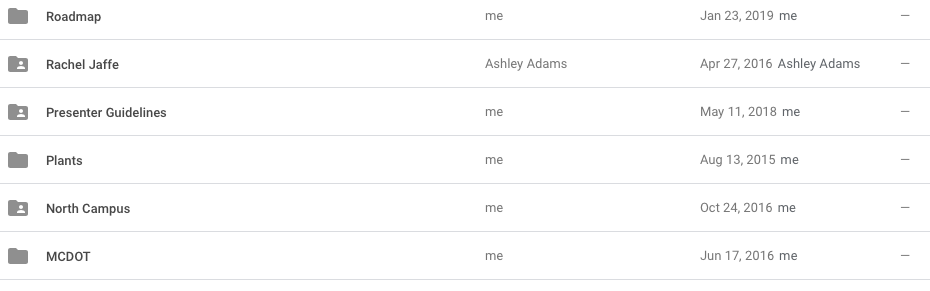
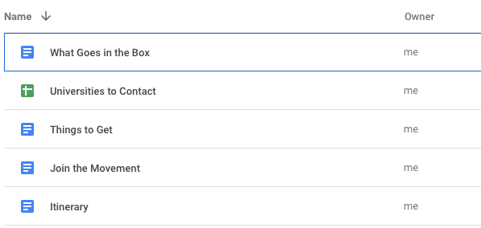
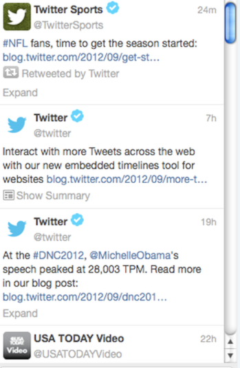
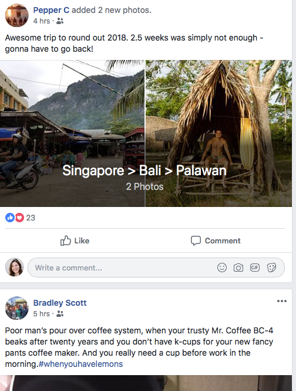
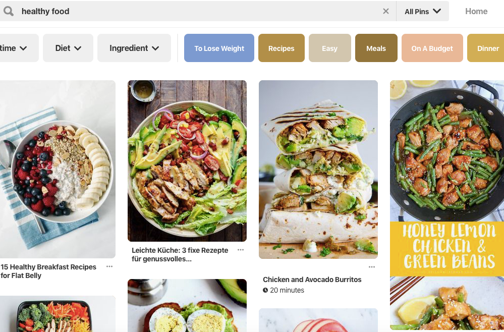
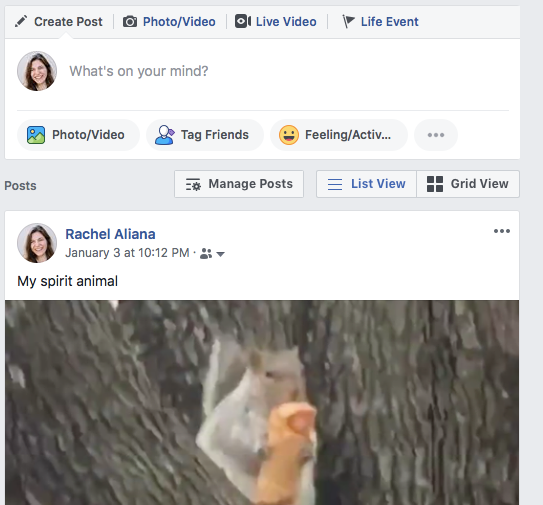
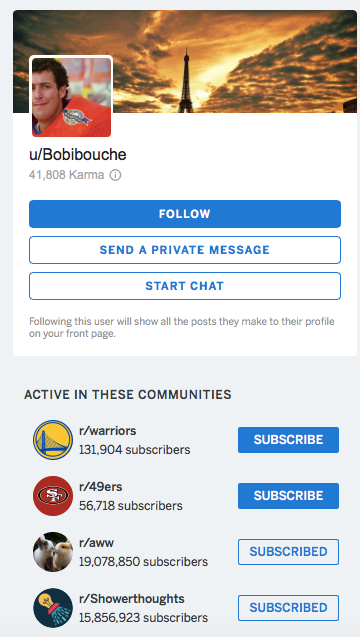
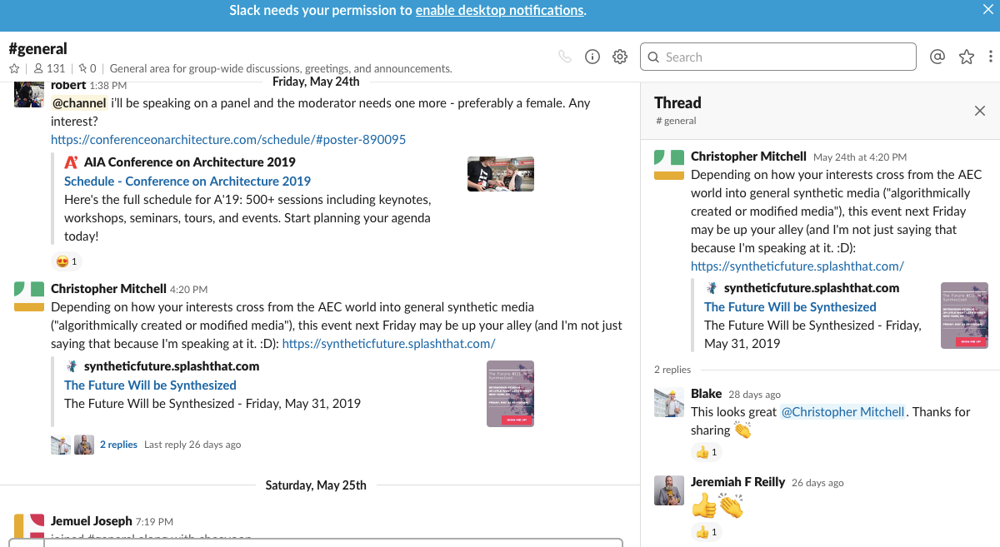

# Blocks

Modules in different combinations become blocks.

_This post is a part of_ [_“A Unified Language for the Design of Information Systems_](a-unified-language-for-the-design-of-information-systems.md)_”._

[**Blocks**](a-pattern-language-interaction-blocks.md)  are composed of multiple modules grouped together that give rise to more complicated interactions. Blocks have both  _situational_ connectedness and  _system_ connectedness.  **Situation connectedness** refers to how blocks are laid out visually on the screen.  **System connectedness**  refers to what kind of dynamic there is between the blocks. Blocks can (and will likely) have simultaneously both situation connectedness and system connectedness, and can be connected to several different situations or systems at once.

Above are some basic patterns of blocks. There are  **pools** which are distinct modules nested under a larger hierarchy. There are  **streams**  that are distinct modules that can be scrolled through, generally organized by recency. There are  **walls** which contain both static profile information and collaboratively built streams. There are  **threads**  that are nested comment modules. Below is more depth on each structure and examples.

## Pools

Pools of information occur when there are modules nested under one larger category. In Google Drive, these are pools of folders, or organized objects under one heading. Pools allow for greater focus and specificity around a more targeted topic.

As seen below, on Google Drive the user can have numerous folders on their profiles. These folders in turn can reveal more sub-folders or individual documents.

Initial layer of folders.

When a person opens a folder, they can see more documents or sub-folders. These sub-folders generally move towards increasing specificity. It can be said that this structure is a two-layered pool.

Opening a folder reveals more potential pathways

# Streams

Streams are modules that are scrolled through vertically. Streams are good for creating aggregation of continually updating content. In the case of Twitter, the core object of the platform is the tweet. Users follow certain hash-tags or people, and in turn get a chronological stream of tweets that relate to these topics.

Twitter stream:  [https://www.cnet.com/news/twitter-introduces-embeddable-tweet-stream-tool/](https://www.cnet.com/news/twitter-introduces-embeddable-tweet-stream-tool/)

# Feeds

Feeds are a sub-set of the general stream construction that organizes information not simply chronologically but based on an algorithm. Components of this algorithm can include highly upvoted content, relatedness to the user, and globally trending topics.

Facbeook feed:  [www.facebook.com](http://www.facebook.com/)

# Collections

Collections are groups of related objects. In Google docs, a Collection is composed of documents around a central topic. On Pinterest, a collection is composed of images that users have collected from other users. For example, on Pinterest users can create boards around healthy eating, and save their own recipes and the recipes of other food bloggers.

Collections should be utilized when objects are created that have lasting relevance to users. These platforms grow value the more people add objects into their collections, because the simple act of aggregation means that users have a lower energy demand needed in their daily lives to continually access this information. Once a collection of healthy food is created, users can more easily choose what to make for dinner. Users can also transfer collections to other people, which lowers the energy demanded of another user.

Pinterest board:  [https://www.pinterest.com/search/pins/?q=healthy%20food&rs=typed&term_meta[]=healthy%7Ctyped&term_meta[]=food%7Ctyped](https://www.pinterest.com/search/pins/?q=healthy%20food&rs=typed&term_meta[]=healthy%7Ctyped&term_meta[]=food%7Ctyped)

# Wall

The wall is a specific stream that is owned by one person. The most famous construction is the Facebook wall. But what would a wall look like if it was sorted by top-ranked post? Or divided into topic threads?

Facebook wall:  [www.facebook.com](http://www.facebook.com/)

# Profile

A profile is a public accumulation of information on a specific user. The information contained in a profile depends on the goal of the larger community. On Facebook, a profile has a user’s collection of photo albums, their location, their relationship status. All of this data harkens back to Facebook beginnings as a sort of address book to find attractive connections across college campuses.

On Reddit, a profile has a user’s reputation score on it and communities in which they are active. This reputation score is the accumulation of the positive karma the user has gotten in their interactions on Reddit. This relates to Reddit’s overall goal as a platform where users contribute content to specific communities.

A reddit profile:  [www.reddit.com](http://www.reddit.com/)

## Thread

A thread takes the form of nested modules. These modules can be plain text or emojis, such as in Slack. They can also be comment modules, such as is the case with Reddit. How would threads change if there could be pools of interaction added to them? What would a network look like if threads could be added to different personal collections? Right now Facebook threads disappear over time in the Feed.

## Next Steps

This is not nearly an exhaustive list. There are likely hundreds, if not thousands, of different combinations of modules to create basic block structures.

When information architects have the words to break up systems like Facebook, Google Drive, Slack, Reddit, and Instagram into basic structures by which they are composed, they can begin to see underlying structural differences in how people interact on these platforms and how communities emerge.

Understanding the basic building blocks of these structures also allows information architects the power to do something else: conceive of entirely different kinds of networks. When a platform is broken up into basic paradigms, they can then be shuffled around and rearranged in creative ways.

What would a wall filled with threads of different conversations look like? What would a facebook-like stream look like that had more depth to it, so that people could move from one wall post to a person’s stored collection? When information structures can be broken down into discrete structures, they become like malleable bricks. Basic structures are the root of creative thought and recombination. Underlying basic online structures will allow information architects new creative control over how they build systems.
