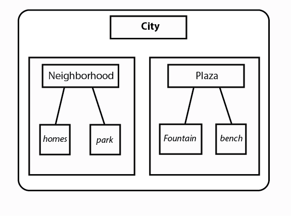
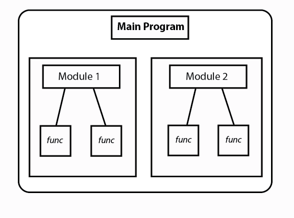
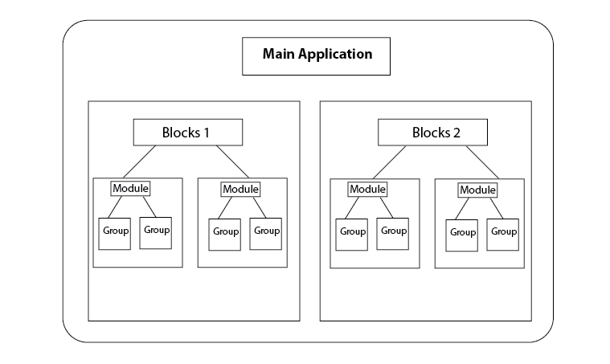
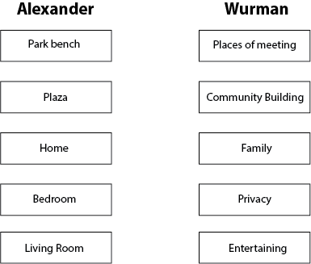
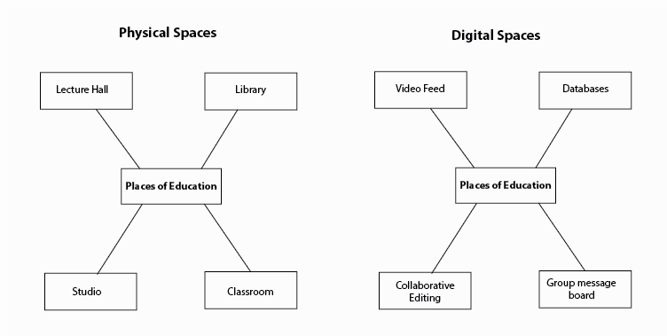

# Development of a new language for Information Architecture

Architecture as spatial structure and information flows:  [https://www.pexels.com/photo/architect-architecture-artist-blur-268362/](https://www.pexels.com/photo/architect-architecture-artist-blur-268362/)

_This is a Part of “_[_Structuralism and a Pattern Language for Online Environments_](towards-a-larger-view-of-information-architecture.md)_.”_

Language is a powerful but subtle force in that it shapes our most basic paradigms. Better architectural design languages have helped architects and planners more consciously design cities. Christopher Alexander made it easier for architects to create high quality spaces through his modularization of spatial patterns whereas Richard Saul Wurman helped planners build more thoughtfully through his recategorization of city spaces by the interactions that take place in them.

The Structural language for information architecture can help information architects better understand how individual components of websites and apps create specific interactions and can use this understanding to more purposefully build digital networks.

This section focuses on how the Structural language emerged from the combination of two concepts Alexander and Wurman developed in the field of architecture and planning: modularization and functionalism.

## Modularization: Christopher Alexander

Architectural theorist  [Christopher Alexander](https://ced.berkeley.edu/ced/faculty-staff/christopher-alexander)  reshaped the perception of city spaces the development of a standard architectural language. Alexander broke down “common problems which occur over and over again in our environment, and then describes the core of the solution to that problem, in such a way that you can use this solution a million times over” ([x, A Pattern Language](http://www.arch.mcgill.ca/prof/mellin/articles/patternla.pdf)). He saw the city as a set of distinct, reusable patterns. The 253 patterns he set forth in his book  _A Pattern Language_ ranged from playrooms and salons in a house to city-scale places like promenades and plazas.

These individual patterns connect to create cities like words connect to form sentences. Whereas words are tied together in underlying structures of noun, verb, and prepositions, patterns of home and park are nested into larger patterns of neighborhoods which are in turn nested into cities.

Nested physical spaces within the larger city

Alexander’s thinking shifted how architects conceived of spaces. His ideas also impacted computer science with the creation of  _modular programming._  Instead of writing one large and complex program, developers could write several smaller sub-programs and then link them together. This meant only some developers needed to build high quality components like menus, headers, and sidebars. Once each pattern was created, other developers who wanted to build anything from apps for party planners to websites for municipal governments could reuse these menus, headers, and sidebars in their platforms. They did not need to reinvent new kinds of ways to organize and navigate through websites because they had patterns at their disposal. This helps each developer do more with less repeated effort.

Modular code is a large program created from many sub-programs.

The Structural language for information architecture shares this same foundation of nested modular components. The language’s foundation is of objects and object groups, which act like root words. These groups are connected in various ways to form modules, or words. These modules are connected together to form blocks, or sentences. These blocks are nested into platforms or mobile applications, like sentences can form everything from technical manuals to fantasy stories.

Nested components within larger structures.

The idea of modularization of nested components is at the foundation of the language, but it is modularization in a different way than Alexander intended. Alexander concentrated on the  _physical_  components of the city. The height of terraces, the width of sidewalks, the orientation of streets to roads. This is much what user experience designers do when they define the size of input boxes or buttons. These design aspects are important to create visually intuitive web pages. But a visually intuitive pattern can still be a terrible choice to get the information architect’s desired user interactions.

To be a language that helps information architects build better digital interactions, it needs to be modularized in a way that focuses not on how digital spaces  _look,_  but how they  _function_.

## Functionalism: Wurman

Alexander might have defined a park as a contained space with a slide, a seesaw, tables, trees, and benches. Richard Saul Wurman on the other hand said we “ask for parks instead of places for recreation” (Aspen speech). He saw many of the physical components Alexander outlined as important  _pieces_ of a park, but the physical park as less important than the interactions the park affords. The design elements of slide and seesaw are only as important as in their ability to promote the function of recreation. I call this view  _functionalism._

Below is a comparison of the two theorists’ conceptions of space. Alexander sees the city in terms of physical components of park benches, plazas, homes, rooms. Wurman sees benches as places to meet others, plazas as places for groups to showcase themselves, the living room as a space to entertain close family guests.

Different ways to break down the spaces of a city

These different ways to see the city are important for planners and architects. To understand why a place functions in a certain way they can analyze its form, while developing new patterns that help places take on new functions.

But what does this have to do with information architecture?

Right now UX designers and information architects build visual patterns like scrolling, cards, posts, profiles. This is similar to how Alexander decomposed the physical world into patterns. This is a modularized  _visual_ view of online spaces.

As Wurman saw with physical spaces, visual design is only half of the puzzle. Online environments can also be broken down into interaction-oriented components like community, vulnerability, self-identity, privacy. This is a modularized  _functional_  view of online spaces.

With an understanding of what both visual and functional patterns exist, it can be easier for designers and information architects to move from desired interaction to a prototype.

What components create digital spaces of education?

But unlike the physical realm where people have a centuries-long understanding of how tables, benches, and doors can be combined in different combinations to form rooms or plazas or playgrounds, the online world does not have this same shared understanding of what its basic components are, much less how they can be combined together.

The next section, “[A Unified Language for Information Architecture](a-unified-language-for-the-design-of-information-systems.md)” defines the basic components of objects, channels, levers, and blocks that form information structures.
