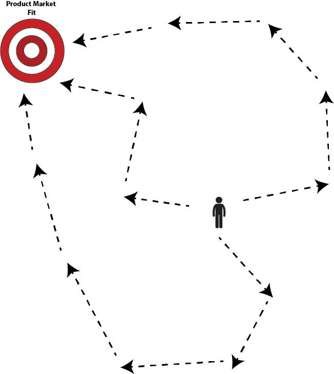
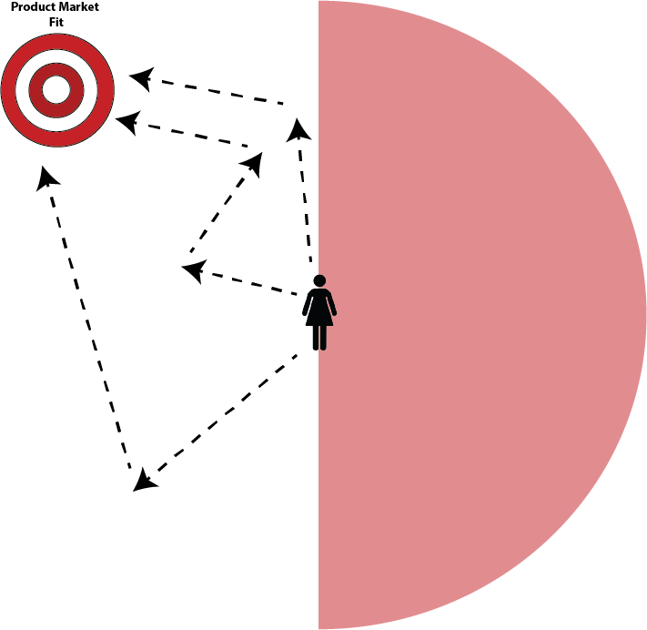

# Guided Agile and the changing role of the Information Architect

Bridges, Roads, Buildings define the routines of daily life:  [https://medium.com/swlh/towards-a-larger-view-of-information-architecture-2a7bd6ebafb7](towards-a-larger-view-of-information-architecture.md)

_A part of “_[_Structuralism and a Pattern Language for Online Environments_](towards-a-larger-view-of-information-architecture.md)_”_

In the past, if a farmer wanted a sweeter strawberry, they needed to search through the strawberries in their field to find one that was sweeter than the others. The next year they would plant their strawberry crop using those seeds, and with each cycle they would get slightly sweeter strawberries. This approach takes a long time, and at the end a farmer would still not be able to say  _why_ their strawberries are now sweeter. They just are.

This process of doing, measuring, adjusting, and doing again is akin to the process of agile development conducted in businesses today. Agile development is a useful tool to get people to talk to customers, experiment, and shift course quickly. But agile can also be highly  _inefficient_  because it can take dozens of iterations to reach a design that works for your given market.

Agile development is like a blind-folded archer that locates the target of product-market fit through a game of Marco Polo. They can shoot and adjust quickly, but this experimentation takes a lot of time. They also lose a lot of arrows.

Product-Market fit Marco Polo

The discovery of DNA opened a new realm of exploration through the insight that small base pairs of guanine–cytosine and adenine–thymine combine in complex sequences to form different genes. This understanding changed how new fruits and vegetables come to market. Suddenly scientists could understand what genes create sweetness in a strawberry, and use this understanding to engineer sweeter fruits in fewer iterations.

[Objects](a-pattern-language-objects.md)  and  [modules](a-unified-language-for-the-design-of-information-systems.md)  are the digital equivalent of the natural world’s base pairs and genes. The patterns information architects uncover are like the understanding scientists cultivate of how genes are expressed. Understanding interaction patterns can help businesses see  _why_  certain website structures fit certain markets, or how adding something small, like a Like or Comment button, can create ripple effects throughout a system.

In the archer-playing-Marco-Polo metaphor, this is like a person that knows the target is likely to be on one half of the field rather than the other. This person only needs to make two or three guesses to get to the target instead of five or six. In a business, this is like a design team that creates a great product in the third or fourth iteration instead of the sixth or eighth. They still need to iterate to understand what patterns match their specific circumstances, but their actions are better directed. They aren’t shooting as blindly.

The archer knows the target is to their left.

## Guided Agile

Currently a lot of information architecture work is done unconsiously, hidden in product design, UX Research, and business management. A business person might see people like Tinder, so they make their app with swipe cards. They understand people like Karma on Reddit, so they put these incentives on their websites as well. They might be able to test and redirect their course of action quickly if these things turn out to be bad choices. But since they never understood the underlying architecture, they cannot enunciate  _why_ they were unsuccessful and their next iteration is not guaranteed to be more successful.

The patterns developed in information architecture are not meant to supersede an agile approach. These patterns are meant to  _make agile experimentation more efficient_  by guiding design decisions, making design closer to engineering than intuition.

If a company wants to build a place where their users can be vulnerable, information architects know that an important element to create vulnerability is to have clarity in who can access a user’s information. If a company wants to build a place where work happens, information architects can align what kind of work (research work, editing, or collaborative work) with user permissions. If a company wants to build a community, information architects can understand the community’s values to see if users should interact primarily in constant streams or separate pools of different discussions.

The ideas of objects, blocks, modules, and channels, as well as the Patterns of Work, Play, Education, and Home are the very first steps to make online designs more conscious and effective. This increase in exactness of design will likely make the Information Architect a more valued member within design teams and organizations as they are better able to move from system goals to the design of these systems.

