---
author: Rachel Jaffe
date: Feb 3, 2020
source: https://rachelaliana.medium.com/modnet-design-standards-15e53176de41

---

# Modnet Design Standards

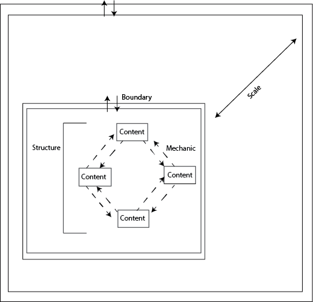

Standard design structure.

_This article is a part of the series_ [_“Past the Internet: The Emergence of the Modnet”._](past-the-internet-the-emergence-of-the-modnet.md)

There is a new potential tool that can drastically alter how digital spaces are designed and value is captured: the modnet. The modnet is formed through modules that are composed of patterns that contain both user-generated content and ways to connect with other modules to form larger modular networks, or modnets that are platform-independent.

Below are rules for how the modules should be structured to enable them to connect to each other. First I wanted to get the theory and logic down. Slowly, these standards will be translated into what I call “top-code” that can be utilized in conjunction with other computer languages.

The Monet Design Standards (**MDS**) lays out basic guidelines for how information architects can design patterns that autonomously combine with each other. The Design Standard consists of standards of  **content**,  **scale**,  **boundary,**  and  **mechanic**.

Standard design structure.

# Content

Similar content would be tagged with  **keywords**  so that when networks combine, similar content will be organized together.

Let’s say a community is hosting a farmer’s market in a plaza. Today there are websites that post what food trucks and farmers should be there. However, these websites tend to be updated infrequently due to low direct, monetary incentives for farmers market organizers. Instead of a website that needs to be updated by a central authority, each farmer can have their own stall pattern where they input what food they have that day.

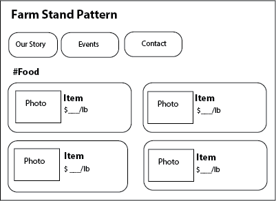

A Farm Stand pattern to insert produce information.

When a farmer reaches a public square or plaza, they can add their Farm Stand Pattern to others’ modules. When more than two or three Farm Stand modules connect, a Farmer’s Market interface is automatically generated for people to be able to see what food is available at the market in real time

When the farmer leaves the plaza, their business’s Farm Stand module disappears from the Farmer’s Market.

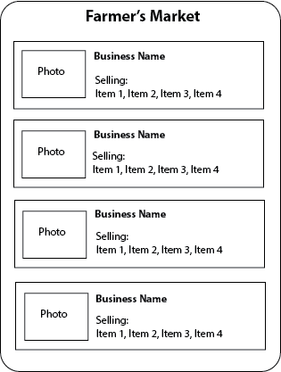

Farmer’s Market design pattern.

## Scale

Scale represents a new level of one-ness, or a separate level in a hierarchy. On the Modnet, in order for blocks and modules to be able to be combined together, there needs to be standard ways in which they can be organized.

Below are eight basic classes of scale for designers to use. For each pattern that an information architect creates, they will need to define what scale each piece of their pattern fits in.

S1 —  **Singular objects**

S2 —  **Object Groups** (contains lists, steps, and collections)

S3 —  **Blocks** (contains pools, streams, walls, threads)

S4 —  **Block Groups** (rooms)

S5 —  **Modules** (Houses/Buildings)

S6 —  **Module Groups** (blocks)

S7 —  **Platform structures** (neighborhoods)

S8 —  **Super-structures**  (cities)

Let’s use the example of a farmer’s market again to understand scale.

**S1:**  Singular food items.

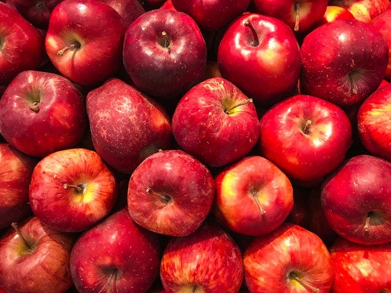

Apples:  [https://www.pexels.com/photo/red-apples-2487443/](https://www.pexels.com/photo/red-apples-2487443/)

**S2:**  Bushels of items with details pertaining to type, cost, list price.

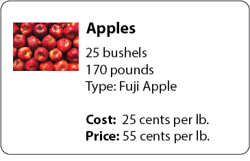

Item listing.

**S3:**  Items are aggregated into collections.

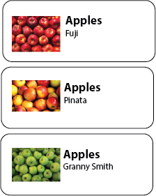

Collection of apples.

**S4:**  Collections can also be nested within larger collection “rooms” of Produce.

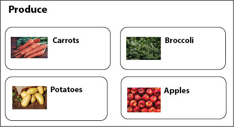

A collection of many collection.

**S5:**  Produce is nested within a larger Stall module.

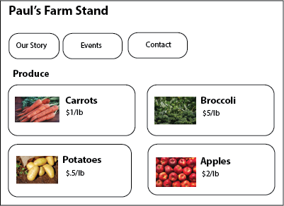

A farmer’s stand module.

**S6:** These stalls would be added to a Module group to become a Farmer’s Market if close to other public Stand modules.

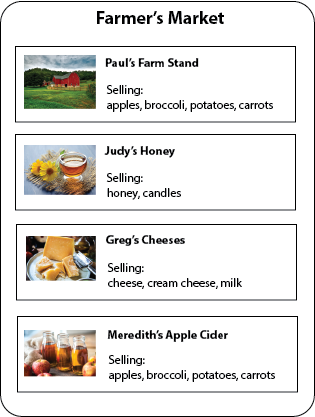

Stands in close proximity become a Farmer’s market.

**S6:** If stalls that sells clothes and another that sells jewelry arrives, the network will automatically become a larger, general Market.

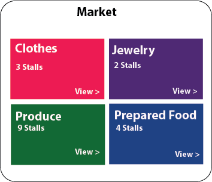

A collection of different structures become a general market.

# Boundary

The idea is that people will constantly be sharing data with the world around them. If people are going to be ok with this, they will need to know exactly what information they share. Boundaries are  **what information is shared between different modules.**  This includes what information modules and blocks at smaller scales receive from larger networks, and what information is shared back out to the larger network.

## Personal Apple Module

A farmer could enter the data of how much corn he or she has into one item module. Instead of inputting information into a supplier’s website, a farmer’s market website, and updating one’s own information, this personal module will automatically update all of the modules connected to it.

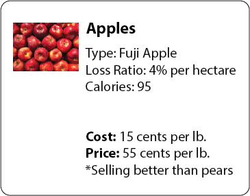

Those with private permissions would see all of the block’s information.

## Supplier Item Listing

Those who have supplier permissions can see certain information:

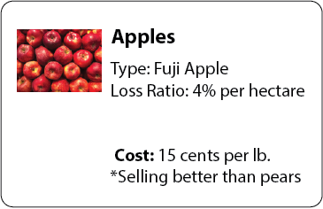

Information a supplier can see.

## Public Item Listing

Those who have public permissions would see another set of information:

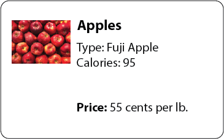

Information seen by the public.

This creates less overhead for people to track what sells best and whether they are on track to make a profit. This will allow business to get done faster with lower need to plan gatherings ahead of time or update many websites with the same information. It can also create greater trust between different parties as people know organizations are working with similar information as their suppliers. This can have [far-reaching consequences for who has power](information-literacy-and-power-structures-of-control.md)  within information systems.

## Search Boundaries

**Search boundaries** are how far away a person can find a network and how far away they can participate in the network. For innate ephemeral networks the search boundaries of how far away you can connect to the network and the participation boundaries of whether you can participate in the network are the  _same_, and limited by the strength of the  _wifi_  signal.

Locally ephemeral networks there can have  _different_ search and participation boundary and have top-down designer delineated control of the boundaries of search and participation. What this could mean is that a person might be able to see a farmer’s market is converging nearby, but only when in the participation boundary can they add their stall module to the network.

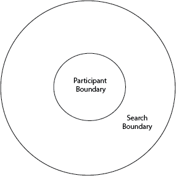

Locally ephemeral networks can have different search versus participation boundaries.

# Mechanics

Content of similar types or structures can inherit mechanics of scales above and below it. A lot of work of module and app designers is how this inheritance will happen.

## Bottom-Up

Let’s say an individual has a food tracking app that helps them plan healthy meals around them. All of the stall items can appear in the person’s catalog of options around them. Healthy items can be overlaid with green icons, semi-healthy with yellow, and unhealthy with red.

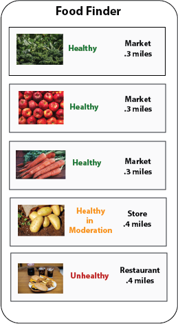

With a personal module people have more control than on Yelp or Google to find all food sources, not simply restaurants.

## Top-Down

Stall icons can also inherit mechanics from super-structure (S6) that they are connected to. An urban planner might use all of the stall data to map food scarcity in real-time on a much larger platform. Here the stalls would be a part of an entirely different mechanic of density. Areas that have good coverage of fresh food might appear in green, and areas of low coverage appear in red. The same data is used in many different networks in many different ways, but the important part is that people  _only need to input their data in one place_. This can allow for greater user control over their data, and more networks that can be built without the need for intensive work or monetary gain.

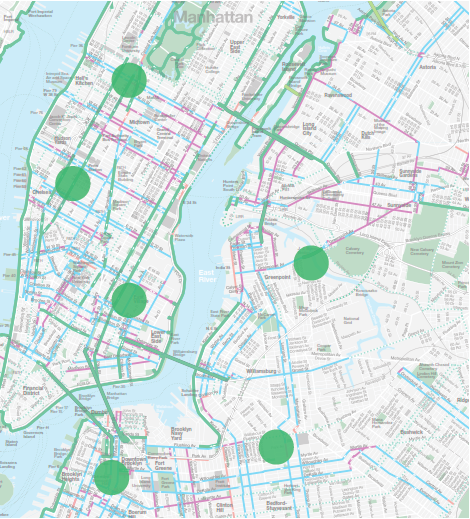

Planners can see farmers markets in real time, better being able to understand food access.
