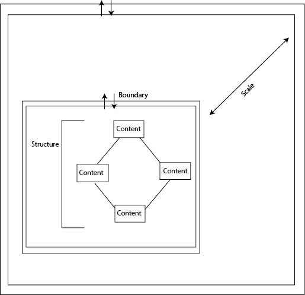

---
author:  Rachel Jaffe
date: Sep 30, 2019
source: https://medium.com/mytake/patterns-for-the-online-world-4604a714dfd1

---
 
# Pattern Structures

The pattern of a basketball court overlaid on an empty lot:  [https://www.pexels.com/photo/multicolored-basketball-court-1897359/](https://www.pexels.com/photo/multicolored-basketball-court-1897359/)

_This article is a part of “_[_Structuralism and a Pattern Language for Online Environments”_](towards-a-larger-view-of-information-architecture.md)_._

Previous sections laid out foundational concepts of modules, blocks, and platforms that are foundational elements of information structures. This section moves from understanding these concepts to  _using_ them. This will be done by developing a dictionary of repeatable, functional digital patterns of what routines people conduct in these spaces. These patterns are grouped by routines because it is an easier short hand. For example, when people go to describe a kitchen, they do not say “this place with four walls, a table, a fridge, five shelves, and a sink.” The idea of “kitchen” provides architects a basic understanding of the kind of architecture that will be seen in this place, and understand some of the basic goals of the people in these places (to cook, to eat, to engage with family).

These patterns are inspired by the physical patterns that Christopher Alexander set out in his book “A Pattern Language: Towns, Buildings, Construction.” In this book Alexander and his co-authors write about the design of many physical elements of the city, from singular rooms, to houses, to the creation of cohesive neighborhoods. These patterns helped architects understand how to structure physical spaces to best enable desired routines. Similarly, these patterns are meant to help information architects have a common understanding of what combination of modules and blocks enable common routines people want to accomplish online.

Each pattern is broken into four defining attributes: content, structure, boundary, and scale.

## **Content**

What kind of activities and desired interactions take place in this pattern? What is the  _goal_  of this pattern for the user?

## **Structure**

How is information organized in this pattern, and are there any innate mechanics within this pattern?

## **Boundary**

What information within this pattern is shared with other patterns, what information does this pattern utilize from other patterns, and what user permissions are needed to interact with a certain space?

## **Scale**

How does this piece of the network interact with the larger whole? How is it nested amongst others, and what can be nested inside of it?

Alexander could talk about rooms, buildings, and streets, and people have a general understanding of how big these things are and how they fit together since they have some experience seeing these spaces in the world around them. In digital space, it is odd to say a place is “big” or “small”, and relationships are not naturally apparent. Because of this, the size of an object is consciously delineated. Eight basic sizes are defined:

S1 —  **Singular objects**

S2 —  **Object Groups** (contains lists, steps, and collections)

S3 —  **Blocks** (contains pools, streams, walls, threads)

S4 —  **Block Groups** (rooms)

S5 —  **Modules** (Houses/Buildings)

S6 —  **Module Groups** (blocks)

S7 —  **Platform structures** (neighborhoods)

S8 —  **Super-structures**  (cities)

## Pattern Drawing

Below is a general drawing of a pattern, with boxes that delineate Content, and lines that delineate that the Content is connected together. A double line represents a Boundary outside of the pattern, while the pair of arrows represent that data is shared in and out of a pattern. A single arrow out demarcates that information is shared out, but does not enter. A single arrow in demarcates that information is shared to the pattern, but information is not shared out. A solid line demarcates that  _all_  information generated inside a pattern is shared. A dashed line demarcates that there are some rules around what information is shared.

General structure of a design pattern.

The way in which these patterns are define are meant to create  **_interoperable_** components. This can allow designers to better analyze the structural differences across what might look at first glance like very different kinds of websites.
