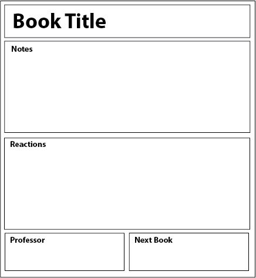
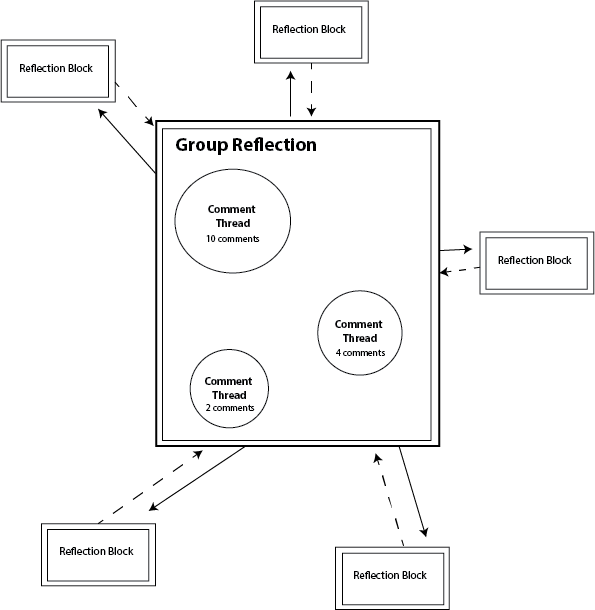
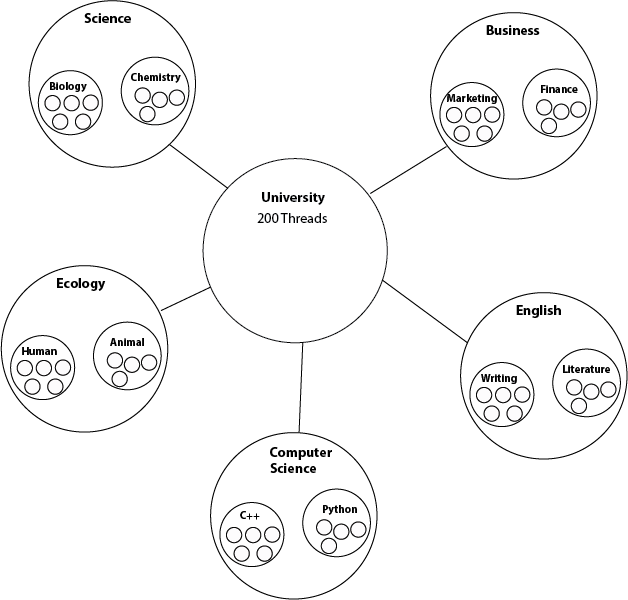

---
author:  Rachel Jaffe
date: Sep 20, 2019
source: https://rachelaliana.medium.com/patterns-of-education-reflection-reaction-and-marketplace-of-learning-42fbfd591202

---

# Patterns of Education: Reflection, Reaction, and Marketplace of Learning

A place of education as a place of discussion:  [https://www.pexels.com/photo/top-view-photo-of-3-men-in-front-of-laptop-2566581/](https://www.pexels.com/photo/top-view-photo-of-3-men-in-front-of-laptop-2566581/)

Online classes, certificate programs, and bootcamps have emerged that challenge traditional education formats and the physical spaces that comprise them. However, many people do not finish online classes. Others finish bootcamps without a network that can help them find a job. Some could complete an online degree without the basic assumptions of their world ever being challenged. There are also components of real-world universities, like the debate, discussion, and guidance that digital spaces lack. As more of education goes online, information architects will need to better understand all of the interaction patterns at work in education spaces and understand how to engrain these online.

This article breaks down places of education not by the physical characteristics (lecture hall, auditorium, classroom), but by what  **kinds of information flows and dynamics are a part of a quality education and then define structures that can support these flows.**

The first is a block-scale pattern of  **Reflection.** An integral piece of a university is the act of reading material, taking notes, and reflecting on what was learned.

The second is the module-level pattern of  **Reaction.**  An important part of the university is the gathering of people together to discuss their individual ideas, and then build on each other’s different thoughts and experiences.

The third pattern is the platform level of  **Marketplace of Learning**. This platform structure lets students explore through a broad web of content and experiences to find their own “path” within education.

It is important to note that these are only  _three_ of dozens of different patterns possible within the overarching structure of education, and hundreds of potential networks that can be built using these patterns. An experiment block, a guidance counselor module, or a large-scale collaborative engineering platform to work on a specific problem are all potential interactions that can be made through structural patterns.

With the structural approach to information architecture and the development of structural information patterns, information architects and educators can begin to create radically new kinds of education structures.

# Reflection

**Content:** The function of this pattern is for individuals to  **generate their reflections on specific content**  that they read. This content might be a book, a lab report, a movie, a lecture.

**Structure:** Four individual sections, or objects, are connected into this Reflection Block. The  **Notes**  object and  **Reaction**  objects are for students to put in general notes on what they read or listen to. The  **Professor** section connects the student’s module to someone who has Professor permissions. The Professor can sign off on whether the student put in quality reflections. The Professor can also edit the  **Next Book**  object, where they can direct a person to the next book they should read, or the next movie to watch, class to go to, etc. In this way, a student can string together a chain of different professors’ recommendations to create a personalized education.

**Boundary:** This block is meant to be generated solely by an individual. This block when connected to a Reaction block automatically shares information with a person who has “Professor” class of permissions.

**Scale:**  Block, S3.

# Reaction

**Content:** A special part of a university is that there are people who challenge your viewpoints. A Reaction module is a place where people  **discuss**  **their individual reactions with classmates and grow their thinking**.

**Structure:** Individuals connect to the Group Reaction module by way of their individual Reflection Blocks. When there is more than one conversation, the Module automatically splits into separate threads. When there are several threads around certain subjects, the module splits to separate pools of various subjects. The student can then explore different ongoing conversations that can happen within different topics on a certain primary subject.

**Boundary:** Individuals would automatically be able to see all of the conversations that occur within the Group module. An individual can choose to share their information with only the Professor, with specific individuals, or with the entire group.

**Scale:** Module, S5.

# Marketplace of Learning

**Content:** In Christopher Alexander’s “A Pattern Language” he spoke of a Marketplace of Learning that is akin to a decentralized university spread across the city. People who know about a subject can simply pick up the responsibility of teacher, and offer a class. Students, instead of one defined curriculum, they can explore through pathways of linked classes. The best classes will rise in popularity, making each professor compete to be the most compelling teacher possible. This marketplace is meant to widen access to education both for professors and students, as anyone can offer or join a course. This platform can also use places in the city as classrooms and untraditional resources, like television studios, museums, architecturally noteworthy buildings, all as spaces of learning.

**Structure:** The previous pattern explored how individuals join group discussions. These discussions are one pattern of classes. Several different patterns of discussion, reflection, evaluation, etc. accumulate to a Class module. The Class modules in turn form a structure of pools of different subjects that a student can search through both centrally (Science has the sub-pools of Biology and Chemistry) or locally (Biology classes have links to ecology and Microbiology because other students have taken similar classes).

**Boundary:**  There are three levels of permissions. A student can share their individual modules out to the community and search through content. Professors have the ability to generate Content and Class modules. Moderators resolve disputes and give the final say for what modules are hosted on the network.

**Scale:** Platform, S8.

# Next Steps

Would it not be interesting if a university education was composed, not of credit hours in class, but 300 hours of a student engaging in 300 different modules? Within this dispersed education, a university can be hosted in every coffee shop where students hold book discussions, within every lab where a student has a job, contained in the span of a city as a student travels the world to hear the stories of a hundred different professors who go by the names mechanic, businessperson, archaeologist, all suddenly better able to share their experiences with the world.

