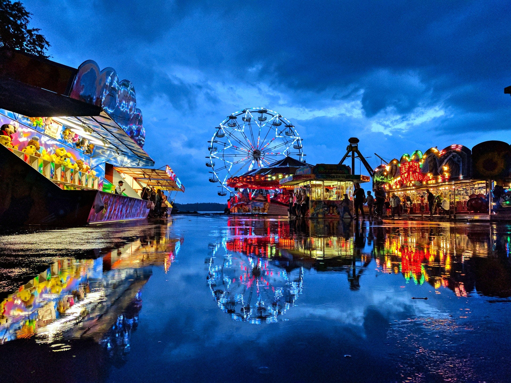
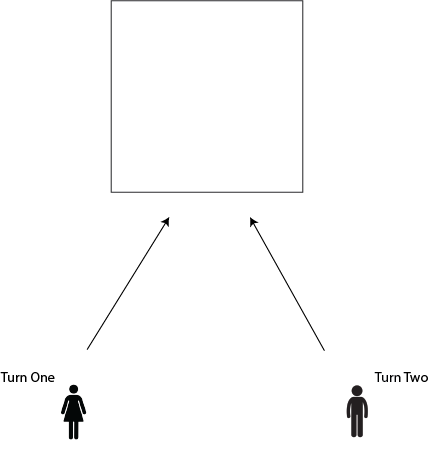
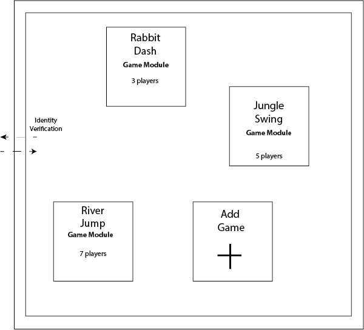
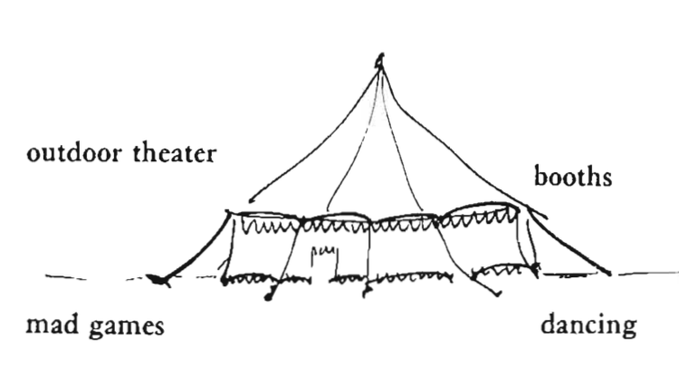
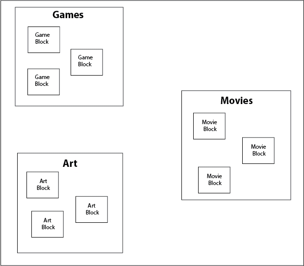

---
author:  Rachel Jaffe
date: Oct 3, 2019
source: https://rachelaliana.medium.com/patterns-of-play-connected-play-playground-carnival-fd898c7d870a

---

# Patterns of Play: Connected Play, Playground, Carnival

A carnival is a collection of different modes of entertainment.

One of the power of cities is the delight of hundreds of ways to play. There are parks where people can set up informal dances, stairways that can become the foundation for skateboard tricks, and walls on which to create fantastical murals. There are also myriad online forums to play, from Minecraft where people build worlds, to League of Legends where people create fantastical creatures. There are likely hundreds of different patterns of play. This collection is only a few distinct patterns of ways to develop online environments to create playful interactions.

Understanding basic patterns of play can help urban designers think of ways to incorporate joyful interactions into cities, and digital designers to develop better digital games. The goal is by no means to be exhaustive but to prompt people to begin thinking about what patterns of play they engage in, and design their own language of “play” to develop more joyful online spaces. These patterns can also begin to create “mixed-reality” spaces where the digital and physical worlds unite into new modes of play.

## Connected Play

**Content:**  One of the basic forms of play is two people that create something together. In the physical world this might be the creation of a blanket fort, a sand castle, a magical world encapsulated in the confines of one’s backyard.

**Structure:**  Digitally the structure of a Connected Play pattern is very basic. It is an object that lets a person draw or write. When they are done they can pass the object to the next person to add to it. This basic pattern can be changed by people — creating time limits, limiting the number of times a Box can be passed back and forth, or setting the box to disappear after a certain period of time. But the basic idea is that two people have a blank canvas to create together.

People take turns to create together.

**Boundary:** The Connected Play Module initially is private, with the person that created the pattern to have the ability to add another individual. The person can then decide to add a specific friend or colleague — -or make their pattern entirely open. With a public Connected Play pattern, people can create something with a complete stranger on the subway or across the plaza.

**Scale:** S4 — Block Groups

## Playground

**Content:**  A playground in the physical world might include a slide, a swing set, a climbing wall, a jungle gym. The best playgrounds are ones in which children get to design themselves. A digital playground might be a social network that only children from a specific neighborhood can access, and each child can put up their own modules, for games they want to play with others.

**Structure:**  The digital playground is a place where kids can play games with other kids in their community. Any kid can put up a game module that they want to play. Depicted here are three different active game modules within a neighborhood’s Playground platform. A game stays “active” in the playground for a day.

A playground as a safe space where children can co-create.

**Boundary:** There can be adult and child age playgrounds. The boundary rules would need to be set in a way where anyone can join, but each person needs to be verified. This would be to ensure that no one older than the allowed age range can access the playground.

**Scale:** S6 — Module Groups

## Carnival

> “Just as an individual person dreams fantastic happenings to release the inner forces which cannot be encompassed by ordinary events, so too does a city need its dreams.”

Christopher Alexander envisioned carnivals as places where people could engage in activities that are frivolous, and perhaps skirt the line of socially accepted behavior. A typical carnival is composed of main attractions like roller coasters and Ferris wheels, bumper cars, and haunted houses. There are games such as bucket toss, darts, Ring the Bell, and Ladder Climb. Outside of games of chance, people can also amble around the carnival and purchase gifts and food, from caramel covered apples to big bags of cotton candy.

The digital environment today has many places of passive entertainment like Netflix and Hulu, as well as video games. But neither of these capture the mystery of being presented with a diverse array of ways to be entertained that are not known from the outset. There is currently no online equivalent pattern of free exploration where people can go to uncover what entertainment they want, rather they decide their experience before they go to a certain platform.

Information architects can carve out potential new online patterns that capture similar fantastical excitement that a carnival brings to a physical city. These patterns can in turn transform into new types of companies. With the Carnival pattern, people might have greater access to exploring new, emerging art forms from local artists, like immersive music and massive multiplayer storytelling.

The carnival tent contains many types of entertainment,

**Structure:**  The structure of a carnival is a bi-level Collaborative Collection. On the first level, it is a collection of different entertainment modules, like Games, Movies, and Art. The secondary level for each of these modules includes distinct modules or block groups that contain their own specific structures for that specific content type.

A carnival as a diverse number of forms of entertainment where people can explore at will.

**Boundary:** There are three different sets of users in this pattern. There is the Carnival Owner that can define which Module Types are allowed (Art, Games, Design, Movies, etc.) and grant posting permissions to the Carnival Creators. Carnival Creators can post their blocks, which are proto-apps or games that follow the general patterns of a Game Block or a Movie block. Carnival attendees can access any of the posted blocks, but do not have the ability to post their own blocks.

**Scale:** S7 — Platform Structures

