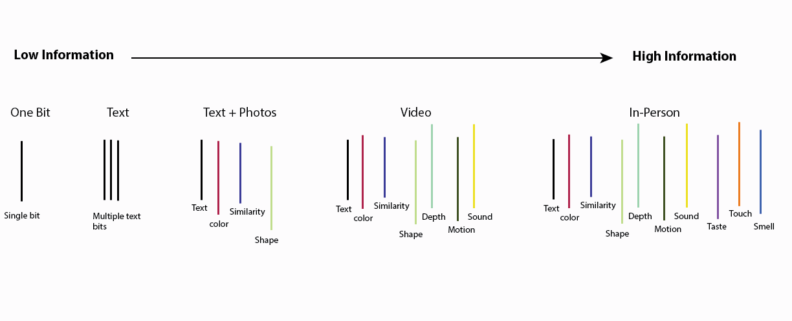
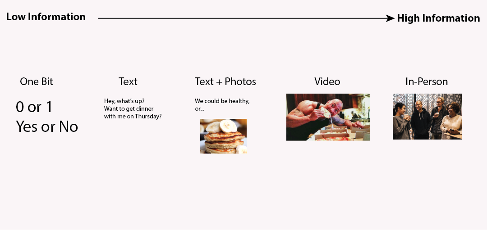

---
author: Rachel Aliana
date: Jun 10, 2019
source: https://rachelaliana.medium.com/a-pattern-language-channels-bd706220c26c

---

# Channels

Channels can be designed to send high or low levels of information.

_This post is a part of_ [_“A Unified Language for the Design of Information Systems_](a-unified-language-for-the-design-of-information-systems.md)_”._

Pipes connect your toilet to the sewage system. A bus connects two locations across town. Electronic signals connect your phone to your friend’s phone. Channels are vital components of information systems. Channels  **connect objects together.**

In information systems, infrequently will objects share absolutely every piece of information with other parts of the system.  **An important part of an information architect’s job is to decide what information should be shared between different objects in a system.**

It might just be necessary for objects to share singular bits of information between each other, like Yes or No a device is connected to a computer, whethe a door is open, or a parking space is occupied. Channels might be designed to send text input, or text and audio. Many of the biggest advances in the last century have dealt with advances in being able to send more varied kinds of information between objects. People could send dots and dashes with the telegraph, audio with the telephone, and voice and moving picture with cell phones and video calls.

However, we still do many of our most important business deals, romantic outings, and creative work in person. In person we transmit dozens of different levels of information simultaneously, such as tone of voice, body movement, pheromones, temperature, smell, facial expressions, and markers of identity such as university or brand labels on clothes. Trust is in many ways built up through the exchange of information.

What kinds of information is transmitted across channels impacts  _who has power within a system._  A person who has more information on investments can make better investment decisions. A person who has more information on what cards will be dealt at a poker table can make better bets. What information is passed across channels between objects is an important decision for information architects and is intimately tied to notions of trust and power within a system.

A line of low-information channels versus high information channels.
