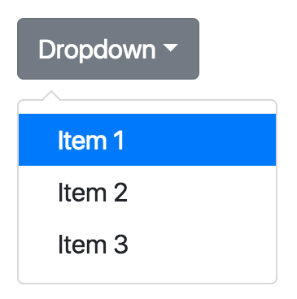
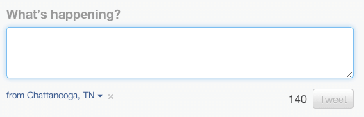
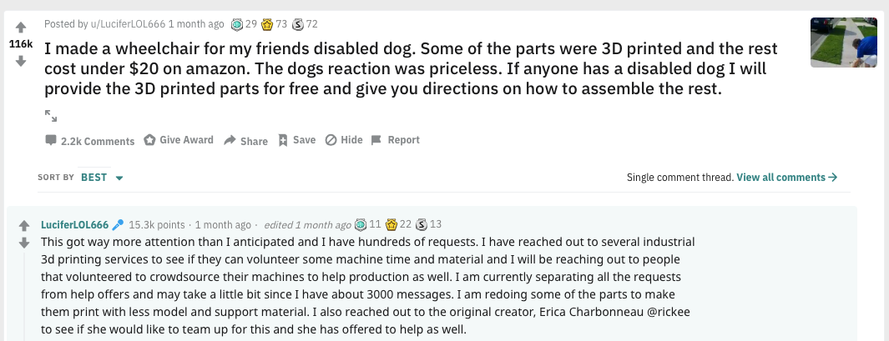

---
author: Rachel Aliana
date: Jun 10, 2019
source: https://rachelaliana.medium.com/a-pattern-language-levers-3ab13c5aca5

---

# Levers

Levers alter flows within a system:  [https://www.pexels.com/photo/bathroom-bathtub-ceramic-chrome-534116/](https://www.pexels.com/photo/bathroom-bathtub-ceramic-chrome-534116/)

_This post is a part of_ [_“A Unified Language for the Design of Information Systems_](a-unified-language-for-the-design-of-information-systems.md)_”._

In a bathtub the handles can change to allow in more or less water. Like a bathtub, levers in information systems define how much energy people put into the system (how much water goes into the bathtub) and how people feel while interacting with the system (is the water hot or cold).

There are two types of levers: incentivizers and modifiers.  **Incentivizers** are cues or systems that alter energy output in the system.  **Constraints** channel this energy into discrete pathways. It should be noted, some levers might act simultaneously as incentivizers and constraints simultaneously.

Incentivizers and constraints are the  _impacts_ on the system. These impacts are realized through  **structural cues, affordances,** and  **games.**  Structural cues are levers that are a part of the visual design of the webpage. An affordance is a specific subset of structural cue that tells a user how to interact with a system. Games are incentive structures that exist across several parts of a system.

## Structural Cues

Structural cues are components of the visual design of systems that impacts how and how much users interact with the system.

A structural cue that acts as a constraint is a  **drop-down list** that constrains an answer that a person gives. This structural constraint forces users to choose amongst pre-determined options, and forces users to interact with the system in constrained pathways.

A drop-down menu

A structural cue that can act as either constraint or incentivizer might be the  **size** of the text box. For example, Twitter has a maximum of 140 characters that people can use. This constrains users who have the intention of sharing longer, more in-depth thoughts, and incentivizes people to share quick updates because there is less pressure to develop a long article or email.

This structural cue impacts dynamics on the platform as a whole. Twitter is seen as a place where people can follow celebrities’ movements, stay up to date with the news, and have brief conversations with other users. It is not seen as a place for long, drawn-out, and nuanced discussions.

The size of the box and character count

## Games

A game is a structure that exists across a larger system that impacts user action. Reddit utilizes two different kinds of games on their platform:  **karma** and  **gold.**  A user’s karma is shaped by the accumulation of their upvotes and downvotes. The upvotes push users to add more objects to the platform in the form of posts, while the downvotes constrain users to not just post any content, but to post high quality content. Meanwhile, a highly rated comment or post can receive gold or silver, which is an icon on the post given by another user to denote that they really like or support the comment or post. A gold or silver coin gives a user access to private subreddits that make getting gold or silver coins highly prized.

A highly ranked post on reddit:  [https://www.reddit.com/r/aww/comments/becrye/i_made_a_wheelchair_for_my_friends_disabled_dog/el4slyw/?context=3](https://www.reddit.com/r/aww/comments/becrye/i_made_a_wheelchair_for_my_friends_disabled_dog/el4slyw/?context=3)

Continue on to the article on  [constraints](https://medium.com/@rachelaliana/constraints-f82a22768119?postPublishedType=initial)  that direct user actions on a platform and  [incentivizers](a-pattern-language-mechanics.md)  that seek to increase user energy input into the information system.

## Affordances

**Affordances** are well known in information architecture as properties of an object that make explicit how a user can engage with an object. For example, doors have either handles to pull or flat surfaces to push. The design of the door helps people understand how to interact with it.

A door handle signals to people whether they should pull or push.

In the structuralist perspective of information architecture, there is another layer to affordances: affordances affect the energy output required by a person interacting with an object. Well-designed affordances tell people how to interact with objects to complete their goals in a way that decreases the energy output people have to exert using the system. This is why people feel frustrated when they push a pull door or pull a push door. Their action both breaks down their understanding of the correct action to take with a particular signifier and demanded that they exert twice the amount of energy to achieve their goals.
