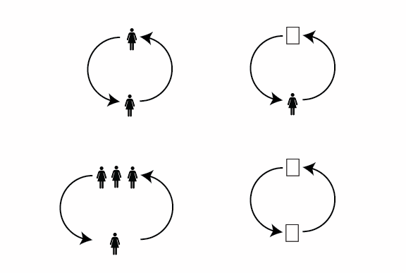
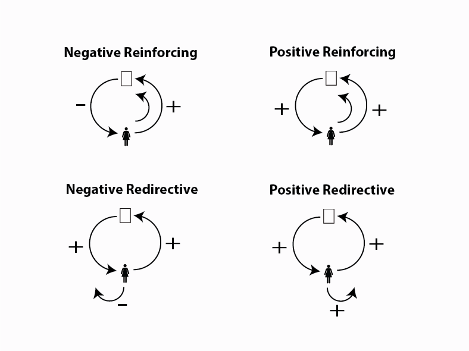
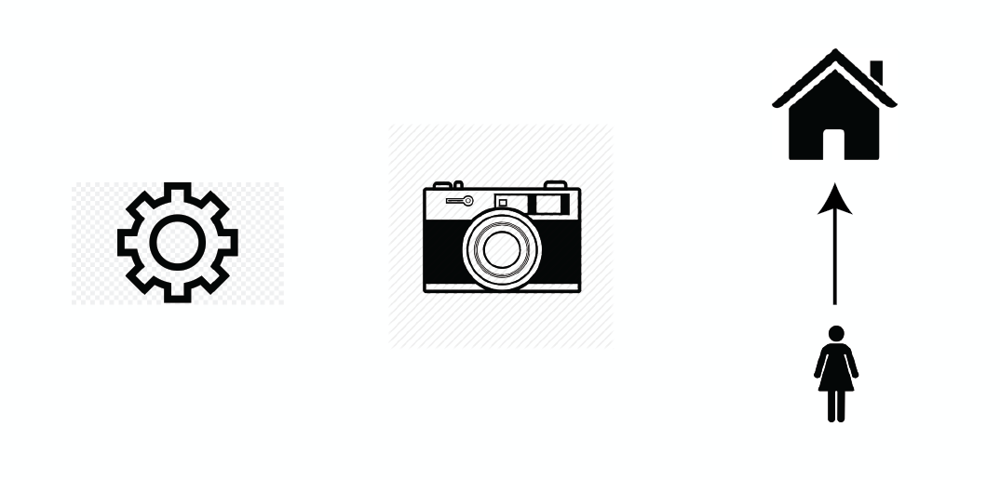

---
author: Rachel Aliana
date: Jun 17, 2019
source: https://rachelaliana.medium.com/loops-c04cc04f5b1c

---

# Loops

A base dynamic with feedback is a loop

_This post is a part of_ [_“A Unified Language for the Design of Information Systems_](a-unified-language-for-the-design-of-information-systems.md)_”._

Most information systems have more than a one-way flow of information. They also have  **feedback** for people who engage with the system. Two  [base dynamics](a-pattern-language-base-dynamics.md)  (one-way flows of information) that are connected around a single goal in a call-response relationship are considered a  **closed loop.**

**Base dynamic + base dynamic = Loop**

# Types of Loops

Loops provide  **feedback**  in a way that people who use the systems can  _adapt_  to the information they get back from interacting with the system. This adaptation impacts how much energy people are willing to put into the system. Positive feedback is defined as feedback that makes people put  _more_  energy in the system. Negative feedback is feedback that makes people put  _less_  energy into the system.

**Reinforcing feedback**  is feedback that reinforces that people engage again in the same action sequence.  **Redirective feedback**  is feedback that encourages people to engage in a different action sequence.

Together these two concepts create four different kinds of feedback:

**Negative reinforcing:**  This type of loop decreases the energy users will expend on a platform but they will engage in the same sequence.

Example: As you search for a restaurant to go to, you hit the two dollar sign Price icon, but the restaurant list you get shows only three dollar sign restaurants. You are frustrated, and perhaps more likely to ask a friend for a recommendation, but you go back to the list and select the two dollar sign icon again.

**Positive reinforcing:**  Increases the energy a user wants to spend in the system performing the same loop.

Example: You select the correct word in a language learning app. An icon comes up that you selected the correct answer, and you see your score increase. This encourages you to repeat this action again with the next word.

**Negative redirective:**  decreases the energy a user wants to spend on the system, and they leave to start a new loop elsewhere (or leave the platform entirely).

Example: You see a link to a news article, but when the article appears, it is covered by a banner that says you need to be a member to read it. You close the page and do not read the article.

**Positive redirective:**  increases the energy users want to spend on the platform, but they direct this energy towards starting a new loop.

Example: You complete a tutorial sequence on a diet app about nutrition. As you see the screen that says you have completed the articles, there is a link to another sequence of articles focused on exercise.

## Loops and Company Types

Relationship between loops and company value

Loops represent an increment of energy exerted on a platform.  **Core loops are energy exerted on actions that directly relate to goals that people want to complete within the system**. Information architects should understand what are the core loops of a platform, and try to cut down on loops that do not directly correlate to user goals.

For  **object creation** companies, like a company that makes gears, a loop is any action that directly relates to building a gear.  **Object manipulation** companies, such as a photo editor that edits a photo, a loop would constitute an action that directly relates to their manipulating a photo to the desired result.  **Object connection** companies include companies who develop connections between existing objects or between object manipulators. A loop for them includes any action that helps them develop these connections.

However, to be a truly great information architect a designer must look outside of the platforms that they work in to understand the differences between successful user goals completed on a platform and the user’s goals themselves.

Object connection companies must understand that their users want the connections between objects, and care little how they are connected. If a person can talk to a friend and gain a recommendation about a great apartment, it does not matter that your platform can effectively connect people and property owners.

Object manipulation companies like photo editors, must always be aware that users want the edited photo. They do not care that the photo editor is extremely efficient at photo editing if they can do the same thing on an app on their phone.

Object creation companies that develop gears for car companies must always understand that user goals are to get from one place to another. This may or may not be through a car.

Information architects should always understand both the system they design for, and the system that this system is within. The most successful information systems align with users’ ultimate goals rather than goals that meet a company’s bottom line.

## Loops and Value

Information systems are built to achieve goals, both goals of the  _people who use these systems_ and the  _architects of the systems._

People want to achieve their goals with minimal energy expenditure. Meanwhile many businesses today are centered around getting people to stay on platforms for as long as possible. Unless you create purely entertaining platforms (where user enjoyment is directly correlated to number of loops completed), you will constantly need to balance your user’s desire to complete their goal with minimal energy expended, and to keep building more loops for the user to complete.

Information architects should be well aware of the core loops that relate directly to goals a user wants to achieve. Companies whose platforms have a higher proportion of core loops are more efficient. The more extraneous loops that people need to perform (like signing up, clicking to another page, refreshing), the lower amount of energy that the user has to put into a system.

**People will gravitate towards the lowest energy-expending systems that will allow them to complete their goals.**

If your information system is being beaten by a competitors, it might be a good idea for you to look at all of the actions that a user takes on your system versus your competitor. There is a good chance that if the price of your products are similar, that you have a more inefficient system.

Likewise, information architects need to understand that users will jump to an entirely new system if they are able to expend drastically lower amounts of energy to achieve similar goals. In the next few years, there will likely be more specific data gathered to create an understanding of exactly how many non-core loops people are willing to complete for each kind of company before they will leave a website.

Future design software might even highlight non-core and core user action flows and be able to tell a designer where they might be able to make their systems more efficient.
