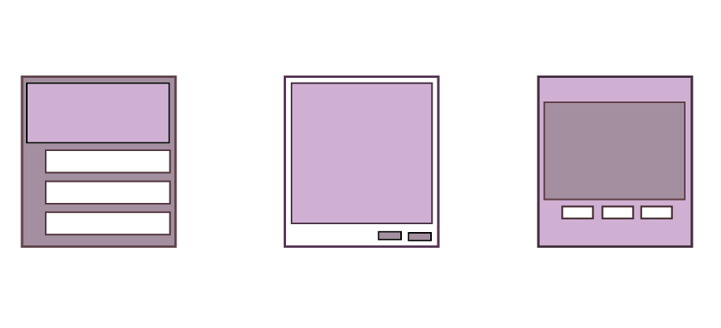
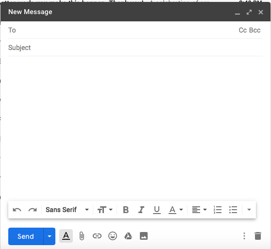
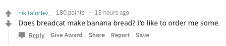
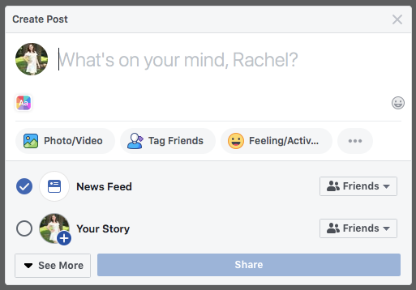
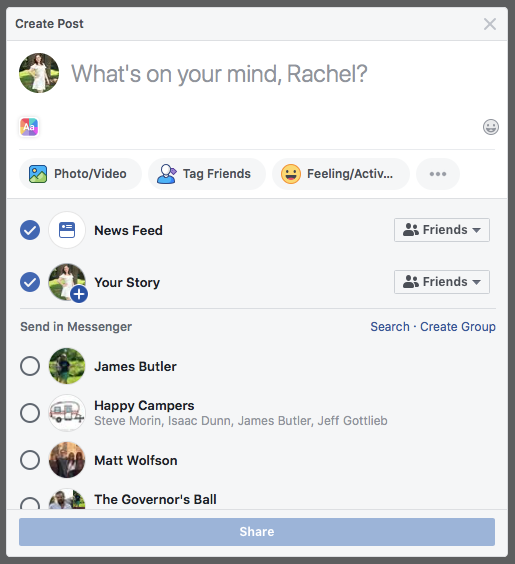

---
author: Rachel Aliana
date: Jun 19, 2019
source: https://rachelaliana.medium.com/modules-4a76a8f5d257

---

# Modules

_This post is a part of_ [_“A Unified Language for the Design of Information Systems_](a-unified-language-for-the-design-of-information-systems.md)_”._

Chairs arranged around a table to eat dinner. Park benches arranged around a lake to watch wildlife. Tables arranged in a cafe for diners to sit and relax. Modules in the physical world are simple groupings of furniture into larger units. In the online world modules are repeated basic patterns of loops and objects around a larger functional goal.

**Objects + Loops = Module**

In the online world, modules take the form of basic routines like the  **Composition of an Email**  page. There are many potential loops that can be carried out (writing, sending, saving a draft, deleting), but the composition of an email is a repeated, well-known routine.

Email composition page on Gmail.

Likewise, on a comment thread the posts are the objects, and the multitude of different ways that people can interact with them (Reply, Give Award, Share, Report, Upvote, Downvote, and Save) constitute many potential loops. A  **Comment** module is a larger package of a well understood routine online.

Comment: www.reddit.com

On Facebook there is the  **Post**  module, where you can choose to engage with a post by writing, adding a photo, tagging people, and deciding what people are connected to the post. Again, many potential loops within a well understood basic routine.

Compose post:  [https://www.facebook.com](https://www.facebook.com/)

Compose Email. Compose Post. Comment. Modules represent a movement away from simply the objects (emails, posts, comments), or actions (comment, post, compose), and to  **repeatable, functional patterns of actions with objects.**

Usually, though there are many actions that can be taken on the objects — -you can save a draft of an email, report a comment thread, or send a message from the Create Post page on Facebook. While there are many secondary routines, Modules have primary goals can be seen in the design of the objects. On Gmail, the  **Send** button is highlighted. On Reddit, the  **Reply** button has an icon in front of it, while the other actions do not. On Facebook, the  **Share** button is much larger and blue, whereas the See More button is white and takes up a much smaller amount of space.

Options from the Post module on Facebook: www.facebook.com

These repeated patterns compose some of the basic patterns of online networks. Like tables, chairs, benches, and beds within a house, there are many different varieties and groupings of these items within a house, just like there are different varieties of these simple modules across many different types of online networks.
