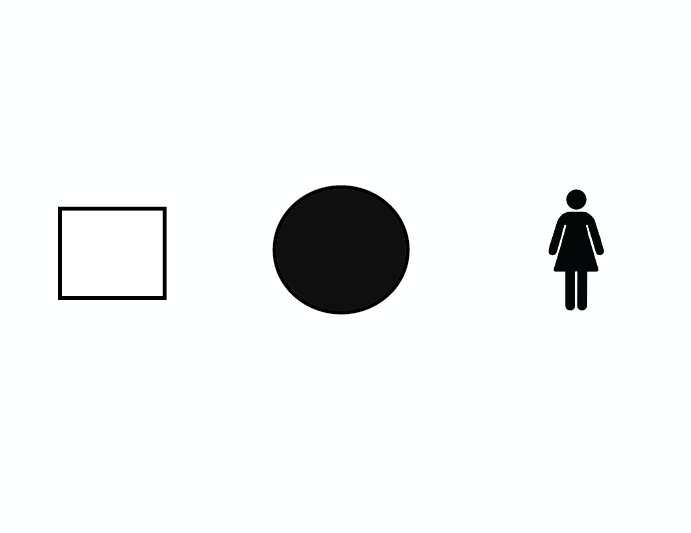
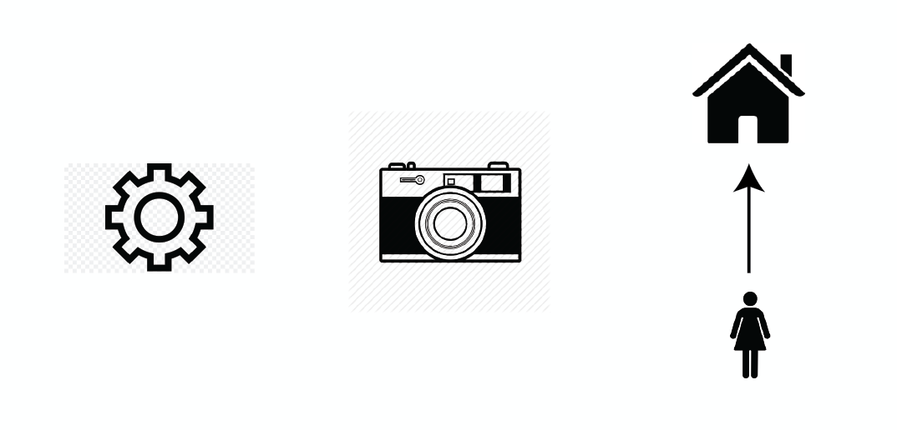

---
author: Rachel Aliana
date: Jun 10, 2019
source: https://rachelaliana.medium.com/a-pattern-language-objects-5c5aa865f2ec

---

# Objects

End objects, pools, and people

_This post is a part of_ [_“A Unified Language for the Design of Information Systems_](a-unified-language-for-the-design-of-information-systems.md)_”._

A painter creates objects of artwork on canvas. A seamstress manipulates existing objects when they alter clothes. A logistics coordinator organizes objects when they designate routes drivers take to drop off packages. Although these are very different kinds of companies, they all still deal with  **objects:**  the canvas, the cloth, the package. ​The basis of information systems consist of the creation, manipulation, and organization of different objects.

It is important to note that people can also be objects. A hospital system deals with the manipulation, the healing and curing of people with various ailments. Anything you perceive as  **one** can be understood as an object**.** Objects do not need to be concrete, tangible things that you can touch in the real world. But to create complex structures of interaction, you need things that can be structured. Objects are those things.

# Understanding Scale

A class is a part of a curriculum in a school, but this one school functions in a system of a university. Which is the object? The answer is,  _it depends._  Many objects are themselves accumulations of other objects. Whether you choose to address something as an object or as a system depends on what scale is most useful to you based on what problem you want to solve.

Take salads. If you look at the level of the individual salad, they are a mix of lettuce, tomatoes, carrots, and dressing. The individual-salad scale might be useful if you are solving the problem of having a healthy but affordable lunch. You want to analyze each ingredient in the salad, and create combinations that meet your requirements for price, taste, calories, and nutrients.

If you however are a store manager, you need to solve different problems. You need to buy ingredients for your entire store. With this new problem set you are less concerned with each specific salad and more concerned with how you can use salad ingredients across a broad array of different foods, from pizzas to paninis. At this scale you will have different concerns, such as cost, perishability, demand, and storage.

Each different problem scale comes with different concerns. The scope you look at changes what you perceive to be one object and how you evaluate it. Most objects in our world, from chairs to clothes to food to people, are simultaneously one thing but immersed in dozens of overlapping systems.

The problem you want to solve impacts how you will look at objects. Let us say you are still a restaurant owner, but you are now dealing with not sourcing, but drafting a menu. You are not so much interested in how well tomatoes alone are selling, but how each item on the menu is selling. You have suddenly switched from looking at the level of the individual ingredient to looking at the level of the food item. The object has not changed, but the system structure it is placed in has.

# Objects and Company Types

There are three main types of companies. The type of objects created on a platform impact what revenue model that a company is likely to pursue.

There are  **object creation** companies, where a company sells a product to a consumer. This might be farmers who sells food, a designer that sells clothes, or an artist that sells their art. These companies have a fairly clear business model: they charge for the product. In the past these companies often needed middlemen to connect them to people who would buy their objects (stores, suppliers, galleries). The internet has helped to make it so there are fewer steps between the object creators and consumers. This can be seen with websites like Etsy that directly connects object creators and people who want the objects created. Threats to these companies include people who can sell higher quality products, cheaper products, or can form a new niche that takes away from a company’s consumer base.

There are  **object manipulation**  companies, where a person charges for alterations to some other already-created object. This might be a graphic designer that charges to Photoshop a photo. These people charge for a factor of their time, expertise, and risk. Threats to these companies include lower initial investment that is needed to prepare for the field or lower amounts of skill that is needed to perform the object manipulation. A good example of this is Instagram’s filters. Now people can quickly edit photos on their phones or choose from pre-set filters without the need for professional photographers.

For  **object connection**  companies, the creation of the channels between objects might be more important than the objects themselves. Companies in this class might charge for the initial connection between users, or between users and objects. Recruiting platforms often does this, while Zocdoc charges for connection between patient and potential doctor. If they do not charge for the initial connection, these companies need to figure out another way to make their networks valuable.

A contentious component of today’s economy is that platforms are monetize their users’ data, often while their users are unaware. It is generally best to understand what type of company you want to build or what company you are designing within, and align value directly with the revenue model.
