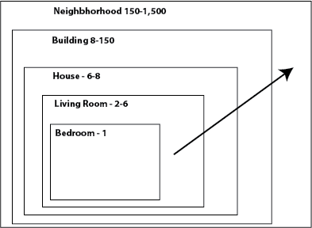
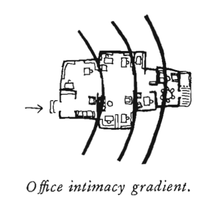
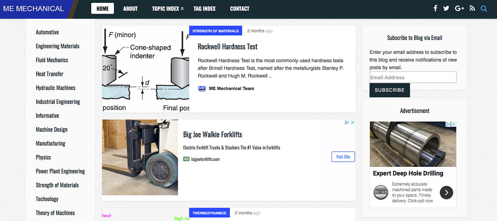
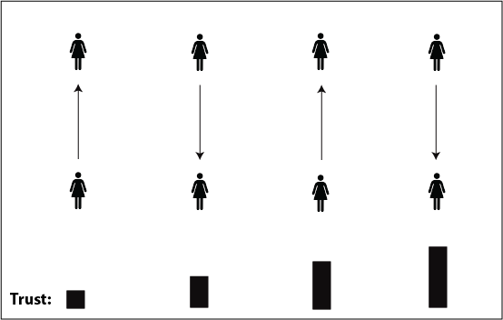

---
author:  Rachel Aliana
date: Aug 4, 2019
source: https://medium.com/swlh/architecting-intent-designing-for-vulnerability-and-publicness-703c9f50802a

---

# Architecting Intent: Designing for Vulnerability and Publicness

Girl waits for train:  [https://www.pexels.com/photo/metro-station-people-woman-21410/](https://www.pexels.com/photo/metro-station-people-woman-21410/)

_A Part of “_[_Structuralism and a Pattern Language for Online Environments_](towards-a-larger-view-of-information-architecture.md)_.”_

Ever walked past an oddly empty plaza or vacant park? Even the most well-designed spaces can be left unused if they are tucked behind office buildings or situated near highways. A place is not simply shaped by its own physical features, but the context around it.

In the previous section we outlined individual digital patterns. But just like a misplaced park will be left abandoned, so too will a misplaced message board. In this section we will look at how individual online spaces are impacted by outside forces working at different scales of the larger network. We call these  **cross-cutting patterns.**

The goal of this section is to provide techniques to help designers and information architects better understand the cross-cutting patterns of publicness and vulnerability.

## Degrees of Publicness

Ever overheard someone on the subway loudly share too much information with their friend? You probably felt pretty awkward. There are clear norms in physical spaces of what should and should not be said. The same holds true online. For all those who have seen couples fight via thinly veiled Facebook status posts, spatial norms are broken online too.

The  **degree of publicness**  is the expectation of how many other users will interact with a specific users’ content. In bedroom-type spaces that might include private notes or messages people expect a high amount of privacy. In house-type spaces, which might be a group message or Slack thread, people will moderate their actions based on the goals of the community (you would say different things to co-workers than your family), but still hold the expectation that in such environments only the people who have been allowed into the community will see information posted.

As the patterns get larger, to house and neighborhood scales, there is an understanding that there will be  **information spillage,**  where there will be more people that see a users’ information and messages than the user’s originally intended target. For building and neighborhood scale patterns, people might go to these spaces because they  _want_ an  **information cascade**  (virality), where information they post reaches wider scales and even cross out into other platforms.

Designers need to understand whether their users want targeted messages to specific communities, or are seeking a platform to reach a wider audience. They can then align these interests with the right scale of space for each component of their online network.

The important thing to keep in mind is  _clarity_ for the user. People will migrate to places that best serve their needs, but they will not be active if they are unsure of the degree of publicness of a space.

People in a space impact interaction

Publicness is shaped by three factors: number of people, entry requirements, and decay of data.

**Number of people**  refers to how many people are likely to see a person’s information. On the internet, there is the constant possibility for a person to take a screenshot and spread a post or message. While the  _potential_  amount of people that can see any bit of information is in the billions, this is different from the local  _expected_ number_._  On a private message thread, people  _expect_  that only the person sent the message will see it. A break in this expectation can make a person feel as violated as a hidden camera in their home.

**Entry requirements** relates to who has access to a space. In the physical world, entry requirements are things like ID badges to get into an office, or a driver’s license to get into a bar. People feel comfortable others in the office building are trusted, and people expect those inside of a bar are over the legal drinking age.

The picture below shows the degrees of publicness of an office. In the private office people might leave personal possessions, take their shoes off or take personal calls. In the general workspace there is more decorum but still a shared sense of trust and identity. In the waiting area guests can be called in to the main office. The expectation is that only invited guests will enter the main office area.

Online entry requirements take the form of passwords, codes, or email addresses. These levels of publicness in the office are paralleled within company websites that might have levels of different access for customers, suppliers, workers, and administrators. In turn, people at a company moderate their speech depending on what person they speak with (suppliers, partners, customers).

Intimacy as a function of space, pg. 612:  [https://arl.human.cornell.edu/linked%20docs/Alexander_A_Pattern_Language.pdf](https://arl.human.cornell.edu/linked%20docs/Alexander_A_Pattern_Language.pdf)

Entry requirements can also be more subtle. Anyone can access the engineering website shown below, but only people with  _specialized knowledge_  would know how to navigate it. It is unclear what kind of information selecting “Informative” will get you. This is a more subtle, cultural barrier to entry but an entry requirement nonetheless.

Website is tailored to specific user groups:  [https://me-mechanicalengineering.com](https://me-mechanicalengineering.com/)

**Decay of data** is a tricky component of online spaces that does not hold true for the physical world. In the physical world, if you whisper a secret to another person, it is possible that no one else ever hears it. In the digital world a private message can be saved on a server and a person judged for it years later. Spaces that are initially private can become public after the fact. To create private spaces in the digital world, designers need to understand how data on their networks is stored.

## Places of Vulnerability

Vulnerability is a hard concept to understand much less consciously build it into a network. So far I have broken vulnerability down into two different types: general and interpersonal.

People can be vulnerable to strangers when they are anonymous, because their thoughts are unattached to any identifying information.  **General vulnerability**  is fairly easy to design for — make everyone anonymous.

What is much tricker but can create more social capital within a community is  **interpersonal vulnerability**. Interpersonal vulnerability is built through the exchange of information between two people. Interpersonal vulnerability in design cannot be designed by changing the size of a box or adding a certain button. It is created by the act of mutually revealing information that builds up trust and needs to be created through the accumulation of several interactions over time.

Designers can shape their networks for vulnerability by having clear entry requirements, prompts to encourage continued conversation, incentives to share increasing amounts of information, and large disincentives for users to share others’ information outside of the platform.

Vulnerability as information exchange over time

## Next Steps

There are several cross-cutting patterns that exist in information architecture. This section will be updated with more cross-cutting patterns over time.

