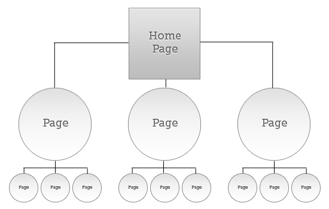

---
author: Rachel Aliana
date: Jul 11, 2019
source: https://rachelaliana.medium.com/current-frameworks-of-information-architecture-acf6e608f9e7

---

# Current Frameworks of Information Architecture

Architecture as process and pattern:  [https://www.pexels.com/photo/abstract-architecture-black-and-white-boardwalk-262367/](https://www.pexels.com/photo/abstract-architecture-black-and-white-boardwalk-262367/)

_A Part of “_[_Structuralism and a Pattern Language for Online Environments._](towards-a-larger-view-of-information-architecture.md)_”_

Today there are two common approaches to the study of Information Architecture: Little IA and Big IA. The theory of Structuralism offers a third perspective.

This article provides background on the current information architecture approaches to ground the theory of Structuralism developed in later chapters.

## Big IA

Big IA is a  _process_  oriented approach. Big IA architects focus on the design of information systems as an iterative process where the architect interviews, builds, tests, and iterates on their designs with constant input from users.

While input from users is important, without an understanding of reproducible structures that exist outside of specific products, Big IA architects are often beholden to their users. Users will say things like: “Can I have Tinder for apartment searching?” or “I want Instagram for events.” Information architects have to then try to understand  _what about_ these platforms users actually want. This is difficult because the architects are themselves constrained by their knowledge of apps and websites. They do not have a repertoire of structures that exist outside of the user or a product.

What has emerged from Big IA’s approach are  [user-oriented principles](https://xd.adobe.com/ideas/principles/human-computer-interaction/user-centered-design/)  such as “provide users feedback for each action they take”, “make buttons large enough and visually consistent”, “align user expectations to website actions.” All of these ideas are important to create an enjoyable and understandable experience for the user. But these principles are surface-level guidelines. Big IA has not developed deeper reproducible structures that can help designers understand how elements of a website shape dynamics between people and contribute to larger organizational structures.

Big IA’s lack of development of replicable structures is unsurprising when understanding how Big IA is situated within a business. Big IA was born during the consulting boom of the early 2000’s, and as such, many Big IA practitioners are outside consultants. A custom-built approach for each project earns consultants more money.

## Little IA

Little IA provides the  _structural_  approach to information architecture that Big IA lacks. But Little IA has only defined structures that relate to navigation, search, and way-finding. This gap make sense when understanding the development and positioning of the field. Little IA emerged from library science, and librarians are largely concerned with the organization of books and records to  _help people find them_.

With this focus on navigation Little IA architects have developed important concepts such as hierarchical structures, taxonomies, and matrices.

Strict hierarchical structure:  [https://www.webfx.com/blog/web-design/information-architecture-101-techniques-and-best-practices/](https://www.webfx.com/blog/web-design/information-architecture-101-techniques-and-best-practices/)

What Little IA architects have not done is to develop an understanding of how structure impacts online environments outside of navigation.

This focus on efficient navigation parallels the perspective of urban planners in the 1950’s. The city was seen as a place that people should be able to get through quickly. Engineers focused on moving as many cars on a road as possible. Planners created new highways, the most notorious of which was  [Robert Moses](http://www.nypap.org/preservation-history/robert-moses/)  who created the Brooklyn-Battery link, the Triborough Bridge, and the Cross-Bronx expressway. These projects decimated urban neighborhoods and the communities that lived there in the quest to get people through cities quickly.

The comparison between Little IA and modernist planning seems unfair. When an information architect reorganizes a website, their actions hardly have the same life-altering repercussions as the reorganization of a physical city. Instead the fixation of Little IA architects on navigation has done something else: it has meant many of the potential structures of a vibrant online world  _have never even been conceived._

I do not mean that these structures have not been  _built;_  there will be new, different websites created for centuries. I mean that there are important, fundamental ways to interact in the online world that have not been thought of yet. It is not just that the online world is like a city with too many roads that cut through parks and promenades. It is like a world in which there is still no comprehensive understanding of how to build parks and promenades. Just roads.

## Repercussions of a Paradigm

The focus of Big IA on the user and Little IA’s focus on navigation has deep repercussions for how we build online spaces and organize our world. Without the conscious development of structures that create trust, vulnerability, community, and equity the online world will become a consumerist monopoly.

The online world will increasingly look like the top-down, artificially constructed cities of Abu Dhabi or Xiang’an with ample stores like Amazon and Zappos to buy mass-produced goods. People will be lulled into enjoyment with the passive consumption of suggested content that Hulu, Netflix, and Youtube promises. There will be ample room to flaunt one’s new clothes and shoes with Facebook and Instagram. Algorithmic feeds will offer rabbit holes for consumers to descend into, followed by a trail of internet cookies.

The digital world has no Jane Jacobs to rally communities to fight for the cadence of the sidewalk or the quiet of a neighborhood park because  _we are not quite sure what a digital sidewalk or park entails_. It is hard for people to fight for what they cannot explain.

At the heart of the Structural language for information architecture is the search for a cohesive design language to give people more power to directly express what kinds of interactions they want to have. The Structural Information Architect fights for digital structures that can create emergent pockets for creative play, cafes for respectful debate, newsstands where people can purvey a broad range of opinions, reading nooks for quiet reflection. As we need public spaces in the physical world, so too do we need these kinds of spaces online.

We just need to first figure out what the online equivalent of these places look like. In “[Development of a New Language](development-of-a-new-language-for-information-architecture.md)” we turn from understanding existing IA frameworks to the development this new language.
