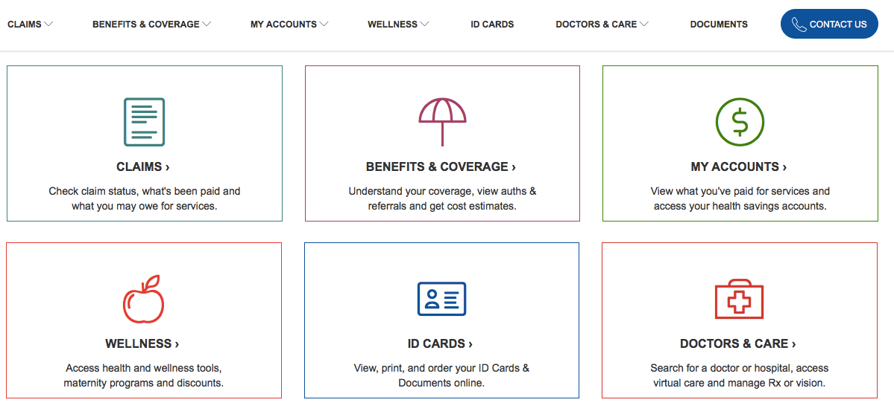

---
author:  Rachel Aliana
date: Aug 8, 2019
source: https://uxdesign.cc/information-literacy-and-power-structures-of-control-d17048497f12

---

# Information literacy and power: structures of control

## A Framework of User Participation vs. Control

Norms, and power, are engrained into the sidewalk as depicted by cars stopping in front of the white line and people walking only in crosswalks:  [https://www.pexels.com/photo/aerial-photo-of-city-street-and-buildings-1044329/](https://www.pexels.com/photo/aerial-photo-of-city-street-and-buildings-1044329/).

_A Part of “_[_Structuralism and a Pattern Language for Information Architecture._](towards-a-larger-view-of-information-architecture.md)_”_

Before the advent of cars, pedestrians ruled the city. Pedestrians’ rule was so great that when cars were first made, they were a nuisance to use because drivers could only move slowly with so many people rushing around them. To fuel car usage, car companies built crosswalks and then  [lobbied](https://www.vox.com/2015/1/15/7551873/jaywalking-history)  government to make  _not_ using a crosswalk a crime. With people constrained to crosswalks, cars could move swiftly throughout the city and more people wanted them.

If you look around the digital world, you’ll see lots of “crosswalks”, or places that seem so normal you never question why they have to be there at all, or how the world would change for the better if they were not. Why is it so easy to refill a prescription online but hard to see the costs of a potential medical procedure? Why is it easy to donate to your representative but hard to see where that money goes?

It is taken as so normal that the information system of politics will be unfathomable and hospital costs will be difficult to find that people forget that  _every human system is designed_. What information people hold, how they can interact with a system, and how easy this interaction is, all impact how much power a person has to change the system. This section outlines tiers of user control within systems and the implications of these choices for network outcomes.

## User Control

User control means the  **amount of control users have to impact a given information system.**  There are five levels of user control:

-   **Tier 1** — Users can only go through delineated pathways defined by the system’s architect. The user has no way to impact the system.
-   **Tier 2** — Users can create content, or singular objects and object groups in the system. They cannot control who sees their content or how people interact with it.
-   **Tier 3** — Users have module-level control to be able to shape who sees and how people interact with their content. They cannot change block-level functionality of the system.
-   **Tier 4**  — Users have control over the design and functionality of the system at the block level. They do not have control over the goals of the network at the platform level.
-   **Tier 5** — Users are deeply embedded in the formulation of the goals and ethics that shape the design of the network at the platform-wide level.

Not every network needs to be wholly controlled by its users, but the idea of  **Tiers of Control**  can make it easier for people to turn intangible problems into actionable solutions. It is hopeful to say “I want the medical system to be more responsive.” It is powerful to say “I want to move from Tier 2 to Tier 3 control over my health records.”

## Goals and Network Growth

The ability for users to control systems is  _inversely proportional_  to a designers’ ability to predict users’ actions and interactions on a network. This concept is important to help designers understand how to best test their systems. In  **goal-constrained**  systems where designers can delineate user pathways, traditional user research can be very useful. There is a goal that the designer has in mind, and walk-throughs of an app or website with a potential user can help the designer understand if the user can swiftly achieve this goal. In goal-constrained systems, the best designs are generally those that require the least energy exertion from users.

For  **open-goal** networks, the information architect might have a general idea of what users will do on their platform, but users shape their own paths on the network and ultimately define the direction of the platform. The sooner the website or app can be released to the community, the sooner the designer will understand the ways users want to use the network. Traditional user testing can help designers understand whether users can navigate through the platform easily, but it will  _not_ be able to answer whether the platform will ultimately be successful. With an open-goal construction, the outcome of the platform is highly  _unpredictable_ and depends on who is in the network. In these networks types, designers should concentrate more on value generation rather than pure efficiency of navigation.

An example of an open-goal network is  [Reddit](https://www.reddit.com/), the front page of the internet. People can add their own content, moderate and create communities, define the moderation rules, and have input on the goals of the network. This platform has everything from political debate to anime fandom to radicalism to communities dedicated to cats that have jobs. The creators of Reddit could not predict all of the ways the network would be used.

Open-goal networks form in places that utilize broad language and have low entry requirements. These places grow with mechanics that award users for participation within the network. These places provide opportunities for users to create and moderate the network. The higher tiers of user control, the more powerful users can be on the network, but with empowerment also comes higher rates of unpredictability and potential abuse.

The front page of Reddit features content generated by communities formed by users:  [www.reddit.com](http://www.reddit.com/)

Contrast Reddit with a typical health insurance website. The Horizon BlueCross website shown below has inflexible categories of goals that users can achieve on the network, such as Claims, Accounts, and Care. There are no opportunities for a person to interact with another person. This makes it hard for people to gain  _capacity_ to change any component of the system.

Horizon Blue Cross Blue Shield personal dashboard that depicts links to topics like Benefits, Account, Claims, and Wellness:  [www.my.horizonblue.com](http://www.my.horizonblue.com/)

Goal-constrained networks are created in places where users cannot generate content and can only navigate through top-down delineated hierarchies at the platform level. Designers of goal-constrained networks can also use entry requirements to select who is on the network, and choose only those whose goals that are aligned with the systems’ designers.

## Information literacy and power

What would Reddit look like if it was composed of only communities created by newspapers or official organizations? What would health insurance companies look like if they hosted user-generated groups and people had messaging threads with their doctors?

Whether a network is goal-constrained or open-goaled has implications for who has power within a system_._  Just as news literacy and computer literacy is important in today’s world,  **information architecture literacy**  will be important in tomorrow’s world as people become more conscious of how information impacts equity and access. The concept of Tiers and goals I hope will make these imbalances more explicit and change more likely.

