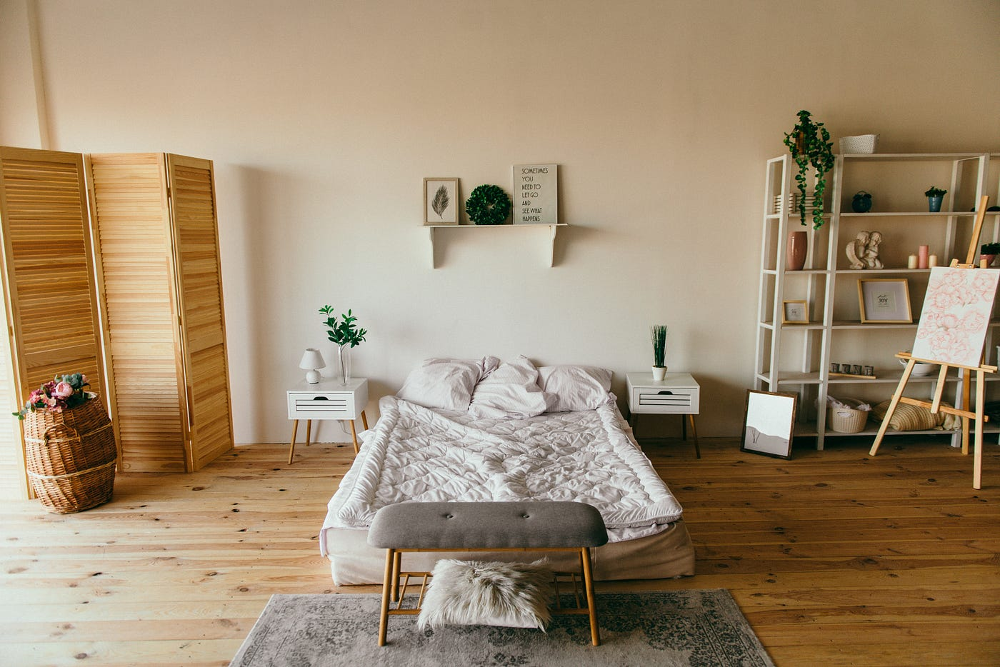
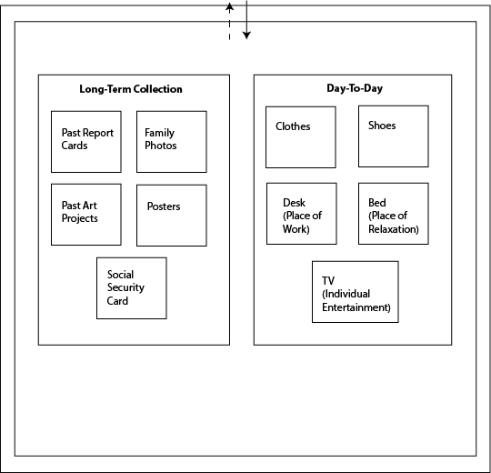
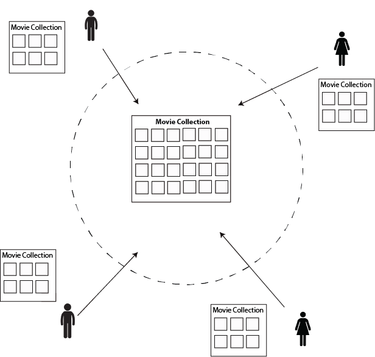
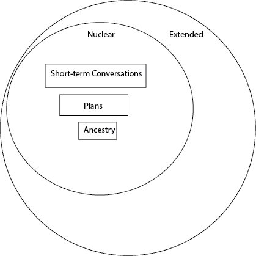
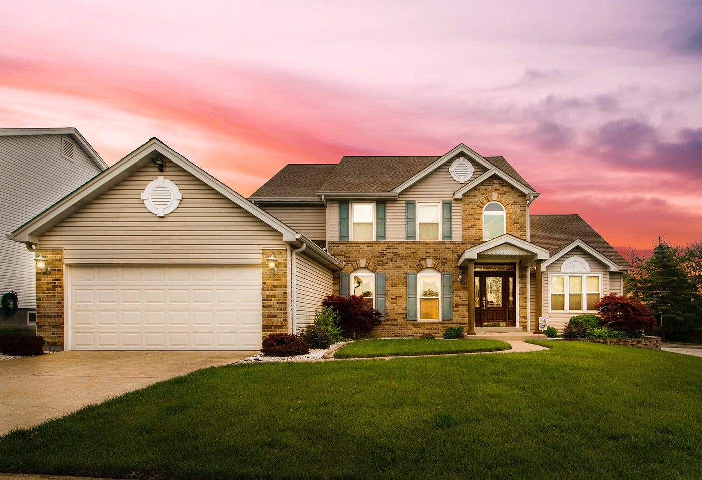
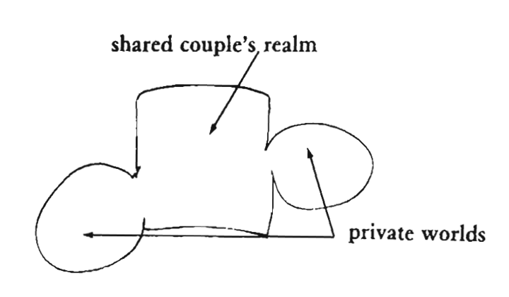
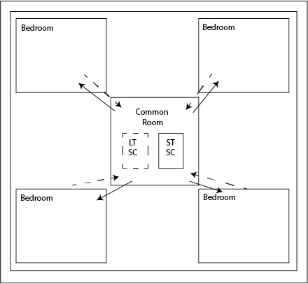

---
author:  Rachel Aliana
date: Sep 11, 2019
source: https://rachelaliana.medium.com/pattern-bedroom-eaf93eb1bb2d

---

# Patterns of Home: Bedroom, Living Room, House

A bedroom has several functions for an individual:  [https://www.pexels.com/photo/bedroom-area-with-no-people-inside-building-2082087/](https://www.pexels.com/photo/bedroom-area-with-no-people-inside-building-2082087/)

_These digital patterns are a part of “_[_Structuralism and a Pattern Language for Online Environments._](towards-a-larger-view-of-information-architecture.md)_”_

A fundamental part of people’s lives is the home. A home might have many physical parts — kitchen, living room, garage, pantry, bedroom, library. It also might contain many different kinds of people and relationships, like mother, daughter, son, father, friend, aunt, step-sister, cousin, grandmother. A good home, as Alexander in “A Pattern Language” saw it, balances the need for each individual to grow on their own, and a family to grow together.

The patterns described here are bedroom, living room, and house. These patterns are a first attempt to understand how designers can build interactions integral to the home into the digital world. They are also meant to help information architects develop a common language amongst each other of common functions and structures online.

## Bedroom

**Content:**  A bedroom in a house acts as a solitary place for rest and rejuvenation. It is a place to store objects needed for the actions of daily life like a bed, clothes, and work desk. It is also a place to store things needed in the past, like awards, past report cards, art projects. The bedroom might be seen as an aggregation point for a person’s long term and daily needs.

**Structure:** A digital bedroom contains the data and patterns of people’s short term and long-term needs. A part of the Bedroom is a Long Term Collection for items people need over the course of years, including collections of family photos, favorite posters, books, and health information. The Bedroom pattern also contains a secondary pooled collection of Short-term items that people want easy access to for their day-to-day routines. This might include entertainment apps or weekly scheduler apps. Within a collection people can set up ways that these patterns can share data (like linking the weather app to people’s schedule) without this data being shared outside of an individual’s network.

A bedroom combines short term and long term needs.

**Boundary:** Today it is taken as accepted that when people put data onto an app, that app will then send all of a person’s data back to the parent company. But, it might be possible for people who contain apps within their bedroom pattern to be able to have stronger control over what data is allowed “out” of their bedroom space. If others are allowed “in” to view the apps and content of a person’s bedroom pattern, it is for a short period of time.

**Scale:** S3, Block Group.

## Living Room

**Content:** The living room in a house is a flexible area in a home that contains the infrastructure for many diverse kinds of families. A living room might be the epicenter of a family’s game nights, or the place where kids do homework. It can be a place to build blanket forts and set forward long-term plans.

**Structure:** The living room pattern is very general because of the inherent flexibility of the space. The Living Room takes on the pattern of a basic Shared Collection (one of the most fundamental patterns) where anyone with access can add a module, and the modules are then accessible to the whole group. Over time there will likely be app developers that create patterns for specifically Living Room situations. For example, a Movie Time pattern that coalesces people’s individual movie collections to create a set of suggestions for the group.

A living room as a welcoming foundation for family and guests.

**Boundary:** The living room is a highly malleable space where friends are invited into for entertainment, extended family is invited for vacation, and co-workers are invited for game nights. Because of this an important component of the Living Room is the Boundary. The Nuclear Family (however the family decides this) can access the Living Room from anywhere, but guests can only access the pattern while in the living space. This will make it so while in the house, people can share movie collections, but the movie would not be stored outside of the house.

Depiction of family network

**Scale:** S5, Module Group.

## House

There are many types of houses, from sprawling Midwestern mansions to small bungalows to townhomes. A house has both staying power as an investment mechanism and a mental part of people’s lives. It is often quoted that “Home is where the heart is.”

A house contains numerous different rooms connected by a shared community:  [https://www.pexels.com/photo/white-and-brown-concrete-building-2287310/](https://www.pexels.com/photo/white-and-brown-concrete-building-2287310/)

**Content:**  As people become increasingly transient and climate change prompts large shifts in human populations, the house pattern will likely become increasingly important in online spaces. A house is a place of rest, security, and privacy for a family. It might be seen as a space of aggregation for the long-term needs of the family, like ancestry, finances, and relationship formation, as well as the short-term needs of scheduling the day-to-day routines of family members. In Christopher Alexander’s “A Pattern Language” he saw the House as a mergence of people’s private worlds and a shared family space.

A home as a place where people flourish as individuals and as family. From “A Pattern Language”.

**Structure:**  The House pattern is a long-term platform that hosts the multitude of room patterns within a larger, long term structure where people can share information between patterns. It is like an app solely for a family’s data, completely tailored to their needs. The pattern below shows how numerous bedroom patterns are connected to a Common Area with a Long Term Shared Collection pattern (for a family’s medical records, ancestry, photos) and a Short term Shared Collection (which might include everyone’s schedules, grocery lists, etc.).

A Home design pattern includes bedrooms and shared common areas.

**Boundary:**  People who have Bedroom patterns would need to share what information they want public with the larger Home. On the other hand, information shared to the Home is automatically accessible to any individual pattern in the Home. Users outside of the home need permission to access any of the Long Term Collections in the Home.

**Scale:**  S6, Platform.

