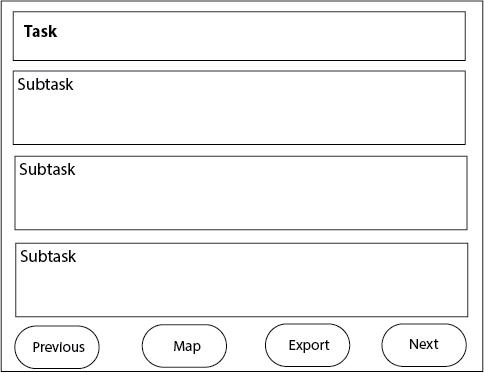
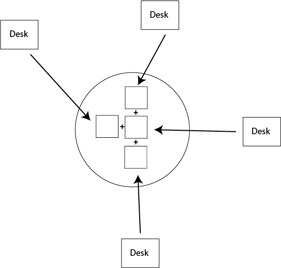
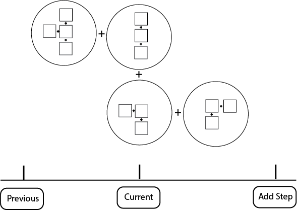
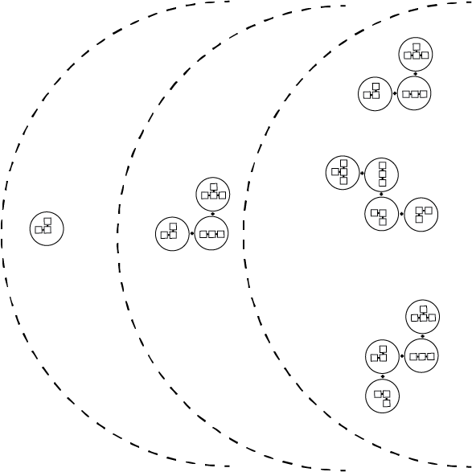

---
author:  Rachel Aliana
date: Sep 11, 2019
source: https://rachelaliana.medium.com/patterns-of-work-desk-table-meeting-room-office-6aa0e8fd851a

---

# Patterns of Work: Desk, Table, Meeting Room, Office

Offices provide places for individual work and community interaction:  [https://www.pexels.com/photo/woman-using-laptop-photography-2041398/](https://www.pexels.com/photo/woman-using-laptop-photography-2041398/)

_This article is a part of “_[_Structuralism and a Pattern Language for Online Environments_](towards-a-larger-view-of-information-architecture.md)_.”_

In the traditional model of work people sit at a desk for eight hours a day, five days a week. Slowly this conception is changing with the emergence of co-working spaces, tele-working, and the digital economy. Work as we will define it for this artcle is  _an energy input that creates value_. This value differs based on the type of work. There are three major types of work for which we will define patterns.  **Creation,**  in which a product, an idea, or data is generated.  **Evaluation**, where the initial product is given feedback.  **Coordination,**  in which individual products are combined together and individual teams coordinated into a cohesive whole.

Each of these kinds of work we will define an information pattern for. The design patterns that line up with Creation is the **Desk**  block group, Evaluation with the  **Table**  module. Coordination lines up with the  **Meeting Room**  Module group and the  **Office** Platform. By outlining common functional patterns of how work is conducted in online spaces, designers can have clearer words for what functionality will take place in each section of their systems. For example, a designer can talk about creating pools of Desk structures, or strict hierarchies of Table structures, and other designers will quickly understand what kind of information structure this will result in.

With clearer words and standard conceptions of functional patterns, there can be better dialogue between information architect, business development teams, and customers.

## Desk

**Content:**  Creation work can include painting, writing a novel, researching a scientific breakthrough, amongst many other forms of deep, intensive, and generally individual work. Creation work generally involves 1–2 people that generate lasting content that can be exported outside of a network. A play once written can be sold to numerous people. A painting once created can be sold far away from the original creator.

**Structure:** In Desk patterns, the key concept is that value can be  **generated**  and  **exported.**  Each specific field — -art, literature, science, business — -will all have specific tools to generate content relevant for their field. But below is a basic general pattern of a Table pattern. This block group features a Task title, the possibility to break a Task into different sub-tasks, and Export the Task to others in their team.

A desk as a place to create individual content.

**Boundary:** A Desk pattern is meant for an individual to conduct work, and so its boundaries are set to be initially private. A person can then choose to share with others on their team or within the larger organization.

**Scale:** S3, Block Group

## Table

**Content:**  Evaluation work comes when a piece of work developed by an individual is then seen by another and feedback is offered. Evaluation work includes the critique of a song, the editing of prose, the mark-up of a graphic design. For evaluation-oriented work, around 3–8 people are focused on the work of editing or combining some individual piece of work. After an individual brings their individual work to the table, the Table offers two primary loops: people can either reiterate and individually improve on this work, or export this work from a Table to a Meeting Room.

**Structure:**  The functionality of a table is where individuals can post their contributions and obtain critiques from others, and other people can shuffle around individual bits of value into different formations. For a book, this might look like each person contributing a chapter. For a scientific study, this might look like each investigator adding their individual data to a Report Module. Individuals’ Desk Modules are able to be explored by people at the table, and the individual Desks can be rearranged into different groupings to be exported.

**Boundary**: Anyone set as an Administrator for the Table can create the structure of the collaboration (is it a scientific report, a news article, a book). Anyone who has permissions to be at the Table can look at and comment on any of the individual Desk blocks that have been connected to the Table.

**Scale:** S5, Module

## Meeting Room

**Content:** There is important work that is necessary to not simply create value, but coordinate products and people. A Meeting Room is a space where people collaborate to transform bits of value and groups of value into products and services that can be sent to clients.

**Structure:**  The Meeting Room is a larger version of the Table. Instead of individual Desk patterns that are rearranged, it is Table blocks. These structures are then also grouped across time, so that people can understand how products and services evolve across the life of a company.

Different teams coordinate their work with other teams.

**Boundary:**  Anyone within the organization can edit and suggest re-arrangements of Table groups. Anyone with Meeting Room level permissions can rearrange groupings, and Add Steps in the Timeline. Only people with S6 level permissions and higher can share these groups outside of the organization.

**Scale:** S6, Module Groups

## Office

**Content:**  The structure of an office in Christopher Alexander’s “A Pattern Language” emphasized the different levels of privacy within an office. There is the individual office where private work is done, the office floor where co-workers collaborate, and the outer salon where clients wait to be invited in. Paralleling this pattern in the online world, the Office pattern is focused around the distribution of information between the workspace and the larger world.

**Structure:** Within an office there are different levels of information sharing for different contingents of people. There is the inner ring for those who work at the company, a middle ring for trusted parties, and then an outer ring for the general public.

**Boundary:** Some companies might have only three rings of privacy. Others might have far more complex sharing options, with contractors, shareholders, and partners all gaining slightly different information access. A large role of the office manager is to define the boundaries and decide which Meeting Room blocks can be shared in which circles.

**Scale:** S7, Platform structure

By creating this shorthand of typical patterns, information architects can have a better understanding of what kind of networks they are building, and a common language to discuss online networks with other information architects. There are likely dozens more different patterns that apply to the overall genre of Work that will be developed over time. 

