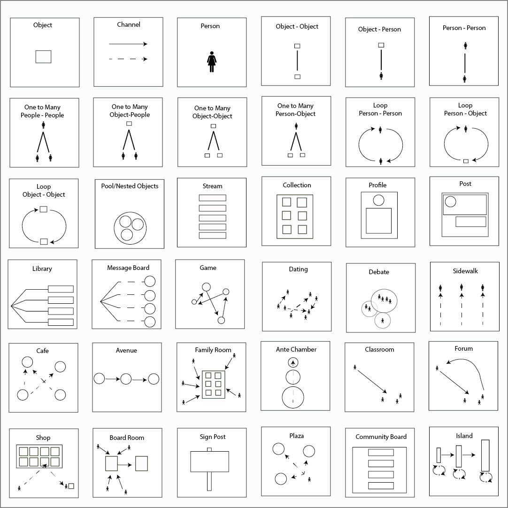

---
author: Rachel Jaffe
date: Mar 10, 2019
source: https://medium.com/swlh/towards-a-larger-view-of-information-architecture-2a7bd6ebafb7

---

# Structuralism and a Pattern Language for Online Environments

Common interaction patterns.

Words shape how we think about problems. In 2016 my co-founder Sal and I built a mobile app called  [Adjacent](https://www.adjacent.us/)  using Eric Reiss’s  [lean-start-up](http://theleanstartup.com/)  method, and we used words like  _minimum viable product, beta test_ and _UX research_. This meant we would build a feature, test it, change it, and test again. Each iteration was slightly closer to a successful product. But this process was reactive, time and development intensive, and extremely stressful.

With each new feature designed, it felt like we searched for a light in a dark room not knowing whether what we sought would look like a lamp or a flashlight_._  We needed a way to proactively connect what interactions people wanted with how our platform should be structured.

We needed better words.

At the same time I was also in graduate school at the University of Michigan. I was not supposed to be building a start-up. I was supposed to be working on my Masters thesis, which was to map how coffee shops, universities, and incubators in Ann Arbor created an  [innovation district](https://www.brookings.edu/wp-content/uploads/2017/12/es_20171208_bailyclustersandinnovation.pdf). My research showed  _sometimes_ people who were in the right physical spaces were more likely to become successful entrepreneurs.

This  _sometimes_  disquieted me. Something magical happened when smart people were close to each other, but the data points only revealed the  _what_  and not the  _how_. Here, too, I saw urban analytics professionals were caught by words like  _data points,_  _clusters_,  _nodes,_  and  _anonymous aggregation_. These words could be used to build and analyze detailed maps of phenomena, but could not be used to understand how the pieces connected together.

Here too, I needed better words.

While I was supposed to be finishing up the last grammatical tweaks on my thesis, instead I started to analyze the data I collected over again. This time, I developed  **spatial interaction patterns** of how people’s individual mental models changed based on their interactions in physical space. The idea of spatial interaction patterns brought with it new words to explain innovation districts, like  _paradigm generation_,  _attention lock,_  and  _trust accumulation_. The magic of how individual interactions came together to create thriving entrepreneurial hubs came into focus.

In solving the problem I faced in the field of urban planning, I also saw what was missing in the lexicon of app developers:  **digital interaction patterns**. Just like urban planners got stuck seeing cities in terms of location because they used a lexicon drawn from mapmakers, app developers were stuck haphazardly iterating because they had words for the front-end of digital spaces, like buttons and panels, and words for the back-end like API and query.

But there were no good words to explain how the form of online spaces shaped interaction.

So, I built this language. I began with basic words to break down apps and websites into fundamental information components. From these pieces I developed a set of repeatable patterns of how digital design shapes user interaction. These patterns can help designers more effectively talk with each other and entrepreneurs to iterate faster.

I call this the  **Structural**  language for Information Architecture.

> The Structural approach to Information Architecture (IA) believes the design of online spaces impacts the interactions that occur within them. The role of the Structuralist Information Architect is to define existing interaction patterns and develop new ones.

This series of articles is broken into Foundation, Language, Patterns, and Impacts.

**Foundations**  provides an overview of the current academic approaches to Information Architecture, Little IA and Big IA.

**Language** lays out fundamental ideas of objects, channels, groups, and other “words” of this language.

**Patterns** uses Christopher Alexander’s “[A Pattern Language](https://arl.human.cornell.edu/linked%20docs/Alexander_A_Pattern_Language.pdf)” as a foundation to develop a dictionary of standard digital interaction patterns.

**Impacts** looks at how these interaction patterns can provide designers more control over how they build vulnerability, publicness, and power into the structure of digital systems.

Words have the power to shape how we think of problems, and in turn what solutions we build. My hope is that the Structural language can create a shared lexicon that empowers individuals in the design process for a more collaborative, connected, and equitably built world.

## Foundations

[Current Frameworks: Little IA and Big IA](current-frameworks-of-information-architecture.md)

[Development of a New Language for Information Architecture](development-of-a-new-language-for-information-architecture.md)

## Language

[A Unified Language for the Design of Information Systems](a-unified-language-for-the-design-of-information-systems.md)

[Objects](a-pattern-language-objects.md)

[Object Groups](a-pattern-language-object-groups.md)

[Channels](a-pattern-language-channels.md)

[Levers](a-pattern-language-levers.md)

[Base Dynamics](a-pattern-language-base-dynamics.md)

[Loops](a-pattern-language-loops.md)

[Modules](a-pattern-language-modules.md)

[Blocks](a-pattern-language-interaction-blocks.md)

[Platforms](a-pattern-language-platform-structures.md)

## Patterns

[Pattern Structures](patterns-for-the-online-world.md)

[Patterns of Work](patterns-of-work-desk-table-meeting-room-office.md)

[Patterns of Home](patterns-of-home-bedroom-living-room-house.md)

[Patterns of Education](patterns-of-education-reflection-reaction-and-marketplace-of-learning.md)

[Patterns of Play](patterns-of-play-connected-play-playground-carnival.md)

## Impacts

[Architecting Intent: Designing for Publicness and Vulnerability](architecting-intent-designing-for-vulnerability-and-publicness.md)

[Information Literacy and Power: Structures of Control](information-literacy-and-power-structures-of-control.md)

[Guided Agile and the Changing Role of the Information Architect](guided-agile-and-the-changing-role-of-the-information-architect.md)

## Appendix

[Further Reading](https://medium.com/@rachelaliana/further-reading-3e55330b7bed)
