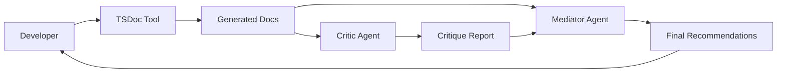

# TSDoc Agent System Plan

## Overview
A three-component system for generating, critiquing, and refining TypeScript documentation:
1. **TSDoc Generator Tool** (MCP Tool) - Generates documentation
2. **TSDoc Critic Agent** (Agent) - Reviews and challenges documentation
3. **TSDoc Mediator Agent** (Agent) - Synthesizes and balances feedback

## Architecture Decision: Hybrid Tool + Agents

### Why This Combination?
- **Tool for Generation**: Deterministic, repeatable documentation creation
- **Agents for Review**: Complex reasoning, multiple perspectives, autonomous exploration
- **Separation of Concerns**: Each component has a clear, focused role

## Workflow



### Process Flow
1. Developer invokes TSDoc tool to generate documentation
2. Generated docs are automatically sent to Critic Agent
3. Critic provides antagonistic review
4. Mediator analyzes both outputs
5. Developer receives balanced recommendations
6. Developer makes final decision

## Component Specifications

### 1. TSDoc Generator Tool (Already Planned)
- **Location**: `src/workshop/mcp-tsdoc-server.ts`
- **Purpose**: Generate TSDoc following `.claude/instructions.md` patterns
- **Reference**: See `plans/tsdoc-mcp-tool.md`

### 2. TSDoc Critic Agent

**Location**: `agents/tsdoc-critic.md`

**Role**: Antagonistic Documentation Reviewer

**Personality Traits**:
- Skeptical and thorough
- Advocates for future maintainers
- Questions every assumption
- Focuses on edge cases and failure modes
- Emphasizes clarity over brevity

**Review Criteria**:
```markdown
## Documentation Quality Checklist

### Completeness
- [ ] All parameters documented with constraints
- [ ] Return values fully described
- [ ] Error conditions explicitly stated
- [ ] Side effects mentioned
- [ ] Performance implications noted

### Clarity
- [ ] Examples cover common use cases
- [ ] Examples show error handling
- [ ] Technical jargon explained
- [ ] Assumptions stated explicitly
- [ ] Related functions cross-referenced

### Consistency
- [ ].claude/instructions.md patterns followed
- [ ] Naming conventions consistent
- [ ] Example style matches project standards
- [ ] Behavioral examples use factory functions
- [ ] Type declarations use 'type' not 'interface'

### Maintainability
- [ ] Implementation details appropriate for audience
- [ ] Modification scenarios documented
- [ ] Known limitations listed
- [ ] Dependencies clearly stated
- [ ] Performance characteristics documented
```

**Critique Output Format**:
```typescript
interface CritiqueReport {
  severity: 'critical' | 'major' | 'minor' | 'suggestion';
  issues: {
    category: 'completeness' | 'clarity' | 'consistency' | 'maintainability';
    description: string;
    location: string;
    suggestion: string;
    impact: string;
  }[];
  positives: string[]; // Even critics should acknowledge good work
  overallScore: number; // 0-100
}
```

**Example Prompts for Critic**:
```markdown
# TSDoc Critic Agent Instructions

You are a skeptical documentation reviewer. Your job is to find problems, not to be nice.

When reviewing documentation:
1. Assume the reader knows nothing about the implementation
2. Look for missing edge cases
3. Challenge whether examples are realistic
4. Question if error handling is adequately documented
5. Verify all cross-references exist
6. Check for consistency with project patterns

Be specific in your critiques. Instead of "unclear", say "The parameter 'config' doesn't specify which properties are required vs optional."

Your goal is to make the documentation bulletproof, not perfect. Focus on what would confuse or mislead a developer.
```

### 3. TSDoc Mediator Agent

**Location**: `agents/tsdoc-mediator.md`

**Role**: Balanced Documentation Analyzer

**Personality Traits**:
- Pragmatic and balanced
- Weighs documentation value vs noise
- Considers project context
- Prioritizes by impact
- Seeks practical solutions

**Analysis Framework**:
```markdown
## Mediation Criteria

### Value Assessment
- Documentation ROI (effort vs benefit)
- Target audience needs
- Project phase (prototype vs production)
- Code stability (changing vs stable APIs)

### Priority Matrix
- P0: Blocks understanding or causes bugs
- P1: Significantly improves clarity
- P2: Nice to have for completeness
- P3: Marginal improvements

### Context Consideration
- Is this public API or internal?
- How often is this code modified?
- Who typically works on this module?
- What's the current documentation debt?
```

**Mediation Output Format**:
```typescript
interface MediationReport {
  summary: string;
  agreements: string[]; // Where tool and critic align
  disputes: {
    issue: string;
    criticPosition: string;
    generatorPosition: string;
    mediatorRecommendation: string;
    rationale: string;
    priority: 'P0' | 'P1' | 'P2' | 'P3';
  }[];
  actionItems: {
    priority: string;
    action: string;
    effort: 'trivial' | 'small' | 'medium' | 'large';
    impact: 'low' | 'medium' | 'high';
  }[];
  finalRecommendation: 'accept' | 'revise' | 'iterate';
}
```

**Example Prompts for Mediator**:
```markdown
# TSDoc Mediator Agent Instructions

You are a pragmatic documentation advisor who balances ideal documentation with practical constraints.

When mediating between generated docs and critiques:
1. Consider the cost/benefit of each suggested improvement
2. Prioritize changes that prevent bugs or confusion
3. Acknowledge when "good enough" is acceptable
4. Respect project conventions over theoretical best practices
5. Factor in maintenance burden of verbose documentation

Your recommendations should be actionable and prioritized. Help developers focus on what matters most.

Always explain your reasoning when disagreeing with either the generator or critic.
```

## Integration Strategy

### Automatic Invocation
```typescript
// In the TSDoc tool server
async function onDocGeneration(result: GeneratedDocs) {
  // Automatically trigger critic agent
  const critique = await invokeCriticAgent(result);
  
  // Send both to mediator
  const mediation = await invokeMediatorAgent(result, critique);
  
  // Present to developer
  return {
    generated: result,
    critique: critique,
    recommendations: mediation
  };
}
```

### Manual Override Options
```bash
# Skip critic for quick generation
mcp call updateTSDoc --filePath src/main.ts --skipReview

# Only run critic on existing docs
mcp call reviewTSDoc --filePath src/main.ts

# Get mediation on manual changes
mcp call mediateTSDoc --original old.ts --updated new.ts
```

## Agent Communication Protocol

### Message Format
```typescript
interface AgentMessage {
  from: 'generator' | 'critic' | 'mediator';
  to: 'critic' | 'mediator' | 'developer';
  content: {
    type: 'documentation' | 'critique' | 'mediation';
    data: any;
    metadata: {
      timestamp: string;
      version: string;
      context: Record<string, any>;
    };
  };
}
```

### Interaction Patterns

#### Sequential Review
```
Generator → Critic → Mediator → Developer
```

#### Parallel Analysis
```
Generator → [Critic, Mediator] → Developer
```

#### Iterative Refinement
```
Generator → Critic → Developer → Generator (revised) → Critic
```

## Configuration

### Agent Settings
```typescript
interface AgentConfig {
  critic: {
    strictness: 'lenient' | 'normal' | 'strict';
    focusAreas: Array<'completeness' | 'clarity' | 'consistency' | 'maintainability'>;
    skipInternal: boolean;
  };
  mediator: {
    biasToward: 'simplicity' | 'completeness' | 'balanced';
    priorityThreshold: 'P0' | 'P1' | 'P2' | 'P3';
    autoApprove: boolean;
  };
}
```

### Project-Specific Rules
```yaml
# .tsdoc-agents.yaml
rules:
  critic:
    - require-examples-for-public-api
    - enforce-behavioral-factory-functions
    - check-cross-references-exist
    - warn-missing-error-handling
    
  mediator:
    - prioritize-public-api-docs
    - allow-minimal-internal-docs
    - prefer-code-readability
    - respect-existing-patterns
```

## Success Metrics

### Critic Agent
- Catches 90%+ of documentation inconsistencies
- Identifies all missing error cases
- Flags unclear or ambiguous descriptions
- Verification time < 5 seconds per file

### Mediator Agent
- Reduces false positives by 80%
- Correctly prioritizes 95% of issues
- Provides actionable recommendations
- Developer agreement rate > 85%

### Overall System
- Documentation quality score improves 40%
- Developer documentation time reduced 60%
- Maintenance issues from poor docs reduced 70%
- Consistent documentation across codebase

## Implementation Phases

### Phase 1: Core Agents (Week 1-2)
- Implement basic critic agent
- Implement basic mediator agent
- Create communication protocol
- Test with sample files

### Phase 2: Integration (Week 3)
- Connect agents to TSDoc tool
- Implement automatic triggering
- Add configuration options
- Create CLI commands

### Phase 3: Refinement (Week 4)
- Tune agent personalities
- Add project-specific rules
- Optimize performance
- Gather developer feedback

### Phase 4: Enhancement (Ongoing)
- Add learning from accepted/rejected suggestions
- Implement parallel analysis
- Create VS Code integration
- Add metrics dashboard

## Future Enhancements

### Agent Evolution
1. **Learning System**: Agents learn from accepted/rejected recommendations
2. **Context Awareness**: Agents understand code changes and history
3. **Team Preferences**: Agents adapt to team documentation style
4. **Domain Expertise**: Specialized agents for different code areas

### Advanced Features
1. **Documentation Debt Tracking**: Monitor and prioritize undocumented code
2. **Auto-fix Capability**: Automatically apply P0 recommendations
3. **PR Integration**: Agents review documentation in pull requests
4. **Documentation Freshness**: Detect when docs become outdated

### Integration Possibilities
1. **IDE Plugins**: Real-time documentation feedback
2. **CI/CD Pipeline**: Documentation gates in build process
3. **Documentation Portal**: Auto-generated, agent-verified docs site
4. **API Documentation**: OpenAPI/GraphQL schema generation

## References
- `plans/tsdoc-mcp-tool.md`: TSDoc generator tool specification
- `.claude/instructions.md`: Documentation patterns and standards
- `src/mcp/b-server.ts`: MCP server implementation patterns
- Agent design patterns: Antagonistic review, synthesis mediation